# 46. Bridge — memo

> **Informative · generated.** Dist-mirror of the bridge hub with expanded per-chapter sections (PRD-008), a quantification head-table with click-to-scroll (PRD-009), Mermaid graph views (PRD-010), and by-skill namespace grouping (PRD-011). Do not edit by hand; re-run the spec build to regenerate.

<!-- Auto-generated by scripts/generate-bridge.mjs from the skill-to-spec map. -->

**Coverage:** 45 of 46 chapters have at least one public implementer (98%).

## Coverage summary

| Chapter | Covered | Public | Internal | Reqs | Gaps |
|---|---|---|---|---|---|
| [00-overview](#00-overview) | ✓ | 1 | 0 | — | — |
| [01-philosophy](#01-philosophy) | ✓ | 5 | 0 | — | — |
| [02-memo-sop-entrypoint](#02-memo-sop-entrypoint) | ✓ | 14 | 0 | 2 | 6 |
| [03-input-paths](#03-input-paths) | ✓ | 2 | 0 | — | — |
| [04-input-pipeline](#04-input-pipeline) | ✓ | 2 | 0 | 2 | 5 |
| [05-memo-strategies](#05-memo-strategies) | ✓ | 2 | 0 | — | — |
| [06-memo-structure](#06-memo-structure) | ✓ | 6 | 0 | 4 | 7 |
| [07-revisions-and-questions](#07-revisions-and-questions) | ✓ | 11 | 0 | 5 | 10 |
| [08-phases-and-prds](#08-phases-and-prds) | ✓ | 19 | 0 | 6 | 11 |
| [09-contamination-context-handover](#09-contamination-context-handover) | ✓ | 25 | 0 | — | 2 |
| [10-proactive-research](#10-proactive-research) | ✓ | 9 | 0 | 8 | 2 |
| [11-quality-and-finalization](#11-quality-and-finalization) | ✓ | 16 | 1 | 5 | 13 |
| [12-rollout](#12-rollout) | ✓ | 7 | 1 | — | 7 |
| [13-orchestration](#13-orchestration) | ✓ | 19 | 0 | — | 7 |
| [14-agents-skills-tasks](#14-agents-skills-tasks) | ✓ | 4 | 2 | — | 2 |
| [15-prompt-generator](#15-prompt-generator) | ✓ | 5 | 0 | — | — |
| [16-git-security-versioning](#16-git-security-versioning) | ✓ | 17 | 4 | 8 | — |
| [17-git-workflow-and-ids](#17-git-workflow-and-ids) | ✓ | 10 | 1 | 6 | 2 |
| [18-multidimensionality](#18-multidimensionality) | ✓ | 3 | 0 | — | — |
| [19-internal-vs-external-communication](#19-internal-vs-external-communication) | ✓ | 6 | 6 | 1 | — |
| [20-flow-full-vs-update-revisions](#20-flow-full-vs-update-revisions) | ✓ | 4 | 0 | — | 1 |
| [21-human-computer-interaction](#21-human-computer-interaction) | ✓ | 7 | 0 | — | — |
| [22-tree-cli-recommended-way](#22-tree-cli-recommended-way) | ✓ | 4 | 0 | 4 | — |
| [23-requirements](#23-requirements) | ✓ | 17 | 3 | 6 | 4 |
| [24-tools-registry](#24-tools-registry) | ✓ | 5 | 0 | 5 | — |
| [25-strands](#25-strands) | ✓ | 2 | 0 | — | — |
| [26-memo-history](#26-memo-history) | ✓ | 4 | 0 | — | — |
| [27-landing-the-plane](#27-landing-the-plane) | ✓ | 5 | 0 | — | — |
| [28-drift](#28-drift) | ✓ | 4 | 0 | — | 2 |
| [29-behavioral-guardrails](#29-behavioral-guardrails) | ✓ | 5 | 1 | — | — |
| [30-primitives](#30-primitives) | ✓ | 4 | 0 | — | — |
| [31-goals](#31-goals) | ✓ | 6 | 0 | — | 1 |
| [32-prompt-governance](#32-prompt-governance) | ✓ | 4 | 0 | — | — |
| [33-maintenance](#33-maintenance) | ✓ | 6 | 0 | — | 1 |
| [34-question-interface](#34-question-interface) | ✓ | 5 | 0 | — | — |
| [35-memo-authoring](#35-memo-authoring) | ✓ | 4 | 1 | 7 | — |
| [36-agent-strategies](#36-agent-strategies) | ✓ | 12 | 0 | — | — |
| [37-transcript-reliability](#37-transcript-reliability) | ✓ | 1 | 0 | — | — |
| [38-stage-model](#38-stage-model) | ✓ | 16 | 0 | — | 2 |
| [39-release-and-pinning](#39-release-and-pinning) | ✓ | 4 | 0 | — | — |
| [40-diagrams](#40-diagrams) | ✓ | 1 | 2 | 4 | — |
| [41-mental-model](#41-mental-model) | ✓ | 3 | 0 | — | 2 |
| [42-plans](#42-plans) | ✓ | 10 | 0 | — | 30 |
| [43-skill-authoring-and-quality](#43-skill-authoring-and-quality) | ✓ | 2 | 1 | 8 | 2 |
| [44-repository-and-outward-docs](#44-repository-and-outward-docs) | — | 0 | 6 | 22 | — |
| [45-implementation-fidelity-audit](#45-implementation-fidelity-audit) | ✓ | 1 | 0 | — | — |
| **Summary** | **45 / 46 (98%)** | — | — | 103 | 119 |

## 00-overview

| Field | Value |
|---|---|
| Covered | ✓ yes |
| Public skills | `memo-sop` |
| Internal tooling | — |
| Requirements | — |
| Gaps | — |
| Depends on | [01-philosophy](./01-philosophy.md), [02-memo-sop-entrypoint](./02-memo-sop-entrypoint.md), [08-phases-and-prds](./08-phases-and-prds.md), [18-multidimensionality](./18-multidimensionality.md) |

## 01-philosophy

| Field | Value |
|---|---|
| Covered | ✓ yes |
| Public skills | `memo-coherence`, `memo-mental-model-derive`, `memo-revision-generate`, `memo-sop`, `workbench-modes` |
| Internal tooling | — |
| Requirements | — |
| Gaps | — |
| Depends on | [00-overview](./00-overview.md), [02-memo-sop-entrypoint](./02-memo-sop-entrypoint.md), [04-input-pipeline](./04-input-pipeline.md), [12-rollout](./12-rollout.md) |

## 02-memo-sop-entrypoint

| Field | Value |
|---|---|
| Covered | ✓ yes |
| Public skills | `memo-finalize`, `memo-init`, `memo-plan-add`, `memo-plan-execute`, `memo-plan-finalize`, `memo-plan-init`, `memo-plan-status`, `memo-plan-stop`, `memo-plan-update-checkbox`, `memo-reset-recommend`, `memo-sop`, `memo-sub-init`, `skill-testing`, `workbench-modes` |
| Internal tooling | — |
| Requirements | 2 |
| Gaps | issue-severity-classification-thresholds, Notification / acoustic-signal hook, Reset / context-clear jumps, Success definition / Mass und Ziel anti-pattern, Third-party token-tracking veto, three-mode-taxonomy |
| Depends on | [00-overview](./00-overview.md), [01-philosophy](./01-philosophy.md), [03-input-paths](./03-input-paths.md), [11-quality-and-finalization](./11-quality-and-finalization.md), [12-rollout](./12-rollout.md), [13-orchestration](./13-orchestration.md) |

## 03-input-paths

| Field | Value |
|---|---|
| Covered | ✓ yes |
| Public skills | `memo-goal-optimize`, `memo-input-processing` |
| Internal tooling | — |
| Requirements | — |
| Gaps | — |
| Depends on | [02-memo-sop-entrypoint](./02-memo-sop-entrypoint.md), [04-input-pipeline](./04-input-pipeline.md), [05-memo-strategies](./05-memo-strategies.md), [07-revisions-and-questions](./07-revisions-and-questions.md) |

## 04-input-pipeline

| Field | Value |
|---|---|
| Covered | ✓ yes |
| Public skills | `memo-goal-optimize`, `memo-input-processing` |
| Internal tooling | — |
| Requirements | 2 |
| Gaps | Information-content (FAKT:ANNAHME) score gate, Interview-Modus (bundled question catalog), Prompt-injection data/instruction boundary for URL mode, Topic-store write-side (register) mechanics, URL-mode error codes + schema-version legacy handling |
| Depends on | [02-memo-sop-entrypoint](./02-memo-sop-entrypoint.md), [03-input-paths](./03-input-paths.md), [05-memo-strategies](./05-memo-strategies.md), [10-proactive-research](./10-proactive-research.md) |

## 05-memo-strategies

| Field | Value |
|---|---|
| Covered | ✓ yes |
| Public skills | `memo-init`, `memo-sub-init` |
| Internal tooling | — |
| Requirements | — |
| Gaps | — |
| Depends on | [03-input-paths](./03-input-paths.md), [06-memo-structure](./06-memo-structure.md), [08-phases-and-prds](./08-phases-and-prds.md), [11-quality-and-finalization](./11-quality-and-finalization.md) |

## 06-memo-structure

| Field | Value |
|---|---|
| Covered | ✓ yes |
| Public skills | `memo-init`, `memo-plan-init`, `memo-plan-status`, `memo-revision-execute`, `memo-sub-init`, `workbench-project-setup` |
| Internal tooling | — |
| Requirements | 4 |
| Gaps | Cross-memo status check / 'marked finalized but never built' trap, Fact-briefing for autonomous memos, Lessons-Learned / Ancillary Files mandatory sections, Mandatory finalization checklist + auto F1 question, Memo-vs-Phase default decision + new-memo cost, Sub-memo lifecycle HARD-STOP, Triage table -> sub-memo fan-out + parent index |
| Depends on | [05-memo-strategies](./05-memo-strategies.md), [07-revisions-and-questions](./07-revisions-and-questions.md), [12-rollout](./12-rollout.md), [16-git-security-versioning](./16-git-security-versioning.md) |

## 07-revisions-and-questions

| Field | Value |
|---|---|
| Covered | ✓ yes |
| Public skills | `memo-balance`, `memo-coherence`, `memo-evidence`, `memo-fidelity-audit`, `memo-init`, `memo-mental-model-derive`, `memo-references`, `memo-revision-consolidate`, `memo-revision-evaluate`, `memo-revision-execute`, `memo-revision-generate` |
| Internal tooling | — |
| Requirements | 5 |
| Gaps | [Research offen] tag / Forschungsbedarf carry-over, Auto-iteration loop (max 2x then ask), Feedback-coverage as a gate, Meta-block memo identity fields (ICL), Post-revision lint gate (!memo lint), Prepare file as a primary artifact, REV-02 detector trigger + risk-threshold lowering, Sub-Memo HARD-STOP check, User Mental Model consult mechanism, Vorwort section (placement + single-channel) |
| Depends on | [04-input-pipeline](./04-input-pipeline.md), [06-memo-structure](./06-memo-structure.md), [11-quality-and-finalization](./11-quality-and-finalization.md), [14-agents-skills-tasks](./14-agents-skills-tasks.md) |

## 08-phases-and-prds

| Field | Value |
|---|---|
| Covered | ✓ yes |
| Public skills | `drift-resolution`, `memo-finalize`, `memo-init`, `memo-phase-evaluate`, `memo-phase-execute`, `memo-phase-generate`, `memo-plan-add`, `memo-plan-evaluate`, `memo-plan-init`, `memo-prd-evaluate`, `memo-prd-generate`, `memo-prds-validate`, `memo-references`, `memo-reset-recommend`, `memo-revision-execute`, `memo-rollout-evaluate`, `memo-rollout-execute`, `memo-rollout-generate`, `workbench-modes` |
| Internal tooling | — |
| Requirements | 6 |
| Gaps | AI cannot self-execute /clear, assertion-layer / closed-set rule, category tag taxonomy, coverage classification taxonomy, eval-set file as a generate output, max-PRDs-per-phase hard number, plan-status.json.reset-check state schema, PRD on-disk layout, header sections, and Ralph-Loop config, Reset-recommendation algorithm and thresholds, retry budget for PRD generation/evaluation, validation report path/template + integration-PRD requirement |
| Depends on | [05-memo-strategies](./05-memo-strategies.md), [07-revisions-and-questions](./07-revisions-and-questions.md), [12-rollout](./12-rollout.md), [13-orchestration](./13-orchestration.md), [15-prompt-generator](./15-prompt-generator.md), [18-multidimensionality](./18-multidimensionality.md) |

## 09-contamination-context-handover

| Field | Value |
|---|---|
| Covered | ✓ yes |
| Public skills | `memo-chronic-add`, `memo-chronic-build`, `memo-finalize`, `memo-goal-optimize`, `memo-goal-score`, `memo-goal-score-all`, `memo-handover`, `memo-init`, `memo-maintenance-score`, `memo-maintenance-verify`, `memo-mental-model-derive`, `memo-phase-evaluate`, `memo-phase-execute`, `memo-phase-generate`, `memo-plan-evaluate`, `memo-plan-execute`, `memo-plan-stop`, `memo-prd-evaluate`, `memo-prds-validate`, `memo-reset-recommend`, `memo-revision-evaluate`, `memo-rollout-evaluate`, `memo-rollout-execute`, `memo-sub-init`, `workbench-persona-audit` |
| Internal tooling | — |
| Requirements | — |
| Gaps | plan-stop / plan-handover facade and plan re-entry, state-recovery state-file taxonomy |
| Depends on | [00-overview](./00-overview.md), [08-phases-and-prds](./08-phases-and-prds.md), [10-proactive-research](./10-proactive-research.md), [11-quality-and-finalization](./11-quality-and-finalization.md), [13-orchestration](./13-orchestration.md) |

## 10-proactive-research

| Field | Value |
|---|---|
| Covered | ✓ yes |
| Public skills | `memo-evidence`, `memo-init`, `memo-input-processing`, `memo-research-agent`, `memo-revision-generate`, `research-best-practice-playwright`, `research-scrape-docs`, `research-workflow`, `wiki-ingest` |
| Internal tooling | — |
| Requirements | 8 |
| Gaps | research-output-format, untrusted-web-content-as-data |
| Depends on | [00-overview](./00-overview.md), [04-input-pipeline](./04-input-pipeline.md), [07-revisions-and-questions](./07-revisions-and-questions.md), [09-contamination-context-handover](./09-contamination-context-handover.md), [11-quality-and-finalization](./11-quality-and-finalization.md) |

## 11-quality-and-finalization

| Field | Value |
|---|---|
| Covered | ✓ yes |
| Public skills | `drift-resolution`, `git-commit`, `git-push`, `git-security`, `memo-balance`, `memo-coherence`, `memo-evidence`, `memo-fidelity-audit`, `memo-finalize`, `memo-prds-validate`, `memo-references`, `memo-research-agent`, `memo-revision-consolidate`, `memo-rollout`, `memo-rollout-generate`, `workbench-persona-audit` |
| Internal tooling | `repo-quality` |
| Requirements | 5 |
| Gaps | Budget snapshot as the single legitimate paste point, Calibration rating scale and indicator catalog, Dependency smoke-check at finalization, Inline tag insertion format, Large-codebase sub-agent threshold, Maturity rating taxonomy, Ralph-Loop suitability gate, Reference status taxonomy and auto-fix policy, Rollout-Entry-Points section + filesystem check, SKILL header drift vs the description's three-level shorthand, Sub-memo HARD-STOP at finalization, Third-party token-tracking veto, YAGNI / minimal-code overlap not referenced |
| Depends on | [00-overview](./00-overview.md), [09-contamination-context-handover](./09-contamination-context-handover.md), [10-proactive-research](./10-proactive-research.md), [12-rollout](./12-rollout.md), [16-git-security-versioning](./16-git-security-versioning.md), [23-requirements](./23-requirements.md) |

## 12-rollout

| Field | Value |
|---|---|
| Covered | ✓ yes |
| Public skills | `memo-fidelity-audit`, `memo-finalize`, `memo-phase-execute`, `memo-rollout`, `memo-rollout-evaluate`, `memo-rollout-execute`, `memo-sop` |
| Internal tooling | `image-pencil-playwright-diff` |
| Requirements | — |
| Gaps | between-phase integration follow-up policy, duty-of-care contract exact 9 points, plan-context operating modes, plan-context write-back delegation, UI before/after diff + proofs evidence layout, user-triggered landing as the only valid stop point, utilization gate (built-but-unwired) |
| Depends on | [00-overview](./00-overview.md), [11-quality-and-finalization](./11-quality-and-finalization.md), [13-orchestration](./13-orchestration.md), [14-agents-skills-tasks](./14-agents-skills-tasks.md), [16-git-security-versioning](./16-git-security-versioning.md) |

## 13-orchestration

| Field | Value |
|---|---|
| Covered | ✓ yes |
| Public skills | `drift-resolution`, `git-merge-strategy`, `memo-chronic-build`, `memo-handover`, `memo-phase-evaluate`, `memo-phase-execute`, `memo-phase-generate`, `memo-plan-execute`, `memo-prd-evaluate`, `memo-prds-validate`, `memo-references`, `memo-research-agent`, `memo-revision-evaluate`, `memo-revision-generate`, `memo-rollout`, `memo-rollout-execute`, `memo-rollout-generate`, `memo-sop`, `research-workflow` |
| Internal tooling | — |
| Requirements | — |
| Gaps | file-based contract negotiation protocol, follow-up-PRD escalation on stuck PRD, max iteration / phase-eval iteration limits, shared findings store, tool-selection-decision-tree, trivial-independent-PRDs verdict, UI baseline capture at phase-start |
| Depends on | [00-overview](./00-overview.md), [09-contamination-context-handover](./09-contamination-context-handover.md), [12-rollout](./12-rollout.md), [14-agents-skills-tasks](./14-agents-skills-tasks.md), [16-git-security-versioning](./16-git-security-versioning.md) |

## 14-agents-skills-tasks

| Field | Value |
|---|---|
| Covered | ✓ yes |
| Public skills | `memo-plan-evaluate`, `memo-prd-evaluate`, `skill-testing`, `workbench-persona-audit` |
| Internal tooling | `repo-docs-writing`, `repo-readme` |
| Requirements | — |
| Gaps | no-overwrite-and-output-location, persona-audit-schemas |
| Depends on | [00-overview](./00-overview.md), [09-contamination-context-handover](./09-contamination-context-handover.md), [12-rollout](./12-rollout.md), [13-orchestration](./13-orchestration.md), [15-prompt-generator](./15-prompt-generator.md) |

## 15-prompt-generator

| Field | Value |
|---|---|
| Covered | ✓ yes |
| Public skills | `memo-phase-execute`, `memo-phase-generate`, `memo-prd-generate`, `memo-req-template`, `memo-rollout-generate` |
| Internal tooling | — |
| Requirements | — |
| Gaps | — |
| Depends on | [00-overview](./00-overview.md), [12-rollout](./12-rollout.md), [13-orchestration](./13-orchestration.md), [14-agents-skills-tasks](./14-agents-skills-tasks.md), [16-git-security-versioning](./16-git-security-versioning.md) |

## 16-git-security-versioning

| Field | Value |
|---|---|
| Covered | ✓ yes |
| Public skills | `drift-resolution`, `git-commit`, `git-merge-strategy`, `git-push`, `git-security`, `memo-finalize`, `memo-handover`, `memo-maintenance-verify`, `memo-phase-execute`, `memo-phase-generate`, `memo-plan-execute`, `memo-req-runner`, `memo-rollout`, `memo-rollout-execute`, `release`, `workbench-audit`, `workbench-modes` |
| Internal tooling | `image-pencil-playwright-diff`, `repo-init`, `repo-issue`, `repo-quality` |
| Requirements | 8 |
| Gaps | — |
| Depends on | [00-overview](./00-overview.md), [11-quality-and-finalization](./11-quality-and-finalization.md), [13-orchestration](./13-orchestration.md), [15-prompt-generator](./15-prompt-generator.md), [17-git-workflow-and-ids](./17-git-workflow-and-ids.md) |

## 17-git-workflow-and-ids

| Field | Value |
|---|---|
| Covered | ✓ yes |
| Public skills | `git-commit`, `git-merge-strategy`, `git-push`, `memo-phase-execute`, `memo-plan-execute`, `memo-plan-stop`, `memo-plan-update-checkbox`, `memo-prd-generate`, `memo-rollout-execute`, `workbench-modes` |
| Internal tooling | `repo-issue` |
| Requirements | 6 |
| Gaps | Decision hierarchy on commit content, Mandatory-issue-per-commit doctrine |
| Depends on | [00-overview](./00-overview.md), [08-phases-and-prds](./08-phases-and-prds.md), [13-orchestration](./13-orchestration.md), [16-git-security-versioning](./16-git-security-versioning.md), [18-multidimensionality](./18-multidimensionality.md) |

## 18-multidimensionality

| Field | Value |
|---|---|
| Covered | ✓ yes |
| Public skills | `git-merge-strategy`, `git-push`, `memo-plan-add` |
| Internal tooling | — |
| Requirements | — |
| Gaps | — |
| Depends on | [00-overview](./00-overview.md), [08-phases-and-prds](./08-phases-and-prds.md), [13-orchestration](./13-orchestration.md), [16-git-security-versioning](./16-git-security-versioning.md), [17-git-workflow-and-ids](./17-git-workflow-and-ids.md) |

## 19-internal-vs-external-communication

| Field | Value |
|---|---|
| Covered | ✓ yes |
| Public skills | `git-commit`, `git-push`, `git-security`, `memo-req-runner`, `workbench-audit`, `workbench-persona-audit` |
| Internal tooling | `image-art-architecture`, `repo-docs-writing`, `repo-github-org`, `repo-issue`, `repo-quality`, `repo-readme` |
| Requirements | 1 |
| Gaps | — |
| Depends on | [00-overview](./00-overview.md), [16-git-security-versioning](./16-git-security-versioning.md), [17-git-workflow-and-ids](./17-git-workflow-and-ids.md) |

## 20-flow-full-vs-update-revisions

| Field | Value |
|---|---|
| Covered | ✓ yes |
| Public skills | `memo-finalize`, `memo-revision-consolidate`, `memo-revision-execute`, `memo-revision-generate` |
| Internal tooling | — |
| Requirements | — |
| Gaps | Merge conflict resolution rule |
| Depends on | [00-overview](./00-overview.md), [07-revisions-and-questions](./07-revisions-and-questions.md), [11-quality-and-finalization](./11-quality-and-finalization.md), [12-rollout](./12-rollout.md) |

## 21-human-computer-interaction

| Field | Value |
|---|---|
| Covered | ✓ yes |
| Public skills | `memo-finalize`, `memo-goal-score-all`, `memo-maintenance-score-all`, `memo-mental-model-derive`, `memo-plan-execute`, `memo-reset-recommend`, `memo-sop` |
| Internal tooling | — |
| Requirements | — |
| Gaps | — |
| Depends on | [00-overview](./00-overview.md), [11-quality-and-finalization](./11-quality-and-finalization.md), [20-flow-full-vs-update-revisions](./20-flow-full-vs-update-revisions.md) |

## 22-tree-cli-recommended-way

| Field | Value |
|---|---|
| Covered | ✓ yes |
| Public skills | `memo-goal-score`, `memo-maintenance-score`, `memo-plan-status`, `memo-plan-update-checkbox` |
| Internal tooling | — |
| Requirements | 4 |
| Gaps | — |
| Depends on | [00-overview](./00-overview.md), [13-orchestration](./13-orchestration.md), [14-agents-skills-tasks](./14-agents-skills-tasks.md) |

## 23-requirements

| Field | Value |
|---|---|
| Covered | ✓ yes |
| Public skills | `git-push`, `git-security`, `memo-finalize`, `memo-phase-evaluate`, `memo-phase-execute`, `memo-phase-generate`, `memo-prd-evaluate`, `memo-prd-generate`, `memo-prds-validate`, `memo-req-registry`, `memo-req-runner`, `memo-req-store`, `memo-req-template`, `memo-rollout-evaluate`, `memo-rollout-generate`, `specs-to-skills`, `wiki-lint` |
| Internal tooling | `image-pencil-playwright-diff`, `repo-github-org`, `repo-quality` |
| Requirements | 6 |
| Gaps | report storage path + producer/consumer evidence round-trip, tool/requirement entry FORMAT (YAML/object schema) and intake flow, topic-as-MatchContext / topic-attach wrapper, validation tactics catalog + signal->tactic selection map |
| Depends on | [00-overview](./00-overview.md), [11-quality-and-finalization](./11-quality-and-finalization.md), [24-tools-registry](./24-tools-registry.md) |

## 24-tools-registry

| Field | Value |
|---|---|
| Covered | ✓ yes |
| Public skills | `memo-req-registry`, `memo-req-store`, `memo-req-template`, `wiki-query`, `workbench-audit` |
| Internal tooling | — |
| Requirements | 5 |
| Gaps | — |
| Depends on | [00-overview](./00-overview.md), [08-phases-and-prds](./08-phases-and-prds.md), [23-requirements](./23-requirements.md) |

## 25-strands

| Field | Value |
|---|---|
| Covered | ✓ yes |
| Public skills | `memo-finalize`, `memo-rollout-generate` |
| Internal tooling | — |
| Requirements | — |
| Gaps | — |
| Depends on | [00-overview](./00-overview.md), [06-memo-structure](./06-memo-structure.md), [08-phases-and-prds](./08-phases-and-prds.md), [23-requirements](./23-requirements.md), [24-tools-registry](./24-tools-registry.md) |

## 26-memo-history

| Field | Value |
|---|---|
| Covered | ✓ yes |
| Public skills | `memo-chronic-add`, `memo-chronic-build`, `memo-rollout-execute`, `wiki-ingest` |
| Internal tooling | — |
| Requirements | — |
| Gaps | — |
| Depends on | [00-overview](./00-overview.md), [18-multidimensionality](./18-multidimensionality.md), [24-tools-registry](./24-tools-registry.md), [31-goals](./31-goals.md), [33-maintenance](./33-maintenance.md) |

## 27-landing-the-plane

| Field | Value |
|---|---|
| Covered | ✓ yes |
| Public skills | `git-merge-strategy`, `memo-handover`, `memo-rollout-execute`, `memo-sop`, `workbench-modes` |
| Internal tooling | — |
| Requirements | — |
| Gaps | — |
| Depends on | [00-overview](./00-overview.md), [12-rollout](./12-rollout.md), [13-orchestration](./13-orchestration.md), [16-git-security-versioning](./16-git-security-versioning.md), [38-stage-model](./38-stage-model.md) |

## 28-drift

| Field | Value |
|---|---|
| Covered | ✓ yes |
| Public skills | `drift-resolution`, `memo-maintenance-score`, `memo-maintenance-score-all`, `memo-references` |
| Internal tooling | — |
| Requirements | — |
| Gaps | Enumeration of artifact-surface roots that the D1 grep must cover, Per-unit-class authoring of the idempotent gate (literal vs pattern) |
| Depends on | [00-overview](./00-overview.md), [08-phases-and-prds](./08-phases-and-prds.md), [13-orchestration](./13-orchestration.md) |

## 29-behavioral-guardrails

| Field | Value |
|---|---|
| Covered | ✓ yes |
| Public skills | `memo-coherence`, `memo-init`, `memo-phase-execute`, `release`, `workbench-modes` |
| Internal tooling | `image-pencil-playwright-diff` |
| Requirements | — |
| Gaps | — |
| Depends on | [00-overview](./00-overview.md), [13-orchestration](./13-orchestration.md), [21-human-computer-interaction](./21-human-computer-interaction.md) |

## 30-primitives

| Field | Value |
|---|---|
| Covered | ✓ yes |
| Public skills | `memo-req-registry`, `memo-req-runner`, `memo-req-store`, `memo-sop` |
| Internal tooling | — |
| Requirements | — |
| Gaps | — |
| Depends on | [00-overview](./00-overview.md), [04-input-pipeline](./04-input-pipeline.md), [06-memo-structure](./06-memo-structure.md), [07-revisions-and-questions](./07-revisions-and-questions.md), [08-phases-and-prds](./08-phases-and-prds.md), [23-requirements](./23-requirements.md), [24-tools-registry](./24-tools-registry.md), [25-strands](./25-strands.md) |

## 31-goals

| Field | Value |
|---|---|
| Covered | ✓ yes |
| Public skills | `memo-chronic-add`, `memo-fidelity-audit`, `memo-goal-optimize`, `memo-goal-score`, `memo-goal-score-all`, `memo-rollout-evaluate` |
| Internal tooling | — |
| Requirements | — |
| Gaps | terminal output channel (R1) |
| Depends on | [00-overview](./00-overview.md), [06-memo-structure](./06-memo-structure.md), [13-orchestration](./13-orchestration.md), [26-memo-history](./26-memo-history.md), [30-primitives](./30-primitives.md), [33-maintenance](./33-maintenance.md) |

## 32-prompt-governance

| Field | Value |
|---|---|
| Covered | ✓ yes |
| Public skills | `memo-phase-generate`, `memo-prd-generate`, `memo-req-template`, `memo-rollout-generate` |
| Internal tooling | — |
| Requirements | — |
| Gaps | — |
| Depends on | [08-phases-and-prds](./08-phases-and-prds.md), [14-agents-skills-tasks](./14-agents-skills-tasks.md), [15-prompt-generator](./15-prompt-generator.md), [23-requirements](./23-requirements.md), [30-primitives](./30-primitives.md), [31-goals](./31-goals.md) |

## 33-maintenance

| Field | Value |
|---|---|
| Covered | ✓ yes |
| Public skills | `memo-goal-score-all`, `memo-maintenance-score`, `memo-maintenance-score-all`, `memo-maintenance-verify`, `memo-rollout`, `release` |
| Internal tooling | — |
| Requirements | — |
| Gaps | terminal output channel (R1) |
| Depends on | [19-internal-vs-external-communication](./19-internal-vs-external-communication.md), [26-memo-history](./26-memo-history.md), [27-landing-the-plane](./27-landing-the-plane.md), [28-drift](./28-drift.md), [30-primitives](./30-primitives.md), [31-goals](./31-goals.md), [32-prompt-governance](./32-prompt-governance.md) |

## 34-question-interface

| Field | Value |
|---|---|
| Covered | ✓ yes |
| Public skills | `memo-goal-optimize`, `memo-init`, `memo-revision-evaluate`, `memo-revision-execute`, `memo-revision-generate` |
| Internal tooling | — |
| Requirements | — |
| Gaps | — |
| Depends on | [05-memo-strategies](./05-memo-strategies.md), [07-revisions-and-questions](./07-revisions-and-questions.md), [21-human-computer-interaction](./21-human-computer-interaction.md), [29-behavioral-guardrails](./29-behavioral-guardrails.md), [31-goals](./31-goals.md) |

## 35-memo-authoring

| Field | Value |
|---|---|
| Covered | ✓ yes |
| Public skills | `memo-balance`, `memo-coherence`, `memo-init`, `memo-revision-execute` |
| Internal tooling | `image-diagram-excalidraw` |
| Requirements | 7 |
| Gaps | — |
| Depends on | [01-philosophy](./01-philosophy.md), [05-memo-strategies](./05-memo-strategies.md), [06-memo-structure](./06-memo-structure.md), [10-proactive-research](./10-proactive-research.md), [30-primitives](./30-primitives.md), [34-question-interface](./34-question-interface.md) |

## 36-agent-strategies

| Field | Value |
|---|---|
| Covered | ✓ yes |
| Public skills | `memo-chronic-build`, `memo-goal-score`, `memo-goal-score-all`, `memo-input-processing`, `memo-maintenance-score`, `memo-maintenance-score-all`, `memo-mental-model-derive`, `memo-phase-evaluate`, `memo-research-agent`, `memo-rollout-evaluate`, `research-workflow`, `workbench-persona-audit` |
| Internal tooling | — |
| Requirements | — |
| Gaps | — |
| Depends on | [09-contamination-context-handover](./09-contamination-context-handover.md), [10-proactive-research](./10-proactive-research.md), [13-orchestration](./13-orchestration.md), [14-agents-skills-tasks](./14-agents-skills-tasks.md), [31-goals](./31-goals.md), [35-memo-authoring](./35-memo-authoring.md) |

## 37-transcript-reliability

| Field | Value |
|---|---|
| Covered | ✓ yes |
| Public skills | `memo-input-processing` |
| Internal tooling | — |
| Requirements | — |
| Gaps | — |
| Depends on | [03-input-paths](./03-input-paths.md), [04-input-pipeline](./04-input-pipeline.md), [09-contamination-context-handover](./09-contamination-context-handover.md), [10-proactive-research](./10-proactive-research.md), [30-primitives](./30-primitives.md) |

## 38-stage-model

| Field | Value |
|---|---|
| Covered | ✓ yes |
| Public skills | `git-merge-strategy`, `git-push`, `memo-fidelity-audit`, `memo-plan-add`, `memo-plan-evaluate`, `memo-plan-execute`, `memo-plan-finalize`, `memo-plan-init`, `memo-plan-status`, `memo-plan-stop`, `memo-plan-update-checkbox`, `memo-rollout`, `memo-rollout-evaluate`, `memo-rollout-execute`, `memo-sop`, `release` |
| Internal tooling | — |
| Requirements | — |
| Gaps | Mandatory issue-close cycle after push, Post-push CodeCov / coverage / overview-page conventions |
| Depends on | [00-overview](./00-overview.md), [12-rollout](./12-rollout.md), [13-orchestration](./13-orchestration.md), [17-git-workflow-and-ids](./17-git-workflow-and-ids.md), [27-landing-the-plane](./27-landing-the-plane.md) |

## 39-release-and-pinning

| Field | Value |
|---|---|
| Covered | ✓ yes |
| Public skills | `git-push`, `memo-maintenance-score-all`, `memo-maintenance-verify`, `release` |
| Internal tooling | — |
| Requirements | — |
| Gaps | — |
| Depends on | [16-git-security-versioning](./16-git-security-versioning.md), [17-git-workflow-and-ids](./17-git-workflow-and-ids.md), [19-internal-vs-external-communication](./19-internal-vs-external-communication.md), [33-maintenance](./33-maintenance.md) |

## 40-diagrams

| Field | Value |
|---|---|
| Covered | ✓ yes |
| Public skills | `memo-init` |
| Internal tooling | `image-art-architecture`, `image-diagram-excalidraw` |
| Requirements | 4 |
| Gaps | — |
| Depends on | [00-overview](./00-overview.md), [06-memo-structure](./06-memo-structure.md), [21-human-computer-interaction](./21-human-computer-interaction.md), [35-memo-authoring](./35-memo-authoring.md) |

## 41-mental-model

| Field | Value |
|---|---|
| Covered | ✓ yes |
| Public skills | `memo-init`, `memo-mental-model-derive`, `memo-revision-generate` |
| Internal tooling | — |
| Requirements | — |
| Gaps | answered-question pair format, User Mental Model store as a primitive |
| Depends on | [00-overview](./00-overview.md), [12-rollout](./12-rollout.md), [21-human-computer-interaction](./21-human-computer-interaction.md), [31-goals](./31-goals.md), [33-maintenance](./33-maintenance.md), [34-question-interface](./34-question-interface.md) |

## 42-plans

| Field | Value |
|---|---|
| Covered | ✓ yes |
| Public skills | `memo-budget-paste`, `memo-handover`, `memo-plan-add`, `memo-plan-evaluate`, `memo-plan-execute`, `memo-plan-finalize`, `memo-plan-init`, `memo-plan-status`, `memo-plan-stop`, `memo-plan-update-checkbox` |
| Internal tooling | — |
| Requirements | — |
| Gaps | [PHASE-DONE] output + reset auto-call, add gate on finalization, budget / ScheduleWakeup, checkbox-as-state mechanic, coexistence gate (direct vs plan), conformance report location, cross-memo phaseRef translation, executionOrder mandate, ICL cold-start / bitter lesson, ICL cold-start gate, mandatory 7 phase fields, memo-hoheit over phase order, next-phase algorithm, phase-boundary stop discipline, plan archival lifecycle, plan conformance model, plan folder structure, plan integrity re-check, plan status terminal format, plan-done vs memo-done, plan-status.json budget block, plan-status.json schema, plan-stop atomic three steps, plan.md skeleton, skill code conventions, token-budget awareness, unplanned-memos subroutine, write-ahead / crash recovery, write-ahead finalization, write-ahead marker referenced-not-spec'd |
| Depends on | [06-memo-structure](./06-memo-structure.md), [08-phases-and-prds](./08-phases-and-prds.md), [12-rollout](./12-rollout.md), [13-orchestration](./13-orchestration.md), [30-primitives](./30-primitives.md), [38-stage-model](./38-stage-model.md) |

## 43-skill-authoring-and-quality

| Field | Value |
|---|---|
| Covered | ✓ yes |
| Public skills | `skill-testing`, `specs-to-skills` |
| Internal tooling | `image-art-architecture` |
| Requirements | 8 |
| Gaps | skill quality / testing has no spec (Memo-039 core), skill-authoring counterpart absent |
| Depends on | [02-memo-sop-entrypoint](./02-memo-sop-entrypoint.md), [11-quality-and-finalization](./11-quality-and-finalization.md), [14-agents-skills-tasks](./14-agents-skills-tasks.md), [23-requirements](./23-requirements.md), [30-primitives](./30-primitives.md), [33-maintenance](./33-maintenance.md) |

## 44-repository-and-outward-docs

| Field | Value |
|---|---|
| Covered | — not yet |
| Public skills | — none yet — |
| Internal tooling | `repo-docs-writing`, `repo-github-org`, `repo-init`, `repo-issue`, `repo-quality`, `repo-readme` |
| Requirements | 22 |
| Gaps | — |
| Depends on | [00-overview](./00-overview.md), [16-git-security-versioning](./16-git-security-versioning.md), [17-git-workflow-and-ids](./17-git-workflow-and-ids.md), [19-internal-vs-external-communication](./19-internal-vs-external-communication.md), [24-tools-registry](./24-tools-registry.md), [35-memo-authoring](./35-memo-authoring.md) |

## 45-implementation-fidelity-audit

| Field | Value |
|---|---|
| Covered | ✓ yes |
| Public skills | `memo-fidelity-audit` |
| Internal tooling | — |
| Requirements | — |
| Gaps | — |
| Depends on | [07-revisions-and-questions](./07-revisions-and-questions.md), [11-quality-and-finalization](./11-quality-and-finalization.md), [12-rollout](./12-rollout.md), [28-drift](./28-drift.md), [31-goals](./31-goals.md), [33-maintenance](./33-maintenance.md), [38-stage-model](./38-stage-model.md) |

## Skills by namespace

### code-patterns (1 skill)

| Skill | Chapters |
|---|---|
| `memo-budget-paste` | [42-plans](./42-plans.md) (primary) |

### evals (3 skills)

| Skill | Chapters |
|---|---|
| `memo-req-registry` | [23-requirements](./23-requirements.md) (primary), [24-tools-registry](./24-tools-registry.md), [30-primitives](./30-primitives.md) |
| `memo-req-runner` | [23-requirements](./23-requirements.md) (primary), [16-git-security-versioning](./16-git-security-versioning.md), [19-internal-vs-external-communication](./19-internal-vs-external-communication.md), [30-primitives](./30-primitives.md) |
| `memo-req-store` | [23-requirements](./23-requirements.md) (primary), [24-tools-registry](./24-tools-registry.md), [30-primitives](./30-primitives.md) |

### git (5 skills)

| Skill | Chapters |
|---|---|
| `git-commit` | [17-git-workflow-and-ids](./17-git-workflow-and-ids.md) (primary), [11-quality-and-finalization](./11-quality-and-finalization.md), [16-git-security-versioning](./16-git-security-versioning.md), [19-internal-vs-external-communication](./19-internal-vs-external-communication.md) |
| `git-merge-strategy` | [38-stage-model](./38-stage-model.md) (primary), [13-orchestration](./13-orchestration.md), [16-git-security-versioning](./16-git-security-versioning.md), [17-git-workflow-and-ids](./17-git-workflow-and-ids.md), [18-multidimensionality](./18-multidimensionality.md), [27-landing-the-plane](./27-landing-the-plane.md) |
| `git-push` | [38-stage-model](./38-stage-model.md) (primary), [11-quality-and-finalization](./11-quality-and-finalization.md), [16-git-security-versioning](./16-git-security-versioning.md), [17-git-workflow-and-ids](./17-git-workflow-and-ids.md), [18-multidimensionality](./18-multidimensionality.md), [19-internal-vs-external-communication](./19-internal-vs-external-communication.md), [23-requirements](./23-requirements.md), [39-release-and-pinning](./39-release-and-pinning.md) |
| `git-security` | [16-git-security-versioning](./16-git-security-versioning.md) (primary), [11-quality-and-finalization](./11-quality-and-finalization.md), [19-internal-vs-external-communication](./19-internal-vs-external-communication.md), [23-requirements](./23-requirements.md) |
| `release` | [39-release-and-pinning](./39-release-and-pinning.md) (primary), [16-git-security-versioning](./16-git-security-versioning.md), [29-behavioral-guardrails](./29-behavioral-guardrails.md), [33-maintenance](./33-maintenance.md), [38-stage-model](./38-stage-model.md) |

### memo (42 skills)

| Skill | Chapters |
|---|---|
| `drift-resolution` | [28-drift](./28-drift.md) (primary), [08-phases-and-prds](./08-phases-and-prds.md), [11-quality-and-finalization](./11-quality-and-finalization.md), [13-orchestration](./13-orchestration.md), [16-git-security-versioning](./16-git-security-versioning.md) |
| `memo-balance` | [11-quality-and-finalization](./11-quality-and-finalization.md) (primary), [07-revisions-and-questions](./07-revisions-and-questions.md), [35-memo-authoring](./35-memo-authoring.md) |
| `memo-chronic-add` | [26-memo-history](./26-memo-history.md) (primary), [09-contamination-context-handover](./09-contamination-context-handover.md), [31-goals](./31-goals.md) |
| `memo-chronic-build` | [26-memo-history](./26-memo-history.md) (primary), [09-contamination-context-handover](./09-contamination-context-handover.md), [13-orchestration](./13-orchestration.md), [36-agent-strategies](./36-agent-strategies.md) |
| `memo-coherence` | [11-quality-and-finalization](./11-quality-and-finalization.md) (primary), [01-philosophy](./01-philosophy.md), [07-revisions-and-questions](./07-revisions-and-questions.md), [29-behavioral-guardrails](./29-behavioral-guardrails.md), [35-memo-authoring](./35-memo-authoring.md) |
| `memo-evidence` | [11-quality-and-finalization](./11-quality-and-finalization.md) (primary), [07-revisions-and-questions](./07-revisions-and-questions.md), [10-proactive-research](./10-proactive-research.md) |
| `memo-fidelity-audit` | [45-implementation-fidelity-audit](./45-implementation-fidelity-audit.md) (primary), [07-revisions-and-questions](./07-revisions-and-questions.md), [11-quality-and-finalization](./11-quality-and-finalization.md), [12-rollout](./12-rollout.md), [31-goals](./31-goals.md), [38-stage-model](./38-stage-model.md) |
| `memo-finalize` | [11-quality-and-finalization](./11-quality-and-finalization.md) (primary), [02-memo-sop-entrypoint](./02-memo-sop-entrypoint.md), [08-phases-and-prds](./08-phases-and-prds.md), [09-contamination-context-handover](./09-contamination-context-handover.md), [12-rollout](./12-rollout.md), [16-git-security-versioning](./16-git-security-versioning.md), [20-flow-full-vs-update-revisions](./20-flow-full-vs-update-revisions.md), [21-human-computer-interaction](./21-human-computer-interaction.md), [23-requirements](./23-requirements.md), [25-strands](./25-strands.md) |
| `memo-goal-optimize` | [31-goals](./31-goals.md) (primary), [03-input-paths](./03-input-paths.md), [04-input-pipeline](./04-input-pipeline.md), [09-contamination-context-handover](./09-contamination-context-handover.md), [34-question-interface](./34-question-interface.md) |
| `memo-goal-score` | [31-goals](./31-goals.md) (primary), [09-contamination-context-handover](./09-contamination-context-handover.md), [22-tree-cli-recommended-way](./22-tree-cli-recommended-way.md), [36-agent-strategies](./36-agent-strategies.md) |
| `memo-goal-score-all` | [31-goals](./31-goals.md) (primary), [09-contamination-context-handover](./09-contamination-context-handover.md), [21-human-computer-interaction](./21-human-computer-interaction.md), [33-maintenance](./33-maintenance.md), [36-agent-strategies](./36-agent-strategies.md) |
| `memo-handover` | [09-contamination-context-handover](./09-contamination-context-handover.md) (primary), [13-orchestration](./13-orchestration.md), [16-git-security-versioning](./16-git-security-versioning.md), [27-landing-the-plane](./27-landing-the-plane.md), [42-plans](./42-plans.md) |
| `memo-init` | [06-memo-structure](./06-memo-structure.md) (primary), [02-memo-sop-entrypoint](./02-memo-sop-entrypoint.md), [05-memo-strategies](./05-memo-strategies.md), [07-revisions-and-questions](./07-revisions-and-questions.md), [08-phases-and-prds](./08-phases-and-prds.md), [09-contamination-context-handover](./09-contamination-context-handover.md), [10-proactive-research](./10-proactive-research.md), [29-behavioral-guardrails](./29-behavioral-guardrails.md), [34-question-interface](./34-question-interface.md), [35-memo-authoring](./35-memo-authoring.md), [40-diagrams](./40-diagrams.md), [41-mental-model](./41-mental-model.md) |
| `memo-input-processing` | [04-input-pipeline](./04-input-pipeline.md) (primary), [03-input-paths](./03-input-paths.md), [10-proactive-research](./10-proactive-research.md), [36-agent-strategies](./36-agent-strategies.md), [37-transcript-reliability](./37-transcript-reliability.md) |
| `memo-maintenance-score` | [33-maintenance](./33-maintenance.md) (primary), [09-contamination-context-handover](./09-contamination-context-handover.md), [22-tree-cli-recommended-way](./22-tree-cli-recommended-way.md), [28-drift](./28-drift.md), [36-agent-strategies](./36-agent-strategies.md) |
| `memo-maintenance-score-all` | [33-maintenance](./33-maintenance.md) (primary), [21-human-computer-interaction](./21-human-computer-interaction.md), [28-drift](./28-drift.md), [36-agent-strategies](./36-agent-strategies.md), [39-release-and-pinning](./39-release-and-pinning.md) |
| `memo-maintenance-verify` | [33-maintenance](./33-maintenance.md) (primary), [09-contamination-context-handover](./09-contamination-context-handover.md), [16-git-security-versioning](./16-git-security-versioning.md), [39-release-and-pinning](./39-release-and-pinning.md) |
| `memo-mental-model-derive` | [41-mental-model](./41-mental-model.md) (primary), [01-philosophy](./01-philosophy.md), [07-revisions-and-questions](./07-revisions-and-questions.md), [09-contamination-context-handover](./09-contamination-context-handover.md), [21-human-computer-interaction](./21-human-computer-interaction.md), [36-agent-strategies](./36-agent-strategies.md) |
| `memo-phase-evaluate` | [13-orchestration](./13-orchestration.md) (primary), [08-phases-and-prds](./08-phases-and-prds.md), [09-contamination-context-handover](./09-contamination-context-handover.md), [23-requirements](./23-requirements.md), [36-agent-strategies](./36-agent-strategies.md) |
| `memo-phase-execute` | [13-orchestration](./13-orchestration.md) (primary), [08-phases-and-prds](./08-phases-and-prds.md), [09-contamination-context-handover](./09-contamination-context-handover.md), [12-rollout](./12-rollout.md), [15-prompt-generator](./15-prompt-generator.md), [16-git-security-versioning](./16-git-security-versioning.md), [17-git-workflow-and-ids](./17-git-workflow-and-ids.md), [23-requirements](./23-requirements.md), [29-behavioral-guardrails](./29-behavioral-guardrails.md) |
| `memo-phase-generate` | [08-phases-and-prds](./08-phases-and-prds.md) (primary), [09-contamination-context-handover](./09-contamination-context-handover.md), [13-orchestration](./13-orchestration.md), [15-prompt-generator](./15-prompt-generator.md), [16-git-security-versioning](./16-git-security-versioning.md), [23-requirements](./23-requirements.md), [32-prompt-governance](./32-prompt-governance.md) |
| `memo-plan-add` | [42-plans](./42-plans.md) (primary), [02-memo-sop-entrypoint](./02-memo-sop-entrypoint.md), [08-phases-and-prds](./08-phases-and-prds.md), [18-multidimensionality](./18-multidimensionality.md), [38-stage-model](./38-stage-model.md) |
| `memo-plan-evaluate` | [42-plans](./42-plans.md) (primary), [08-phases-and-prds](./08-phases-and-prds.md), [09-contamination-context-handover](./09-contamination-context-handover.md), [14-agents-skills-tasks](./14-agents-skills-tasks.md), [38-stage-model](./38-stage-model.md) |
| `memo-plan-execute` | [42-plans](./42-plans.md) (primary), [02-memo-sop-entrypoint](./02-memo-sop-entrypoint.md), [09-contamination-context-handover](./09-contamination-context-handover.md), [13-orchestration](./13-orchestration.md), [16-git-security-versioning](./16-git-security-versioning.md), [17-git-workflow-and-ids](./17-git-workflow-and-ids.md), [21-human-computer-interaction](./21-human-computer-interaction.md), [38-stage-model](./38-stage-model.md) |
| `memo-plan-finalize` | [42-plans](./42-plans.md) (primary), [02-memo-sop-entrypoint](./02-memo-sop-entrypoint.md), [38-stage-model](./38-stage-model.md) |
| `memo-plan-init` | [42-plans](./42-plans.md) (primary), [02-memo-sop-entrypoint](./02-memo-sop-entrypoint.md), [06-memo-structure](./06-memo-structure.md), [08-phases-and-prds](./08-phases-and-prds.md), [38-stage-model](./38-stage-model.md) |
| `memo-plan-status` | [42-plans](./42-plans.md) (primary), [02-memo-sop-entrypoint](./02-memo-sop-entrypoint.md), [06-memo-structure](./06-memo-structure.md), [22-tree-cli-recommended-way](./22-tree-cli-recommended-way.md), [38-stage-model](./38-stage-model.md) |
| `memo-plan-stop` | [42-plans](./42-plans.md) (primary), [02-memo-sop-entrypoint](./02-memo-sop-entrypoint.md), [09-contamination-context-handover](./09-contamination-context-handover.md), [17-git-workflow-and-ids](./17-git-workflow-and-ids.md), [38-stage-model](./38-stage-model.md) |
| `memo-plan-update-checkbox` | [42-plans](./42-plans.md) (primary), [02-memo-sop-entrypoint](./02-memo-sop-entrypoint.md), [17-git-workflow-and-ids](./17-git-workflow-and-ids.md), [22-tree-cli-recommended-way](./22-tree-cli-recommended-way.md), [38-stage-model](./38-stage-model.md) |
| `memo-prds-validate` | [08-phases-and-prds](./08-phases-and-prds.md) (primary), [09-contamination-context-handover](./09-contamination-context-handover.md), [11-quality-and-finalization](./11-quality-and-finalization.md), [13-orchestration](./13-orchestration.md), [23-requirements](./23-requirements.md) |
| `memo-references` | [11-quality-and-finalization](./11-quality-and-finalization.md) (primary), [07-revisions-and-questions](./07-revisions-and-questions.md), [08-phases-and-prds](./08-phases-and-prds.md), [13-orchestration](./13-orchestration.md), [28-drift](./28-drift.md) |
| `memo-reset-recommend` | [08-phases-and-prds](./08-phases-and-prds.md) (primary), [02-memo-sop-entrypoint](./02-memo-sop-entrypoint.md), [09-contamination-context-handover](./09-contamination-context-handover.md), [21-human-computer-interaction](./21-human-computer-interaction.md) |
| `memo-revision-consolidate` | [20-flow-full-vs-update-revisions](./20-flow-full-vs-update-revisions.md) (primary), [07-revisions-and-questions](./07-revisions-and-questions.md), [11-quality-and-finalization](./11-quality-and-finalization.md) |
| `memo-revision-evaluate` | [07-revisions-and-questions](./07-revisions-and-questions.md) (primary), [09-contamination-context-handover](./09-contamination-context-handover.md), [13-orchestration](./13-orchestration.md), [34-question-interface](./34-question-interface.md) |
| `memo-revision-execute` | [07-revisions-and-questions](./07-revisions-and-questions.md) (primary), [06-memo-structure](./06-memo-structure.md), [08-phases-and-prds](./08-phases-and-prds.md), [20-flow-full-vs-update-revisions](./20-flow-full-vs-update-revisions.md), [34-question-interface](./34-question-interface.md), [35-memo-authoring](./35-memo-authoring.md) |
| `memo-revision-generate` | [07-revisions-and-questions](./07-revisions-and-questions.md) (primary), [01-philosophy](./01-philosophy.md), [10-proactive-research](./10-proactive-research.md), [13-orchestration](./13-orchestration.md), [20-flow-full-vs-update-revisions](./20-flow-full-vs-update-revisions.md), [34-question-interface](./34-question-interface.md), [41-mental-model](./41-mental-model.md) |
| `memo-rollout` | [12-rollout](./12-rollout.md) (primary), [11-quality-and-finalization](./11-quality-and-finalization.md), [13-orchestration](./13-orchestration.md), [16-git-security-versioning](./16-git-security-versioning.md), [33-maintenance](./33-maintenance.md), [38-stage-model](./38-stage-model.md) |
| `memo-rollout-evaluate` | [12-rollout](./12-rollout.md) (primary), [08-phases-and-prds](./08-phases-and-prds.md), [09-contamination-context-handover](./09-contamination-context-handover.md), [23-requirements](./23-requirements.md), [31-goals](./31-goals.md), [36-agent-strategies](./36-agent-strategies.md), [38-stage-model](./38-stage-model.md) |
| `memo-rollout-execute` | [12-rollout](./12-rollout.md) (primary), [08-phases-and-prds](./08-phases-and-prds.md), [09-contamination-context-handover](./09-contamination-context-handover.md), [13-orchestration](./13-orchestration.md), [16-git-security-versioning](./16-git-security-versioning.md), [17-git-workflow-and-ids](./17-git-workflow-and-ids.md), [26-memo-history](./26-memo-history.md), [27-landing-the-plane](./27-landing-the-plane.md), [38-stage-model](./38-stage-model.md) |
| `memo-rollout-generate` | [08-phases-and-prds](./08-phases-and-prds.md) (primary), [11-quality-and-finalization](./11-quality-and-finalization.md), [13-orchestration](./13-orchestration.md), [15-prompt-generator](./15-prompt-generator.md), [23-requirements](./23-requirements.md), [25-strands](./25-strands.md), [32-prompt-governance](./32-prompt-governance.md) |
| `memo-sop` | [02-memo-sop-entrypoint](./02-memo-sop-entrypoint.md) (primary), [00-overview](./00-overview.md), [01-philosophy](./01-philosophy.md), [12-rollout](./12-rollout.md), [13-orchestration](./13-orchestration.md), [21-human-computer-interaction](./21-human-computer-interaction.md), [27-landing-the-plane](./27-landing-the-plane.md), [30-primitives](./30-primitives.md), [38-stage-model](./38-stage-model.md) |
| `memo-sub-init` | [06-memo-structure](./06-memo-structure.md) (primary), [02-memo-sop-entrypoint](./02-memo-sop-entrypoint.md), [05-memo-strategies](./05-memo-strategies.md), [09-contamination-context-handover](./09-contamination-context-handover.md) |

### prd (3 skills)

| Skill | Chapters |
|---|---|
| `memo-prd-evaluate` | [08-phases-and-prds](./08-phases-and-prds.md) (primary), [09-contamination-context-handover](./09-contamination-context-handover.md), [13-orchestration](./13-orchestration.md), [14-agents-skills-tasks](./14-agents-skills-tasks.md), [23-requirements](./23-requirements.md) |
| `memo-prd-generate` | [08-phases-and-prds](./08-phases-and-prds.md) (primary), [15-prompt-generator](./15-prompt-generator.md), [17-git-workflow-and-ids](./17-git-workflow-and-ids.md), [23-requirements](./23-requirements.md), [32-prompt-governance](./32-prompt-governance.md) |
| `memo-req-template` | [23-requirements](./23-requirements.md) (primary), [15-prompt-generator](./15-prompt-generator.md), [24-tools-registry](./24-tools-registry.md), [32-prompt-governance](./32-prompt-governance.md) |

### research (4 skills)

| Skill | Chapters |
|---|---|
| `memo-research-agent` | [10-proactive-research](./10-proactive-research.md) (primary), [11-quality-and-finalization](./11-quality-and-finalization.md), [13-orchestration](./13-orchestration.md), [36-agent-strategies](./36-agent-strategies.md) |
| `research-best-practice-playwright` | [10-proactive-research](./10-proactive-research.md) |
| `research-scrape-docs` | [10-proactive-research](./10-proactive-research.md) |
| `research-workflow` | [13-orchestration](./13-orchestration.md) (primary), [10-proactive-research](./10-proactive-research.md), [36-agent-strategies](./36-agent-strategies.md) |

### skill (2 skills)

| Skill | Chapters |
|---|---|
| `skill-testing` | [43-skill-authoring-and-quality](./43-skill-authoring-and-quality.md) (primary), [02-memo-sop-entrypoint](./02-memo-sop-entrypoint.md), [14-agents-skills-tasks](./14-agents-skills-tasks.md) |
| `specs-to-skills` | [43-skill-authoring-and-quality](./43-skill-authoring-and-quality.md) (primary), [23-requirements](./23-requirements.md) |

### wiki (3 skills)

| Skill | Chapters |
|---|---|
| `wiki-ingest` | [10-proactive-research](./10-proactive-research.md), [26-memo-history](./26-memo-history.md) |
| `wiki-lint` | [23-requirements](./23-requirements.md) |
| `wiki-query` | [24-tools-registry](./24-tools-registry.md) |

### workbench (4 skills)

| Skill | Chapters |
|---|---|
| `workbench-audit` | [16-git-security-versioning](./16-git-security-versioning.md), [19-internal-vs-external-communication](./19-internal-vs-external-communication.md), [24-tools-registry](./24-tools-registry.md) |
| `workbench-modes` | [02-memo-sop-entrypoint](./02-memo-sop-entrypoint.md) (primary), [01-philosophy](./01-philosophy.md), [08-phases-and-prds](./08-phases-and-prds.md), [16-git-security-versioning](./16-git-security-versioning.md), [17-git-workflow-and-ids](./17-git-workflow-and-ids.md), [27-landing-the-plane](./27-landing-the-plane.md), [29-behavioral-guardrails](./29-behavioral-guardrails.md) |
| `workbench-persona-audit` | [14-agents-skills-tasks](./14-agents-skills-tasks.md) (primary), [09-contamination-context-handover](./09-contamination-context-handover.md), [11-quality-and-finalization](./11-quality-and-finalization.md), [19-internal-vs-external-communication](./19-internal-vs-external-communication.md), [36-agent-strategies](./36-agent-strategies.md) |
| `workbench-project-setup` | [06-memo-structure](./06-memo-structure.md) |

**Summary: 9 namespaces · 67 skills total**

## Graph views

### Skill → primary chapter (memo)

### SOP flow

```mermaid
flowchart TD
    sop["02-memo-sop-entrypoint (SOP anchor)"]
    sk_memo_init["memo-init"]
    sk_memo_rollout["memo-rollout"]
    sk_memo_sop["memo-sop"]
    sk_workbench_modes["workbench-modes"]
    ch_n_00_overview["00-overview"]
    ch_n_01_philosophy["01-philosophy"]
    ch_n_02_memo_sop_entrypoint["02-memo-sop-entrypoint"]
    ch_n_05_memo_strategies["05-memo-strategies"]
    ch_n_06_memo_structure["06-memo-structure"]
    ch_n_07_revisions_and_questions["07-revisions-and-questions"]
    ch_n_08_phases_and_prds["08-phases-and-prds"]
    ch_n_09_contamination_context_handover["09-contamination-context-handover"]
    ch_n_10_proactive_research["10-proactive-research"]
    ch_n_11_quality_and_finalization["11-quality-and-finalization"]
    ch_n_12_rollout["12-rollout"]
    ch_n_13_orchestration["13-orchestration"]
    ch_n_16_git_security_versioning["16-git-security-versioning"]
    ch_n_17_git_workflow_and_ids["17-git-workflow-and-ids"]
    ch_n_21_human_computer_interaction["21-human-computer-interaction"]
    ch_n_27_landing_the_plane["27-landing-the-plane"]
    ch_n_29_behavioral_guardrails["29-behavioral-guardrails"]
    ch_n_30_primitives["30-primitives"]
    ch_n_33_maintenance["33-maintenance"]
    ch_n_34_question_interface["34-question-interface"]
    ch_n_35_memo_authoring["35-memo-authoring"]
    ch_n_38_stage_model["38-stage-model"]
    ch_n_40_diagrams["40-diagrams"]
    ch_n_41_mental_model["41-mental-model"]
    sop --> sk_memo_init
    sop --> sk_memo_rollout
    sop --> sk_memo_sop
    sop --> sk_workbench_modes
    sk_memo_sop --> ch_n_00_overview
    sk_memo_sop --> ch_n_01_philosophy
    sk_workbench_modes --> ch_n_01_philosophy
    sk_memo_init --> ch_n_02_memo_sop_entrypoint
    sk_memo_sop --> ch_n_02_memo_sop_entrypoint
    sk_workbench_modes --> ch_n_02_memo_sop_entrypoint
    sk_memo_init --> ch_n_05_memo_strategies
    sk_memo_init --> ch_n_06_memo_structure
    sk_memo_init --> ch_n_07_revisions_and_questions
    sk_memo_init --> ch_n_08_phases_and_prds
    sk_workbench_modes --> ch_n_08_phases_and_prds
    sk_memo_init --> ch_n_09_contamination_context_handover
    sk_memo_init --> ch_n_10_proactive_research
    sk_memo_rollout --> ch_n_11_quality_and_finalization
    sk_memo_rollout --> ch_n_12_rollout
    sk_memo_sop --> ch_n_12_rollout
    sk_memo_rollout --> ch_n_13_orchestration
    sk_memo_sop --> ch_n_13_orchestration
    sk_memo_rollout --> ch_n_16_git_security_versioning
    sk_workbench_modes --> ch_n_16_git_security_versioning
    sk_workbench_modes --> ch_n_17_git_workflow_and_ids
    sk_memo_sop --> ch_n_21_human_computer_interaction
    sk_memo_sop --> ch_n_27_landing_the_plane
    sk_workbench_modes --> ch_n_27_landing_the_plane
    sk_memo_init --> ch_n_29_behavioral_guardrails
    sk_workbench_modes --> ch_n_29_behavioral_guardrails
    sk_memo_sop --> ch_n_30_primitives
    sk_memo_rollout --> ch_n_33_maintenance
    sk_memo_init --> ch_n_34_question_interface
    sk_memo_init --> ch_n_35_memo_authoring
    sk_memo_rollout --> ch_n_38_stage_model
    sk_memo_sop --> ch_n_38_stage_model
    sk_memo_init --> ch_n_40_diagrams
    sk_memo_init --> ch_n_41_mental_model
```

