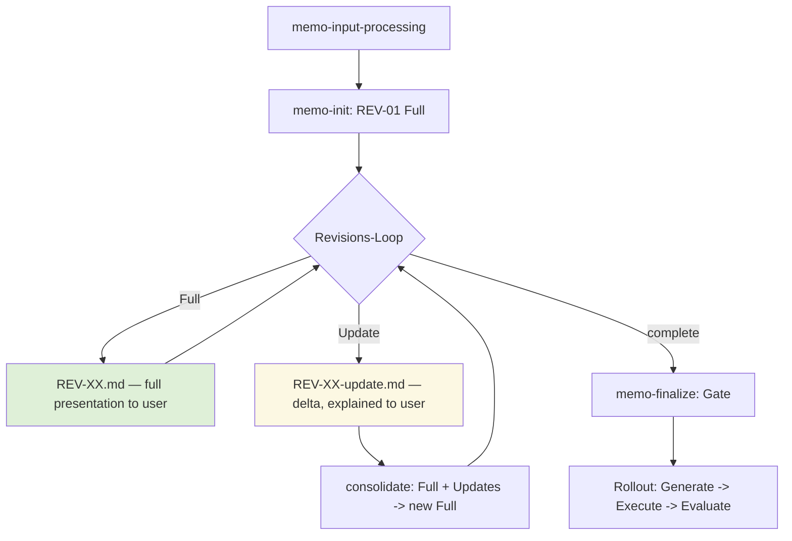

The memo flow runs from the first input to the rollout in one continuous shape: input processing produces the seed, `memo-init` writes the first full revision, a revision loop iterates until the memo is settled, and finalization opens the gate to the rollout. This chapter fixes the **revision shape** within that loop — when a revision is a self-contained **Full** snapshot the user sees, and when it is an incremental **Update** delta — and how the two reconcile via consolidation.

---

## The Flow Diagram

The following flowchart is the canonical reference for the flow.

---

## Full vs. Update Definitions

A revision is one of exactly two shapes.

- A **Full** revision (`REV-XX.md`) is a complete, standalone presentation of the entire memo. It is self-contained: it can be read on its own without reference to any earlier revision. A Full revision is **user-facing** — it is the snapshot the user is shown and reasons about.
- An **Update** revision (`REV-XX-update.md`) is a **delta** against the most recent Full revision. It records only what changed. An Update is **explained** to the user, but it is not itself a standalone presentation of the memo.

> Only **Full** revisions MUST be presented to the user as the memo. An Update revision MUST be communicated as a delta (its changes explained) and MUST NOT be treated as a standalone presentation of the whole memo.

The first revision (`REV-01`, written by `memo-init`) MUST be a Full revision. The revision loop may then produce any mix of Full and Update revisions.

---

## Consolidation

When the most recent revision is an Update, the standalone snapshot has drifted: the latest Full revision no longer reflects the current state. **Consolidation** folds the last Full revision plus all subsequent Update deltas into a **new Full** revision.

> Before finalization or PRD creation, if the most recent revision is an Update, the system MUST consolidate — producing a new Full revision that is a current, standalone snapshot — so that no downstream step (finalization, rollout) ever reads from a non-standalone state.

Consolidation is the `F` node in the diagram: `consolidate: Full + Updates -> new Full`. After consolidation, the loop continues from a clean Full baseline.

---

<!-- IMPLEMENTED-BY — rendered backlink lives in the dist (generated/bridge/<family>/<stem>.backlink.md); source stays authored-only (F2 Dist-Split) -->
## Related

- [07-revisions-and-questions.md](/specification/revisions-and-questions/) — the three-area revision structure and the question format that every revision carries.
- [11-quality-and-finalization.md](/specification/quality-and-finalization/) — the finalization gate the flow opens after the revision loop settles.
- [12-rollout.md](/specification/rollout/) — the Generate → Execute → Evaluate rollout the flow enters after finalization.
- [00-overview.md](/specification/overview/) — conformance language.
