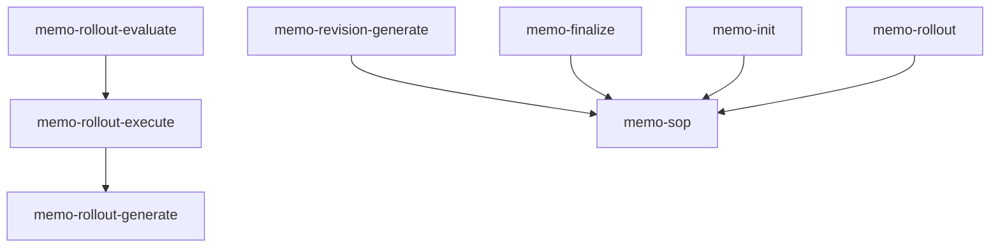

This page maps each specification chapter to the skills that implement it — so you can see which parts of the workflow are covered and where to look next.

> **Informative · generated.** Do not edit by hand; re-run the spec build to regenerate.

<!-- Auto-generated by scripts/generate-bridge.mjs from the skill-to-spec map. -->

## Coverage summary

| Chapter | Covered | Public | Internal | Reqs |
|---|---|---|---|---|
| [00-overview](#00-overview) | ✓ | 1 | 0 | — |
| [01-philosophy](#01-philosophy) | ✓ | 5 | 0 | — |
| [02-memo-sop-entrypoint](#02-memo-sop-entrypoint) | ✓ | 14 | 0 | 2 |
| [03-input-paths](#03-input-paths) | ✓ | 2 | 0 | — |
| [04-input-pipeline](#04-input-pipeline) | ✓ | 2 | 0 | 2 |
| [05-memo-strategies](#05-memo-strategies) | ✓ | 2 | 0 | — |
| [06-memo-structure](#06-memo-structure) | ✓ | 6 | 0 | 4 |
| [07-revisions-and-questions](#07-revisions-and-questions) | ✓ | 11 | 0 | 5 |
| [08-phases-and-prds](#08-phases-and-prds) | ✓ | 19 | 0 | 6 |
| [09-contamination-context-handover](#09-contamination-context-handover) | ✓ | 25 | 0 | — |
| [10-proactive-research](#10-proactive-research) | ✓ | 9 | 0 | 8 |
| [11-quality-and-finalization](#11-quality-and-finalization) | ✓ | 16 | 1 | 5 |
| [12-rollout](#12-rollout) | ✓ | 7 | 1 | — |
| [13-orchestration](#13-orchestration) | ✓ | 19 | 0 | — |
| [14-agents-skills-tasks](#14-agents-skills-tasks) | ✓ | 4 | 2 | — |
| [15-prompt-generator](#15-prompt-generator) | ✓ | 5 | 0 | — |
| [16-git-security-versioning](#16-git-security-versioning) | ✓ | 17 | 4 | 8 |
| [17-git-workflow-and-ids](#17-git-workflow-and-ids) | ✓ | 10 | 1 | 6 |
| [18-multidimensionality](#18-multidimensionality) | ✓ | 3 | 0 | — |
| [19-internal-vs-external-communication](#19-internal-vs-external-communication) | ✓ | 6 | 6 | 1 |
| [20-flow-full-vs-update-revisions](#20-flow-full-vs-update-revisions) | ✓ | 4 | 0 | — |
| [21-human-computer-interaction](#21-human-computer-interaction) | ✓ | 7 | 0 | — |
| [22-tree-cli-recommended-way](#22-tree-cli-recommended-way) | ✓ | 4 | 0 | 4 |
| [23-requirements](#23-requirements) | ✓ | 17 | 3 | 6 |
| [24-tools-registry](#24-tools-registry) | ✓ | 5 | 0 | 5 |
| [25-strands](#25-strands) | ✓ | 2 | 0 | — |
| [26-memo-history](#26-memo-history) | ✓ | 4 | 0 | — |
| [27-landing-the-plane](#27-landing-the-plane) | ✓ | 5 | 0 | 1 |
| [28-drift](#28-drift) | ✓ | 4 | 0 | — |
| [29-behavioral-guardrails](#29-behavioral-guardrails) | ✓ | 5 | 1 | 1 |
| [30-primitives](#30-primitives) | ✓ | 4 | 0 | — |
| [31-goals](#31-goals) | ✓ | 6 | 0 | — |
| [32-prompt-governance](#32-prompt-governance) | ✓ | 4 | 0 | — |
| [33-maintenance](#33-maintenance) | ✓ | 6 | 0 | 2 |
| [34-question-interface](#34-question-interface) | ✓ | 5 | 0 | — |
| [35-memo-authoring](#35-memo-authoring) | ✓ | 4 | 1 | 7 |
| [36-agent-strategies](#36-agent-strategies) | ✓ | 12 | 0 | — |
| [37-transcript-reliability](#37-transcript-reliability) | ✓ | 1 | 0 | — |
| [38-stage-model](#38-stage-model) | ✓ | 16 | 0 | — |
| [39-release-and-pinning](#39-release-and-pinning) | ✓ | 4 | 0 | — |
| [40-diagrams](#40-diagrams) | ✓ | 1 | 2 | 4 |
| [41-mental-model](#41-mental-model) | ✓ | 3 | 0 | — |
| [42-plans](#42-plans) | ✓ | 10 | 0 | — |
| [43-skill-authoring-and-quality](#43-skill-authoring-and-quality) | ✓ | 2 | 1 | 8 |
| [44-repository-and-outward-docs](#44-repository-and-outward-docs) | — | 0 | 6 | 22 |
| [45-implementation-fidelity-audit](#45-implementation-fidelity-audit) | ✓ | 1 | 0 | — |
| **Summary** | **45 / 46** | — | — | 107 |

## Skills by namespace

### code-patterns (1 skill)

| Skill | Chapters |
|---|---|
| `memo-budget-paste` | [42-plans](/specification/plans/) (primary) |

### evals (3 skills)

| Skill | Chapters |
|---|---|
| `memo-req-registry` | [23-requirements](/specification/requirements/) (primary), [24-tools-registry](/specification/tools-registry/), [30-primitives](/specification/primitives/) |
| `memo-req-runner` | [23-requirements](/specification/requirements/) (primary), [16-git-security-versioning](/specification/git-security-versioning/), [19-internal-vs-external-communication](/specification/internal-vs-external-communication/), [30-primitives](/specification/primitives/) |
| `memo-req-store` | [23-requirements](/specification/requirements/) (primary), [24-tools-registry](/specification/tools-registry/), [30-primitives](/specification/primitives/) |

### git (5 skills)

| Skill | Chapters |
|---|---|
| `git-commit` | [17-git-workflow-and-ids](/specification/git-workflow-and-ids/) (primary), [11-quality-and-finalization](/specification/quality-and-finalization/), [16-git-security-versioning](/specification/git-security-versioning/), [19-internal-vs-external-communication](/specification/internal-vs-external-communication/) |
| `git-merge-strategy` | [38-stage-model](/specification/stage-model/) (primary), [13-orchestration](/specification/orchestration/), [16-git-security-versioning](/specification/git-security-versioning/), [17-git-workflow-and-ids](/specification/git-workflow-and-ids/), [18-multidimensionality](/specification/multidimensionality/), [27-landing-the-plane](/specification/landing-the-plane/) |
| `git-push` | [38-stage-model](/specification/stage-model/) (primary), [11-quality-and-finalization](/specification/quality-and-finalization/), [16-git-security-versioning](/specification/git-security-versioning/), [17-git-workflow-and-ids](/specification/git-workflow-and-ids/), [18-multidimensionality](/specification/multidimensionality/), [19-internal-vs-external-communication](/specification/internal-vs-external-communication/), [23-requirements](/specification/requirements/), [39-release-and-pinning](/specification/release-and-pinning/) |
| `git-security` | [16-git-security-versioning](/specification/git-security-versioning/) (primary), [11-quality-and-finalization](/specification/quality-and-finalization/), [19-internal-vs-external-communication](/specification/internal-vs-external-communication/), [23-requirements](/specification/requirements/) |
| `release` | [39-release-and-pinning](/specification/release-and-pinning/) (primary), [16-git-security-versioning](/specification/git-security-versioning/), [29-behavioral-guardrails](/specification/behavioral-guardrails/), [33-maintenance](/specification/maintenance/), [38-stage-model](/specification/stage-model/) |

### memo (42 skills)

| Skill | Chapters |
|---|---|
| `drift-resolution` | [28-drift](/specification/drift/) (primary), [08-phases-and-prds](/specification/phases-and-prds/), [11-quality-and-finalization](/specification/quality-and-finalization/), [13-orchestration](/specification/orchestration/), [16-git-security-versioning](/specification/git-security-versioning/) |
| `memo-balance` | [11-quality-and-finalization](/specification/quality-and-finalization/) (primary), [07-revisions-and-questions](/specification/revisions-and-questions/), [35-memo-authoring](/specification/memo-authoring/) |
| `memo-chronic-add` | [26-memo-history](/specification/memo-history/) (primary), [09-contamination-context-handover](/specification/contamination-context-handover/), [31-goals](/specification/goals/) |
| `memo-chronic-build` | [26-memo-history](/specification/memo-history/) (primary), [09-contamination-context-handover](/specification/contamination-context-handover/), [13-orchestration](/specification/orchestration/), [36-agent-strategies](/specification/agent-strategies/) |
| `memo-coherence` | [11-quality-and-finalization](/specification/quality-and-finalization/) (primary), [01-philosophy](/specification/philosophy/), [07-revisions-and-questions](/specification/revisions-and-questions/), [29-behavioral-guardrails](/specification/behavioral-guardrails/), [35-memo-authoring](/specification/memo-authoring/) |
| `memo-evidence` | [11-quality-and-finalization](/specification/quality-and-finalization/) (primary), [07-revisions-and-questions](/specification/revisions-and-questions/), [10-proactive-research](/specification/proactive-research/) |
| `memo-fidelity-audit` | [45-implementation-fidelity-audit](/specification/implementation-fidelity-audit/) (primary), [07-revisions-and-questions](/specification/revisions-and-questions/), [11-quality-and-finalization](/specification/quality-and-finalization/), [12-rollout](/specification/rollout/), [31-goals](/specification/goals/), [38-stage-model](/specification/stage-model/) |
| `memo-finalize` | [11-quality-and-finalization](/specification/quality-and-finalization/) (primary), [02-memo-sop-entrypoint](/specification/memo-sop-entrypoint/), [08-phases-and-prds](/specification/phases-and-prds/), [09-contamination-context-handover](/specification/contamination-context-handover/), [12-rollout](/specification/rollout/), [16-git-security-versioning](/specification/git-security-versioning/), [20-flow-full-vs-update-revisions](/specification/flow-full-vs-update-revisions/), [21-human-computer-interaction](/specification/human-computer-interaction/), [23-requirements](/specification/requirements/), [25-strands](/specification/strands/) |
| `memo-goal-optimize` | [31-goals](/specification/goals/) (primary), [03-input-paths](/specification/input-paths/), [04-input-pipeline](/specification/input-pipeline/), [09-contamination-context-handover](/specification/contamination-context-handover/), [34-question-interface](/specification/question-interface/) |
| `memo-goal-score` | [31-goals](/specification/goals/) (primary), [09-contamination-context-handover](/specification/contamination-context-handover/), [22-tree-cli-recommended-way](/specification/tree-cli-recommended-way/), [36-agent-strategies](/specification/agent-strategies/) |
| `memo-goal-score-all` | [31-goals](/specification/goals/) (primary), [09-contamination-context-handover](/specification/contamination-context-handover/), [21-human-computer-interaction](/specification/human-computer-interaction/), [33-maintenance](/specification/maintenance/), [36-agent-strategies](/specification/agent-strategies/) |
| `memo-handover` | [09-contamination-context-handover](/specification/contamination-context-handover/) (primary), [13-orchestration](/specification/orchestration/), [16-git-security-versioning](/specification/git-security-versioning/), [27-landing-the-plane](/specification/landing-the-plane/), [42-plans](/specification/plans/) |
| `memo-init` | [06-memo-structure](/specification/memo-structure/) (primary), [02-memo-sop-entrypoint](/specification/memo-sop-entrypoint/), [05-memo-strategies](/specification/memo-strategies/), [07-revisions-and-questions](/specification/revisions-and-questions/), [08-phases-and-prds](/specification/phases-and-prds/), [09-contamination-context-handover](/specification/contamination-context-handover/), [10-proactive-research](/specification/proactive-research/), [29-behavioral-guardrails](/specification/behavioral-guardrails/), [34-question-interface](/specification/question-interface/), [35-memo-authoring](/specification/memo-authoring/), [40-diagrams](/specification/diagrams/), [41-mental-model](/specification/mental-model/) |
| `memo-input-processing` | [04-input-pipeline](/specification/input-pipeline/) (primary), [03-input-paths](/specification/input-paths/), [10-proactive-research](/specification/proactive-research/), [36-agent-strategies](/specification/agent-strategies/), [37-transcript-reliability](/specification/transcript-reliability/) |
| `memo-maintenance-score` | [33-maintenance](/specification/maintenance/) (primary), [09-contamination-context-handover](/specification/contamination-context-handover/), [22-tree-cli-recommended-way](/specification/tree-cli-recommended-way/), [28-drift](/specification/drift/), [36-agent-strategies](/specification/agent-strategies/) |
| `memo-maintenance-score-all` | [33-maintenance](/specification/maintenance/) (primary), [21-human-computer-interaction](/specification/human-computer-interaction/), [28-drift](/specification/drift/), [36-agent-strategies](/specification/agent-strategies/), [39-release-and-pinning](/specification/release-and-pinning/) |
| `memo-maintenance-verify` | [33-maintenance](/specification/maintenance/) (primary), [09-contamination-context-handover](/specification/contamination-context-handover/), [16-git-security-versioning](/specification/git-security-versioning/), [39-release-and-pinning](/specification/release-and-pinning/) |
| `memo-mental-model-derive` | [41-mental-model](/specification/mental-model/) (primary), [01-philosophy](/specification/philosophy/), [07-revisions-and-questions](/specification/revisions-and-questions/), [09-contamination-context-handover](/specification/contamination-context-handover/), [21-human-computer-interaction](/specification/human-computer-interaction/), [36-agent-strategies](/specification/agent-strategies/) |
| `memo-phase-evaluate` | [13-orchestration](/specification/orchestration/) (primary), [08-phases-and-prds](/specification/phases-and-prds/), [09-contamination-context-handover](/specification/contamination-context-handover/), [23-requirements](/specification/requirements/), [36-agent-strategies](/specification/agent-strategies/) |
| `memo-phase-execute` | [13-orchestration](/specification/orchestration/) (primary), [08-phases-and-prds](/specification/phases-and-prds/), [09-contamination-context-handover](/specification/contamination-context-handover/), [12-rollout](/specification/rollout/), [15-prompt-generator](/specification/prompt-generator/), [16-git-security-versioning](/specification/git-security-versioning/), [17-git-workflow-and-ids](/specification/git-workflow-and-ids/), [23-requirements](/specification/requirements/), [29-behavioral-guardrails](/specification/behavioral-guardrails/) |
| `memo-phase-generate` | [08-phases-and-prds](/specification/phases-and-prds/) (primary), [09-contamination-context-handover](/specification/contamination-context-handover/), [13-orchestration](/specification/orchestration/), [15-prompt-generator](/specification/prompt-generator/), [16-git-security-versioning](/specification/git-security-versioning/), [23-requirements](/specification/requirements/), [32-prompt-governance](/specification/prompt-governance/) |
| `memo-plan-add` | [42-plans](/specification/plans/) (primary), [02-memo-sop-entrypoint](/specification/memo-sop-entrypoint/), [08-phases-and-prds](/specification/phases-and-prds/), [18-multidimensionality](/specification/multidimensionality/), [38-stage-model](/specification/stage-model/) |
| `memo-plan-evaluate` | [42-plans](/specification/plans/) (primary), [08-phases-and-prds](/specification/phases-and-prds/), [09-contamination-context-handover](/specification/contamination-context-handover/), [14-agents-skills-tasks](/specification/agents-skills-tasks/), [38-stage-model](/specification/stage-model/) |
| `memo-plan-execute` | [42-plans](/specification/plans/) (primary), [02-memo-sop-entrypoint](/specification/memo-sop-entrypoint/), [09-contamination-context-handover](/specification/contamination-context-handover/), [13-orchestration](/specification/orchestration/), [16-git-security-versioning](/specification/git-security-versioning/), [17-git-workflow-and-ids](/specification/git-workflow-and-ids/), [21-human-computer-interaction](/specification/human-computer-interaction/), [38-stage-model](/specification/stage-model/) |
| `memo-plan-finalize` | [42-plans](/specification/plans/) (primary), [02-memo-sop-entrypoint](/specification/memo-sop-entrypoint/), [38-stage-model](/specification/stage-model/) |
| `memo-plan-init` | [42-plans](/specification/plans/) (primary), [02-memo-sop-entrypoint](/specification/memo-sop-entrypoint/), [06-memo-structure](/specification/memo-structure/), [08-phases-and-prds](/specification/phases-and-prds/), [38-stage-model](/specification/stage-model/) |
| `memo-plan-status` | [42-plans](/specification/plans/) (primary), [02-memo-sop-entrypoint](/specification/memo-sop-entrypoint/), [06-memo-structure](/specification/memo-structure/), [22-tree-cli-recommended-way](/specification/tree-cli-recommended-way/), [38-stage-model](/specification/stage-model/) |
| `memo-plan-stop` | [42-plans](/specification/plans/) (primary), [02-memo-sop-entrypoint](/specification/memo-sop-entrypoint/), [09-contamination-context-handover](/specification/contamination-context-handover/), [17-git-workflow-and-ids](/specification/git-workflow-and-ids/), [38-stage-model](/specification/stage-model/) |
| `memo-plan-update-checkbox` | [42-plans](/specification/plans/) (primary), [02-memo-sop-entrypoint](/specification/memo-sop-entrypoint/), [17-git-workflow-and-ids](/specification/git-workflow-and-ids/), [22-tree-cli-recommended-way](/specification/tree-cli-recommended-way/), [38-stage-model](/specification/stage-model/) |
| `memo-prds-validate` | [08-phases-and-prds](/specification/phases-and-prds/) (primary), [09-contamination-context-handover](/specification/contamination-context-handover/), [11-quality-and-finalization](/specification/quality-and-finalization/), [13-orchestration](/specification/orchestration/), [23-requirements](/specification/requirements/) |
| `memo-references` | [11-quality-and-finalization](/specification/quality-and-finalization/) (primary), [07-revisions-and-questions](/specification/revisions-and-questions/), [08-phases-and-prds](/specification/phases-and-prds/), [13-orchestration](/specification/orchestration/), [28-drift](/specification/drift/) |
| `memo-reset-recommend` | [08-phases-and-prds](/specification/phases-and-prds/) (primary), [02-memo-sop-entrypoint](/specification/memo-sop-entrypoint/), [09-contamination-context-handover](/specification/contamination-context-handover/), [21-human-computer-interaction](/specification/human-computer-interaction/) |
| `memo-revision-consolidate` | [20-flow-full-vs-update-revisions](/specification/flow-full-vs-update-revisions/) (primary), [07-revisions-and-questions](/specification/revisions-and-questions/), [11-quality-and-finalization](/specification/quality-and-finalization/) |
| `memo-revision-evaluate` | [07-revisions-and-questions](/specification/revisions-and-questions/) (primary), [09-contamination-context-handover](/specification/contamination-context-handover/), [13-orchestration](/specification/orchestration/), [34-question-interface](/specification/question-interface/) |
| `memo-revision-execute` | [07-revisions-and-questions](/specification/revisions-and-questions/) (primary), [06-memo-structure](/specification/memo-structure/), [08-phases-and-prds](/specification/phases-and-prds/), [20-flow-full-vs-update-revisions](/specification/flow-full-vs-update-revisions/), [34-question-interface](/specification/question-interface/), [35-memo-authoring](/specification/memo-authoring/) |
| `memo-revision-generate` | [07-revisions-and-questions](/specification/revisions-and-questions/) (primary), [01-philosophy](/specification/philosophy/), [10-proactive-research](/specification/proactive-research/), [13-orchestration](/specification/orchestration/), [20-flow-full-vs-update-revisions](/specification/flow-full-vs-update-revisions/), [34-question-interface](/specification/question-interface/), [41-mental-model](/specification/mental-model/) |
| `memo-rollout` | [12-rollout](/specification/rollout/) (primary), [11-quality-and-finalization](/specification/quality-and-finalization/), [13-orchestration](/specification/orchestration/), [16-git-security-versioning](/specification/git-security-versioning/), [33-maintenance](/specification/maintenance/), [38-stage-model](/specification/stage-model/) |
| `memo-rollout-evaluate` | [12-rollout](/specification/rollout/) (primary), [08-phases-and-prds](/specification/phases-and-prds/), [09-contamination-context-handover](/specification/contamination-context-handover/), [23-requirements](/specification/requirements/), [31-goals](/specification/goals/), [36-agent-strategies](/specification/agent-strategies/), [38-stage-model](/specification/stage-model/) |
| `memo-rollout-execute` | [12-rollout](/specification/rollout/) (primary), [08-phases-and-prds](/specification/phases-and-prds/), [09-contamination-context-handover](/specification/contamination-context-handover/), [13-orchestration](/specification/orchestration/), [16-git-security-versioning](/specification/git-security-versioning/), [17-git-workflow-and-ids](/specification/git-workflow-and-ids/), [26-memo-history](/specification/memo-history/), [27-landing-the-plane](/specification/landing-the-plane/), [38-stage-model](/specification/stage-model/) |
| `memo-rollout-generate` | [08-phases-and-prds](/specification/phases-and-prds/) (primary), [11-quality-and-finalization](/specification/quality-and-finalization/), [13-orchestration](/specification/orchestration/), [15-prompt-generator](/specification/prompt-generator/), [23-requirements](/specification/requirements/), [25-strands](/specification/strands/), [32-prompt-governance](/specification/prompt-governance/) |
| `memo-sop` | [02-memo-sop-entrypoint](/specification/memo-sop-entrypoint/) (primary), [00-overview](/specification/overview/), [01-philosophy](/specification/philosophy/), [12-rollout](/specification/rollout/), [13-orchestration](/specification/orchestration/), [21-human-computer-interaction](/specification/human-computer-interaction/), [27-landing-the-plane](/specification/landing-the-plane/), [30-primitives](/specification/primitives/), [38-stage-model](/specification/stage-model/) |
| `memo-sub-init` | [06-memo-structure](/specification/memo-structure/) (primary), [02-memo-sop-entrypoint](/specification/memo-sop-entrypoint/), [05-memo-strategies](/specification/memo-strategies/), [09-contamination-context-handover](/specification/contamination-context-handover/) |

### prd (3 skills)

| Skill | Chapters |
|---|---|
| `memo-prd-evaluate` | [08-phases-and-prds](/specification/phases-and-prds/) (primary), [09-contamination-context-handover](/specification/contamination-context-handover/), [13-orchestration](/specification/orchestration/), [14-agents-skills-tasks](/specification/agents-skills-tasks/), [23-requirements](/specification/requirements/) |
| `memo-prd-generate` | [08-phases-and-prds](/specification/phases-and-prds/) (primary), [15-prompt-generator](/specification/prompt-generator/), [17-git-workflow-and-ids](/specification/git-workflow-and-ids/), [23-requirements](/specification/requirements/), [32-prompt-governance](/specification/prompt-governance/) |
| `memo-req-template` | [23-requirements](/specification/requirements/) (primary), [15-prompt-generator](/specification/prompt-generator/), [24-tools-registry](/specification/tools-registry/), [32-prompt-governance](/specification/prompt-governance/) |

### research (4 skills)

| Skill | Chapters |
|---|---|
| `memo-research-agent` | [10-proactive-research](/specification/proactive-research/) (primary), [11-quality-and-finalization](/specification/quality-and-finalization/), [13-orchestration](/specification/orchestration/), [36-agent-strategies](/specification/agent-strategies/) |
| `research-best-practice-playwright` | [10-proactive-research](/specification/proactive-research/) |
| `research-scrape-docs` | [10-proactive-research](/specification/proactive-research/) |
| `research-workflow` | [13-orchestration](/specification/orchestration/) (primary), [10-proactive-research](/specification/proactive-research/), [36-agent-strategies](/specification/agent-strategies/) |

### skill (2 skills)

| Skill | Chapters |
|---|---|
| `skill-testing` | [43-skill-authoring-and-quality](/specification/skill-authoring-and-quality/) (primary), [02-memo-sop-entrypoint](/specification/memo-sop-entrypoint/), [14-agents-skills-tasks](/specification/agents-skills-tasks/) |
| `specs-to-skills` | [43-skill-authoring-and-quality](/specification/skill-authoring-and-quality/) (primary), [23-requirements](/specification/requirements/) |

### wiki (3 skills)

| Skill | Chapters |
|---|---|
| `wiki-ingest` | [10-proactive-research](/specification/proactive-research/), [26-memo-history](/specification/memo-history/) |
| `wiki-lint` | [23-requirements](/specification/requirements/) |
| `wiki-query` | [24-tools-registry](/specification/tools-registry/) |

### workbench (4 skills)

| Skill | Chapters |
|---|---|
| `workbench-audit` | [16-git-security-versioning](/specification/git-security-versioning/), [19-internal-vs-external-communication](/specification/internal-vs-external-communication/), [24-tools-registry](/specification/tools-registry/) |
| `workbench-modes` | [02-memo-sop-entrypoint](/specification/memo-sop-entrypoint/) (primary), [01-philosophy](/specification/philosophy/), [08-phases-and-prds](/specification/phases-and-prds/), [16-git-security-versioning](/specification/git-security-versioning/), [17-git-workflow-and-ids](/specification/git-workflow-and-ids/), [27-landing-the-plane](/specification/landing-the-plane/), [29-behavioral-guardrails](/specification/behavioral-guardrails/) |
| `workbench-persona-audit` | [14-agents-skills-tasks](/specification/agents-skills-tasks/) (primary), [09-contamination-context-handover](/specification/contamination-context-handover/), [11-quality-and-finalization](/specification/quality-and-finalization/), [19-internal-vs-external-communication](/specification/internal-vs-external-communication/), [36-agent-strategies](/specification/agent-strategies/) |
| `workbench-project-setup` | [06-memo-structure](/specification/memo-structure/) |

**Summary: 9 namespaces · 67 skills total**

## Chapters

### Introduction

#### 00-overview

| Field | Value |
|---|---|
| Covered | ✓ yes |
| Public skills | `memo-sop` |
| Internal tooling | — |
| Requirements | — |
| Depends on | [01-philosophy](/specification/philosophy/), [02-memo-sop-entrypoint](/specification/memo-sop-entrypoint/), [08-phases-and-prds](/specification/phases-and-prds/), [18-multidimensionality](/specification/multidimensionality/) |

#### 01-philosophy

| Field | Value |
|---|---|
| Covered | ✓ yes |
| Public skills | `memo-coherence`, `memo-mental-model-derive`, `memo-revision-generate`, `memo-sop`, `workbench-modes` |
| Internal tooling | — |
| Requirements | — |
| Depends on | [00-overview](/specification/overview/), [02-memo-sop-entrypoint](/specification/memo-sop-entrypoint/), [04-input-pipeline](/specification/input-pipeline/), [12-rollout](/specification/rollout/) |

#### 02-memo-sop-entrypoint

| Field | Value |
|---|---|
| Covered | ✓ yes |
| Public skills | `memo-finalize`, `memo-init`, `memo-plan-add`, `memo-plan-execute`, `memo-plan-finalize`, `memo-plan-init`, `memo-plan-status`, `memo-plan-stop`, `memo-plan-update-checkbox`, `memo-reset-recommend`, `memo-sop`, `memo-sub-init`, `skill-testing`, `workbench-modes` |
| Internal tooling | — |
| Requirements | 2 |
| Depends on | [00-overview](/specification/overview/), [01-philosophy](/specification/philosophy/), [03-input-paths](/specification/input-paths/), [11-quality-and-finalization](/specification/quality-and-finalization/), [12-rollout](/specification/rollout/), [13-orchestration](/specification/orchestration/) |

#### 30-primitives

| Field | Value |
|---|---|
| Covered | ✓ yes |
| Public skills | `memo-req-registry`, `memo-req-runner`, `memo-req-store`, `memo-sop` |
| Internal tooling | — |
| Requirements | — |
| Depends on | [00-overview](/specification/overview/), [04-input-pipeline](/specification/input-pipeline/), [06-memo-structure](/specification/memo-structure/), [07-revisions-and-questions](/specification/revisions-and-questions/), [08-phases-and-prds](/specification/phases-and-prds/), [23-requirements](/specification/requirements/), [24-tools-registry](/specification/tools-registry/), [25-strands](/specification/strands/) |

### Input

#### 03-input-paths

| Field | Value |
|---|---|
| Covered | ✓ yes |
| Public skills | `memo-goal-optimize`, `memo-input-processing` |
| Internal tooling | — |
| Requirements | — |
| Depends on | [02-memo-sop-entrypoint](/specification/memo-sop-entrypoint/), [04-input-pipeline](/specification/input-pipeline/), [05-memo-strategies](/specification/memo-strategies/), [07-revisions-and-questions](/specification/revisions-and-questions/) |

#### 04-input-pipeline

| Field | Value |
|---|---|
| Covered | ✓ yes |
| Public skills | `memo-goal-optimize`, `memo-input-processing` |
| Internal tooling | — |
| Requirements | 2 |
| Depends on | [02-memo-sop-entrypoint](/specification/memo-sop-entrypoint/), [03-input-paths](/specification/input-paths/), [05-memo-strategies](/specification/memo-strategies/), [10-proactive-research](/specification/proactive-research/) |

#### 37-transcript-reliability

| Field | Value |
|---|---|
| Covered | ✓ yes |
| Public skills | `memo-input-processing` |
| Internal tooling | — |
| Requirements | — |
| Depends on | [03-input-paths](/specification/input-paths/), [04-input-pipeline](/specification/input-pipeline/), [09-contamination-context-handover](/specification/contamination-context-handover/), [10-proactive-research](/specification/proactive-research/), [30-primitives](/specification/primitives/) |

### Initialization

#### 05-memo-strategies

| Field | Value |
|---|---|
| Covered | ✓ yes |
| Public skills | `memo-init`, `memo-sub-init` |
| Internal tooling | — |
| Requirements | — |
| Depends on | [03-input-paths](/specification/input-paths/), [06-memo-structure](/specification/memo-structure/), [08-phases-and-prds](/specification/phases-and-prds/), [11-quality-and-finalization](/specification/quality-and-finalization/) |

#### 06-memo-structure

| Field | Value |
|---|---|
| Covered | ✓ yes |
| Public skills | `memo-init`, `memo-plan-init`, `memo-plan-status`, `memo-revision-execute`, `memo-sub-init`, `workbench-project-setup` |
| Internal tooling | — |
| Requirements | 4 |
| Depends on | [05-memo-strategies](/specification/memo-strategies/), [07-revisions-and-questions](/specification/revisions-and-questions/), [12-rollout](/specification/rollout/), [16-git-security-versioning](/specification/git-security-versioning/) |

#### 10-proactive-research

| Field | Value |
|---|---|
| Covered | ✓ yes |
| Public skills | `memo-evidence`, `memo-init`, `memo-input-processing`, `memo-research-agent`, `memo-revision-generate`, `research-best-practice-playwright`, `research-scrape-docs`, `research-workflow`, `wiki-ingest` |
| Internal tooling | — |
| Requirements | 8 |
| Depends on | [00-overview](/specification/overview/), [04-input-pipeline](/specification/input-pipeline/), [07-revisions-and-questions](/specification/revisions-and-questions/), [09-contamination-context-handover](/specification/contamination-context-handover/), [11-quality-and-finalization](/specification/quality-and-finalization/) |

#### 35-memo-authoring

| Field | Value |
|---|---|
| Covered | ✓ yes |
| Public skills | `memo-balance`, `memo-coherence`, `memo-init`, `memo-revision-execute` |
| Internal tooling | `image-diagram-excalidraw` |
| Requirements | 7 |
| Depends on | [01-philosophy](/specification/philosophy/), [05-memo-strategies](/specification/memo-strategies/), [06-memo-structure](/specification/memo-structure/), [10-proactive-research](/specification/proactive-research/), [30-primitives](/specification/primitives/), [34-question-interface](/specification/question-interface/) |

### Revision

#### 07-revisions-and-questions

| Field | Value |
|---|---|
| Covered | ✓ yes |
| Public skills | `memo-balance`, `memo-coherence`, `memo-evidence`, `memo-fidelity-audit`, `memo-init`, `memo-mental-model-derive`, `memo-references`, `memo-revision-consolidate`, `memo-revision-evaluate`, `memo-revision-execute`, `memo-revision-generate` |
| Internal tooling | — |
| Requirements | 5 |
| Depends on | [04-input-pipeline](/specification/input-pipeline/), [06-memo-structure](/specification/memo-structure/), [11-quality-and-finalization](/specification/quality-and-finalization/), [14-agents-skills-tasks](/specification/agents-skills-tasks/) |

#### 11-quality-and-finalization

| Field | Value |
|---|---|
| Covered | ✓ yes |
| Public skills | `drift-resolution`, `git-commit`, `git-push`, `git-security`, `memo-balance`, `memo-coherence`, `memo-evidence`, `memo-fidelity-audit`, `memo-finalize`, `memo-prds-validate`, `memo-references`, `memo-research-agent`, `memo-revision-consolidate`, `memo-rollout`, `memo-rollout-generate`, `workbench-persona-audit` |
| Internal tooling | `repo-quality` |
| Requirements | 5 |
| Depends on | [00-overview](/specification/overview/), [09-contamination-context-handover](/specification/contamination-context-handover/), [10-proactive-research](/specification/proactive-research/), [12-rollout](/specification/rollout/), [16-git-security-versioning](/specification/git-security-versioning/), [23-requirements](/specification/requirements/) |

#### 20-flow-full-vs-update-revisions

| Field | Value |
|---|---|
| Covered | ✓ yes |
| Public skills | `memo-finalize`, `memo-revision-consolidate`, `memo-revision-execute`, `memo-revision-generate` |
| Internal tooling | — |
| Requirements | — |
| Depends on | [00-overview](/specification/overview/), [07-revisions-and-questions](/specification/revisions-and-questions/), [11-quality-and-finalization](/specification/quality-and-finalization/), [12-rollout](/specification/rollout/) |

#### 34-question-interface

| Field | Value |
|---|---|
| Covered | ✓ yes |
| Public skills | `memo-goal-optimize`, `memo-init`, `memo-revision-evaluate`, `memo-revision-execute`, `memo-revision-generate` |
| Internal tooling | — |
| Requirements | — |
| Depends on | [05-memo-strategies](/specification/memo-strategies/), [07-revisions-and-questions](/specification/revisions-and-questions/), [21-human-computer-interaction](/specification/human-computer-interaction/), [29-behavioral-guardrails](/specification/behavioral-guardrails/), [31-goals](/specification/goals/) |

#### 40-diagrams

| Field | Value |
|---|---|
| Covered | ✓ yes |
| Public skills | `memo-init` |
| Internal tooling | `image-art-architecture`, `image-diagram-excalidraw` |
| Requirements | 4 |
| Depends on | [00-overview](/specification/overview/), [06-memo-structure](/specification/memo-structure/), [21-human-computer-interaction](/specification/human-computer-interaction/), [35-memo-authoring](/specification/memo-authoring/) |

### Execution

#### 08-phases-and-prds

| Field | Value |
|---|---|
| Covered | ✓ yes |
| Public skills | `drift-resolution`, `memo-finalize`, `memo-init`, `memo-phase-evaluate`, `memo-phase-execute`, `memo-phase-generate`, `memo-plan-add`, `memo-plan-evaluate`, `memo-plan-init`, `memo-prd-evaluate`, `memo-prd-generate`, `memo-prds-validate`, `memo-references`, `memo-reset-recommend`, `memo-revision-execute`, `memo-rollout-evaluate`, `memo-rollout-execute`, `memo-rollout-generate`, `workbench-modes` |
| Internal tooling | — |
| Requirements | 6 |
| Depends on | [05-memo-strategies](/specification/memo-strategies/), [07-revisions-and-questions](/specification/revisions-and-questions/), [12-rollout](/specification/rollout/), [13-orchestration](/specification/orchestration/), [15-prompt-generator](/specification/prompt-generator/), [18-multidimensionality](/specification/multidimensionality/) |

#### 12-rollout

| Field | Value |
|---|---|
| Covered | ✓ yes |
| Public skills | `memo-fidelity-audit`, `memo-finalize`, `memo-phase-execute`, `memo-rollout`, `memo-rollout-evaluate`, `memo-rollout-execute`, `memo-sop` |
| Internal tooling | `image-pencil-playwright-diff` |
| Requirements | — |
| Depends on | [00-overview](/specification/overview/), [11-quality-and-finalization](/specification/quality-and-finalization/), [13-orchestration](/specification/orchestration/), [14-agents-skills-tasks](/specification/agents-skills-tasks/), [16-git-security-versioning](/specification/git-security-versioning/) |

#### 13-orchestration

| Field | Value |
|---|---|
| Covered | ✓ yes |
| Public skills | `drift-resolution`, `git-merge-strategy`, `memo-chronic-build`, `memo-handover`, `memo-phase-evaluate`, `memo-phase-execute`, `memo-phase-generate`, `memo-plan-execute`, `memo-prd-evaluate`, `memo-prds-validate`, `memo-references`, `memo-research-agent`, `memo-revision-evaluate`, `memo-revision-generate`, `memo-rollout`, `memo-rollout-execute`, `memo-rollout-generate`, `memo-sop`, `research-workflow` |
| Internal tooling | — |
| Requirements | — |
| Depends on | [00-overview](/specification/overview/), [09-contamination-context-handover](/specification/contamination-context-handover/), [12-rollout](/specification/rollout/), [14-agents-skills-tasks](/specification/agents-skills-tasks/), [16-git-security-versioning](/specification/git-security-versioning/) |

#### 25-strands

| Field | Value |
|---|---|
| Covered | ✓ yes |
| Public skills | `memo-finalize`, `memo-rollout-generate` |
| Internal tooling | — |
| Requirements | — |
| Depends on | [00-overview](/specification/overview/), [06-memo-structure](/specification/memo-structure/), [08-phases-and-prds](/specification/phases-and-prds/), [23-requirements](/specification/requirements/), [24-tools-registry](/specification/tools-registry/) |

#### 27-landing-the-plane

| Field | Value |
|---|---|
| Covered | ✓ yes |
| Public skills | `git-merge-strategy`, `memo-handover`, `memo-rollout-execute`, `memo-sop`, `workbench-modes` |
| Internal tooling | — |
| Requirements | 1 |
| Depends on | [00-overview](/specification/overview/), [12-rollout](/specification/rollout/), [13-orchestration](/specification/orchestration/), [16-git-security-versioning](/specification/git-security-versioning/), [38-stage-model](/specification/stage-model/) |

#### 32-prompt-governance

| Field | Value |
|---|---|
| Covered | ✓ yes |
| Public skills | `memo-phase-generate`, `memo-prd-generate`, `memo-req-template`, `memo-rollout-generate` |
| Internal tooling | — |
| Requirements | — |
| Depends on | [08-phases-and-prds](/specification/phases-and-prds/), [14-agents-skills-tasks](/specification/agents-skills-tasks/), [15-prompt-generator](/specification/prompt-generator/), [23-requirements](/specification/requirements/), [30-primitives](/specification/primitives/), [31-goals](/specification/goals/) |

#### 38-stage-model

| Field | Value |
|---|---|
| Covered | ✓ yes |
| Public skills | `git-merge-strategy`, `git-push`, `memo-fidelity-audit`, `memo-plan-add`, `memo-plan-evaluate`, `memo-plan-execute`, `memo-plan-finalize`, `memo-plan-init`, `memo-plan-status`, `memo-plan-stop`, `memo-plan-update-checkbox`, `memo-rollout`, `memo-rollout-evaluate`, `memo-rollout-execute`, `memo-sop`, `release` |
| Internal tooling | — |
| Requirements | — |
| Depends on | [00-overview](/specification/overview/), [12-rollout](/specification/rollout/), [13-orchestration](/specification/orchestration/), [17-git-workflow-and-ids](/specification/git-workflow-and-ids/), [27-landing-the-plane](/specification/landing-the-plane/) |

#### 42-plans

| Field | Value |
|---|---|
| Covered | ✓ yes |
| Public skills | `memo-budget-paste`, `memo-handover`, `memo-plan-add`, `memo-plan-evaluate`, `memo-plan-execute`, `memo-plan-finalize`, `memo-plan-init`, `memo-plan-status`, `memo-plan-stop`, `memo-plan-update-checkbox` |
| Internal tooling | — |
| Requirements | — |
| Depends on | [06-memo-structure](/specification/memo-structure/), [08-phases-and-prds](/specification/phases-and-prds/), [12-rollout](/specification/rollout/), [13-orchestration](/specification/orchestration/), [30-primitives](/specification/primitives/), [38-stage-model](/specification/stage-model/) |

### Procedure

#### 22-tree-cli-recommended-way

| Field | Value |
|---|---|
| Covered | ✓ yes |
| Public skills | `memo-goal-score`, `memo-maintenance-score`, `memo-plan-status`, `memo-plan-update-checkbox` |
| Internal tooling | — |
| Requirements | 4 |
| Depends on | [00-overview](/specification/overview/), [13-orchestration](/specification/orchestration/), [14-agents-skills-tasks](/specification/agents-skills-tasks/) |

#### 23-requirements

| Field | Value |
|---|---|
| Covered | ✓ yes |
| Public skills | `git-push`, `git-security`, `memo-finalize`, `memo-phase-evaluate`, `memo-phase-execute`, `memo-phase-generate`, `memo-prd-evaluate`, `memo-prd-generate`, `memo-prds-validate`, `memo-req-registry`, `memo-req-runner`, `memo-req-store`, `memo-req-template`, `memo-rollout-evaluate`, `memo-rollout-generate`, `specs-to-skills`, `wiki-lint` |
| Internal tooling | `image-pencil-playwright-diff`, `repo-github-org`, `repo-quality` |
| Requirements | 6 |
| Depends on | [00-overview](/specification/overview/), [11-quality-and-finalization](/specification/quality-and-finalization/), [24-tools-registry](/specification/tools-registry/) |

#### 24-tools-registry

| Field | Value |
|---|---|
| Covered | ✓ yes |
| Public skills | `memo-req-registry`, `memo-req-store`, `memo-req-template`, `wiki-query`, `workbench-audit` |
| Internal tooling | — |
| Requirements | 5 |
| Depends on | [00-overview](/specification/overview/), [08-phases-and-prds](/specification/phases-and-prds/), [23-requirements](/specification/requirements/) |

### Behavior

#### 09-contamination-context-handover

| Field | Value |
|---|---|
| Covered | ✓ yes |
| Public skills | `memo-chronic-add`, `memo-chronic-build`, `memo-finalize`, `memo-goal-optimize`, `memo-goal-score`, `memo-goal-score-all`, `memo-handover`, `memo-init`, `memo-maintenance-score`, `memo-maintenance-verify`, `memo-mental-model-derive`, `memo-phase-evaluate`, `memo-phase-execute`, `memo-phase-generate`, `memo-plan-evaluate`, `memo-plan-execute`, `memo-plan-stop`, `memo-prd-evaluate`, `memo-prds-validate`, `memo-reset-recommend`, `memo-revision-evaluate`, `memo-rollout-evaluate`, `memo-rollout-execute`, `memo-sub-init`, `workbench-persona-audit` |
| Internal tooling | — |
| Requirements | — |
| Depends on | [00-overview](/specification/overview/), [08-phases-and-prds](/specification/phases-and-prds/), [10-proactive-research](/specification/proactive-research/), [11-quality-and-finalization](/specification/quality-and-finalization/), [13-orchestration](/specification/orchestration/) |

#### 18-multidimensionality

| Field | Value |
|---|---|
| Covered | ✓ yes |
| Public skills | `git-merge-strategy`, `git-push`, `memo-plan-add` |
| Internal tooling | — |
| Requirements | — |
| Depends on | [00-overview](/specification/overview/), [08-phases-and-prds](/specification/phases-and-prds/), [13-orchestration](/specification/orchestration/), [16-git-security-versioning](/specification/git-security-versioning/), [17-git-workflow-and-ids](/specification/git-workflow-and-ids/) |

#### 21-human-computer-interaction

| Field | Value |
|---|---|
| Covered | ✓ yes |
| Public skills | `memo-finalize`, `memo-goal-score-all`, `memo-maintenance-score-all`, `memo-mental-model-derive`, `memo-plan-execute`, `memo-reset-recommend`, `memo-sop` |
| Internal tooling | — |
| Requirements | — |
| Depends on | [00-overview](/specification/overview/), [11-quality-and-finalization](/specification/quality-and-finalization/), [20-flow-full-vs-update-revisions](/specification/flow-full-vs-update-revisions/) |

#### 28-drift

| Field | Value |
|---|---|
| Covered | ✓ yes |
| Public skills | `drift-resolution`, `memo-maintenance-score`, `memo-maintenance-score-all`, `memo-references` |
| Internal tooling | — |
| Requirements | — |
| Depends on | [00-overview](/specification/overview/), [08-phases-and-prds](/specification/phases-and-prds/), [13-orchestration](/specification/orchestration/) |

#### 29-behavioral-guardrails

| Field | Value |
|---|---|
| Covered | ✓ yes |
| Public skills | `memo-coherence`, `memo-init`, `memo-phase-execute`, `release`, `workbench-modes` |
| Internal tooling | `image-pencil-playwright-diff` |
| Requirements | 1 |
| Depends on | [00-overview](/specification/overview/), [13-orchestration](/specification/orchestration/), [21-human-computer-interaction](/specification/human-computer-interaction/) |

#### 41-mental-model

| Field | Value |
|---|---|
| Covered | ✓ yes |
| Public skills | `memo-init`, `memo-mental-model-derive`, `memo-revision-generate` |
| Internal tooling | — |
| Requirements | — |
| Depends on | [00-overview](/specification/overview/), [12-rollout](/specification/rollout/), [21-human-computer-interaction](/specification/human-computer-interaction/), [31-goals](/specification/goals/), [33-maintenance](/specification/maintenance/), [34-question-interface](/specification/question-interface/) |

### Health

#### 26-memo-history

| Field | Value |
|---|---|
| Covered | ✓ yes |
| Public skills | `memo-chronic-add`, `memo-chronic-build`, `memo-rollout-execute`, `wiki-ingest` |
| Internal tooling | — |
| Requirements | — |
| Depends on | [00-overview](/specification/overview/), [18-multidimensionality](/specification/multidimensionality/), [24-tools-registry](/specification/tools-registry/), [31-goals](/specification/goals/), [33-maintenance](/specification/maintenance/) |

#### 31-goals

| Field | Value |
|---|---|
| Covered | ✓ yes |
| Public skills | `memo-chronic-add`, `memo-fidelity-audit`, `memo-goal-optimize`, `memo-goal-score`, `memo-goal-score-all`, `memo-rollout-evaluate` |
| Internal tooling | — |
| Requirements | — |
| Depends on | [00-overview](/specification/overview/), [06-memo-structure](/specification/memo-structure/), [13-orchestration](/specification/orchestration/), [26-memo-history](/specification/memo-history/), [30-primitives](/specification/primitives/), [33-maintenance](/specification/maintenance/) |

#### 33-maintenance

| Field | Value |
|---|---|
| Covered | ✓ yes |
| Public skills | `memo-goal-score-all`, `memo-maintenance-score`, `memo-maintenance-score-all`, `memo-maintenance-verify`, `memo-rollout`, `release` |
| Internal tooling | — |
| Requirements | 2 |
| Depends on | [19-internal-vs-external-communication](/specification/internal-vs-external-communication/), [26-memo-history](/specification/memo-history/), [27-landing-the-plane](/specification/landing-the-plane/), [28-drift](/specification/drift/), [30-primitives](/specification/primitives/), [31-goals](/specification/goals/), [32-prompt-governance](/specification/prompt-governance/) |

#### 45-implementation-fidelity-audit

| Field | Value |
|---|---|
| Covered | ✓ yes |
| Public skills | `memo-fidelity-audit` |
| Internal tooling | — |
| Requirements | — |
| Depends on | [07-revisions-and-questions](/specification/revisions-and-questions/), [11-quality-and-finalization](/specification/quality-and-finalization/), [12-rollout](/specification/rollout/), [28-drift](/specification/drift/), [31-goals](/specification/goals/), [33-maintenance](/specification/maintenance/), [38-stage-model](/specification/stage-model/) |

### Agents

#### 14-agents-skills-tasks

| Field | Value |
|---|---|
| Covered | ✓ yes |
| Public skills | `memo-plan-evaluate`, `memo-prd-evaluate`, `skill-testing`, `workbench-persona-audit` |
| Internal tooling | `repo-docs-writing`, `repo-readme` |
| Requirements | — |
| Depends on | [00-overview](/specification/overview/), [09-contamination-context-handover](/specification/contamination-context-handover/), [12-rollout](/specification/rollout/), [13-orchestration](/specification/orchestration/), [15-prompt-generator](/specification/prompt-generator/) |

#### 15-prompt-generator

| Field | Value |
|---|---|
| Covered | ✓ yes |
| Public skills | `memo-phase-execute`, `memo-phase-generate`, `memo-prd-generate`, `memo-req-template`, `memo-rollout-generate` |
| Internal tooling | — |
| Requirements | — |
| Depends on | [00-overview](/specification/overview/), [12-rollout](/specification/rollout/), [13-orchestration](/specification/orchestration/), [14-agents-skills-tasks](/specification/agents-skills-tasks/), [16-git-security-versioning](/specification/git-security-versioning/) |

#### 36-agent-strategies

| Field | Value |
|---|---|
| Covered | ✓ yes |
| Public skills | `memo-chronic-build`, `memo-goal-score`, `memo-goal-score-all`, `memo-input-processing`, `memo-maintenance-score`, `memo-maintenance-score-all`, `memo-mental-model-derive`, `memo-phase-evaluate`, `memo-research-agent`, `memo-rollout-evaluate`, `research-workflow`, `workbench-persona-audit` |
| Internal tooling | — |
| Requirements | — |
| Depends on | [09-contamination-context-handover](/specification/contamination-context-handover/), [10-proactive-research](/specification/proactive-research/), [13-orchestration](/specification/orchestration/), [14-agents-skills-tasks](/specification/agents-skills-tasks/), [31-goals](/specification/goals/), [35-memo-authoring](/specification/memo-authoring/) |

### Git & Repo

#### 16-git-security-versioning

| Field | Value |
|---|---|
| Covered | ✓ yes |
| Public skills | `drift-resolution`, `git-commit`, `git-merge-strategy`, `git-push`, `git-security`, `memo-finalize`, `memo-handover`, `memo-maintenance-verify`, `memo-phase-execute`, `memo-phase-generate`, `memo-plan-execute`, `memo-req-runner`, `memo-rollout`, `memo-rollout-execute`, `release`, `workbench-audit`, `workbench-modes` |
| Internal tooling | `image-pencil-playwright-diff`, `repo-init`, `repo-issue`, `repo-quality` |
| Requirements | 8 |
| Depends on | [00-overview](/specification/overview/), [11-quality-and-finalization](/specification/quality-and-finalization/), [13-orchestration](/specification/orchestration/), [15-prompt-generator](/specification/prompt-generator/), [17-git-workflow-and-ids](/specification/git-workflow-and-ids/) |

#### 17-git-workflow-and-ids

| Field | Value |
|---|---|
| Covered | ✓ yes |
| Public skills | `git-commit`, `git-merge-strategy`, `git-push`, `memo-phase-execute`, `memo-plan-execute`, `memo-plan-stop`, `memo-plan-update-checkbox`, `memo-prd-generate`, `memo-rollout-execute`, `workbench-modes` |
| Internal tooling | `repo-issue` |
| Requirements | 6 |
| Depends on | [00-overview](/specification/overview/), [08-phases-and-prds](/specification/phases-and-prds/), [13-orchestration](/specification/orchestration/), [16-git-security-versioning](/specification/git-security-versioning/), [18-multidimensionality](/specification/multidimensionality/) |

#### 19-internal-vs-external-communication

| Field | Value |
|---|---|
| Covered | ✓ yes |
| Public skills | `git-commit`, `git-push`, `git-security`, `memo-req-runner`, `workbench-audit`, `workbench-persona-audit` |
| Internal tooling | `image-art-architecture`, `repo-docs-writing`, `repo-github-org`, `repo-issue`, `repo-quality`, `repo-readme` |
| Requirements | 1 |
| Depends on | [00-overview](/specification/overview/), [16-git-security-versioning](/specification/git-security-versioning/), [17-git-workflow-and-ids](/specification/git-workflow-and-ids/) |

#### 39-release-and-pinning

| Field | Value |
|---|---|
| Covered | ✓ yes |
| Public skills | `git-push`, `memo-maintenance-score-all`, `memo-maintenance-verify`, `release` |
| Internal tooling | — |
| Requirements | — |
| Depends on | [16-git-security-versioning](/specification/git-security-versioning/), [17-git-workflow-and-ids](/specification/git-workflow-and-ids/), [19-internal-vs-external-communication](/specification/internal-vs-external-communication/), [33-maintenance](/specification/maintenance/) |

#### 44-repository-and-outward-docs

| Field | Value |
|---|---|
| Covered | — not yet |
| Public skills | — none yet — |
| Internal tooling | `repo-docs-writing`, `repo-github-org`, `repo-init`, `repo-issue`, `repo-quality`, `repo-readme` |
| Requirements | 22 |
| Depends on | [00-overview](/specification/overview/), [16-git-security-versioning](/specification/git-security-versioning/), [17-git-workflow-and-ids](/specification/git-workflow-and-ids/), [19-internal-vs-external-communication](/specification/internal-vs-external-communication/), [24-tools-registry](/specification/tools-registry/), [35-memo-authoring](/specification/memo-authoring/) |

### Skills

#### 43-skill-authoring-and-quality

| Field | Value |
|---|---|
| Covered | ✓ yes |
| Public skills | `skill-testing`, `specs-to-skills` |
| Internal tooling | `image-art-architecture` |
| Requirements | 8 |
| Depends on | [02-memo-sop-entrypoint](/specification/memo-sop-entrypoint/), [11-quality-and-finalization](/specification/quality-and-finalization/), [14-agents-skills-tasks](/specification/agents-skills-tasks/), [23-requirements](/specification/requirements/), [30-primitives](/specification/primitives/), [33-maintenance](/specification/maintenance/) |

## Graph views

### Skill dependency graph — `requires` edges (memo)

