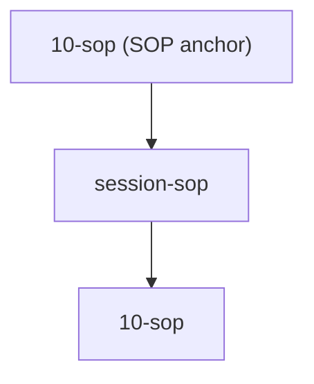

# 16. Bridge — session

> **Informative · generated.** Dist-mirror of the bridge hub with expanded per-chapter sections (PRD-008), a quantification head-table with click-to-scroll (PRD-009), Mermaid graph views (PRD-010), and by-skill namespace grouping (PRD-011). Do not edit by hand; re-run the spec build to regenerate.

<!-- Auto-generated by scripts/generate-bridge.mjs from the skill-to-spec map. -->

**Coverage:** 16 of 16 chapters have at least one public implementer (100%).

## Coverage summary

| Chapter | Covered | Public | Internal | Reqs | Gaps |
|---|---|---|---|---|---|
| [00-overview](#00-overview) | ✓ | 1 | 0 | — | — |
| [01-genesis-root](#01-genesis-root) | ✓ | 1 | 0 | — | — |
| [02-enforcement](#02-enforcement) | ✓ | 1 | 0 | 6 | — |
| [03-recovery](#03-recovery) | ✓ | 1 | 0 | — | — |
| [04-cli](#04-cli) | ✓ | 1 | 0 | 2 | — |
| [05-config-cascade](#05-config-cascade) | ✓ | 1 | 0 | 2 | — |
| [06-namespace-registry](#06-namespace-registry) | ✓ | 1 | 0 | — | — |
| [07-doctor-init](#07-doctor-init) | ✓ | 1 | 0 | 2 | — |
| [08-identity-pin](#08-identity-pin) | ✓ | 1 | 0 | 2 | — |
| [09-root-detection](#09-root-detection) | ✓ | 1 | 0 | 2 | — |
| [10-sop](#10-sop) | ✓ | 1 | 0 | — | — |
| [11-common-denominator](#11-common-denominator) | ✓ | 1 | 0 | — | — |
| [12-instances](#12-instances) | ✓ | 1 | 0 | — | — |
| [13-conventions](#13-conventions) | ✓ | 1 | 0 | — | — |
| [14-migration](#14-migration) | ✓ | 1 | 0 | — | — |
| [15-addons](#15-addons) | ✓ | 1 | 0 | — | — |
| **Summary** | **16 / 16 (100%)** | — | — | 16 | — |

## 00-overview

| Field | Value |
|---|---|
| Covered | ✓ yes |
| Public skills | `session-overview` |
| Internal tooling | — |
| Requirements | — |
| Gaps | — |
| Depends on | [01-genesis-root](./01-genesis-root.md), [02-enforcement](./02-enforcement.md), [03-recovery](./03-recovery.md), [10-sop](./10-sop.md) |

## 01-genesis-root

| Field | Value |
|---|---|
| Covered | ✓ yes |
| Public skills | `session-genesis-root` |
| Internal tooling | — |
| Requirements | — |
| Gaps | — |
| Depends on | [00-overview](./00-overview.md), [02-enforcement](./02-enforcement.md), [03-recovery](./03-recovery.md), [10-sop](./10-sop.md) |

## 02-enforcement

| Field | Value |
|---|---|
| Covered | ✓ yes |
| Public skills | `session-enforcement` |
| Internal tooling | — |
| Requirements | 6 |
| Gaps | — |
| Depends on | [01-genesis-root](./01-genesis-root.md), [03-recovery](./03-recovery.md) |

## 03-recovery

| Field | Value |
|---|---|
| Covered | ✓ yes |
| Public skills | `session-recovery` |
| Internal tooling | — |
| Requirements | — |
| Gaps | — |
| Depends on | [01-genesis-root](./01-genesis-root.md), [02-enforcement](./02-enforcement.md) |

## 04-cli

| Field | Value |
|---|---|
| Covered | ✓ yes |
| Public skills | `session-cli` |
| Internal tooling | — |
| Requirements | 2 |
| Gaps | — |
| Depends on | [00-overview](./00-overview.md), [05-config-cascade](./05-config-cascade.md), [07-doctor-init](./07-doctor-init.md) |

## 05-config-cascade

| Field | Value |
|---|---|
| Covered | ✓ yes |
| Public skills | `session-config-cascade` |
| Internal tooling | — |
| Requirements | 2 |
| Gaps | — |
| Depends on | [01-genesis-root](./01-genesis-root.md), [02-enforcement](./02-enforcement.md), [06-namespace-registry](./06-namespace-registry.md), [07-doctor-init](./07-doctor-init.md) |

## 06-namespace-registry

| Field | Value |
|---|---|
| Covered | ✓ yes |
| Public skills | `session-namespace-registry` |
| Internal tooling | — |
| Requirements | — |
| Gaps | — |
| Depends on | [02-enforcement](./02-enforcement.md), [05-config-cascade](./05-config-cascade.md), [07-doctor-init](./07-doctor-init.md), [10-sop](./10-sop.md) |

## 07-doctor-init

| Field | Value |
|---|---|
| Covered | ✓ yes |
| Public skills | `session-doctor-init` |
| Internal tooling | — |
| Requirements | 2 |
| Gaps | — |
| Depends on | [02-enforcement](./02-enforcement.md), [04-cli](./04-cli.md), [05-config-cascade](./05-config-cascade.md), [06-namespace-registry](./06-namespace-registry.md) |

## 08-identity-pin

| Field | Value |
|---|---|
| Covered | ✓ yes |
| Public skills | `session-identity-pin` |
| Internal tooling | — |
| Requirements | 2 |
| Gaps | — |
| Depends on | [01-genesis-root](./01-genesis-root.md), [02-enforcement](./02-enforcement.md), [03-recovery](./03-recovery.md), [09-root-detection](./09-root-detection.md) |

## 09-root-detection

| Field | Value |
|---|---|
| Covered | ✓ yes |
| Public skills | `session-root-detection` |
| Internal tooling | — |
| Requirements | 2 |
| Gaps | — |
| Depends on | [01-genesis-root](./01-genesis-root.md), [04-cli](./04-cli.md), [05-config-cascade](./05-config-cascade.md), [08-identity-pin](./08-identity-pin.md) |

## 10-sop

| Field | Value |
|---|---|
| Covered | ✓ yes |
| Public skills | `session-sop` |
| Internal tooling | — |
| Requirements | — |
| Gaps | — |
| Depends on | [00-overview](./00-overview.md), [01-genesis-root](./01-genesis-root.md), [06-namespace-registry](./06-namespace-registry.md), [11-common-denominator](./11-common-denominator.md), [12-instances](./12-instances.md), [13-conventions](./13-conventions.md) |

## 11-common-denominator

| Field | Value |
|---|---|
| Covered | ✓ yes |
| Public skills | `session-common-denominator` |
| Internal tooling | — |
| Requirements | — |
| Gaps | — |
| Depends on | [10-sop](./10-sop.md), [12-instances](./12-instances.md) |

## 12-instances

| Field | Value |
|---|---|
| Covered | ✓ yes |
| Public skills | `session-instances` |
| Internal tooling | — |
| Requirements | — |
| Gaps | — |
| Depends on | [10-sop](./10-sop.md), [11-common-denominator](./11-common-denominator.md) |

## 13-conventions

| Field | Value |
|---|---|
| Covered | ✓ yes |
| Public skills | `session-conventions` |
| Internal tooling | — |
| Requirements | — |
| Gaps | — |
| Depends on | [10-sop](./10-sop.md), [11-common-denominator](./11-common-denominator.md), [12-instances](./12-instances.md) |

## 14-migration

| Field | Value |
|---|---|
| Covered | ✓ yes |
| Public skills | `session-migration` |
| Internal tooling | — |
| Requirements | — |
| Gaps | — |
| Depends on | [00-overview](./00-overview.md), [03-recovery](./03-recovery.md), [05-config-cascade](./05-config-cascade.md), [10-sop](./10-sop.md) |

## 15-addons

| Field | Value |
|---|---|
| Covered | ✓ yes |
| Public skills | `session-addons` |
| Internal tooling | — |
| Requirements | — |
| Gaps | — |
| Depends on | [00-overview](./00-overview.md), [10-sop](./10-sop.md), [11-common-denominator](./11-common-denominator.md) |

## Skills by namespace

### session (16 skills)

| Skill | Chapters |
|---|---|
| `session-addons` | [15-addons](./15-addons.md) (primary) |
| `session-cli` | [04-cli](./04-cli.md) (primary) |
| `session-common-denominator` | [11-common-denominator](./11-common-denominator.md) (primary) |
| `session-config-cascade` | [05-config-cascade](./05-config-cascade.md) (primary) |
| `session-conventions` | [13-conventions](./13-conventions.md) (primary) |
| `session-doctor-init` | [07-doctor-init](./07-doctor-init.md) (primary) |
| `session-enforcement` | [02-enforcement](./02-enforcement.md) (primary) |
| `session-genesis-root` | [01-genesis-root](./01-genesis-root.md) (primary) |
| `session-identity-pin` | [08-identity-pin](./08-identity-pin.md) (primary) |
| `session-instances` | [12-instances](./12-instances.md) (primary) |
| `session-migration` | [14-migration](./14-migration.md) (primary) |
| `session-namespace-registry` | [06-namespace-registry](./06-namespace-registry.md) (primary) |
| `session-overview` | [00-overview](./00-overview.md) (primary) |
| `session-recovery` | [03-recovery](./03-recovery.md) (primary) |
| `session-root-detection` | [09-root-detection](./09-root-detection.md) (primary) |
| `session-sop` | [10-sop](./10-sop.md) (primary) |

**Summary: 1 namespace · 16 skills total**

## Graph views

### Skill → skill requires / primary chapter (session)

```mermaid
flowchart TD
    sk_session_addons["session-addons"]
    sk_session_cli["session-cli"]
    sk_session_common_denominator["session-common-denominator"]
    sk_session_config_cascade["session-config-cascade"]
    sk_session_conventions["session-conventions"]
    sk_session_doctor_init["session-doctor-init"]
    sk_session_enforcement["session-enforcement"]
    sk_session_genesis_root["session-genesis-root"]
    sk_session_identity_pin["session-identity-pin"]
    sk_session_instances["session-instances"]
    sk_session_migration["session-migration"]
    sk_session_namespace_registry["session-namespace-registry"]
    sk_session_overview["session-overview"]
    sk_session_recovery["session-recovery"]
    sk_session_root_detection["session-root-detection"]
    sk_session_sop["session-sop"]
    ch_n_00_overview["00-overview"]
    ch_n_01_genesis_root["01-genesis-root"]
    ch_n_02_enforcement["02-enforcement"]
    ch_n_03_recovery["03-recovery"]
    ch_n_04_cli["04-cli"]
    ch_n_05_config_cascade["05-config-cascade"]
    ch_n_06_namespace_registry["06-namespace-registry"]
    ch_n_07_doctor_init["07-doctor-init"]
    ch_n_08_identity_pin["08-identity-pin"]
    ch_n_09_root_detection["09-root-detection"]
    ch_n_10_sop["10-sop"]
    ch_n_11_common_denominator["11-common-denominator"]
    ch_n_12_instances["12-instances"]
    ch_n_13_conventions["13-conventions"]
    ch_n_14_migration["14-migration"]
    ch_n_15_addons["15-addons"]
    sk_session_overview --> ch_n_00_overview
    sk_session_genesis_root --> ch_n_01_genesis_root
    sk_session_enforcement --> ch_n_02_enforcement
    sk_session_recovery --> ch_n_03_recovery
    sk_session_cli --> ch_n_04_cli
    sk_session_config_cascade --> ch_n_05_config_cascade
    sk_session_namespace_registry --> ch_n_06_namespace_registry
    sk_session_doctor_init --> ch_n_07_doctor_init
    sk_session_identity_pin --> ch_n_08_identity_pin
    sk_session_root_detection --> ch_n_09_root_detection
    sk_session_sop --> ch_n_10_sop
    sk_session_common_denominator --> ch_n_11_common_denominator
    sk_session_instances --> ch_n_12_instances
    sk_session_conventions --> ch_n_13_conventions
    sk_session_migration --> ch_n_14_migration
    sk_session_addons --> ch_n_15_addons
```

### SOP flow

