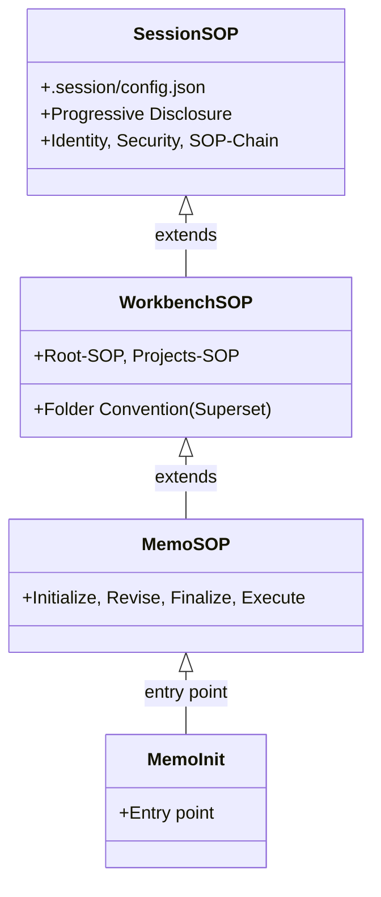

> **Informative.** This document introduces the Session spec, its scope, and its place among the sibling specifications. It does not itself carry normative requirements beyond those defined in the chapters it links.

This is the entry point for the **Session spec** — a standalone sibling of the memo-init core specification and the Workbench spec. It specifies the **Session Genesis Root** (`session-sop`): the lowest tier of the system, the thing that is global **per session** rather than per workbench or per project. It is the **outermost published** family a reader meets, and it is the lowest **runtime** tier the upper layers inherit from — but it is **not** the highest authority (the Core spec owns the conformance vocabulary). Those three "top" axes are kept distinct in [10-sop.md](/specification/sop/).

This family also **absorbs the SOP area**. There is no separate SOP standard: the connecting layer that makes every Standard Operating Procedure predictable — and the mechanism through which tools register, attach to the session, and become findable — is an **integral entry-point area of the session standard** ([10-sop.md](/specification/sop/)–[13-conventions.md](/specification/conventions/)), not a sibling spec of its own.

The Workbench spec's entry point ([workbench/02-sop-entrypoint.md](/workbench/sop-entrypoint/)) records that the machine tier was once left out of scope. This family fills the **enforcement slice** of that gap: the session identity, the per-session security/trust level, and the deterministic PreToolUse enforcement that guarantees the correct SOP is loaded before a tool runs. The broader host-wide machine spec (the security-hook system, the env-file guard, the OS arrangement) remains future work; this family covers only the **genesis root** that the upper layers depend on, plus the SOP entry-point mechanism layered on it.

---

## Why the Session Is the Genesis Root

The session is the one scope that exists **before** any workbench convention. A Claude Code session has an identity (its `sessionId`), it has a transcript, and it fires PreToolUse hooks — all of this independent of whether the session happens to be running inside a workbench, a single project, or nowhere in particular. Because it is the **first** thing that exists, it is the right place to anchor the chain of SOPs: `CLAUDE.md` loads `session-sop` first, and the upper layers — `workbench-sop`, `memo-sop`, the domain entry points — inherit the identity and security level it establishes.

```
session-sop  (this family — the Genesis Root + SOP entry-point mechanism)
  ↑ workbench-sop   (one session-SOP application above the genesis root)
  ↑ memo-sop        (memo process)
  ↑ memo-init / flowmcp / …  (domain entry points)
```

The same chain reads as an **inheritance** relationship — each tier *extends* the one below it and inherits the identity and security it establishes. An inheritance diagram is the type that states "extends" natively (the diagram map in [the Diagrams chapter](/specification/diagrams/) maps a tier model to exactly this type):



The build direction is **bottom-up**: the genesis root exists first, and each layer above it is a convention that assumes the layer below. The workbench is **just one session-SOP application** layered on the session tier — not a peer standard.

---

## Progressive Disclosure — The One Big Idea

The session is **not** a static block of `CLAUDE.md` text that is always fully present. It is a **fan of capabilities** that loads at the right place, only when its intent shows up — the pattern Anthropic calls **Progressive Disclosure**. It is the same mechanism that governs Agent Skills (a skill exposes only its `name` and `description` until its body is needed, and its bundled resources only when actually read) and on-demand tool definitions (the deferred-tools / tool-search mechanism this harness itself uses). Capability lies in a pool and is drawn just-in-time, rather than every door being held open at once.

This is why the session is the right tier to be **minimal**. The always-present surface is small — `.session/` plus its `config.json` — and everything above it is a **superset** that the lower tier never has to carry. **Session = minimal, Workbench = superset**: the genesis root stays lean, and breadth is disclosed by intent rather than pre-loaded.

Progressive Disclosure (when a capability becomes *visible*) must not be conflated with the **Precondition-Gate** (whether a capability is *allowed to run*). The driver's-licence rule — `memo-init` may run only once `memo-sop` has been read — is a Precondition-Gate: the deterministic SessionStart / PreToolUse chain (`REQ-SS-*`) specified in [02-enforcement.md](/specification/enforcement/). The two are complementary: disclosure decides *when* a door appears; the gate decides *whether* you may walk through it. Someone who never intends to drive needs no licence — pure disclosure; the licence itself is the gate laid over the disclosure.

---

## The Push-Down Principle

The family's organizing leitmotif is **push-down**: a concept shared across tiers is explained **once**, at the lowest tier that owns it — the session — and the tiers above (`workbench-sop`, `memo-sop`, and the Workbench folder pages) **reference down** into it rather than restating it. A reader meets the canonical definition here and finds pointers, not copies, higher up. The PreToolUse **Hook-Contract** is the worked example: its single source is this family's enforcement page ([02-enforcement.md](/specification/enforcement/)), and [workbench/23-hooks-contract.md](/workbench/hooks-contract/) references up to it rather than redefining the contract.

Three companion rules keep the push-down honest:

- **No nav-mirror tables.** A page does not rebuild the sidebar as a table; the navigation already lists the chapters.
- **Fewer pages, more content.** Breadth is consolidated into a smaller number of fuller pages rather than scattered across many thin ones.
- **No wild cross-linking.** A concept is linked where it is defined, not at every place it is mentioned; links point to the one owning page, not a web of incidental references.

---

## Glossary

The vocabulary the whole chain shares is defined once here, at the lowest tier (the push-down principle above). Higher tiers use these terms without redefining them.

- **Tool** — a registered **namespace**: an SOP application that reserves a namespace and registers its skills, so the session can find it. The built-in tools are `memo`, `workbench`, and `flowmcp`. A registered namespace is a *Tool* — not a *Component*, which is reserved for a skill subtype.
- **Add-on** — a **custom-folder** tool: a local extension that lives in its own folder and is **not** a reserved namespace. The Workbench spec calls these *custom folders*; `.memo/`, generated by `memo-init`, is one example. "Children" is used only informally for the things a tool carries, deliberately avoiding the formal *Component*.
- **namespace** — the reserved prefix a Tool owns (e.g. `memo`), under which its skills and dependency edges are declared. Namespaces are unique; a collision is an error, never a silent merge.
- **SOP** — Standard Operating Procedure: the connecting layer that makes a procedure predictable, and the entry-point mechanism through which a Tool registers, attaches to the session, and becomes findable ([10-sop.md](/specification/sop/)). Not every Tool is an SOP — a catalog tool carries skills but defines no procedure.
- **phase** — a unit of a memo rollout that groups several PRDs and is ordered by `depends-on` edges.
- **strand** — the dependency closure over phases: the chain that *emerges* when the `depends-on` edges are followed, computed rather than authored.
- **plan** — a multi-phase execution record that references a memo and tracks which phase runs next.
- **requirements** — the typed, persisted assertions and tool-checks a memo declares, drawn from a registry and carried into a rollout through its PRDs.
- **finalisation** — the readiness gate a memo passes before its PRDs are generated: the point at which it is judged complete enough to roll out.
- **user-fuel** — the user-supplied input that drives an otherwise autonomous process: the voice memos, the answered questions, and the explicit approvals. The process runs on its own once started, but it is the user-fuel that sets and steers it.

### Three meanings of "session"

The word *session* is overloaded; this family means exactly one of three things, and the other two never touch a project's `.session/`:

- **OS / runtime session** — the operating system's login or terminal session (`XDG_SESSION_ID`, `tmux`, launchd). It lives in environment variables and `/run`, never in a project folder.
- **Claude Code conversation session** — the harness-owned conversation with its `sessionId` and transcript. It is owned by the harness under `~/.claude/` and is one replaceable consumer of our marker.
- **our `.session/`** — the on-disk genesis-root marker directory this family specifies (it holds `config.json`). It is OS- and harness-agnostic and collides with neither of the above.

---

## The Chapters

The family is read in six nav groups; the sidebar lists the individual chapters, so they are not re-tabulated here (the push-down rule on nav-mirror tables, above). Each group is summarised by what it owns:

- **Introduction** — this overview: scope, the genesis-root rationale, Progressive Disclosure, the push-down principle, and the shared glossary.
- **Genesis Root** — what the session tier owns: the tier model and identity, the `.session/config.json` cascade, the namespace registry, and root detection.
- **SOP** — the entry-point mechanism: SOP as the layer tools register through, the four-part common denominator every SOP shares, the existing instances, the naming conventions, and the Add-on model.
- **Enforcement** — the deterministic PreToolUse gate: the three-state fail-safe contract, `session doctor` / `session init`, and the SessionStart identity pin.
- **CLI** — the command-line doctrine: the standard verbs and flags and the exit-code mirror.
- **Recovery** — the fail-safe guarantees (disable switch, sentinel, SessionStart canary) and the publication-fold migration.

---


<!-- IMPLEMENTED-BY — rendered backlink lives in the dist (generated/bridge/<family>/<stem>.backlink.md); source stays authored-only (F2 Dist-Split) -->
## Related

- [10-sop.md](/specification/sop/) — the SOP entry-point mechanism this family absorbs, and the common SOP standard `session-sop` is an instance of.
- [The Workbench spec](/workbench/overview/) — the convention layered above the genesis root; its [SOP entry point](/workbench/sop-entrypoint/) routes through this tier.
- [workbench/23-hooks-contract.md](/workbench/hooks-contract/) — the PreToolUse contract this family's enforcement realizes.
