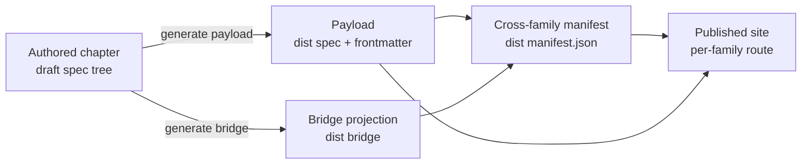

Every specification chapter in this organization has the same shape. The shape is not a style preference — it is what lets a build pipeline read any chapter of any family uniformly, lets a reader arrive at a chapter and know where to look, and lets a new family be added by following a document instead of reverse-engineering a generator. Until now that shape lived only as tribal knowledge inside the authored chapters and the scripts that process them. This chapter makes it normative: the invariant elements every chapter carries, the family-level files that describe a family as a whole, and the draft-to-dist pipeline that turns an authored chapter into published output.

The rules here are authored the same way they describe: this chapter is itself a chapter in the format it specifies (it dogfoods its own contract), and so is every other chapter in this family.

---

## The Invariant Chapter Elements

A chapter is a single Markdown file. In reading order, it **MUST** carry the following elements, and a build gate **MAY** enforce their presence:

| Element | Rule |
|---------|------|
| **H1 title** | The first line is a single `# NN. Title` heading. The `NN` is the chapter's two-digit number and the title is a short human name. The published page renders its title from the family payload, so the body H1 is stripped in the dist — it exists in the source as the canonical chapter name. |
| **Header metadata table** | Directly under the H1, a small table carries the chapter's own metadata: a `Status` row (always), an optional `Depends on` row, and a `Related` row. Both the `\| Field \| Value \|` header form and the borderless `\| \| \|` form are accepted; the presence of a `Status` row is what marks the block as the metadata table. This table is stripped from the top of the published page (reading order is content-first) and its links are preserved in the bottom `## Related` footer. |
| **Intro prose** | Between the metadata table and the first `##` heading there **MUST** be at least one paragraph of running prose. A chapter opens by explaining itself to a reader, not by dropping straight into a sub-heading. This intro is the source of the page's one-line description in the family manifest. |
| **`## ` section headings** | The body is organized under second-level headings. Deeper nesting (`###`, `####`) is allowed within a section. |
| **Bottom `## Related` section** | The last section is `## Related`, a list of the chapters (and, where useful, cross-family pages) a reader should follow next, each with a one-line note on why. |

A chapter that is motivation or index prose rather than binding rules marks itself non-normative with a short blockquote near the top whose bold lead word is `Informative.`; every other chapter is normative and assumes the RFC-2119 conformance interpretation ([00-overview.md](/specification/overview/)).

### The Implemented-By Placeholder

Each non-bridge chapter also carries a single generated marker — the implemented-by placeholder — immediately above its `## Related` section. The rendered "Implemented by" backlink (which skills implement the chapter) is a derived artifact that lives only in the dist; the source chapter carries the placeholder and never the full block. This authored-versus-derived split is described in [The Bridge Standard](/specification/bridge-standard/); a chapter author leaves the placeholder in place and does not hand-edit the backlink.

---

## The Numbering Convention

A chapter file is named `NN-name.md`: a two-digit ordinal, a hyphen, and a lowercase hyphenated slug. The number orders the family and the slug names the chapter. Two rules keep numbering sound:

- The **published slug is the filename minus its `NN-` prefix and `.md` suffix**, so `02-per-chapter-format.md` publishes at the slug `per-chapter-format`. Renaming the number does **not** change the slug, so a renumbered chapter keeps its published URL — numbering is a reading-order device, not part of a page's identity.
- The **`NN-bridge.md` name is reserved** for the family's generated bridge hub ([The Bridge Standard](/specification/bridge-standard/)). A family has exactly one bridge chapter; the build reuses its existing number so re-runs stay idempotent.

Within a chapter, same-family links use the relative `./NN-name.md` form; the pipeline rewrites them to the family's published route. Cross-family links are written as the target family's absolute route directly, because the relative form cannot be re-routed across families.

---

## Category Classification

The work that produces and maintains a chapter is classified with a **category tag** — `[Docs]` for a prose chapter, `[Code]` where a chapter drives a code artifact, and further tags (`[GitHub]`, `[Text]`, …) for other work families. The tag vocabulary is defined once, at memo creation, and is described in the memo input pipeline ([/specification/input-pipeline/](/specification/input-pipeline/)); it is not re-invented here.

The tag classifies the *work*, not the chapter file — a chapter does not embed its tag in the header. Where the classification surfaces at chapter granularity it does so as the **cluster** column on a family's chapter-index README, computed from the skills that implement the chapter ([The Bridge Standard](/specification/bridge-standard/)). A reader therefore sees the classification as a property projected onto the chapter, single-sourced from the work, never hand-maintained on the chapter itself.

---

## The Family Head

Beside its chapters, each spec family declares a machine-readable **head** so tooling can read every family uniformly. Both container forms are allowed — a `spec.json` or a `spec-manifest.json` — but one common field set is mandatory. *(This field set is the structural contract every family satisfies; it was previously specified from the requirements chapter and now lives here, in the family that owns spec structure.)*

| Field | Meaning |
|-------|---------|
| `namespaceToken` | A short, globally-unique uppercase token for the family, so cross-family references never collide. |
| `hasRequirements` | Whether the family authors its own requirements inline (the harvest source). |
| `hasGrading` | Whether the family carries a grading head. |
| `requirementsRef` | The chapter that hosts the family's requirement standard, or `null`. |
| `gradingRef` | The chapter that hosts the family's grading model, or `null` — a thin family points this at the shared model it imports. |

A family that hosts a standard sets its flag `true` and points the ref at the hosting chapter; a **thin** family that only consumes sets the flag `false` / the ref `null` and, when it grades, imports the model via `gradingRef`. The **field set is the contract, not the container filename** — an external family adopts the same fields when it is ready, regardless of whether it names its head `spec.json` or `spec-manifest.json`.

The `spec-manifest.json` additionally carries the `groups[]` navigation categories, specified in [Navigation Categories](/specification/categories/). The `spec.json` additionally carries the family's route and sidebar metadata. The two files together are the head; a reader that wants the whole family reads the head first and the chapters second.

---

## The Draft-to-Dist Pipeline

A chapter is authored under `draft/<family>/<version>/spec/` and published from `dist/<family>/<version>/`. The source is content-first prose; the published payload is the source plus generated metadata. The build is deterministic and idempotent — running it twice over an unchanged source produces the same output.

The payload step prepends discovery frontmatter (title, one-line description, order, section, normative flag, provenance), strips the body H1 and the top metadata table, and rewrites same-family links to published routes. The manifest step reads the payload frontmatter and the family head to assemble the cross-family index the site consumes. Because the layout is `draft/<family>/<version>/spec` for every family, one build path serves all families, and a new family drops into the same tree.

---

<!-- IMPLEMENTED-BY — rendered backlink lives in the dist (generated/bridge/<family>/<stem>.backlink.md); source stays authored-only (F2 Dist-Split) -->
## Related

- [./00-overview.md](/specification/overview/) — why this meta-specification exists and how it relates to the three system families.
- [./03-categories.md](/specification/categories/) — the `groups[]` navigation categories the family head carries.
- [./04-bridge-standard.md](/specification/bridge-standard/) — the generated bridge chapter and the implemented-by backlink projected onto each chapter.
- [/specification/requirements/](/specification/requirements/) — the requirements family, whose manifest-head flags (`hasRequirements`, `requirementsRef`) are interpreted for the harvest.
