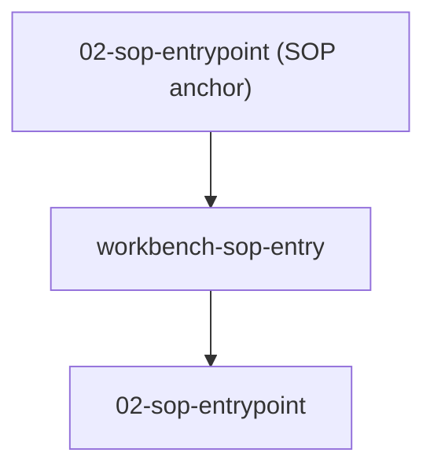

# 42. Bridge — workbench

> **Informative · generated.** Dist-mirror of the bridge hub with expanded per-chapter sections (PRD-008), a quantification head-table with click-to-scroll (PRD-009), Mermaid graph views (PRD-010), and by-skill namespace grouping (PRD-011). Do not edit by hand; re-run the spec build to regenerate.

<!-- Auto-generated by scripts/generate-bridge.mjs from the skill-to-spec map. -->

**Coverage:** 23 of 23 chapters have at least one public implementer (100%).

## Coverage summary

| Chapter | Covered | Public | Internal | Reqs | Gaps |
|---|---|---|---|---|---|
| [00-overview](#00-overview) | ✓ | 2 | 0 | — | — |
| [01-philosophy](#01-philosophy) | ✓ | 1 | 0 | — | — |
| [02-sop-entrypoint](#02-sop-entrypoint) | ✓ | 5 | 0 | — | — |
| [10-root-and-projects](#10-root-and-projects) | ✓ | 1 | 0 | — | — |
| [11-project-structure](#11-project-structure) | ✓ | 3 | 1 | 2 | 5 |
| [12-folders](#12-folders) | ✓ | 3 | 0 | 3 | — |
| [13-knowledge-format-okf](#13-knowledge-format-okf) | ✓ | 5 | 0 | 4 | 2 |
| [15-repos](#15-repos) | ✓ | 1 | 0 | 2 | — |
| [16-context](#16-context) | ✓ | 2 | 0 | 2 | — |
| [17-memo-store](#17-memo-store) | ✓ | 1 | 0 | — | — |
| [18-design](#18-design) | ✓ | 1 | 0 | 2 | — |
| [19-tmp](#19-tmp) | ✓ | 1 | 0 | — | — |
| [20-cli](#20-cli) | ✓ | 7 | 0 | 2 | — |
| [21-environment-scripts](#21-environment-scripts) | ✓ | 4 | 0 | 2 | — |
| [22-config](#22-config) | ✓ | 5 | 0 | 2 | — |
| [23-hooks-contract](#23-hooks-contract) | ✓ | 6 | 0 | 3 | — |
| [24-skills-scope](#24-skills-scope) | ✓ | 3 | 0 | — | — |
| [25-validation-overview](#25-validation-overview) | ✓ | 4 | 0 | 3 | — |
| [26-addons](#26-addons) | ✓ | 2 | 0 | 1 | — |
| [30-wiki](#30-wiki) | ✓ | 6 | 0 | 2 | 7 |
| [31-browser-automation](#31-browser-automation) | ✓ | 4 | 0 | — | 5 |
| [32-trash](#32-trash) | ✓ | 5 | 0 | — | — |
| [41-project-architecture](#41-project-architecture) | ✓ | 6 | 0 | 2 | — |
| **Summary** | **23 / 23 (100%)** | — | — | 32 | 19 |

## 00-overview

| Field | Value |
|---|---|
| Covered | ✓ yes |
| Public skills | `workbench-audit`, `workbench-project-setup` |
| Internal tooling | — |
| Requirements | — |
| Gaps | — |
| Depends on | [01-philosophy](./01-philosophy.md), [02-sop-entrypoint](./02-sop-entrypoint.md), [11-project-structure](./11-project-structure.md), [13-knowledge-format-okf](./13-knowledge-format-okf.md), [32-trash](./32-trash.md) |

## 01-philosophy

| Field | Value |
|---|---|
| Covered | ✓ yes |
| Public skills | `workbench-philosophy` |
| Internal tooling | — |
| Requirements | — |
| Gaps | — |
| Depends on | [00-overview](./00-overview.md), [02-sop-entrypoint](./02-sop-entrypoint.md), [20-cli](./20-cli.md), [22-config](./22-config.md) |

## 02-sop-entrypoint

| Field | Value |
|---|---|
| Covered | ✓ yes |
| Public skills | `workbench-addons`, `workbench-cli`, `workbench-config`, `workbench-hooks-contract`, `workbench-sop-entry` |
| Internal tooling | — |
| Requirements | — |
| Gaps | — |
| Depends on | [00-overview](./00-overview.md), [01-philosophy](./01-philosophy.md), [10-root-and-projects](./10-root-and-projects.md), [22-config](./22-config.md), [23-hooks-contract](./23-hooks-contract.md) |

## 10-root-and-projects

| Field | Value |
|---|---|
| Covered | ✓ yes |
| Public skills | `workbench-root-projects` |
| Internal tooling | — |
| Requirements | — |
| Gaps | — |
| Depends on | [00-overview](./00-overview.md), [02-sop-entrypoint](./02-sop-entrypoint.md), [11-project-structure](./11-project-structure.md), [12-folders](./12-folders.md), [22-config](./22-config.md) |

## 11-project-structure

| Field | Value |
|---|---|
| Covered | ✓ yes |
| Public skills | `wiki-init`, `workbench-audit`, `workbench-project-setup` |
| Internal tooling | `repo-init` |
| Requirements | 2 |
| Gaps | audit-report-format, claude-md-runbook-required-sections, five-step-installation-process, memo-079-eleven-ecken, required-claude-md-sections-and-scripts |
| Depends on | [00-overview](./00-overview.md), [10-root-and-projects](./10-root-and-projects.md), [12-folders](./12-folders.md), [32-trash](./32-trash.md) |

## 12-folders

| Field | Value |
|---|---|
| Covered | ✓ yes |
| Public skills | `workbench-environment-scripts`, `workbench-folders`, `workbench-tmp` |
| Internal tooling | — |
| Requirements | 3 |
| Gaps | — |
| Depends on | [10-root-and-projects](./10-root-and-projects.md), [11-project-structure](./11-project-structure.md), [22-config](./22-config.md), [30-wiki](./30-wiki.md), [31-browser-automation](./31-browser-automation.md), [32-trash](./32-trash.md) |

## 13-knowledge-format-okf

| Field | Value |
|---|---|
| Covered | ✓ yes |
| Public skills | `wiki-ingest`, `wiki-init`, `wiki-lint`, `wiki-query`, `wiki-update` |
| Internal tooling | — |
| Requirements | 4 |
| Gaps | Auto-run-before-memo-init coupling, Non-OKF lint checks (orphans, contradictions, stubs, missing cross-refs) |
| Depends on | [00-overview](./00-overview.md), [11-project-structure](./11-project-structure.md), [18-design](./18-design.md), [30-wiki](./30-wiki.md), [32-trash](./32-trash.md) |

## 15-repos

| Field | Value |
|---|---|
| Covered | ✓ yes |
| Public skills | `workbench-repos` |
| Internal tooling | — |
| Requirements | 2 |
| Gaps | — |
| Depends on | [11-project-structure](./11-project-structure.md), [12-folders](./12-folders.md), [22-config](./22-config.md), [41-project-architecture](./41-project-architecture.md) |

## 16-context

| Field | Value |
|---|---|
| Covered | ✓ yes |
| Public skills | `workbench-context`, `workbench-tmp` |
| Internal tooling | — |
| Requirements | 2 |
| Gaps | — |
| Depends on | [10-root-and-projects](./10-root-and-projects.md), [11-project-structure](./11-project-structure.md), [12-folders](./12-folders.md), [13-knowledge-format-okf](./13-knowledge-format-okf.md), [30-wiki](./30-wiki.md), [41-project-architecture](./41-project-architecture.md) |

## 17-memo-store

| Field | Value |
|---|---|
| Covered | ✓ yes |
| Public skills | `workbench-memo-store` |
| Internal tooling | — |
| Requirements | — |
| Gaps | — |
| Depends on | [11-project-structure](./11-project-structure.md), [12-folders](./12-folders.md), [26-addons](./26-addons.md) |

## 18-design

| Field | Value |
|---|---|
| Covered | ✓ yes |
| Public skills | `workbench-design` |
| Internal tooling | — |
| Requirements | 2 |
| Gaps | — |
| Depends on | [12-folders](./12-folders.md), [13-knowledge-format-okf](./13-knowledge-format-okf.md), [23-hooks-contract](./23-hooks-contract.md), [30-wiki](./30-wiki.md) |

## 19-tmp

| Field | Value |
|---|---|
| Covered | ✓ yes |
| Public skills | `workbench-tmp` |
| Internal tooling | — |
| Requirements | — |
| Gaps | — |
| Depends on | [12-folders](./12-folders.md), [16-context](./16-context.md), [32-trash](./32-trash.md) |

## 20-cli

| Field | Value |
|---|---|
| Covered | ✓ yes |
| Public skills | `workbench-addons`, `workbench-cli`, `workbench-config`, `workbench-environment-scripts`, `workbench-hooks-contract`, `workbench-skills-scope`, `workbench-validation` |
| Internal tooling | — |
| Requirements | 2 |
| Gaps | — |
| Depends on | [00-overview](./00-overview.md), [21-environment-scripts](./21-environment-scripts.md), [30-wiki](./30-wiki.md) |

## 21-environment-scripts

| Field | Value |
|---|---|
| Covered | ✓ yes |
| Public skills | `workbench-cli`, `workbench-environment-scripts`, `workbench-skills-scope`, `workbench-validation` |
| Internal tooling | — |
| Requirements | 2 |
| Gaps | — |
| Depends on | [00-overview](./00-overview.md), [12-folders](./12-folders.md), [20-cli](./20-cli.md), [22-config](./22-config.md), [23-hooks-contract](./23-hooks-contract.md), [24-skills-scope](./24-skills-scope.md) |

## 22-config

| Field | Value |
|---|---|
| Covered | ✓ yes |
| Public skills | `workbench-addons`, `workbench-config`, `workbench-environment-scripts`, `workbench-hooks-contract`, `workbench-validation` |
| Internal tooling | — |
| Requirements | 2 |
| Gaps | — |
| Depends on | [02-sop-entrypoint](./02-sop-entrypoint.md), [12-folders](./12-folders.md), [23-hooks-contract](./23-hooks-contract.md), [41-project-architecture](./41-project-architecture.md) |

## 23-hooks-contract

| Field | Value |
|---|---|
| Covered | ✓ yes |
| Public skills | `workbench-cli`, `workbench-config`, `workbench-environment-scripts`, `workbench-hooks-contract`, `workbench-skills-scope`, `workbench-validation` |
| Internal tooling | — |
| Requirements | 3 |
| Gaps | — |
| Depends on | [02-sop-entrypoint](./02-sop-entrypoint.md), [21-environment-scripts](./21-environment-scripts.md), [22-config](./22-config.md) |

## 24-skills-scope

| Field | Value |
|---|---|
| Covered | ✓ yes |
| Public skills | `workbench-addons`, `workbench-hooks-contract`, `workbench-skills-scope` |
| Internal tooling | — |
| Requirements | — |
| Gaps | — |
| Depends on | [02-sop-entrypoint](./02-sop-entrypoint.md), [21-environment-scripts](./21-environment-scripts.md), [31-browser-automation](./31-browser-automation.md) |

## 25-validation-overview

| Field | Value |
|---|---|
| Covered | ✓ yes |
| Public skills | `workbench-cli`, `workbench-hooks-contract`, `workbench-skills-scope`, `workbench-validation` |
| Internal tooling | — |
| Requirements | 3 |
| Gaps | — |
| Depends on | [02-sop-entrypoint](./02-sop-entrypoint.md), [20-cli](./20-cli.md), [21-environment-scripts](./21-environment-scripts.md), [22-config](./22-config.md), [23-hooks-contract](./23-hooks-contract.md), [32-trash](./32-trash.md) |

## 26-addons

| Field | Value |
|---|---|
| Covered | ✓ yes |
| Public skills | `workbench-addons`, `workbench-skills-scope` |
| Internal tooling | — |
| Requirements | 1 |
| Gaps | — |
| Depends on | [02-sop-entrypoint](./02-sop-entrypoint.md), [12-folders](./12-folders.md), [20-cli](./20-cli.md), [22-config](./22-config.md), [24-skills-scope](./24-skills-scope.md) |

## 30-wiki

| Field | Value |
|---|---|
| Covered | ✓ yes |
| Public skills | `wiki-ingest`, `wiki-init`, `wiki-lint`, `wiki-query`, `wiki-update`, `workbench-project-setup` |
| Internal tooling | — |
| Requirements | 2 |
| Gaps | CLAUDE.md auto-extension contract, Ingest extraction rules (summary caps, chunking, dedup), Parallel sub-agent ingest threshold + central index rebuild, Query answer discipline (max-5-pages, mandatory citations, contradiction handling), Stale detection definition (mtime vs updated), Wiki internal directory taxonomy, Wiki local-git + log.md store |
| Depends on | [00-overview](./00-overview.md), [13-knowledge-format-okf](./13-knowledge-format-okf.md), [20-cli](./20-cli.md), [41-project-architecture](./41-project-architecture.md) |

## 31-browser-automation

| Field | Value |
|---|---|
| Covered | ✓ yes |
| Public skills | `memo-research-agent`, `research-best-practice-playwright`, `research-scrape-docs`, `research-workflow` |
| Internal tooling | — |
| Requirements | — |
| Gaps | browser-automation-method, documentation-scraping-method, playwright-operational-rules, temp-cleanup-vs-trash, untrusted-web-content-banner |
| Depends on | [00-overview](./00-overview.md), [11-project-structure](./11-project-structure.md), [12-folders](./12-folders.md), [32-trash](./32-trash.md) |

## 32-trash

| Field | Value |
|---|---|
| Covered | ✓ yes |
| Public skills | `wiki-init`, `wiki-update`, `workbench-project-setup`, `workbench-tmp`, `workbench-validation` |
| Internal tooling | — |
| Requirements | — |
| Gaps | — |
| Depends on | [00-overview](./00-overview.md), [11-project-structure](./11-project-structure.md) |

## 41-project-architecture

| Field | Value |
|---|---|
| Covered | ✓ yes |
| Public skills | `memo-maintenance-score`, `memo-maintenance-score-all`, `memo-maintenance-verify`, `wiki-lint`, `workbench-audit`, `workbench-config` |
| Internal tooling | — |
| Requirements | 2 |
| Gaps | — |
| Depends on | [00-overview](./00-overview.md), [02-sop-entrypoint](./02-sop-entrypoint.md), [10-root-and-projects](./10-root-and-projects.md), [11-project-structure](./11-project-structure.md), [13-knowledge-format-okf](./13-knowledge-format-okf.md), [30-wiki](./30-wiki.md) |

## Skills by namespace

### memo (3 skills)

| Skill | Chapters |
|---|---|
| `memo-maintenance-score` | [41-project-architecture](./41-project-architecture.md) |
| `memo-maintenance-score-all` | [41-project-architecture](./41-project-architecture.md) |
| `memo-maintenance-verify` | [41-project-architecture](./41-project-architecture.md) |

### research (4 skills)

| Skill | Chapters |
|---|---|
| `memo-research-agent` | [31-browser-automation](./31-browser-automation.md) |
| `research-best-practice-playwright` | [31-browser-automation](./31-browser-automation.md) (primary) |
| `research-scrape-docs` | [31-browser-automation](./31-browser-automation.md) (primary) |
| `research-workflow` | [31-browser-automation](./31-browser-automation.md) |

### wiki (5 skills)

| Skill | Chapters |
|---|---|
| `wiki-ingest` | [30-wiki](./30-wiki.md) (primary), [13-knowledge-format-okf](./13-knowledge-format-okf.md) |
| `wiki-init` | [30-wiki](./30-wiki.md) (primary), [11-project-structure](./11-project-structure.md), [13-knowledge-format-okf](./13-knowledge-format-okf.md), [32-trash](./32-trash.md) |
| `wiki-lint` | [13-knowledge-format-okf](./13-knowledge-format-okf.md) (primary), [30-wiki](./30-wiki.md), [41-project-architecture](./41-project-architecture.md) |
| `wiki-query` | [30-wiki](./30-wiki.md) (primary), [13-knowledge-format-okf](./13-knowledge-format-okf.md) |
| `wiki-update` | [30-wiki](./30-wiki.md) (primary), [13-knowledge-format-okf](./13-knowledge-format-okf.md), [32-trash](./32-trash.md) |

### workbench (18 skills)

| Skill | Chapters |
|---|---|
| `workbench-addons` | [26-addons](./26-addons.md) (primary), [02-sop-entrypoint](./02-sop-entrypoint.md), [20-cli](./20-cli.md), [22-config](./22-config.md), [24-skills-scope](./24-skills-scope.md) |
| `workbench-audit` | [11-project-structure](./11-project-structure.md) (primary), [00-overview](./00-overview.md), [41-project-architecture](./41-project-architecture.md) |
| `workbench-cli` | [20-cli](./20-cli.md) (primary), [02-sop-entrypoint](./02-sop-entrypoint.md), [21-environment-scripts](./21-environment-scripts.md), [23-hooks-contract](./23-hooks-contract.md), [25-validation-overview](./25-validation-overview.md) |
| `workbench-config` | [22-config](./22-config.md) (primary), [02-sop-entrypoint](./02-sop-entrypoint.md), [20-cli](./20-cli.md), [23-hooks-contract](./23-hooks-contract.md), [41-project-architecture](./41-project-architecture.md) |
| `workbench-context` | [16-context](./16-context.md) (primary) |
| `workbench-design` | [18-design](./18-design.md) (primary) |
| `workbench-environment-scripts` | [21-environment-scripts](./21-environment-scripts.md) (primary), [12-folders](./12-folders.md), [20-cli](./20-cli.md), [22-config](./22-config.md), [23-hooks-contract](./23-hooks-contract.md) |
| `workbench-folders` | [12-folders](./12-folders.md) (primary) |
| `workbench-hooks-contract` | [23-hooks-contract](./23-hooks-contract.md) (primary), [02-sop-entrypoint](./02-sop-entrypoint.md), [20-cli](./20-cli.md), [22-config](./22-config.md), [24-skills-scope](./24-skills-scope.md), [25-validation-overview](./25-validation-overview.md) |
| `workbench-memo-store` | [17-memo-store](./17-memo-store.md) (primary) |
| `workbench-philosophy` | [01-philosophy](./01-philosophy.md) (primary) |
| `workbench-project-setup` | [11-project-structure](./11-project-structure.md) (primary), [00-overview](./00-overview.md), [30-wiki](./30-wiki.md), [32-trash](./32-trash.md) |
| `workbench-repos` | [15-repos](./15-repos.md) (primary) |
| `workbench-root-projects` | [10-root-and-projects](./10-root-and-projects.md) (primary) |
| `workbench-skills-scope` | [24-skills-scope](./24-skills-scope.md) (primary), [20-cli](./20-cli.md), [21-environment-scripts](./21-environment-scripts.md), [23-hooks-contract](./23-hooks-contract.md), [25-validation-overview](./25-validation-overview.md), [26-addons](./26-addons.md) |
| `workbench-sop-entry` | [02-sop-entrypoint](./02-sop-entrypoint.md) (primary) |
| `workbench-tmp` | [19-tmp](./19-tmp.md) (primary), [12-folders](./12-folders.md), [16-context](./16-context.md), [32-trash](./32-trash.md) |
| `workbench-validation` | [25-validation-overview](./25-validation-overview.md) (primary), [20-cli](./20-cli.md), [21-environment-scripts](./21-environment-scripts.md), [22-config](./22-config.md), [23-hooks-contract](./23-hooks-contract.md), [32-trash](./32-trash.md) |

**Summary: 4 namespaces · 30 skills total**

## Graph views

### Skill → skill requires / primary chapter (workbench)

```mermaid
flowchart TD
    sk_research_best_practice_playwright["research-best-practice-playwright"]
    sk_research_scrape_docs["research-scrape-docs"]
    sk_wiki_ingest["wiki-ingest"]
    sk_wiki_init["wiki-init"]
    sk_wiki_lint["wiki-lint"]
    sk_wiki_query["wiki-query"]
    sk_wiki_update["wiki-update"]
    sk_workbench_addons["workbench-addons"]
    sk_workbench_audit["workbench-audit"]
    sk_workbench_cli["workbench-cli"]
    sk_workbench_config["workbench-config"]
    sk_workbench_context["workbench-context"]
    sk_workbench_design["workbench-design"]
    sk_workbench_environment_scripts["workbench-environment-scripts"]
    sk_workbench_folders["workbench-folders"]
    sk_workbench_hooks_contract["workbench-hooks-contract"]
    sk_workbench_memo_store["workbench-memo-store"]
    sk_workbench_philosophy["workbench-philosophy"]
    sk_workbench_project_setup["workbench-project-setup"]
    sk_workbench_repos["workbench-repos"]
    sk_workbench_root_projects["workbench-root-projects"]
    sk_workbench_skills_scope["workbench-skills-scope"]
    sk_workbench_sop_entry["workbench-sop-entry"]
    sk_workbench_tmp["workbench-tmp"]
    sk_workbench_validation["workbench-validation"]
    ch_n_01_philosophy["01-philosophy"]
    ch_n_02_sop_entrypoint["02-sop-entrypoint"]
    ch_n_10_root_and_projects["10-root-and-projects"]
    ch_n_11_project_structure["11-project-structure"]
    ch_n_12_folders["12-folders"]
    ch_n_13_knowledge_format_okf["13-knowledge-format-okf"]
    ch_n_15_repos["15-repos"]
    ch_n_16_context["16-context"]
    ch_n_17_memo_store["17-memo-store"]
    ch_n_18_design["18-design"]
    ch_n_19_tmp["19-tmp"]
    ch_n_20_cli["20-cli"]
    ch_n_21_environment_scripts["21-environment-scripts"]
    ch_n_22_config["22-config"]
    ch_n_23_hooks_contract["23-hooks-contract"]
    ch_n_24_skills_scope["24-skills-scope"]
    ch_n_25_validation_overview["25-validation-overview"]
    ch_n_26_addons["26-addons"]
    ch_n_30_wiki["30-wiki"]
    ch_n_31_browser_automation["31-browser-automation"]
    sk_workbench_philosophy --> ch_n_01_philosophy
    sk_workbench_sop_entry --> ch_n_02_sop_entrypoint
    sk_workbench_root_projects --> ch_n_10_root_and_projects
    sk_workbench_audit --> ch_n_11_project_structure
    sk_workbench_project_setup --> ch_n_11_project_structure
    sk_workbench_folders --> ch_n_12_folders
    sk_wiki_lint --> ch_n_13_knowledge_format_okf
    sk_workbench_repos --> ch_n_15_repos
    sk_workbench_context --> ch_n_16_context
    sk_workbench_memo_store --> ch_n_17_memo_store
    sk_workbench_design --> ch_n_18_design
    sk_workbench_tmp --> ch_n_19_tmp
    sk_workbench_cli --> ch_n_20_cli
    sk_workbench_environment_scripts --> ch_n_21_environment_scripts
    sk_workbench_config --> ch_n_22_config
    sk_workbench_hooks_contract --> ch_n_23_hooks_contract
    sk_workbench_skills_scope --> ch_n_24_skills_scope
    sk_workbench_validation --> ch_n_25_validation_overview
    sk_workbench_addons --> ch_n_26_addons
    sk_wiki_ingest --> ch_n_30_wiki
    sk_wiki_init --> ch_n_30_wiki
    sk_wiki_query --> ch_n_30_wiki
    sk_wiki_update --> ch_n_30_wiki
    sk_research_best_practice_playwright --> ch_n_31_browser_automation
    sk_research_scrape_docs --> ch_n_31_browser_automation
```

### SOP flow

