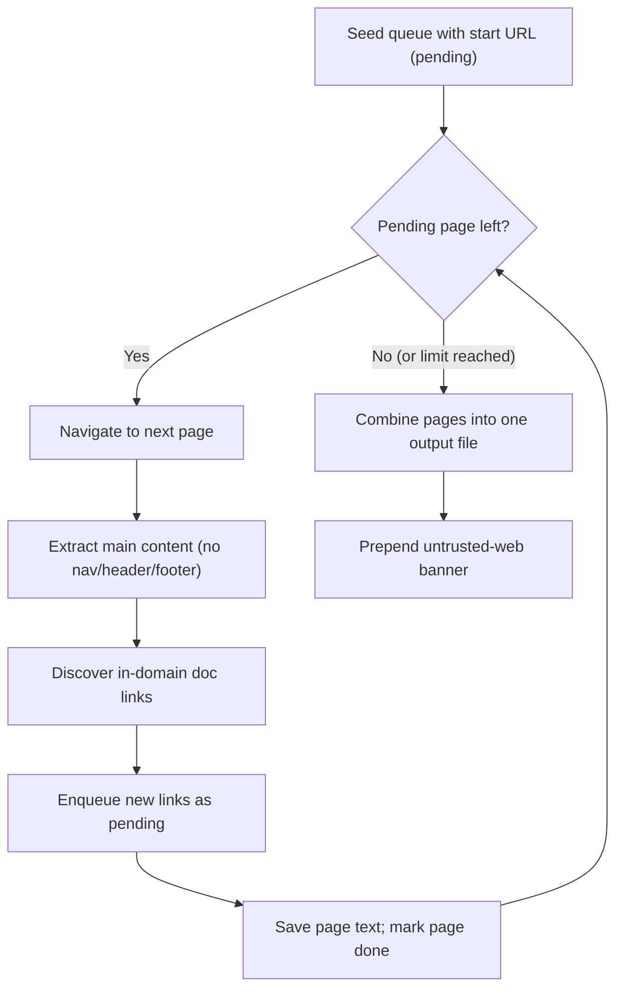
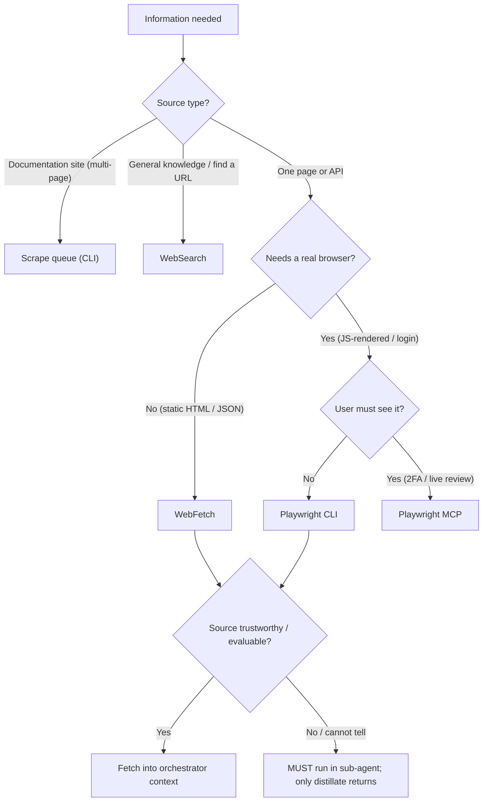

The core specification's research chapter ([../../v0.1.0/10-proactive-research.md](/specification/proactive-research/)) defines the research *duty* — when a memo must verify its assumptions and how that research feeds the revision lifecycle. This document defines the research *method* — the concrete tooling a project uses to gather external information, and the cost discipline that governs which tool is chosen. The two are complementary: the core chapter says *what must be researched and when*, this chapter says *how the gathering is done*.

Browser automation lives at the project level. Each project that uses it carries its own `.browser/` folder (an optional folder — see [12-folders.md](/workbench/folders/)), its own session, and its own scripts. The conventions below are normative for that folder and for the tool-selection decisions a project makes.

> **What belongs here, what belongs to the core spec.** The **method** — tool selection, the cost discipline, the `.browser/` structure, the scrape queue, and `auth.json` handling — is the **workbench's** concern and is specified here. The research **duty** — when a memo must verify its assumptions, and the inward trust boundary as a *behavioral guardrail* — belongs to the memo/core spec ([../../v0.1.0/10-proactive-research.md](/specification/proactive-research/)) and is **referenced, not restated**. This chapter is the *how*; the core chapter is the *what* and the *when*. The one place the two meet is the **trust dimension** of tool selection (see "The Trust Axis" below): the core chapter owns the guardrail, this chapter carries its mechanism in the tool-choice itself.

> **Folder name — `.browser/`, alias `.playwright/`.** The folder is named `.browser/`: the dot marks it as local machinery (see [12-folders.md](/workbench/folders/)) and the neutral name reflects that the concern is *browser automation*, not one tool. `.playwright/` is an accepted **alias** of the same folder — a project that still uses that name remains conformant, and the physical migration of existing projects to `.browser/` is deliberately **deferred**, to be done at each project's own pace.

---

## Folder Contract

`.browser/` is a registered (optional) folder, and this page is its per-folder entry:

| Field | Value |
|-------|-------|
| Name | `.browser/` |
| Status | Optional |
| Level | Project |
| Entry-point | `scripts/` (legacy alias `.playwright/`) |
| Convention | — |
| Purpose | Browser-automation session, scripts, and output — present only when the project performs browser automation. |
| Goes in | The captured session `auth.json`, reusable automation under `scripts/`, and produced `output/`. |
| Does not | Committed material — `auth.json` and `output/` are local-only and never pushed; hardcoded credentials in scripts. |

> The Folder Contract follows the fixed per-folder shape defined in the session conventions ([session/13-conventions.md](/session/conventions/)); its first six fields mirror this folder's row in the central contract table ([12-folders.md](/workbench/folders/)).

---

## The Cost-Driven Tool Choice

The single most important rule of browser automation is that the choice between the **Playwright CLI** and the **Playwright MCP server** is driven by **cost**, not by convenience.

- The **CLI is the default**. It handles the large majority of automation work — logins, batch screenshots, content extraction, health checks — and it does so at a small fraction of the context cost of the MCP server. A CLI script executes outside the agent's context and returns only a compact result.
- The **MCP server is the exception**. Each MCP tool call streams browser state back into the agent's context and is therefore an order of magnitude more expensive per action. The MCP server is reserved for the cases where the user must *see* the browser or *interact* with it live.

> **CLI is the default; MCP is the exception. The deciding factor is cost.**

The MCP server's cost is justified only by a genuine need for a live, visible, or interactive browser. Whenever the work can be expressed as a repeatable script that returns a compact result, the CLI **MUST** be preferred.

---

## The Trust Axis

Cost is only one of **two** dimensions that govern tool choice. The first, above, is **cost** — how expensive the fetch is in context. The second is **trust** — whether the *source* can be assessed before its content lands in the working context. Choosing only on cost answers "how cheaply can I fetch this"; it does not answer "is it safe to let this content into the orchestrator's context at all". Both questions **MUST** be answered.

An **untrusted or unevaluable** source is one whose trustworthiness cannot be assessed up front — most commonly an unknown web page reached for the first time. The risk it carries is **context poisoning**: untrusted or voluminous content polluting the working context — a distinct hazard from prompt injection (the inward trust boundary in [../../v0.1.0/10-proactive-research.md](/specification/proactive-research/), which governs whether ingested text may *steer the agent's actions*). Context poisoning is about *context hygiene*: even content that issues no imperative can crowd, skew, or contaminate the orchestrator's reasoning simply by being there.

> **Trust rule (MUST).** An untrusted or unevaluable source — an unknown web page whose trustworthiness cannot be assessed up front — **MUST** be fetched **inside a sub-agent by default**, not in the orchestrator's (or the user's) context. The raw content **MUST NOT** touch the orchestrator's context; only a distilled result returns. A confused sub-agent is **isolatable and disposable**; a poisoned orchestrator endangers the whole mission.

This is the **reader-agent** (quarantined-inference) pattern: a disposable sub-agent reads the untrusted material, reasons over it in its own isolated context, and hands back only a compact distillate. If that sub-agent's context is skewed by what it read, the damage is contained to a throwaway worker and the orchestrator never inherits the raw page.

**The trigger is MUST for unevaluable sources, not SHOULD.** The core research chapter routes work to a sub-agent by **volume** — "research SHOULD be conducted in Sub-Agents … when the volume is large" ([../../v0.1.0/10-proactive-research.md](/specification/proactive-research/)). The trust axis **extends that trigger to trust**: when a source's trustworthiness *cannot be evaluated*, sub-agent isolation is **MUST**, not SHOULD — regardless of how small the content is. Volume makes isolation advisable; unevaluable trust makes it mandatory. The behavioral guardrail this protects lives in the core chapter (the inward trust boundary); this chapter carries the **mechanism** — the trust dimension built into tool selection.

---

## When CLI, When MCP

The discriminator follows directly from the cost axis above: use the **CLI** for any non-interactive work whose result can be written to a file or returned as a small summary (logins, batch screenshots, content extraction, health checks), and reserve the **MCP server** for the few cases that genuinely need a live, visible browser (a first-time 2FA/CAPTCHA login, a UI review the user watches). The bridge between them is **session transfer**: the MCP server performs the interactive first login once and captures the session, and every subsequent run reuses it through the CLI at no further interactive cost.

---

## The `.browser/` Project Structure

Every project that uses browser automation **MUST** keep it inside a `.browser/` folder at the project root. The folder separates three concerns — the captured session, the reusable scripts, and the produced output.

```
.browser/
├── auth.json              # captured session — secret, never committed
├── output/                # produced artifacts — local-only
│   ├── screenshots/
│   └── temp/
└── scripts/
    ├── login.mjs
    ├── screenshot-routes.mjs
    ├── scrape-page.mjs
    └── health-check.mjs
```

- **`scripts/`** holds the reusable automation. A script is written once and re-run at zero additional context cost; this reusability is the economic reason the CLI is the default.
- **`output/`** holds produced artifacts — screenshots, extracted text, temporary files. Output is written here, **not** into the agent's context; the agent reads back only what it needs. Output is local-only and is never committed.
- **`auth.json`** holds the captured browser session.

### `auth.json` Is a Session Secret

The captured session file `auth.json` carries live authentication state — cookies and tokens equivalent to being logged in. It **MUST** be treated as a secret:

- `auth.json` **MUST NOT** be committed. It belongs in `.gitignore`, and because the project root is local-only (see [11-project-structure.md](/workbench/project-structure/)) it cannot leave the machine through `repos/` either.
- Credentials used to *produce* a session **MUST NOT** be hardcoded into scripts. They are read from the project runbook or environment, never embedded in committed code.
- Scripts **MUST** check for an existing valid session before re-authenticating, so a stored session is reused rather than needlessly regenerated.

---

## The Documentation-Scrape Queue

Scraping a multi-page documentation site is a distinct method with its own algorithm: a **work queue** of pages, **per-page main-content extraction**, and a **single combined output file**.



The algorithm is deliberately simple and bounded:

1. **Seed.** A work queue (a `TODO.md` of links with a status each) starts with the entry URL marked *pending*.
2. **Drain.** While a *pending* entry remains and the page limit is not reached, take the next entry, navigate to it, and extract only its **main content** — the article body, with navigation, header, and footer stripped out.
3. **Expand.** Identify in-domain, documentation-relevant links on the page (sidebar, table of contents, next/previous, sub-pages) and enqueue any not already seen. External links, anchors, assets, and excluded patterns are skipped.
4. **Record.** Save the extracted text as a per-page file and mark the queue entry *done*.
5. **Combine.** When the queue is drained, concatenate the per-page files into a **single** combined output file under `context/`. The combined file **MUST** begin with an untrusted-web banner (see below).

A **safety page limit** bounds the crawl, and the crawl **MUST** stay on the allowed domain. The per-page intermediate files are temporary working material; the combined file is the durable artifact.

### The Combined Output Is Untrusted Data

A scraped documentation file lands in `context/` and is **read back later** by a human or by an agent. To prevent a stray imperative buried in the scraped text from being mistaken for an instruction at read-back time, the combined file **MUST** begin with a banner that marks everything below it as untrusted *data*. This inward trust boundary is specified normatively in [../../v0.1.0/10-proactive-research.md](/specification/proactive-research/); the banner is its concrete enforcement at the point of capture.

---

## The Tool-Selection Decision Tree

Not every information need calls for a browser. Before reaching for Playwright at all, the cheapest tool that can answer the question **MUST** be chosen. The order of preference, from cheapest to most expensive, is: **WebSearch → WebFetch → Playwright CLI → Playwright MCP**. The cost decision picks the *fetch tool*; the trust decision (above) then picks *where the fetch runs* — a final gate applied **after** cost, regardless of which fetch tool was selected.



| Tool | When to reach for it | Relative cost |
|------|----------------------|---------------|
| **WebSearch** | General questions; finding the right URL | Lowest |
| **WebFetch** | A single static page, an API, or JSON | Low |
| **Playwright CLI** | JS-rendered pages, login required, batch work | Medium |
| **Playwright MCP** | The user must see the browser; 2FA or CAPTCHA | High |

The rule is to **default to the lowest-cost tool that can do the job** and to escalate only when a concrete capability — JavaScript rendering, an interactive login, a live visual review — forces the next tier. Escalating past the tool the task actually needs spends context for nothing.

> **Companion note — the trust gate runs after the cost decision.** Once the cost decision has named the fetch tool, the trust gate (see "The Trust Axis") applies on top of it: if the source is untrusted or unevaluable, the chosen fetch **MUST** run inside a sub-agent so the raw content never reaches the orchestrator's context — only a distillate returns. This holds independently of which fetch tool was picked; a cheap `WebFetch` of an unknown page is still quarantined. The cost axis decides *what fetches*; the trust axis decides *where it fetches*.

---

> **Research note (parked).** A project-level **user-preferences** area — a place to record a user's standing tool-choice preferences, so the cost and trust defaults above could be tuned per user — is **possible future work**, noted here only so the idea is not lost. It is **not** introduced by this chapter: no preferences mechanism, folder, or configuration field is defined, and the defaults above stand on their own.

---


<!-- IMPLEMENTED-BY — rendered backlink lives in the dist (generated/bridge/<family>/<stem>.backlink.md); source stays authored-only (F2 Dist-Split) -->
## Related

- [00-overview.md](/workbench/overview/) — the workbench spec framing and the global helpers it exposes.
- [12-folders.md](/workbench/folders/) — the optional `.browser/` folder in the project layout.
- [11-project-structure.md](/workbench/project-structure/) — the local guarantee that keeps `auth.json` and `output/` off the network.
- [../../v0.1.0/10-proactive-research.md](/specification/proactive-research/) — the research *duty* this chapter's *method* serves; the normative inward trust boundary (the behavioral guardrail) on ingested web content; and the volume-based sub-agent trigger that this chapter's trust axis strengthens to a MUST for unevaluable sources.
- [32-trash.md](/workbench/trash/) — why temporary scrape working material is removed through `.trash/` rather than hard-deleted.
