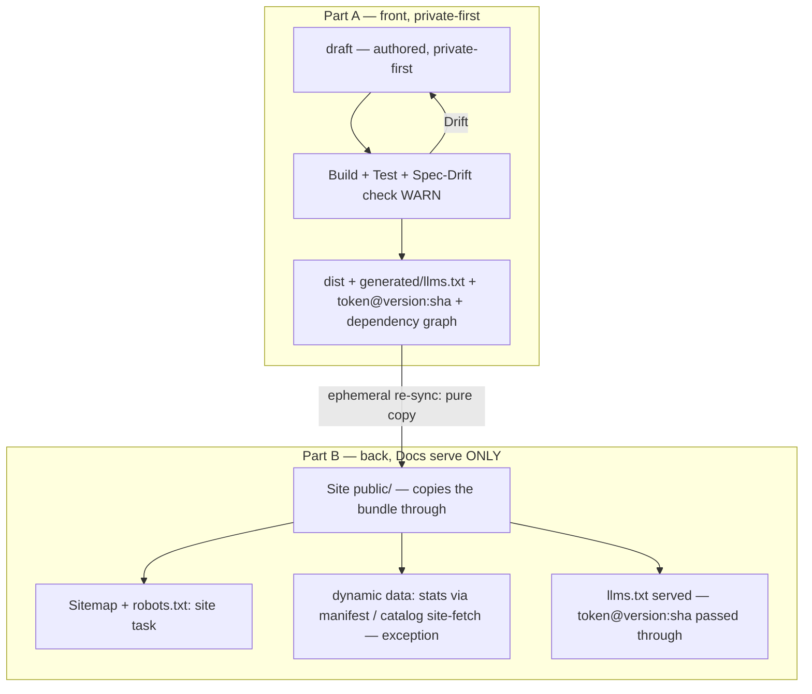

# 08. The Spec Lifecycle (org-wide)

| Field | Value |
|---|---|
| Status | Draft |
| Depends on | [./00-overview.md](./00-overview.md) |
| Related | [./05-publishing-principle.md](./05-publishing-principle.md), [./07-versioning.md](./07-versioning.md) |

This chapter holds the whole organization-wide **spec lifecycle** in one place: from an authored `draft`, through the built `dist/` and its `generated/` bundle, to the served website — across both drift boundaries, with the private-first front (Part A) and the docs-serve-only back (Part B). Until now this workflow existed only as tribal knowledge scattered across the generators and the memos, so it was neither reviewable nor versionable. The specification is the family that owns spec structure, so the lifecycle of a spec has its home here.

It is a normative chapter of the Meta-Specification family and is read under the RFC-2119 conformance interpretation this family establishes in its overview ([./00-overview.md](./00-overview.md)). It describes the lifecycle at overview height and points at the neighboring work-items that own each exact definition, rather than restating them.

---

## The Principle — One Generation Point

> **One generation point (F14 = B).** The spec side (draft → distribution) is the only place content is generated: **content generation belongs exclusively on the spec side; the docs/site generate NO content.** The site copies the spec-emitted bundle through and serves it.

Site audits confirmed the boundary concretely: per site there is **exactly one** piece of llms content generation to remove — that is **one script** (`generate-llms-txt.mjs`), and **at flowmcp two** (additionally `generate-best-practices-txt.mjs`). These are stood down. The site then only **copies** the spec-emitted bundle through and **serves** it.

**What the docs MAY still do** — these are legitimate site tasks, not content generation:

- **Sitemap** — produced by `astro build` (`@astrojs/sitemap` via Starlight); there is no dedicated script.
- **robots.txt** — `generate-robots-txt.mjs` (a pointer to the passed-through bundle plus the sitemap line).
- **Site infrastructure** — pagefind metadata, the og-image, favicons, the markdown map (copy button), the build stamp.
- **Copy / re-sync** of the spec `dist/` + **refs-fetch** (passing version/SHA through) + **serving** (`astro build`).

**The one exception — genuinely dynamic external data (not content).** The single admissible exception is data that cannot be derived from the spec text because it is the live state of another repository. At FlowMCP two such inputs flow in: the **schema stats** (`count_schemas`, `count_tools`, `count_unique_datasources`, …) and the **live catalog** from `flowmcp-schemas-public`. Precisely: the **stats** flow through the spec manifest (`generate-manifest.mjs` → `manifest.meta.stats`) and the site only **reads** them; the **live catalog** is fetched **site-side** (`sync-schemas.mjs`) and stays deliberately site-side as a documented dynamic-data exception. This is categorically different from `llms.txt` / `best-practices.txt`, which are **deterministic transforms of already-published spec content** and therefore belong to the spec side. The named convention for this exception is owned by **ORG-6** and is referenced here, not restated.

**Emit precondition.** The spec side MUST **emit** the llms bundle before the site can pass it through. flowmcp (`generated/llms.txt`) and personal-brand (`dist/<ns>/llms.txt`) already emit it; memo-init `repos/spec` currently emits none (it was deleted in M058) and MUST restore emission before its site can pass a bundle through.

---

## The Two Drift Boundaries

Large specs depend on one another; when one changes, the specs that depend on it drift — and **finding those drifts is the largest problem**. The lifecycle names exactly two boundaries where drift is detected:

1. **draft → dist** — an authored change in one chapter drifts the dependent chapters that build into the same distribution.
2. **dist → website** — the served site drifts from the spec-emitted bundle.

The detection machinery is **not** newly built: the drift engine already exists (`DriftSensor`, M029/M030) and is **lifted** onto the spec edges — reused as-is, not reinvented.

---

## Front — draft → dist (Part A)

The front half is authored and **private-first**. At overview height it comprises:

- **Namespace-first structure.** A spec lives at `spec/<namespace>/<version>/{draft,dist,skills}/` (the version sits *outside* the layout, one level in from the namespace). personal-brand is the reference model; memo-init migrates onto it reversibly, slug-based, and URL-stable. The `spec/` plural-container folder convention itself is declared in the workbench folders chapter (`workbench/…/12-folders.md`) by **ORG-7** — referenced here, not declared on this page.
- **Spec reference ID.** A spec is identified by `<namespaceToken>@<version>:<shortSha>`, where `shortSha` is the **7-character prefix** of the full `fromCommit` SHA — the same provenance token that later stamps the llms.txt header (see Part B).
- **Deterministic dependency graph.** The `requires` / `references` edges are lifted out of the prose into the family head as an OKF edge model `{target, kind, pin}`; the graph is resolved via `ArchitectureLocator.mjs`.
- **Drift detection (WARN).** `DriftSensor.commitsSinceVerified` is reused on the spec edges, with a `verifiedAtSha` per `requires` edge; the dist build **WARNs** on drift rather than auto-blocking, and a boundary is re-blessed via `memo maintenance verify`.
- **private-first.** Every spec is private per se; publishing is a separate, explicit opt-in step.
- **Promotion.** `migrate-namespace.mjs` promotes a spec: copy → strip private → flip `publish:true` → refuse to overwrite without `--force` → **never rm** → supports `--dry-run`.
- **Git strategy.** There is no root git; each spec container MAY carry an optional local git **without a remote** (opt-in), which provides the hash layer that drift detection and provenance stamping rely on.

---

## Back — dist → generated → website (Part B)

The back half serves only — it copies the spec-emitted bundle through and generates nothing.

- **The `generated/` funnel.** The `generated/` folder lives **inside** `dist/` → `spec/<ns>/<version>/dist/generated/`, and `dist/` is the **atomic copy unit** (a single funnel). It holds `llms.txt`, `llms-schema-spec.txt` (an alias), at flowmcp `best-practices.txt`, and `refs.resolved.json` (carrying `generated.fromCommit`). The exact definition table for `generated/` is owned by **ORG-2** and referenced here — this page describes the funnel at overview height only.
- **Ephemeral re-sync as a pure copy.** The publish pipeline (dist → copy → website) performs the re-sync as a **pure copy**: the site copies the spec-emitted bundle through and generates none of it.
- **Provenance threading.** The llms.txt header is stamped `Source: <namespaceToken>@<version>:<shortSha>` — the **identical format** to the reference ID at the front (Part A). The token is stamped at the source, and the site passes it through unchanged.
- **One shared generation script (F13).** A single shared, dependency-free script serves the three **spec**-repo generators, config-parametrized. The site layer generates no content.

---

## End-to-End

> **Note — Phase-5 rename.** This page is authored in today's layout, where this meta family's folder and label are literally `spec`. In Phase 5, MI-S7 renames the family to `meta-spec`; the rename is **URL-stable**, so existing paths keep resolving. This page is planned in the current layout and is carried along by that rename rather than re-authored for it.

---

## Related

- [./00-overview.md](./00-overview.md) — the family entry point and the RFC-2119 conformance anchor this chapter is read under.
- [./05-publishing-principle.md](./05-publishing-principle.md) — what is published versus kept private, the principle the docs-serve-only back rests on.
- [./07-versioning.md](./07-versioning.md) — how a version directory is named and kept URL-stable while a newer one is authored beside it.
