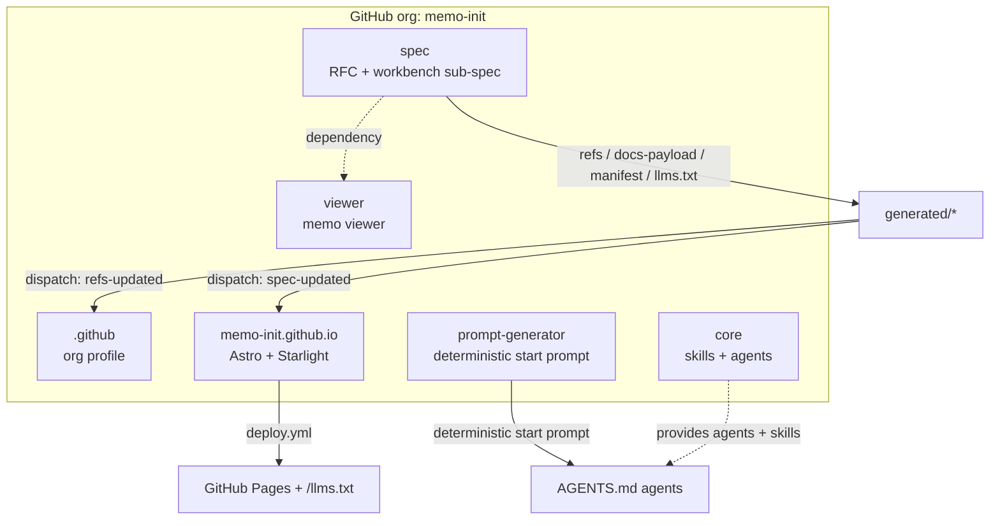

> **Informative.** This document provides the conceptual foundation, mission, terminology, and document index. It is written in prose and does not itself carry normative requirements. The **Conformance** block below is normative for the whole specification.

This is the entry point for the memo-init specification, version `v0.1.0` (Draft). It defines what the memo system is, why it exists, the guardrail philosophy that underpins it, and an index of the chapters that make up the specification.

---

## Conformance

The key words "MUST", "MUST NOT", "REQUIRED", "SHALL", "SHALL NOT", "SHOULD", "SHOULD NOT", "RECOMMENDED", "NOT RECOMMENDED", "MAY", and "OPTIONAL" in this document are to be interpreted as described in BCP 14 [RFC2119] [RFC8174] when, and only when, they appear in all capitals, as shown here.

Some chapters of this specification are intentionally written in prose without normative keywords because they describe philosophy, motivation, or conceptual background (this overview, `01-philosophy.md`). Such chapters are marked **Informative** near their top. All other chapters use normative language and assume this conformance interpretation; they are marked **Normative**.

References:

- [RFC2119](https://www.rfc-editor.org/rfc/rfc2119) — Key words for use in RFCs to Indicate Requirement Levels
- [RFC8174](https://www.rfc-editor.org/rfc/rfc8174) — Ambiguity of Uppercase vs Lowercase in RFC 2119 Key Words
- [BCP 14](https://www.rfc-editor.org/info/bcp14) — Best Current Practice 14 (combined RFC2119 + RFC8174)

---

## What memo-init Is

The memo system transforms long, unstructured input — typically dictated voice transcripts — into discrete, executable work orders, and governs the human-AI interaction that clarifies open questions **before** implementation begins. The developer plans; the AI implements autonomously and self-evaluating.

A **memo** is a versioned strategy document. It starts as a first revision, iterates through revisions until the developer finalizes it, and then drives a rollout that produces real artifacts (code, repositories, documentation). The memo is the single highest authority over its own rollout.

### Mission

Make planning-first agentic engineering reproducible. The memo system gives an AI a **scaffold** for turning long transcripts into dedicated work orders and describes the human-AI interaction for resolving open questions — before implementation is handed over to run as autonomously as possible.

---

## Guardrail Philosophy (Summary)

Planning is the most important activity in agentic engineering. The memo system exists to build **guardrails** — the metaphor is a highway: clear lanes that keep autonomous execution on the road. The memo-SOP (Standard Operating Procedure) defines those guardrails. The full treatment is in [01-philosophy.md](/specification/philosophy/); the canonical entry skill that explains the whole process is described in [02-memo-sop-entrypoint.md](/specification/memo-sop-entrypoint/).

---

## Organization and Repository Fan-Out

The memo-init specification is published across a small organization of repositories. The diagram below shows the organization, the repository fan-out, and the spec→site automation pipeline.

> Diagram orientation is `flowchart TD` (the default). The node meanings are given in the surrounding chapters of this specification.

The six repositories are bootstrapped from an existing public reference organization. Their roles:

| Repository | Role |
|------------|------|
| `spec` | This RFC-style specification plus the workbench sub-spec and the generators that publish it. |
| `.github` | Organization profile, generated via a badge-table tool. Must be named `.github`. |
| `memo-init.github.io` | Static website (Astro + Starlight) that serves the docs and `llms.txt`. |
| `viewer` | The memo viewer, extracted from the toolkit editor. Core-like: depends directly on the spec. |
| `prompt-generator` | The deterministic start-prompt compositor. |
| `core` | Skills (the base layer) and agents (evaluators first). |

---

## Related

- [01-philosophy.md](/specification/philosophy/) — the guardrail analogy and interaction model.
- [02-memo-sop-entrypoint.md](/specification/memo-sop-entrypoint/) — the canonical entry skill.
- [08-phases-and-prds.md](/specification/phases-and-prds/) — how memos become phases and PRDs.
- [18-multidimensionality.md](/specification/multidimensionality/) — one memo coordinating many repos.
- [README.md](./README.md) — chapter index and reading order.
