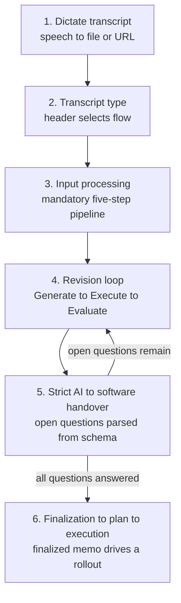

---

## The Single Source of Truth

`memo-sop` is the **canonical entry skill** of the memo system. It is the one document that explains the entire process end to end: the path from a dictated transcript to an executed rollout, the state transitions along the way, the hierarchy of every other skill, and the terminal-output standards. Every other memo skill references it and follows its process.

An agent that needs to understand the memo workflow MUST load `memo-sop` first. It is the document that explains everything; the other skills are children of it.

On the published website, `memo-sop` SHOULD be the first documentation entry after the landing page, because it is the door through which a reader enters the system.

Initialization and the revision loop are a **bidirectional conversation** between the developer and the AI — an alignment process, not a one-way command. The developer states intent, the AI reflects its interpretation back, and the two iterate until the memo expresses a shared understanding. Significant initial energy goes into proper initialization: a well-aligned memo at the start is what makes the later autonomous stages safe to run without a per-step trigger.

---

## The Re-Entry Point

The memo workflow spans sessions. A long rollout may cross a context reset, a crash, or a closed terminal. `memo-sop` is the **re-entry point**: after any loss of session context, an agent re-orients by reading `memo-sop` together with the on-disk task list and state files (see [13-orchestration.md](/specification/orchestration/)).

Because finalized memos are optimized for in-context learning, an empty agent context MUST be able to read the canonical entry point and the memo's own entry-points and resume work without prior conversation history. Re-entry MUST NOT depend on the contents of the lost session.

---

## The Four Verbs

The SOP organizes the whole system under four verbs. Exactly three of them are public entry points that the developer triggers directly; one is internal and runs autonomously.

| Verb | Visibility | Meaning |
|------|------------|---------|
| **Initialize** | public | Create a memo / place a transcript. |
| **Revise** | internal / autonomous | Iterate the memo in a Generate → Execute → Evaluate loop, without a per-step trigger. |
| **Finalize** | public | Close the memo. MUST be developer-triggered; the AI MUST NOT finalize autonomously. |
| **Execute / Plan** | public | Work a finalized memo through a plan. |

The public entry points validate strictly and set the switches — like the public functions of a module — while the remaining skills are private process steps. Their trigger words are chosen to be mutually exclusive: no single trigger activates two entry points at once.

---

## The End-to-End Path

The SOP documents the complete path in six stages. The stages are listed here for orientation; each is specified in detail in the chapter named in the last column.

| Stage | Name | What happens | Specified in |
|-------|------|--------------|--------------|
| 1 | Dictate transcript | The developer produces a transcript (speech → file or URL). | [03-input-paths.md](/specification/input-paths/) |
| 2 | The four transcript types | A type header determines the follow-up flow. | [03-input-paths.md](/specification/input-paths/) |
| 3 | Input processing | The mandatory five-step pipeline runs before any memo work. | [04-input-pipeline.md](/specification/input-pipeline/) |
| 4 | Revision loop | A revision enters the Generate → Execute → Evaluate loop. | [07-revisions-and-questions.md](/specification/revisions-and-questions/) |
| 5 | Strict AI→software handover | Open questions are parsed from a machine-readable schema. | [07-revisions-and-questions.md](/specification/revisions-and-questions/) |
| 6 | Finalization → plan → execution | The finalized memo drives a rollout. | [11-quality-and-finalization.md](/specification/quality-and-finalization/), [12-rollout.md](/specification/rollout/) |

A finalized memo can be carried into execution by two valid, parallel models. The **rollout model** works a single finalized memo straight through its phases in one autonomous run. The **planning model** assembles one or more finalized memos into a plan and executes phase by phase across them. Both are contemporary, complementary approaches: the rollout model fits a self-contained memo, while the planning model fits work that spans several memos. The choice of model does not change the six stages above — it changes only how stage 6 is carried out.

---

## Public / Private Skill Architecture

The SOP classifies every skill as either a public entry point or a private process step. The goal is **few** public skills, easy to find, each with distinct trigger words; everything else stays private.

| Class | Role | Examples |
|-------|------|----------|
| **Public** | Developer entry points. Validate strictly, set switches. | `memo-init` (Initialize), `memo-finalize` (Finalize), `memo-plan` (Plan), `memo-rollout` (Rollout) |
| **Private** | Internal process steps, invoked by the public entry points. | the revision-loop skills, the quality skills, the rollout machinery |

This classification drives **progressive disclosure**: public memos and skills are the visible UI entry points, shown so a reader can find the doors into the system; internal memos and skills are linked from the public ones but not displayed up front. A reader sees the few entry points first and reaches the private process steps only by following a link.

---

## Related

- [01-philosophy.md](/specification/philosophy/) — why the SOP defines the guardrails.
- [03-input-paths.md](/specification/input-paths/) — the four transcript types the SOP routes on.
- [11-quality-and-finalization.md](/specification/quality-and-finalization/) — the developer-triggered finalize verb.
- [13-orchestration.md](/specification/orchestration/) — state and crash recovery behind re-entry.
