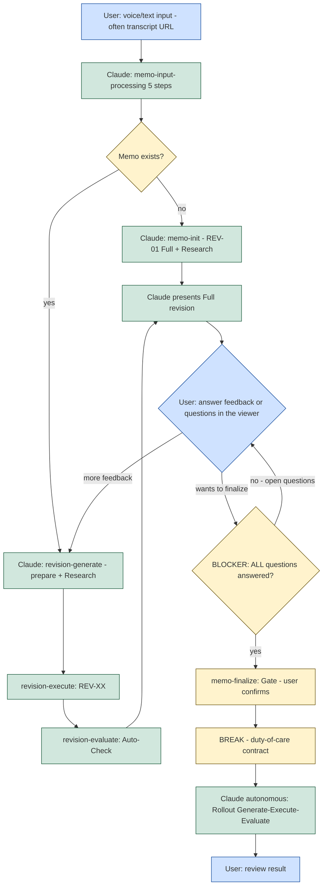

The interaction model fixes the **two points** where the user touches the system — input and feedback/finalization — and the autonomous span in between. Before finalization, the user's judgement steers the memo: input, feedback, answering questions. After the finalization gate, the rollout runs autonomously to completion. The model also fixes the hard rule that closes the gate: **as long as any question is open, finalization is blocked.**

---

## The Interaction Diagram

The following flowchart is the canonical reference for the interaction model, including the `:::` class assignments and the `classDef` lines.



---

## Where the User Interacts

User interaction has exactly two points: **input** at the start, and **feedback/finalization** during the revision loop. Everything between is autonomous.

- **Input** — the user supplies a voice or text input (often a transcript URL). Claude runs `memo-input-processing` and, depending on whether a memo already exists, either initializes it or generates the next revision.
- **Feedback / finalization** — the user reads the presented Full revision in the viewer, gives further feedback (which loops back into a new revision), or answers open questions, and finally decides to finalize.

Only **Full** revisions are presented to the user (see [20-flow-full-vs-update-revisions.md](/specification/flow-full-vs-update-revisions/)). Between the two interaction points, Claude works autonomously: input processing, research, revision generation, execution, and the auto-check.

**Questions stay essential.** The two touchpoints are deliberately minimal but high-value: minimal contact, maximally important. They are the place where the developer's taste and long view enter the work, because within the guardrails there are usually many valid paths and the choice between them belongs to the developer. As the agent learns to pre-think more over time it raises the quality of the questions rather than abolishing them — there are always questions left, and the developer holds the ultimate right of decision. The positive stance behind this is set out in [01-philosophy.md](/specification/philosophy/).

---

## The Finalization Blocker

The finalization gate is guarded by a hard blocker on open questions.

> Finalization MUST be refused while **any** question is open. The gate MUST open only once **all** questions are answered. An implementation MUST NOT allow `memo-finalize` to proceed while one or more open questions remain.

In the diagram this is the `Q{BLOCKER: ALL questions answered?}` node: when questions remain open (`no - open questions`) control returns to the user to answer them; only on `yes` does control pass to the finalization gate, where the user confirms.

After confirmation, the `BREAK - duty-of-care contract` is shown, and from there the rollout (Generate → Execute → Evaluate) runs **autonomously, without further questions** (see [12-rollout.md](/specification/rollout/)). The user's next interaction is only to review the result.

---

## The Three Communication Layers

Communication in the system runs across **three layers**, and they are a *communication topology*, not a work cycle:

```
User  ──Protocol A (Trust Layer)──▶  Orchestrator  ──Protocol B (start-prompt)──▶  Worker
```

- **User ↔ Orchestrator (Protocol A).** The trust layer: the orchestrator (the main loop) is the user's single channel. How it speaks to the user is governed by the Trust-Layer convention in [19-internal-vs-external-communication.md](/specification/internal-vs-external-communication/).
- **Orchestrator ↔ Worker (Protocol B).** The orchestrator hands work to a worker via a deterministically composed start-prompt ([15-prompt-generator.md](/specification/prompt-generator/)). A worker is any of the three agent-execution primitives ([14-agents-skills-tasks.md](/specification/agents-skills-tasks/)); it cannot address the user directly — everything it returns reaches the user only through the orchestrator.

**G→E→E is not the layer topology.** The Generate → Execute → Evaluate cycle is a *work cycle that runs at a layer*; the three layers are the *communication topology between participants*. They are related but distinct concepts and MUST NOT be conflated — G→E→E describes how a unit of work proceeds, the three layers describe who talks to whom.

**Three layers are enough; the fourth is deferred.** A separate **Communicator** agent (a fourth layer) is **not** technically required to keep the user's terminal clean: a worker never leaks its intermediate output to the user automatically, and the orchestrator already has dedicated surfacing primitives (below). The "Communicator" is therefore a **discipline of the orchestrator**, not a fourth agent. A genuine fourth layer earns its place only when several orchestrators run in parallel and their reports must themselves be marshalled — deferred until then.

---

## Staying in the Loop — Clean-Terminal Surfacing

During the autonomous span (after the duty-of-care break), the user must be able to *step away and come back* and still know what happened, without being buried in text. The orchestrator keeps the main thread clean and surfaces only what matters, on a recurring cadence or on a concrete event. The mechanisms (all available to the orchestrator, distinct from the conversation thread):

- **Surface-only output contract** — the default is an *empty* user thread; surfacing a line is a deliberate per-event decision, never a dump of everything the workers said. This is the binding invariant (see [19-internal-vs-external-communication.md](/specification/internal-vs-external-communication/)).
- **Event channel** — a background watcher with a narrow match pattern emits a single line when a risky/notable state occurs (a mass move to trash, a test break, drift). A clean one-line signal is exactly what makes a silent disaster visible the moment it happens.
- **Cadence channel** — a session timer enqueues one condensed status line every few minutes, so "staying in the loop" does not mean watching a stream.
- **Attention channel** — an out-of-band notification, used sparingly, only for "the user wants to know this now" (a run finished, a decision is needed).
- **Workflows for large runs** — when dozens of agents are needed, a script-driven workflow keeps the main thread clean by construction (its progress lives in a separate panel, one report at the end), so the clean-terminal property is free.

---

## Related

- [20-flow-full-vs-update-revisions.md](/specification/flow-full-vs-update-revisions/) — the Full/Update revision flow that this interaction model wraps.
- [11-quality-and-finalization.md](/specification/quality-and-finalization/) — the finalization gate and quality checks the blocker guards.
- [19-internal-vs-external-communication.md](/specification/internal-vs-external-communication/) — the Trust-Layer convention (J1–J12) and the surface-only output contract that govern Protocol A.
- [14-agents-skills-tasks.md](/specification/agents-skills-tasks/) — the three worker primitives the orchestrator drives over Protocol B.
- [15-prompt-generator.md](/specification/prompt-generator/) — the start-prompt that is Protocol B.
- [00-overview.md](/specification/overview/) — conformance language.
- [34-question-interface.md](/specification/question-interface/) — the option-scoring discipline behind the questions the user answers here.
