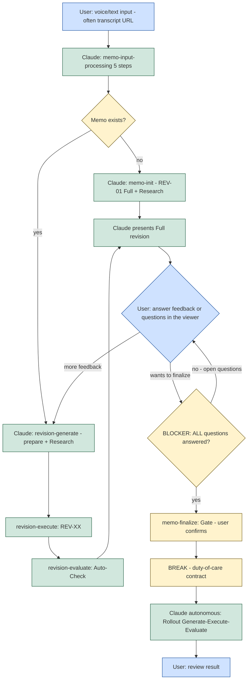

The interaction model fixes the **two points** where the user touches the system — input and feedback/finalization — and the autonomous span in between. Before finalization, the user's judgement steers the memo: input, feedback, answering questions. After the finalization gate, the rollout runs autonomously to completion. The model also fixes the hard rule that closes the gate: **as long as any question is open, finalization is blocked.**

---

## The Interaction Diagram

The following flowchart is the canonical reference for the interaction model, including the `:::` class assignments and the `classDef` lines.

---

## Where the User Interacts

User interaction has exactly two points: **input** at the start, and **feedback/finalization** during the revision loop. Everything between is autonomous.

- **Input** — the user supplies a voice or text input (often a transcript URL). Claude runs `memo-input-processing` and, depending on whether a memo already exists, either initializes it or generates the next revision.
- **Feedback / finalization** — the user reads the presented Full revision in the viewer, gives further feedback (which loops back into a new revision), or answers open questions, and finally decides to finalize.

Only **Full** revisions are presented to the user (see [20-flow-full-vs-update-revisions.md](/specification/flow-full-vs-update-revisions/)). Between the two interaction points, Claude works autonomously: input processing, research, revision generation, execution, and the auto-check.

---

## The Finalization Blocker

The finalization gate is guarded by a hard blocker on open questions.

> Finalization MUST be refused while **any** question is open. The gate MUST open only once **all** questions are answered. An implementation MUST NOT allow `memo-finalize` to proceed while one or more open questions remain.

In the diagram this is the `Q{BLOCKER: ALL questions answered?}` node: when questions remain open (`no - open questions`) control returns to the user to answer them; only on `yes` does control pass to the finalization gate, where the user confirms.

After confirmation, the `BREAK - duty-of-care contract` is shown, and from there the rollout (Generate → Execute → Evaluate) runs **autonomously, without further questions** (see [12-rollout.md](/specification/rollout/)). The user's next interaction is only to review the result.

---

## Related

- [20-flow-full-vs-update-revisions.md](/specification/flow-full-vs-update-revisions/) — the Full/Update revision flow that this interaction model wraps.
- [11-quality-and-finalization.md](/specification/quality-and-finalization/) — the finalization gate and quality checks the blocker guards.
- [00-overview.md](/specification/overview/) — conformance language.
