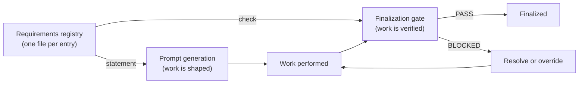

Today, requirements live only as prose scattered across the global rules file and individual skills. Prose requirements are unspecific and not reproducible: there is no machine-readable record of which formatting rules apply to a particular programming language, or which conventions a given repository must satisfy. Two memos touching the same language can apply the rules inconsistently because there is nothing authoritative to pull from. This chapter specifies requirements as a **declarative registry** — data, not prose — that drives both the generation of work and the gate that lets that work finalize.

A requirement is a single, addressable statement of something that must, should, or may hold for a piece of work. Because it is data, it can be pulled dynamically, scoped to the work at hand, diffed, and checked mechanically. The registry replaces the scattered prose with one authoritative source that every memo reads from at the moment it is needed, so a memo always sees the current requirements rather than a stale copy.

---

## The Two-Sided Model

Each requirement is **two-sided**. It carries both a human-readable `statement` of what is required and a machine-checkable `check` that decides whether the requirement is met. The two sides face in opposite directions:

- **`statement` → generation.** The requirement text feeds the prompt generator. It operates one level above the implementation: when work is being prompted, the in-scope requirement statements are surfaced as instructions, so the doer is told up front what is expected. The statement shapes the work before it is done.
- **`check` → gate.** The check drives a scope-matched finalization gate. Requirements that apply to the work in progress are collected, their checks run, and the work **MUST NOT** pass finalization while an applicable blocker check fails — unless an explicit, recorded override exists. The check verifies the work after it is done.

This is the eval-driven contract: a goal is declared as a requirement, that goal shapes generation, and once the goal is met its check becomes a standing regression gate. The same data both asks for the outcome and proves it.



---

## Storage and Scale

Requirements are stored **one file per entry** under `.memo/_requirements/`, a sibling of the memos under `.memo/` rather than a child of any single memo. This keeps the set shared across all memos of a project instead of trapped inside one. Each entry is a small, self-describing file, so requirements can be added, reviewed, and diffed individually, and the registry scales to hundreds of fine-grained entries without any single file becoming unmanageable.

Scope is **carried by the entry itself**, not by where the file sits. A `scope` object with three axes — `repos`, `categories`, and `tags` — plus a `when` trigger object decides which work an entry applies to. A scoped folder tree is a useful conceptual model for reasoning about the registry — global rules, per-repo rules, per-category rules, per-state rules — but the scope axes in the entry are authoritative. The folder layout is a lens onto the data; the data is the source of truth.

The intended conceptual tree:

```
_requirements/
  global/                 # applies to everything (for example: outward-facing language)
  repos/<repo>/           # applies to one repository
  categories/<category>/  # applies to one work category (readme, diagram, issue, …)
  states/<state>/         # applies to one workflow state
  <id>.req.json           # one file per entry; scope axes inside decide matching
```

---

## Entry Schema

A requirement entry is an English-language JSON file. The fields are:

| Field | Required | Description |
|-------|----------|-------------|
| `id` | yes | Stable identifier, pattern `REQ-NNN` (three or more digits). |
| `title` | yes | Short human name. |
| `statement` | yes | One-line human-readable description of what is required. This text flows **into prompt generation**. |
| `scope` | yes | Object with three array axes: `repos`, `categories`, `tags`. Decides which work the entry matches. |
| `when` | no | Trigger object: `worktype`, `effort`, `language`, `changetype` — each an array. Narrows applicability to specific working conditions. |
| `check` | yes | Object that decides whether the requirement is met. Drives the **gate**. See below. |
| `source` | yes | Where the requirement comes from, for example a skill reference such as `skill:node-formatting`. |
| `severity` | yes | One of `blocker`, `warning`, `info`. Governs how hard the gate enforces it. |
| `origin` | yes | One of `predefined`, `ai-added`, `evaluator-session` — how the entry entered the registry. |

The `check` object **MUST** declare a `kind`, one of:

| `check.kind` | Meaning | Typical fields |
|--------------|---------|----------------|
| `assertion` | Direct, deterministic assertions over code, state, or outcome. | `assertions` (list of conditions) |
| `tool` | Verified by running a named tool with a named tactic. | `tool`, `tactic`, `artifact`, `verify` |
| `evaluator` | Judged by a fresh-context evaluator against a rubric. | `rubric`, `verify` |
| `skill` | Delegated to a named skill that performs the check. | `skill`, `verify` |

A `check` **MAY** also declare `artifact` (a machine artifact the check produces or inspects), `presence` (`required` or `optional`), and `verify` (the steps a verifier runs). The `statement` drives what the work should be; the `check` drives whether it is. A `source` of `skill:…` records which skill the requirement originated from, and a `skill`-kind check records which skill verifies it — a requirement can both come from and be enforced by skills.

---

## Selection and Matching

Requirements are selected for a piece of work by a **deterministic** scope cascade evaluated at the moment of writing — one matcher, run consistently, so the same work always selects the same set.

The cascade runs from **broad to narrow**: global requirements first, then per-repo, then per-category and per-tag. Within a single scope axis, an empty array is a wildcard (matches everything on that axis) and a non-empty array matches by intersection. Across the three axes the result is an **AND**: an entry applies only when every populated axis matches the work.

When two requirements conflict, **specific beats general** — a repo-scoped requirement overrides a tag- or category-scoped one, which overrides a global one. The `when` triggers gate applicability further: a requirement with `when.changetype: ["readme"]` engages only when a README is being written, not on every edit. An override is **attribute-based** (declared on the entry), never position-dependent.

Matching **MUST** be deterministic by default. Fuzziness — glob, regex, or set-membership operators — is available only as an **opt-in** operator on a specific axis; it never changes the default exact-match behavior.

---

## Checks and Anti-Cheat

The gate distinguishes hard from soft enforcement by `severity`:

- A **`blocker`** is a hard gate. Its `check` **MUST** verify code, state, outcome, or a tool result — never the mere presence of a claim or a letter-of-the-law match, which invites reward-hacking. A failing blocker **short-circuits**: the gate stops and reports `BLOCKED`.
- A **`warning`** or **`info`** requirement layers softer evidence (a rubric or an evaluator judgment) and **SHOULD** be surfaced without blocking finalization.

Every check resolves to a **ternary** status — `PASS`, `BLOCKED`, or `INCONCLUSIVE`. A check that did not actually run reports `INCONCLUSIVE`; it **MUST NOT** silently report `PASS`. Every check **SHOULD** emit a machine artifact (a file list, an exit code, a state hash) as its evidence, so a result can be reproduced rather than trusted.

The **doer is not the grader**. The agent that performs the work **MUST NOT** be the agent that verifies it. Verification runs in a **fresh context** by a separate verifier, adversarially, so that the proof of a requirement is independent of the work that claimed to satisfy it.

---

## Workflow States

A requirement's force depends on the workflow state of the work it applies to. The registry recognizes four states:

| State | Role of requirements |
|-------|----------------------|
| Intense research | Internal requirements gather evidence first; research precedes opinion. A top-tier model is `must` here. |
| Memo creation | Requirements are added and discussed as the memo is authored and revised. |
| Rollout | Requirements are observed while the work is executed. |
| Finalization | Requirements are **binding** — the gate hands off here, and applicable blockers must pass. |

Requirements may be added or discussed at any earlier state; they become enforceable at finalization. Up to that point a requirement is a proposal that shapes generation; at finalization it is a condition the work must meet.

---

## Multi-Level Requirements

Requirements apply at several granularities, selected through the same scope axes:

| Level | Example scope | Example requirement |
|-------|---------------|---------------------|
| Single repo | `scope.repos: ["spec"]` | A LICENSE file is present; CI is green on the default branch. |
| Repo class | `scope.tags: ["public"]` | No secrets, including public tokens; an organization profile soll-set is satisfied. |
| README | `scope.categories: ["readme"]` | Required README sections exist; badges resolve. |
| Node module | `scope.categories: ["node-module"]`, `when.language: ["node"]` | 4-space indentation, no semicolons, `.mjs` ES modules. |
| Diagram | `scope.categories: ["diagram"]` | Diagram labels are in the artifact's language; the diagram type fits the data flow. |
| Blog-style text | `scope.categories: ["blog"]` | One language per artifact; a readable, structured prose style. |

A higher-level requirement (global, or a repo class) sets a baseline; a narrower one **MAY** tighten it but **MUST NOT** silently weaken it. When both apply, the broad baseline is read first and the narrow entry layered on top.

---

## Skills Declaring Requirements

A skill **MAY** declare and register requirements. When a skill encodes a rule that should hold for the work it governs, it can emit that rule as a registry entry whose `source` names the skill (for example `skill:repo-issue` for issue-writing requirements, or `skill:get-sheet` for spreadsheet work). This lets a skill add enforceable, scoped checks without changing the core gate set: the skill declares the rule as data, and the data becomes both a generation instruction and a gate. Skill-declared requirements participate in the same scope cascade and the same ternary checks as predefined ones; they are distinguished only by their `origin` and `source`.

---

## Verification Scoring and Confidence

Because checks are ternary and evidence-backed, a set of requirements yields a **score** rather than a single pass/fail bit. For a piece of work, the gate reports how many applicable blockers passed, how many warnings were raised, and how many checks were `INCONCLUSIVE`. An `INCONCLUSIVE` result lowers **confidence** without falsely raising or lowering the pass rate — it signals that a requirement could not be proven, which is treated as a gap to close, not a silent success.

A requirement set thereby doubles as an **eval set**: it is the explicit definition of what the work is being optimized against. The score tells the author both whether the work is acceptable and how much of that judgment rests on solid machine evidence versus checks that did not conclusively run.

---

## Related

- [24-tools-registry.md](/specification/tools-registry/) — the parallel data folder; `check.kind: tool` requirements point into the tools registry for the tool and tactic that verify them.
- [11-quality-and-finalization.md](/specification/quality-and-finalization/) — the finalization gate that runs applicable requirement checks and binds them.
- [00-overview.md](/specification/overview/) — spec scope, conformance, and the document index.
- [30-primitives.md](/specification/primitives/) — central glossary and concept map; the requirement primitive summarized as cross-cutting.
