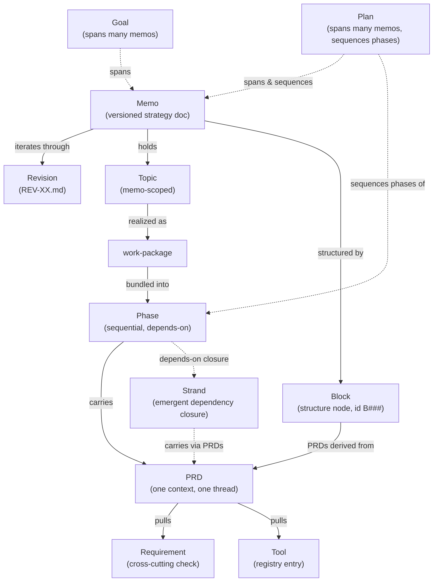
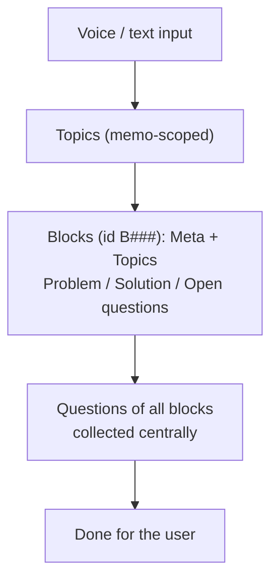
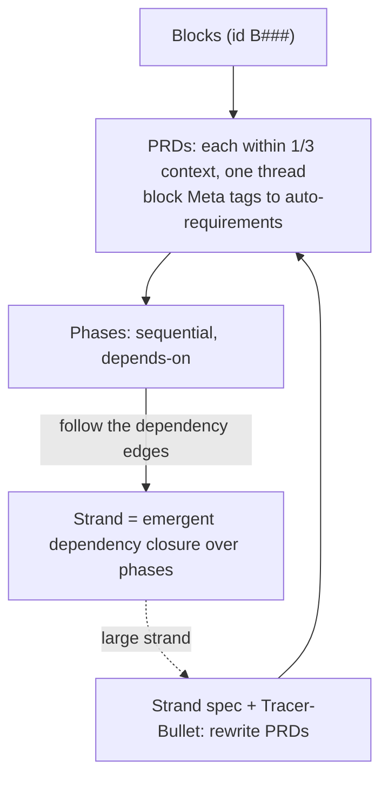
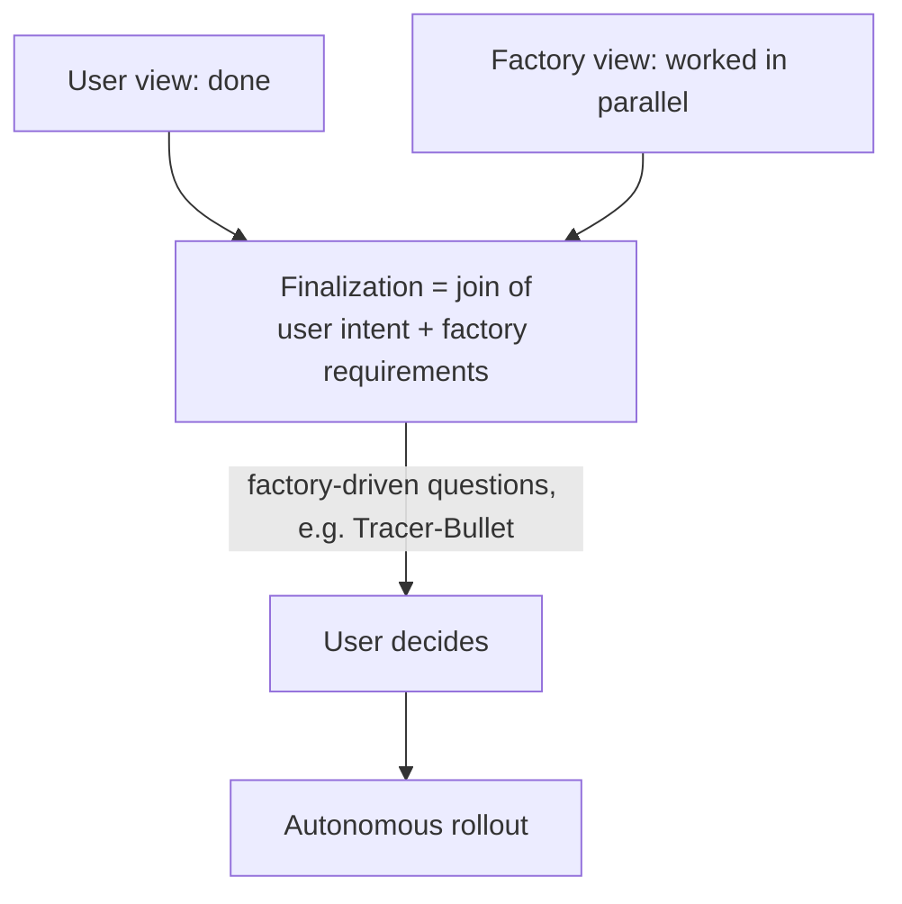

This chapter is the single source of truth for the system's core concepts and the relationships between them. Each primitive is defined here in a short, normative paragraph and linked to the detail chapter that specifies it in full: the top level stays brief and points down, the depth lives in the owning chapter. Where this chapter and a detail chapter both speak about a primitive, the detail chapter is authoritative on its own subject and this chapter MUST stay consistent with it. The chapter also carries the system's only entity/relationship diagram and the two complementary concept views — the user view and the factory view — joined at finalization.

There are exactly **eleven** primitives: **Memo, Revision, Topic, Goal, Block, PRD, Phase, Strand, Requirement, Tool, Plan**. No other term is a primitive of this specification; new primitives MUST be introduced here, not implied elsewhere.

---

## Concept Map

The diagram below shows how the primitives relate. It is the corrected model: a memo holds topics; topics are realized as work-packages, which are bundled into sequential phases; phases carry PRDs. A **strand** is not a structural sibling of these — it is the *emergent* dependency closure over phases (it is computed by walking the `depends-on` edges, never authored). A **requirement** is likewise cross-cutting: it is a check that applies to work through the PRDs. A **block** is a structure node inside the memo, carrying its own `B\d{3}` id, from which PRDs are derived. A **goal** sits *above* a single memo, spanning the memo sequence. A **plan** also sits above the single memo, but on the execution side: it spans one or more finalized memos and sequences their phases into a single ordered run.

> The chain is **Topic → work-package → Phase → PRD** (see [08-phases-and-prds.md](/specification/phases-and-prds/)). Strand and Requirement are **cross-cutting**, not links in that chain: a strand is the emergent dependency closure over phases ([25-strands.md](/specification/strands/)), and a requirement is a check that reaches work through its PRDs ([23-requirements.md](/specification/requirements/)). A block is a structure node identified by `B\d{3}`, not a synonym for a context block.

---

## Memo

A **memo** is a versioned strategy document and the single highest authority over its own rollout. It starts as a first revision, iterates through revisions until the developer finalizes it, and then drives a rollout that produces real artifacts. A memo's content is **local** and MUST NOT be uploaded: the `.memo/` tree contains no git repository, so the local guarantee is structural, not a remembered rule. A memo lives in a directory named `{NNN}-{slug}` with a fixed set of sub-folders. Every other primitive on this page lives inside, or is derived from, a memo — except the goal, which spans several memos.

Related: [06-memo-structure.md](/specification/memo-structure/) (directory layout, local guarantee), [00-overview.md](/specification/overview/) (what a memo is); related primitives: [Revision](#revision), [Topic](#topic), [Block](#block), [Goal](#goal).

## Revision

A **revision** is one immutable snapshot of a memo's content, stored as `REV-XX.md` (zero-padded, two digits) under the memo's `revisions/` folder. Revisions MUST NOT be edited in place: each change produces a **new** file, so the memo's evolution is a forward-only history. A revision is either a **Full** revision (a standalone, self-contained snapshot) or an **Update** revision (a delta on the preceding Full); before finalization or PRD generation a standalone Full snapshot MUST exist. The first revision of a memo is scanned for contamination at revision 2.

Related: [07-revisions-and-questions.md](/specification/revisions-and-questions/) (revision structure, question format), [20-flow-full-vs-update-revisions.md](/specification/flow-full-vs-update-revisions/) (Full vs. Update); related primitives: [Memo](#memo), [Topic](#topic).

## Topic

A **topic** is an atomic point extracted from the input during the five-step input pipeline. Topic extraction MUST produce a **complete** list of every point in the input — nothing is too small to omit — and that list then serves as a checklist during writing. Topics are **memo-scoped**: they belong to one memo and are tracked in that memo's topic store (`<memoDir>/_topics/`), with a finalization coverage gate that distinguishes initial topics from those added in later revisions. A topic is the unit that is realized as a **work-package** when the finalized memo is decomposed; it is the head of the executable chain **Topic → work-package → Phase → PRD**.

Related: [04-input-pipeline.md](/specification/input-pipeline/) (Step 3 topic extraction), [08-phases-and-prds.md](/specification/phases-and-prds/) (topics → work-packages → phases); related primitives: [Block](#block), [Phase](#phase), [PRD](#prd), [Goal](#goal).

## Goal

A **goal** is a cross-memo **intent** (id `G\d{3}`) that spans several memos rather than living inside one, and is the only primitive on this page that sits *above* a single memo: many memos contribute to one goal, and a goal outlives any one of them. A goal is defined by **intent, not surface**, has a fluid `offen`↔`abgeschlossen` lifecycle (completion developer-declared, re-openable), and is **scored in a fresh context against real state** — never in the session that did the work. The full lifecycle, scoring mode, friction model, and the goal-vs-chronicle distinction are specified in [31-goals.md](/specification/goals/).

Related: [31-goals.md](/specification/goals/) (lifecycle, scoring mode, friction), [00-overview.md](/specification/overview/) (mission and authority model), [26-memo-history.md](/specification/memo-history/) (the cross-memo timeline a goal is read against); related primitives: [Memo](#memo), [Topic](#topic).

## Block

A **block** is a **structure node** inside a memo, carrying its own stable identifier of the form `B\d{3}` (for example `B001`). It is **not** a synonym for a "context block": it is an addressable unit of memo structure. A block has a fence declaring `id`, `repos`, and `tags`, and a body of three sections — a problem statement, a proposed solution, and open questions. A block's `tags` flow **additively into the requirement scope match** (meta → auto-requirements), so the structure a block declares automatically pulls in the requirements that apply to that work. A block carries **no** `strand` field: the strand is emergent and MUST NOT be declared on a block. PRDs are **derived from blocks** and take their order from the phase they belong to.

Related: [06-memo-structure.md](/specification/memo-structure/) (memo structure), [08-phases-and-prds.md](/specification/phases-and-prds/) (PRDs derived from blocks), [23-requirements.md](/specification/requirements/) (the scope match a block's tags feed); related primitives: [PRD](#prd), [Requirement](#requirement), [Topic](#topic).

## PRD

A **PRD** (Product Requirements Document) is a chunk of work-packages sized so that **one PRD fits into one context**. A PRD MUST be self-contained and implementable by **one** agent in **one** thread with a fresh, empty context; if work would need more than one thread, that is the signal to chunk it into more PRDs, not to span one PRD across threads. A PRD's declared context plus working headroom MUST stay within **one third (1/3)** of the context window (the hard cap, measured per PRD), and SHOULD aim to sit inside the **smart zone** of roughly **one quarter (1/4)**. A PRD MUST declare its Required-Context as a `| source | path |` table and reference shared material in `context/` rather than copying it. PRDs are derived from blocks, ordered by their phase, and pull their requirements and tools from the registries.

Related: [08-phases-and-prds.md](/specification/phases-and-prds/) (PRD definition, cap, smart-zone, required-context), [15-prompt-generator.md](/specification/prompt-generator/) (the PRD's first prompt); related primitives: [Phase](#phase), [Block](#block), [Requirement](#requirement), [Tool](#tool).

## Phase

A **phase** is a **sequential, mandatory** unit of the rollout that bundles PRDs which MUST be executed together and in order, and it carries an orchestration role (Lead / Worker / Evaluator). A phase MUST declare its dependencies: `depends-on` is a **mandatory characteristic**, not optional decoration — a phase that depends on another MUST NOT start until that other has completed. The `## Phase-Hints` section is the dependency tree of the rollout, declaring each phase's `depends-on` and (symmetric) `can-parallel-with` relations with a `rationale`. A phase is the node from which the chain **Topic → work-package → Phase → PRD** carries work; following the `depends-on` edges across phases is what makes strands emerge.

Related: [08-phases-and-prds.md](/specification/phases-and-prds/) (phases, `## Phase-Hints`, phase-planning lenses), [12-rollout.md](/specification/rollout/) (phase execution), [13-orchestration.md](/specification/orchestration/) (state model); related primitives: [PRD](#prd), [Strand](#strand), [Topic](#topic).

## Plan

A **plan** is the primitive that sits **above the single memo on the execution side**: it spans one or more **finalized** memos and sequences their phases into a single ordered run (id `PLAN-\d{3}-[a-z0-9-]+`). It does not replace the per-memo stage model — it **nests** it, applying the four stages to each carried memo while recording, across all of them, which phase runs next and which have reached the push gate. The order of phases is the **memo's** to decide (memo authority); the plan respects each memo's `## Phase-Hints` and, when it carries more than one memo, an explicit `executionOrder` of cross-memo `phaseRef`s. A plan's deterministic state lives in `plan-status.json`; its human-readable face is `plan.md`. Both a standalone rollout (the direct path) and a rollout under a plan context coexist, entered through one public entry-point. The full store, schema, next-phase resolution, budget gate, crash recovery, conformance, plan-stop verb, and archival are specified in [42-plans.md](/specification/plans/).

Related: [42-plans.md](/specification/plans/) (store, schema, resolution, plan-stop, archival), [38-stage-model.md](/specification/stage-model/) (the four stages the plan nests per memo), [12-rollout.md](/specification/rollout/) (the rollout a plan sequences); related primitives: [Memo](#memo), [Phase](#phase), [Goal](#goal).

## Strand

A **strand** is the **dependency closure over phases**: the transitive closure of the `depends-on` edges declared in `## Phase-Hints`. It is **emergent, not authored** — an implementation *derives* a strand by walking the dependency graph; it is never a thematic bundle the author hand-picks. Because dependency chains converge, a memo with many phases typically resolves into **one or two large strands**. A strand MAY span several topics, since it is defined by the dependency path the work takes, not by the topic it touches. A strand carries its **PRDs**, and through them its requirements and tools. A strand is a **tag**, never part of the numeric memo ID, and adding or renaming a strand MUST NOT change that ID. A large strand MAY carry an optional **strand spec**, sharpened through an interview pass, and is the unit on which the **Tracer-Bullet** finalize decision applies. This **Tracer-Bullet** is the *strand-finalize* sense — a finalization-time decision on one large strand — and is distinct from the same-named vertical-slice-first **rollout strategy** defined in [12-rollout.md](/specification/rollout/), which governs the build order of an entire rollout.

Related: [25-strands.md](/specification/strands/) (emergence, tag-not-ID, strand spec), [08-phases-and-prds.md](/specification/phases-and-prds/) (the phase edges a strand emerges from); related primitives: [Phase](#phase), [PRD](#prd), [Requirement](#requirement), [Tool](#tool).

## Requirement

A **requirement** is a single, addressable, **two-sided** statement of something that must, should, or may hold for a piece of work. Its `statement` faces **generation** (it flows into the prompt generator and shapes the work before it is done); its `check` faces the **finalization gate** (it verifies the work after it is done). Requirements are stored **one file per entry** under `.memo/requirements/`, shared across all memos, and are selected for a piece of work by a deterministic scope cascade over three axes (`repos`, `categories`, `tags`). A requirement is **cross-cutting**: it reaches the work through the PRDs in scope, not as a link in the Topic→Phase→PRD chain. Every check resolves to a **ternary** status — `PASS`, `BLOCKED`, or `INCONCLUSIVE` — and a check that did not run MUST NOT silently report `PASS`. A `blocker` short-circuits the gate; the doer MUST NOT be the grader.

Related: [23-requirements.md](/specification/requirements/) (two-sided model, schema, scope cascade, anti-cheat), [11-quality-and-finalization.md](/specification/quality-and-finalization/) (the gate), [24-tools-registry.md](/specification/tools-registry/) (`check.kind: tool`); related primitives: [PRD](#prd), [Block](#block), [Tool](#tool).

## Tool

A **tool** is an external capability a phase or work-package depends on (browser automation, a spreadsheet reader, the project wiki, and so on), recorded as a short descriptor in the per-project **tools registry** under `.memo/tools/`. The registry is **descriptive**, not a runtime: an entry records *that* a tool exists, *what* it is for, and *where* it lives (the single source of truth), and MUST NOT embed copies of skills or source. The registry is a **RECOMMENDATION**: a project SHOULD maintain it because it makes tool reachability a planning-time concern, but a memo MUST NOT be blocked solely because no registry is present — this is the deliberate difference from the enforced requirements registry. A `check.kind: tool` requirement points into this registry for the tool and tactic that verify it.

Related: [24-tools-registry.md](/specification/tools-registry/) (registry entries, checklist mechanic, wiki-as-a-tool), [23-requirements.md](/specification/requirements/) (tool-kind checks); related primitives: [Requirement](#requirement), [PRD](#prd), [Strand](#strand).

---

## Two Views, Joined at Finalization

The system is best understood as **two complementary views** of the same memo, worked **in parallel** and **joined at finalization**. The **user view** ends when the memo is "done for the user": every topic is captured in blocks and every open question is collected centrally. The **factory view** is how that same memo becomes executable: blocks become PRDs, PRDs are sequenced into phases, and the dependency edges between phases make strands emerge. Finalization is the **join**: it brings the user's intent together with the factory's requirements, and a factory-driven decision (for example, a large strand warranting a **Tracer-Bullet**) MAY raise a fresh question back to the user before the autonomous rollout begins.

The three diagrams below are normative. They are the sharpened form of the work-in-progress concept sketches: the chain and the cross-cutting role of strands and requirements follow the corrected model above.

### User view

A memo, seen by the user, runs from dictated input to a closed document.

### Factory view

The same memo, seen by the factory, becomes a dependency-ordered chain of phases and PRDs; large strands fold back through a Tracer-Bullet that rewrites PRDs.

### Connection at finalization

The user view (closed) and the factory view (worked in parallel) meet at finalization, which is the join of user intent and factory requirements; factory-driven questions can loop back to the user before the autonomous rollout starts.

---

## Glossary

A compact index of every primitive (and the retained maturity and cross-cutting concepts), each pointing at the detail chapter that owns it.

| Term | Short definition | Detail chapter |
|------|------------------|----------------|
| Memo | Versioned, local strategy document; highest authority over its rollout. | [06-memo-structure.md](/specification/memo-structure/) |
| Revision | Immutable `REV-XX.md` snapshot; new file per change, Full or Update. | [07-revisions-and-questions.md](/specification/revisions-and-questions/) |
| Topic | Atomic, memo-scoped point extracted by the input pipeline; head of the chain. | [04-input-pipeline.md](/specification/input-pipeline/) |
| Goal | Cross-memo intent that spans several memos and outlives any one; scored fresh-context against real state. | [31-goals.md](/specification/goals/) |
| Block | Structure node with id `B\d{3}`; tags feed auto-requirements; no `strand` field. | [06-memo-structure.md](/specification/memo-structure/) |
| PRD | Self-contained work-chunk fitting one context (cap 1/3, smart-zone 1/4), one thread. | [08-phases-and-prds.md](/specification/phases-and-prds/) |
| Phase | Sequential, mandatory, dependency-bearing unit with an orchestration role. | [08-phases-and-prds.md](/specification/phases-and-prds/) |
| Strand | Emergent dependency closure over phases; a tag, not part of the memo ID. | [25-strands.md](/specification/strands/) |
| Requirement | Two-sided cross-cutting check (statement → generation, check → gate); ternary status. | [23-requirements.md](/specification/requirements/) |
| Tool | Descriptor in the recommended tools registry; reachability is a planning concern. | [24-tools-registry.md](/specification/tools-registry/) |
| Plan | Execution-side primitive above the memo; spans many finalized memos and sequences their phases into one ordered run. | [42-plans.md](/specification/plans/) |
| Tracer-Bullet | Finalize decision for a large strand: write a strand spec and rewrite its PRDs. Distinct from the vertical-slice-first rollout strategy of the same image. | [25-strands.md](/specification/strands/) |
| Vertical-slice-first (tracer-bullet) rollout strategy | Optional rollout-execution strategy chosen at rollout start: build one thin end-to-end slice across all phases first to prove a risky integration, then fan out. Not the strand-finalize decision. | [12-rollout.md](/specification/rollout/) |
| Smart-Zone | The ~1/4-context band where attention has not yet degraded; the target for a PRD. | [08-phases-and-prds.md](/specification/phases-and-prds/) |
| Chronicle | The narrated, append-only timeline of memos with breakpoints; the project's entry point. Not a primitive — a cross-cutting view. | [26-memo-history.md](/specification/memo-history/) |
| context rot | Quality decay of LLM output as input length grows (the cause). | [09-contamination-context-handover.md](/specification/contamination-context-handover/) |
| contamination | A document written out of a rotten context (the effect). | [09-contamination-context-handover.md](/specification/contamination-context-handover/) |
| transcript reliability | How trustworthy a raw machine transcript is (input-side: the software invents/noises before the model reads). Distinct from contamination. | [37-transcript-reliability.md](/specification/transcript-reliability/) |

---

## Related

- [08-phases-and-prds.md](/specification/phases-and-prds/) — the executable chain Topic → work-package → Phase → PRD that this page summarizes.
- [23-requirements.md](/specification/requirements/) — the cross-cutting requirement primitive in full.
- [25-strands.md](/specification/strands/) — the emergent strand primitive and the strand-finalize Tracer-Bullet decision.
- [12-rollout.md](/specification/rollout/) — the vertical-slice-first (tracer-bullet) rollout strategy, the same-named but distinct rollout-execution concept.
- [24-tools-registry.md](/specification/tools-registry/) — the tool primitive and its registry.
- [42-plans.md](/specification/plans/) — the plan primitive that spans many memos and sequences their phases.
- [06-memo-structure.md](/specification/memo-structure/) — the memo, revision, and block structure on disk.
- [00-overview.md](/specification/overview/) — specification scope and the chapter index.
