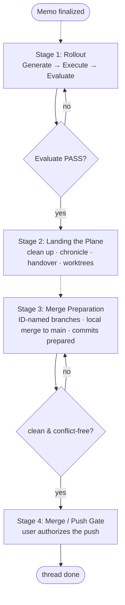

The most reliable way to leave a thread half-finished is to mistake the end of the rollout for the end of the work. The rollout closes when Evaluate passes, but a passed Evaluate is only the first of four stages that carry a memo from "code written" to "thread done". The governing principle is short and load-bearing: **Rollout done ≠ memo done**. The rollout is stage one of four; three further stages stand between a green Evaluate and a thread that can be closed without leaving a mess for the next morning. This chapter names those four stages, fixes the condition that ends each one, and places the per-memo model under the wider plan meta-level, where the same "the rollout is only stage one of N" holds across a sequence of memos as well as within a single one.

---

## The Four Stages

The process end is a fixed, ordered sequence. Each stage has a single job and a single condition that ends it; a stage is not complete until its end-condition holds, and the next stage does not begin until the previous one is done. The condition is what makes the boundary checkable rather than a matter of judgement.

| Stage | Name | Content | Ends when |
|-------|------|---------|-----------|
| 1 | Rollout | Generate → Execute → Evaluate | Evaluate PASS |
| 2 | Landing the Plane | clean up, name open ends honestly, chronicle + handover, worktree cleanup | the workspace is "next-morning" startable |
| 3 | Merge Preparation | branches ID-named, locally merged up to `main`, commits prepared and presented | clean and conflict-free, push-ready |
| 4 | Merge / Push Gate | the user authorizes the push (push is never automatic) | the user pushes and the thread is done |

**Stage 1 — Rollout.** The autonomous half: Generate produces the work orders, Execute implements them across phases, Evaluate checks memo conformity. The stage ends on a green Evaluate. Its full specification is [12-rollout.md](/specification/rollout/). A green Evaluate ends the rollout — it does not end the memo.

**Stage 2 — Landing the Plane.** Landing renders the end-state legible and resumable: it cleans worktrees, names open ends honestly (including a `verdict: OPEN` where that is the truth), writes the chronicle entry and the handover, and leaves the workspace in a state a fresh context can pick up the next morning without questions. Its full specification is [27-landing-the-plane.md](/specification/landing-the-plane/). **Landing is always mandatory** — it is never skipped, regardless of whether the merge stages run immediately or later, because a thread left without a landing is a thread the next session has to reconstruct.

**Stage 3 — Merge Preparation.** With the workspace landed, the branches are named by their memo ID (see [17-git-workflow-and-ids.md](/specification/git-workflow-and-ids/)), the system performs the **local merge up to `main`** deterministically, and the commits are prepared and presented. The stage ends when the result is clean and conflict-free — push-ready, with nothing left to resolve before release.

**Stage 4 — Merge / Push Gate.** The final boundary is the user's. The user authorizes the push; the push is never automatic. The stage — and the thread — ends when the user pushes.

---

## What "The System Merges, The User Releases" Means

The boundary between stage three and stage four is precise, and a common over-statement gets it wrong. It is **not** true that "the user does the merge". The system performs the local merge up to `main` deterministically as part of merge preparation: it folds the ID-named branches together, resolves the integration locally, and presents a clean, conflict-free `main` ready to release. What the system does **not** do is push. The push is the one act of release that stays with the user, every time, and is never automatic.

So the correct framing is a split: **the system merges locally, the user releases by pushing.** Stage three is deterministic system work — branch naming, local merge, commit preparation — and it produces a push-ready state. Stage four is the human gate — the user inspects what is prepared and authorizes the push. Conflating the two, in either direction, is the error this chapter exists to prevent: the system must not push on its own, and "the user merges" must not be used to excuse the system from doing the deterministic local merge it is responsible for.

---

## The Plan Meta-Level

Above the per-memo stage model sits the **plan**. A plan carries one or more memos, and the stages described here apply to each memo in turn. The plan does not replace the per-memo sequence; it nests it. The same shape — "the rollout is only the first stage of N" — holds at both levels: within a single memo, a passed Evaluate is stage one of four; across a plan, a finished rollout of one memo is one step of a longer sequence, with its own landing, merge preparation, and push gate still ahead, and further memos behind it.

The practical consequence is that closing a memo's rollout never closes the plan, and closing a memo's four stages never implies the plan is done while sibling memos remain. The push gate is reached per memo; a plan is finished only when every memo it carries has passed its own stage four. The meta-level is therefore not a different process but the same process applied repeatedly, with the plan as the ledger that records which memos have reached the gate and which have not.

---

## The Stage Lifecycle

The lifecycle moves a finalized memo through the four stages to a closed thread. Solid edges are **gates** — a condition that must hold before the next stage begins. Dotted edges are **coordinated stage handovers** — a baton pass where the work continues but the responsibility moves from one stage's job to the next.

The two gates are the checkable boundaries: the Evaluate gate closes stage one, and the clean-and-conflict-free gate closes stage three. The dotted handovers — finalized memo into rollout, landing into merge preparation — are coordinated baton passes rather than pass/fail checks: the work flows on, but the stage's job changes hands. The final edge into "thread done" is the user's push, the only place where the sequence leaves the system's hands entirely.

---

## Related

- [12-rollout.md](/specification/rollout/) — stage one, the autonomous Generate → Execute → Evaluate that ends on a green Evaluate.
- [27-landing-the-plane.md](/specification/landing-the-plane/) — stage two, the always-mandatory landing that leaves the workspace next-morning startable.
- [13-orchestration.md](/specification/orchestration/) — the orchestrator and state files that drive the stages and record their progress.
- [17-git-workflow-and-ids.md](/specification/git-workflow-and-ids/) — the ID-named branches and the deterministic git flow behind merge preparation and the push gate.
- [00-overview.md](/specification/overview/) — conformance language.
