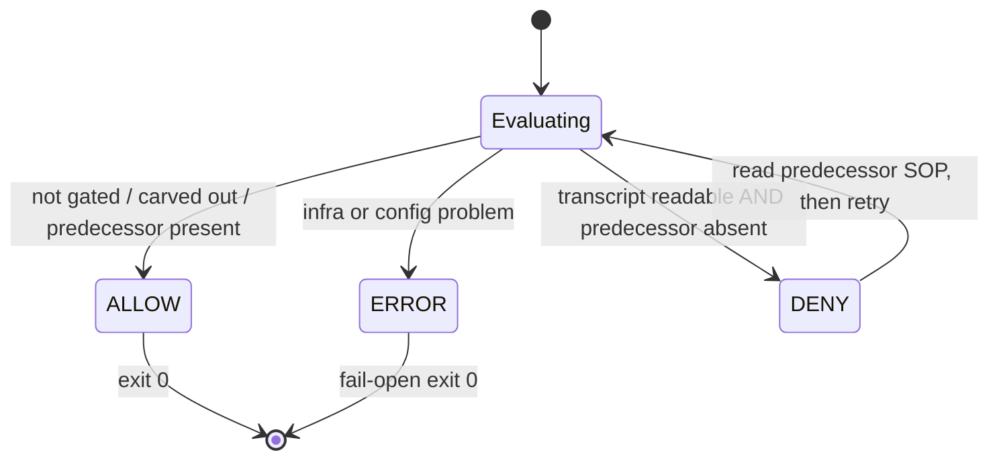
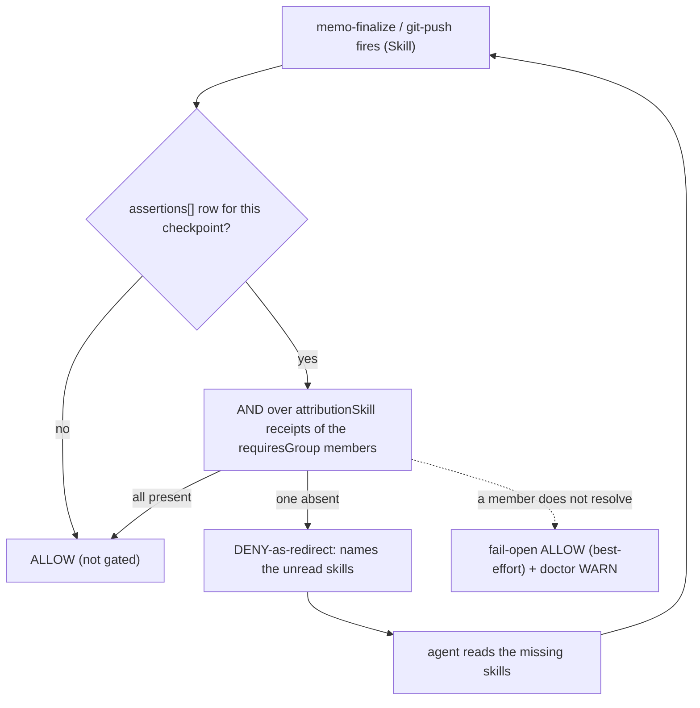

Self-discovery describes what an agent *should* do. Making it **deterministic** — guaranteeing the required predecessor SOP was active before a gated entry point runs, regardless of model behaviour — is the job of the genesis tier, through a Claude Code **PreToolUse hook**. This chapter specifies the contract that hook MUST satisfy. The concrete reference implementation is `sop-precondition.sh`; the contract it realizes is shared with [workbench/23-hooks-contract.md](/workbench/hooks-contract/).

---

## The Session-Tier Config Is the Entry Point

The machine-readable form of the SOP chain is a **registry**, and its entry point is the project-local **`.session/config.json`** — the session-tier home the hook reads ([05-config-cascade.md](/specification/config-cascade/)). The config carries the registrant blocks and the when:pre edges as two top-level structures (`sops[]` + `requirements[]`, [06-namespace-registry.md](/specification/namespace-registry/)). The pre-gate edge that is active in this version is the single project-scoped `memo-init → memo-sop`:

```json
{ "sops": [ { "namespace": "memo", "owner": "memo-init", "tier": 2, "requires": ["workbench"],
              "skills": [ { "id": "memo-init", "signals": ["attributionSkill:memo-init"] },
                          { "id": "memo-sop",  "signals": ["attributionSkill:memo-sop"]  } ] } ],
  "requirements": [ { "id": "REQ-061", "entrypoint": "memo-init",
                      "requires": "memo-sop", "when": "pre" } ] }
```

The config moves the entry point **one tier down** from the former workbench home (`.workbench/registry.json`) to the session tier; the move is a **one-time migration** carried by `session init`, not a dual-read ([05-config-cascade.md](/specification/config-cascade/), [07-doctor-init.md](/specification/doctor-init/)). A machine-global registry at `~/.claude/session/registry.json` (the **session** tier, not a workbench path) is the natural home for cross-project edges; activating it is a follow-up. The config is a privilege artifact and MUST be protected from silent rewrite (a Write/Edit guard; see [03-recovery.md](/specification/recovery/)).

**Absence is fail-open and LOUD.** When `.session/config.json` is absent the gate MUST treat it as a configuration problem that **fails open** (ALLOW, exit 0) — never a lockout — while emitting a **loud SessionStart warning** so the missing config is noticed rather than silently tolerated (REQ-SS-CONFIG-LOUD). Enforcement deliberately starts **permissive**: warn first, tighten later. The strict, refusing posture lives in the foreground `session doctor` / `session init` ([07-doctor-init.md](/specification/doctor-init/)), not in the always-on hook.

---

## The Signal Is Structured, Never a Substring

The predecessor signal MUST be read **jq-structured** from the harness-authored `attributionSkill` field of the session transcript. It MUST NOT be a raw substring match over transcript text: transcript content includes user- and model-influenced text, so a substring grep over it is a **forgeable gate**. Only the structured `attributionSkill` value — which the harness, not the model, writes — is trusted. The scan MUST be bounded and BSD-safe (`tail -r` + early-exit, never `tac`).

The hook locates `.session/config.json` from the **pinned** project root, not from a live `cwd`: the root is resolved once at SessionStart and read from the pin thereafter, so a `cd` mid-session can never repoint the gate at a sister project's config ([08-identity-pin.md](/specification/identity-pin/), [09-root-detection.md](/specification/root-detection/)).

---

## The Three-State Contract

The gate has exactly three outcomes. Two are decisions; the third is the fail-safe.

| State | Meaning | Exit |
|-------|---------|------|
| **ALLOW** | not gated, carved out, or the predecessor signal is present | 0 |
| **DENY** | the transcript is readable AND the required predecessor is genuinely absent | 2 |
| **ERROR (fail-open)** | any infrastructure or configuration problem | 0 + stderr note |

The decision table the reference hook MUST implement:

| Condition | Result | Exit |
|-----------|--------|------|
| disable switch set (`$SESSION_SOP_DISABLE` or the sentinel) | ALLOW | 0 |
| tool ≠ `Skill` | ALLOW | 0 |
| `.session/config.json` absent | ERROR (fail-open) + LOUD SessionStart warning | 0 |
| `jq` missing · `transcript_path` empty/unreadable · config malformed | ERROR (fail-open) | 0 |
| `transcript_path` is a subagent transcript (`…/subagents/agent-*.jsonl`) | ALLOW (carve-out) | 0 |
| the entry point is not gated by a when:pre edge | ALLOW | 0 |
| the required skill is **not installed** (dangling edge) | ERROR (fail-open) | 0 |
| transcript readable AND predecessor `attributionSkill` found (jq) | ALLOW | 0 |
| transcript readable AND predecessor genuinely absent | DENY | 2 |
| firing skill is a checkpoint in `assertions[]` AND every `requiresGroup` member receipt present | ALLOW | 0 |
| firing skill is a checkpoint in `assertions[]` AND a member receipt absent | DENY-as-redirect (names the unread skills) | 2 |
| a `requiresGroup` member does not resolve (e.g. a pending, not-yet-registered skill) | ERROR (fail-open) + doctor WARN | 0 |

The last three rows are the **policy checkpoint** branch (see [Policy Checkpoints — The Landing Gate](#policy-checkpoints--the-landing-gate) below); the rows above them are the unchanged `when:pre` predecessor branch. The two branches are evaluated independently on the same `Skill` call, and either may DENY-as-redirect.

The governing principle: **the gate never fail-CLOSES on infrastructure trouble** (FAILOPEN), and **never produces an unrecoverable lockout** (EDGEVALID). A DENY is a *redirect*, not a dead end — its message tells the agent to read the predecessor SOP first, after which the same entry point passes.

A gate is a state machine, so its three outcomes read as states. The key property the diagram makes visible: `ALLOW` and the fail-open `ERROR` both terminate at exit 0, while `DENY` is a self-redirect — it returns to the decision once the predecessor SOP has been read, never a terminal dead end:



---

## Policy Checkpoints — The Landing Gate

The `when:pre` branch gates an entry point behind a predecessor SOP. A **policy block** ([06-namespace-registry.md](/specification/namespace-registry/)) needs a different shape of gate: *"by the time work lands, a sub-set of standards must have been read."* That is expressed by the top-level **`assertions[]`** collection ([05-config-cascade.md](/specification/config-cascade/)) and evaluated by the **same** PreToolUse hook — there is no second hook.

An `assertions[]` row names a **checkpoint** skill, a **`requiresGroup`**, and an `onMissing` policy:

```jsonc
{ "id": "REQ-NODE-SEC-FINALIZE",    "checkpoint": "memo-finalize", "requiresGroup": "security",     "mode": "all", "when": "landing", "onMissing": "redirect" }
{ "id": "REQ-NODE-SEC-PUSH",        "checkpoint": "git-push",      "requiresGroup": "security",     "mode": "all", "when": "landing", "onMissing": "redirect" }
{ "id": "REQ-NODE-VERIFY-FINALIZE", "checkpoint": "memo-finalize", "requiresGroup": "verification", "mode": "all", "when": "landing", "onMissing": "redirect" }
```

When the firing skill matches a row's `checkpoint`, the hook resolves the row's `requiresGroup` over the union of all blocks and takes the **AND** over its members' `attributionSkill` receipts (`mode:"all"`). All present ⇒ ALLOW. One absent ⇒ **DENY-as-redirect**: a redirect, not a dead end, whose message names exactly the unread skills, after which the same checkpoint passes. The landing gate fires at the next *real* skill the standards must be settled by — `memo-finalize` (primary) with `git-push` as the irreversible-outward backstop; there is no dedicated landing skill to key on.

Three invariants bound the checkpoint branch, all inherited from the three-state contract:

- **Never a hard lock.** `onMissing` is `redirect` only; a checkpoint group may never produce a terminal block.
- **Never blocks the workflow** (REQ-SS-WORKFLOW). Checkpoints sit on `memo-finalize` / `git-push`; `memo-init` / `memo-plan` / `memo-revision-*` are never checkpoints and run unimpeded.
- **A non-resolving member fails open.** If a `requiresGroup` member is not installed (e.g. a standard documented but not yet registered as a skill), the gate cannot honestly assert "all read", so it degrades to fail-open ALLOW (best-effort, **no** hard guarantee) and the foreground doctor reports the unresolved member ([07-doctor-init.md](/specification/doctor-init/)). An `assertions[]` id collision is likewise a fail-open ALLOW at the hook, never a redirect; it is rejected strictly only in the foreground doctor.

The landing gate as a top-down flow:



---

## Required Properties

| Requirement | Statement |
|-------------|-----------|
| **REQ-SS-FAILOPEN** | Any infra/config problem ⇒ ALLOW (exit 0) with a stderr note. Never deny on trouble. |
| **REQ-SS-CONFIG-LOUD** | An absent `.session/config.json` ⇒ ALLOW (fail-open) **and** a loud SessionStart warning; enforcement starts permissive, strict checks live in `session doctor`. |
| **REQ-SS-SIGNAL** | The predecessor signal is matched jq-structured on `attributionSkill`, never as a substring. |
| **REQ-SS-EDGEVALID** | An edge to a non-installed skill fails open; a build-time `registry-validate` MAY refuse it. |
| **REQ-SS-SUBAGENT** | A subagent transcript is carved out (ALLOW) — it carries no parent attribution chain. |
| **REQ-SS-BSD** | The transcript scan is bounded + BSD-safe (`tail -r`, early-exit), never `tac`. |
| **REQ-SS-DISABLE** | A disable switch (env var + sentinel file) short-circuits to ALLOW as the first action. |
| **REQ-SS-CANARY** | A SessionStart canary re-verifies the gate against known fixtures and auto-disables on drift. |
| **REQ-SS-NOWRITE** | Live `~/.claude/` config (settings.json, CLAUDE.md) is changed only additively via a reviewed diff, never auto-written. |
| **REQ-SS-WORKFLOW** | The gate MUST NOT block the memo workflow: `memo-init` / `memo-plan` / `memo-revision-*` run under the active gate (a DENY only redirects through the predecessor SOP). |
| **REQ-SS-POLICY** | A policy block gates only via `assertions[]` checkpoint rows, only as `onMissing:"redirect"`, never as a `when:pre` predecessor. A non-resolving `requiresGroup` member fails open (best-effort); an `assertions[]` id collision fails open at the hook and is rejected only in the foreground doctor. Defined in [06-namespace-registry.md](/specification/namespace-registry/). |

---

## Wiring Is Additive and Reviewed (REQ-SS-NOWRITE)

The gate is wired into `~/.claude/settings.json` as a PreToolUse hook on the `Skill` matcher, **additively**: the existing `*` and `Write|Edit` hooks remain. Because `settings.json` is the single point of failure for all hooks, it MUST NOT be auto-written — a change is presented as an exact diff, backed up, validated with `jq`, and the matcher is asserted present after the edit. The same discipline applies to the `~/.claude/CLAUDE.md` genesis block.

---

## Related

- [03-recovery.md](/specification/recovery/) — the disable switch, sentinel, canary, and recovery runbook that make the gate always recoverable.
- [05-config-cascade.md](/specification/config-cascade/) — the `.session/config.json` entry point the gate reads, and the migration that puts it there.
- [07-doctor-init.md](/specification/doctor-init/) — the foreground `session doctor` / `session init` that carry the strict checks the hook deliberately omits.
- [08-identity-pin.md](/specification/identity-pin/) — the SessionStart-Pin the gate reads instead of a live `cwd`.
- [workbench/23-hooks-contract.md](/workbench/hooks-contract/) — the workbench-side statement of the same PreToolUse contract.
- [workbench/20-cli.md](/workbench/cli/) — `memo session resolve` and `memo session registry-validate`.
