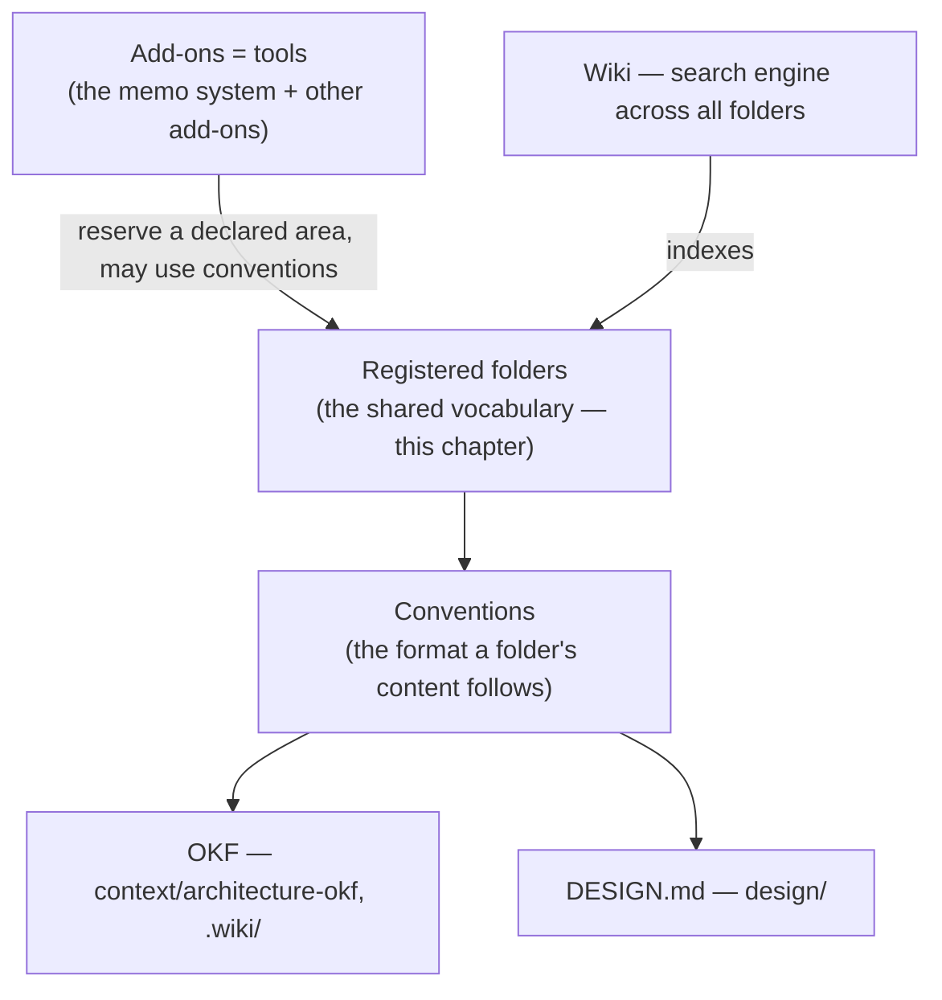

Every project under `projects/{name}/` **MUST** follow a single, predictable layout. A predictable layout is what lets the workbench audit check structure mechanically and what lets a memo assume where its context, repositories, and scripts are without searching. This chapter is the authoritative folder contract; the root-vs-project split is in [10-root-and-projects.md](/specification/root-and-projects/), and the local guarantee that protects the layout in [11-project-structure.md](/specification/project-structure/).

---

## Registered Folders — A Shared, Named Vocabulary

The workbench's core idea is that a project's top-level folders are a **registered vocabulary**: a fixed set of names, identical in every project, each with a declared meaning. Because the names are the same everywhere, a developer moving between projects — and an agent reading a project for the first time — already knows where context, repositories, scripts, and tooling live. The shared layout is a shared *working mentality*, not merely a directory listing; standardizing the first place a thing is put is worth the cost, because the alternative is every project doing it differently.

Four properties make a folder **registered**:

- **A stable name.** The folder is referred to by exactly one name across all projects (`repos/`, `context/`, `.memo/`); the name is a load-bearing identifier, not a project-local choice.
- **A required-or-optional status.** Each registered folder is either mandatory (every project has it) or optional (a project adds it when it needs it).
- **A level.** Each registered folder lives at the workbench **root**, at the **project** level, or — like `context/` — at **both**; the level says where the name is expected (see [10-root-and-projects.md](/specification/root-and-projects/)).
- **A declared meaning.** Each folder has one purpose and, where it is non-trivial, its own chapter or convention that says what belongs in it.

The contract table in the next section **is** this registry: the single, authoritative list of registered folders. Tooling that needs the list — the project-setup helper, the structure audit — **SHOULD derive it from this registry** rather than restate it. A hardcoded copy in a tool is drift, and this registry is the source it must agree with.

---

## The Folder Contract

Folder names are load-bearing identifiers and are reproduced verbatim. The workbench audit reports any missing mandatory path as a structural finding and any unexpected top-level entry for review.

| Path | Status | Level | Purpose |
|------|--------|-------|---------|
| `.claude/` | Mandatory | Project | Claude Code settings and project-local skills. |
| `.memo/` | Mandatory | Project | Memos and their shared stores; see [11-project-structure.md](/specification/project-structure/). |
| `.trash/` | Mandatory | Project | Recoverable trash; the deletion target (see [32-trash.md](/specification/trash/)). |
| `context/` | Mandatory | Both | **Processed**, derived material — specifications, distilled research, Markdown/PDF documents. Also exists at the root for cross-project standards (see [10-root-and-projects.md](/specification/root-and-projects/)). |
| `repos/` | Mandatory | Project | The project's git repositories (one domain per repository). |
| `scripts/` | Mandatory | Project | Environment and health scripts (see [21-environment-scripts.md](/specification/environment-scripts/)). |
| `ABOUT.md` | Mandatory | Project | Project documentation for humans. |
| `CLAUDE.md` | Mandatory | Project | The runbook for the AI. |
| `data/` | Optional | Project | **Raw inputs** — feeds and source material, as ingested, before processing; the input side that `context/` is derived from. |
| `.workbench/` | Optional | Project | The manual project configuration (see [22-config.md](/specification/config/)). |
| `.browser/` | Optional | Project | Browser-automation session, scripts, and output — only when the project does browser automation; legacy alias `.playwright/` (see [31-browser-automation.md](/specification/browser-automation/)). |
| `.wiki/` | Optional | Project | LLM-generated project wiki, an OKF-conformant knowledge bundle (see [30-wiki.md](/specification/wiki/)). |
| `proofs/` | Optional | Project | Proofs captured when a view changes (see "Specialized folders" below). |
| `snapshots/` | Optional | Project | Application snapshots (see "Specialized folders" below). |
| `design/` | Optional | Project | Design system and visual sources — `DESIGN.md`, variants, and `.pen` files (see [18-design.md](/specification/design/)). |
| `.tmp/` | Optional | Project | Scratch / temporary working area — transient material, not durable knowledge and not committed (see [32-trash.md](/specification/trash/)). |

A project **MUST NOT** omit a mandatory folder. A project **MAY** add any optional folder when it needs it.

The **Level** column records where each name is expected. The rows above are the **project-level** contract for folders under `projects/{name}/`; `context/` is marked **Both** because the same name is also a registered folder at the workbench root, where it holds cross-project standards. The root-only folders — `cli/`, `projects/`, `templates/`, and the root `context/` — are registered in [10-root-and-projects.md](/specification/root-and-projects/), not restated here.

---

## The Dot-Prefix Convention

Whether a registered folder's name begins with a dot is **not arbitrary** — it encodes what kind of thing the folder holds:

- A name **begins with `.`** when the folder is **generated or local machinery**: tooling configuration and local-only artifacts that are not authored by hand and, in several cases, never leave the machine (`.claude/`, `.memo/`, `.trash/`, `.workbench/`, `.wiki/`, `.browser/`, `.tmp/`).
- A name **carries no prefix** when the folder holds **authored, user-facing content** — the substantive material a person creates and reads (`context/`, `repos/`, `scripts/`, `proofs/`, `snapshots/`, `data/`, `design/`).

The dot carries two reinforcing meanings — *hidden from casual view* and, for the local-only stores, *never pushed* — and it gives the machine a cheap, structural signal: a folder-aware tool can tell generated machinery from authored content by the leading character alone. `scripts/` is the deliberate edge case — it holds tooling, but it is authored and run by people, so it follows the no-dot, content rule.

A new registered folder **MUST** follow this convention: a dot for generated or local machinery, no dot for authored content.

---

## `data/` vs `context/`

The distinction between `data/` and `context/` is by **state of processing**, and it is the reason both exist:

- **`data/`** holds **raw inputs** — feeds, dumps, and source files exactly as they arrive. It is the input side: material the project ingests but does not author.
- **`context/`** holds **processed, derived** material — the Markdown, PDFs, and distilled research produced *from* the raw data (and from elsewhere). It is the worked, readable side that memos draw on.

The contract is directional: `data/` is the input, `context/` is what is derived from it. A project that only ever works with processed documents has a `context/` and no `data/`; a project that ingests raw feeds keeps them in `data/` and writes the distilled result into `context/`. Keeping the two apart prevents raw dumps from polluting the readable research store.

Both differ from `.tmp/`, the third, transient tier: `data/` and `context/` are **durable knowledge** (the raw inputs and the processed result are both kept), whereas `.tmp/` is **scratch space** for ephemeral working material that may be discarded at any time and is not committed as knowledge (see [32-trash.md](/specification/trash/)).

---

## Conventions and Add-Ons

Two distinct things attach to folders, and the spec keeps them apart:

| Term | What it is | Examples |
|------|-----------|----------|
| **Convention** | A named **standard or format** that the *content* of a folder follows. | OKF for `context/architecture-okf/` and `.wiki/` ([13-knowledge-format-okf.md](/specification/knowledge-format-okf/)); DESIGN.md for `design/`. |
| **Add-On** | A **tool** that reserves an area of the project and may use or bring conventions of its own. | The memo system, and other globally provided tools. |

A Convention answers *what format does this folder's content take?*; an Add-On answers *which tool reserves space here and operates on it?*. The two compose: an add-on may write into a folder whose content follows a convention. The convention model — how a folder declares the standard its content follows — is developed across this Folders category (OKF in [13-knowledge-format-okf.md](/specification/knowledge-format-okf/) is the first instance); the add-on model — how a tool reserves an area and where its data lives — is specified in the add-on chapter ([26-addons.md](/specification/addons/)).

The relationship reads in one direction — from the shared vocabulary outward, with the wiki indexing across the whole:

The registered folders are the shared vocabulary; a convention is the format the *content* of a folder follows; an add-on is a *tool* that reserves a declared area and may use those conventions; and the wiki sits one level above as the search engine that indexes across them all, so a reader finds material without first knowing which folder holds it.

---

## The Convention Model

A **convention** is the named standard a folder's *content* follows. The workbench does not impose one universal schema on everything; it **separates domains by folder** and lets each folder declare the convention that fits its material. A convention is named, documented in its folder's chapter, and — where possible — checked when content is written.

| Folder | Domain | Convention | Status |
|--------|--------|-----------|--------|
| `context/architecture-okf/`, `.wiki/` | Architecture / knowledge | OKF ([13-knowledge-format-okf.md](/specification/knowledge-format-okf/)) | established |
| `design/` | Design system | DESIGN.md ([18-design.md](/specification/design/)) | new |
| `scripts/` | Environment startup | startup-script convention ([21-environment-scripts.md](/specification/environment-scripts/)) | proposed |

OKF was the **first** convention and DESIGN.md the **second**; neither is privileged, and a convention is **replaceable** — if a format is superseded, the folder and its role survive and the standard is swapped. The ordering rule is **spec-first**: a convention is defined here before the tooling that enforces or generates it is built.

---

## Core Is Independent of the Memo System

The registered folders divide into two groups, and the division is deliberate:

- The **workbench core** — `context/`, `repos/`, `scripts/`, `.trash/`, and the authored project files — is **independent of the memo system**. A project can use the workbench layout, the CLIs, the wiki, and the trash policy without any memo ever being written.
- The **memo system's footprint** — `.memo/` (the memo store) and the memo-specific skills inside `.claude/` — is the on-disk presence of an **add-on**: the memo system. It is the **recommended default** way of working, which is why `.memo/` appears as mandatory in the contract above; but its mandatory status is the footprint of that recommended add-on, not a requirement of the bare workbench.

In practice the two are rarely separated: reading and writing a project's work runs **through the memo system** as the normal mode, so a real project almost always carries `.memo/`. "The core is usable without the memo system" is a statement about *dependency*, not about *typical use* — the workbench does not depend on the memo system, even though it is normally driven by it. The memo system is the **weightiest of the workbench's add-ons**; the single, authoritative statement of that — one add-on model for all tools, the memo system merely heavier — lives in the add-on chapter ([26-addons.md](/specification/addons/)).

---

## Specialized Folders May Live Under `.tmp/`

`proofs/` and `snapshots/` are **specialized**: they matter to projects that capture view proofs or application snapshots and are irrelevant to others. Such a project **MAY** keep them as top-level folders, or **MAY** place them under `.tmp/` when the captured material is ephemeral and need not persist. Either placement is conformant; the choice follows from whether the proofs and snapshots are kept as durable artifacts or as throwaway working material.

---

## `.browser/` Is Optional

Browser automation is not universal. A project carries `.browser/` **only if** it actually performs browser automation; a project that does none **MUST NOT** be expected to have it. When present, the folder is named `.browser/` (legacy alias `.playwright/`) and follows the normative conventions in [31-browser-automation.md](/specification/browser-automation/).

---

## `.workbench/` Carries the Configuration

The optional `.workbench/` folder is where a project's **manual** configuration lives — the declaration of what is specific to the project, including the inward/outward-facing classification of its repositories. The configuration is manual, not auto-generated, and is the single source from which deterministic enforcement is derived. Its fields and derivation are specified in [22-config.md](/specification/config/).

---

## Per-Folder Pages

Several registered folders carry enough depth to have their own page; this chapter is the **hub**, and those pages are its spokes. A reader looking for one folder goes straight to its page:

| Folder | Page |
|--------|------|
| `repos/` | [15-repos.md](/specification/repos/) |
| `context/` | [16-context.md](/specification/context/) |
| `context/architecture-okf/` | [41-project-architecture.md](/specification/project-architecture/) (concept) · [13-knowledge-format-okf.md](/specification/knowledge-format-okf/) (format) |
| `.memo/` | [17-memo-store.md](/specification/memo-store/) |
| `design/` | [18-design.md](/specification/design/) |
| `.wiki/` | [30-wiki.md](/specification/wiki/) |
| `.browser/` | [31-browser-automation.md](/specification/browser-automation/) |
| `.trash/` | [32-trash.md](/specification/trash/) |

Folders without a dedicated page (for example `scripts/`, `proofs/`, `snapshots/`, `.tmp/`) are specified by their row in the contract above and, where relevant, by a CLI or tools chapter — `scripts/` by [21-environment-scripts.md](/specification/environment-scripts/). The **wiki sits one level above the folders** as the search engine across all of them: it indexes the separated domains so a reader can find material without first knowing which folder holds it ([30-wiki.md](/specification/wiki/)).

**The registry is authoritative for tooling.** Where a tool — the project-setup helper, the structure audit — carries its own list of folders, that list **MUST** agree with this registry. A tool that treats an *optional* folder (`.browser/`, `proofs/`, `snapshots/`, `.wiki/`) as mandatory has drifted from the registry and is the copy to reconcile, not the source.

---

## Related

- [10-root-and-projects.md](/specification/root-and-projects/) — the workbench-root vs. project split.
- [11-project-structure.md](/specification/project-structure/) — the local guarantee that protects this layout.
- [13-knowledge-format-okf.md](/specification/knowledge-format-okf/) — OKF, a convention used by the wiki and architecture folders.
- [22-config.md](/specification/config/) — the `.workbench/` configuration.
- [26-addons.md](/specification/addons/) — the add-on model; the memo system as the weightiest recommended add-on.
- [32-trash.md](/specification/trash/) — why deletion routes through `.trash/`.
