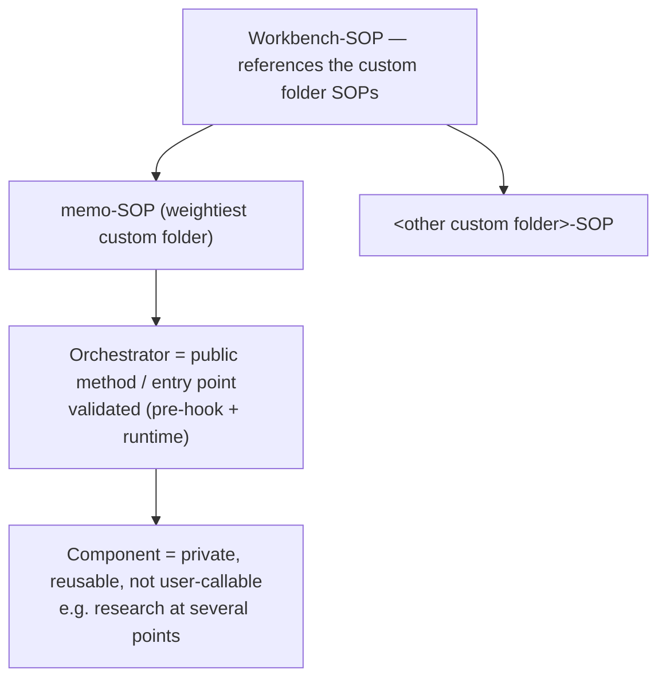

The skills that operate at the workbench level are organized around the **common SOP standard**: a workbench skill serves the Setup, Health, and Update of the workbench scope, plus the scope-specific extras. This chapter records that coupling and where the existing skills fall.

---

## Coupled to the SOP Standard

A workbench skill is an instance of the common SOP denominator ([the SOP common denominator](/session/common-denominator/)) applied to the workbench scope. Its responsibilities map onto the four parts:

| Part | At the workbench scope |
|------|------------------------|
| **Setup** | Bring a project or the workbench into its expected, structured state. |
| **Health** | Verify the workbench setup — do the projects and repositories satisfy the structural checks (see [21-environment-scripts.md](/specification/environment-scripts/)). |
| **Update** | Roll central improvements out into the projects that consume them. |
| **Extras** | Scope-specific capabilities — notably the wiki and the project conventions. |

Organizing workbench skills this way means a reader who knows the SOP standard already knows the shape of the workbench skill set: it is Setup/Health/Update plus the workbench's own extras, not an ad-hoc collection.

The same four-part frame generalizes beyond workbench skills to **every custom folder**: each custom folder's SOP is Setup/Health/Update plus its own tool-specific Extras, scaled to the custom folder's weight ([26-addons.md](/specification/addons/)).

---

## Where the Existing Capabilities Fall

| Capability | Placement |
|------------|-----------|
| Project audit (structure/health) | A **workbench skill** — it realizes the **Health** part (the structural checks of [21-environment-scripts.md](/specification/environment-scripts/)). |
| Documentation scraping | A **borderline** case — closer to user/memo work than to workbench Setup/Health/Update; not a core workbench skill. |
| Phase execution | **Not** a workbench skill — it belongs to the memo-SOP (the core specification's lifecycle), not to the workbench scope. |
| Browser automation | Already covered by [31-browser-automation.md](/specification/browser-automation/) as a project-level method. |

The memo-toolkit capabilities are loaded **dynamically** (progressive disclosure): a skill is brought into context when it is relevant rather than all at once, so the workbench scope stays small at rest and expands only to the task at hand.

---

## Orchestrators and Components

Workbench and custom folder skills split into two roles, by analogy with a class that has public and private methods:

| Role | Analogy | Visibility |
|------|---------|------------|
| **Orchestrator** | a class's **public method** | A user-facing entry point that defines a flow and is invoked from outside. |
| **Component** | a class's **private method** | A reusable building block called *by* orchestrators, not directly by the user. |

A **component** is a part used in several places rather than a standalone entry point — research is the clearest example, reused at multiple points in the memo lifecycle. Components exist today only implicitly; naming the role makes the structure explicit. A skill declares its role in frontmatter:

```yaml
role: orchestrator   # a user-facing entry point
# or
role: component      # a reusable building block, not in the user-callable catalog
```

A skill marked `role: component` is **taken out of the user-callable catalog**: it is private by default, the same posture as a class method that is private unless deliberately exposed. The default is private; an orchestrator is the deliberate exception that is made public.

The two roles sit beneath the custom folder SOPs the workbench-SOP points at ([02-sop-entrypoint.md](/specification/sop-entrypoint/)): each custom folder's orchestrators are its public entry points, and components are the reusable building blocks they call.



---

## The Public-Method Validation Boundary

Why the orchestrator/component split matters is a **systems** argument, stated by analogy with a class:

> A class is a system. Input — and therefore **contamination** — enters through its **public methods**. So the public methods must be **validated**. That is how you build an engine with no internal problems.

The consequences are concrete:

- Validation belongs at the **public entry points** (the orchestrators), because that is the one surface through which outside input enters. Components, being internal, are not called from outside and do not carry the same boundary check.
- The check is on **content, not only types** — not just "is this the right shape?" but "**does this make sense?**". Type-checking the input is necessary and not sufficient.
- **The stricter the public methods, the calmer the interior.** Rigor at the boundary is what lets the inside of the system relax; a lax boundary pushes defensive checks into every internal step.

This is the same boundary the two checkability mechanisms act on: the **entry-point pre-condition** checks it *before* the call ([23-hooks-contract.md](/specification/hooks-contract/)), and the **runtime call-validation** measures it *after* ([20-cli.md](/specification/cli/)). The orchestrators are where the workbench's essential validation layer lives. Enforcing the `role` split with a pre-hook is a later step; the convention is fixed here first — **spec before mechanism**.

---

## Typed Skill Contracts

Each skill **MUST** declare a **machine-readable typed contract** — typed **inputs** and typed **outputs**, not only the prose `## Skill-Inputs` table or the YAML frontmatter. The prose table documents a skill for a reader; the typed contract states the same surface in a form a machine can check and generate from.

A worked example is a skill like `memo-init`, which consumes a structured transcript. Its input is a `TranscriptPrompt` type — named, typed fields rather than free text:

```yaml
# TranscriptPrompt — the typed input a skill such as memo-init consumes
TranscriptPrompt:
    initiator:   enum[user, llm]   # who started the memo
    title:       string            # one-line subject of the transcript
    topics:      string[]          # the extracted topics, one entry each
    openQuestions: string[]        # questions to resolve before implementation
    sources:     string[]          # linked files / URLs the transcript references
```

The typed contract is the **type half** of the [Public-Method Validation Boundary](#the-public-method-validation-boundary) above. That boundary states that "type-checking the input is necessary and not sufficient": the typed contract makes the boundary **machine-checkable** — a call can be checked against the declared shape automatically — while the **content** check ("does this make sense?") still sits on top. Types are the floor, not the ceiling.

The typed contract **lives in the shared SOP-JSON layer** — alongside the dependency table and the registry ([20-cli.md](/specification/cli/), [23-hooks-contract.md](/specification/hooks-contract/)). One machine-readable layer then carries all three of: **discovery** (what skills and custom folders exist), **preconditions** (what must run first), **and skill I/O types** (the typed contract). They are not three separate stores.

The same typed contract has a **dual use**:

- As a **validation test** — does an actual call's input/output match the declared shape? This is the machine-checkable floor of the boundary above.
- As a **generation template** — the declared shape is a skeleton for building or scaffolding the skill, so the contract that validates a skill is also the contract that seeds it.

This chapter fixes the typed contract **spec-side now**; the implementation is **staggered** and is **not** claimed to be built — consistent with the chapter's **spec before mechanism** posture.

---

## Related

- [26-addons.md](/specification/addons/) — the custom folder model the Setup/Health/Update/Extras frame generalizes to.
- [23-hooks-contract.md](/specification/hooks-contract/) — the entry-point pre-condition that guards a public method *before* the call.
- [20-cli.md](/specification/cli/) — the runtime call-validation that measures the boundary *after* the call.
- [The SOP common denominator](/session/common-denominator/) — the Setup/Health/Update standard these skills realize.
- [21-environment-scripts.md](/specification/environment-scripts/) — the health checks the audit skill performs.
- [31-browser-automation.md](/specification/browser-automation/) — the project-level browser-automation method.
