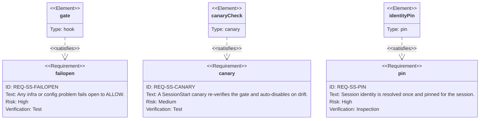
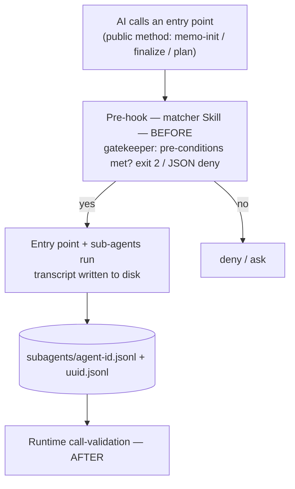

> **Informative.** This chapter is a **wayfinder and code index**: it gathers the workbench's validation families *and* the session-tier `REQ-SS-*` codes in one place and points at the chapter where each is specified. It introduces no new rule of its own — every entry below is normative *there*, not here.

The workbench's checks are deliberately spread across the chapters they belong to — the hook contract, the configuration, the trash policy, the scripts. That keeps each rule next to the thing it governs, but it makes the *set* of rules hard to see. This page is the index that makes the set visible: a reader who asks "what does the workbench actually validate, and where is it defined?" starts here and follows the link. The pattern mirrors a published rule-registry — a stable family name on the left, the defining chapter on the right.

---

## The Validation Families

Each family has a stable name (the wayfinder handle), a short statement of what it checks, **when** it fires relative to the action, the **mechanism** that enforces it, and the chapter that specifies it.

| Family | Checks | When | Mechanism | Defined in |
|--------|--------|------|-----------|------------|
| `WRITE-LINT` | Content matches the target folder's convention before it is written | before (on `Write`/`Edit`) | PreToolUse hook | [23-hooks-contract.md](/specification/hooks-contract/) |
| `ENTRY-PRE` | An entry point's pre-conditions are met before it runs | before (on `Skill`) | PreToolUse hook | [23-hooks-contract.md](/specification/hooks-contract/) |
| `RUNTIME-VAL` | Which skills and tools actually ran this session | after (from the transcript) | transcript scan | [20-cli.md](/specification/cli/) |
| `EGRESS-C1` | Inward routes through the memo ID, outward through Issues | on coordination / push | push / coordination gate | [22-config.md](/specification/config/), [11-project-structure.md](/specification/project-structure/) |
| `TRASH` | Deletion routes through `.trash/` rather than a hard delete | on delete | command rewrite | [32-trash.md](/specification/trash/) |
| `HEALTH` | Project structure and global-tool reachability | on demand / before a memo | CLI / script | [21-environment-scripts.md](/specification/environment-scripts/) |
| `INSTALL-GATE` | A dependency is safe before it is installed | before install | pre-install gate | [00-overview.md](/specification/overview/) |

A second group of rules is **declared** by the workbench but **enforced at the machine tier**, whose hook scripts are out of scope for this spec ([02-sop-entrypoint.md](/specification/sop-entrypoint/)). They are listed so the wayfinder is complete:

| Family | Checks | When | Mechanism | Declared by |
|--------|--------|------|-----------|-------------|
| `ENV-GUARD` | A write to a `.env` file is refused | before (on `Write`/`Edit`) | PreToolUse hook | [23-hooks-contract.md](/specification/hooks-contract/) |
| `NO-DESTRUCT` | A destructive shell command is rewritten or refused | before (on `Bash`) | PreToolUse hook | [23-hooks-contract.md](/specification/hooks-contract/) |
| `ATTRIB-GUARD` | A commit message carries no unapproved AI-attribution trailer | before a commit | commit-msg hook | [23-hooks-contract.md](/specification/hooks-contract/) |

---

## The Validation Codes

The families above are the workbench-tier handles. The **session-tier enforcement** raises a set of **`PREFIX-NUMBER` codes** — the `REQ-SS-*` series — in the manner of a published error-code registry. They are spread across the session enforcement, recovery, namespace-registry, and identity chapters; this index lists them in one place so the *set* is visible. Each code's full statement lives on its defining page — this table is the pointer, not the definition.

| Code | Meaning | Defined in |
|------|---------|------------|
| `REQ-SS-FAILOPEN` | Any infra/config problem ⇒ ALLOW (exit 0); the gate never denies on trouble | [session · enforcement](/session/enforcement/) |
| `REQ-SS-CONFIG-LOUD` | An absent `.session/config.json` ⇒ fail-open ALLOW **plus** a loud SessionStart warning | [session · enforcement](/session/enforcement/) |
| `REQ-SS-SIGNAL` | The predecessor signal is matched jq-structured on `attributionSkill`, never as a substring | [session · enforcement](/session/enforcement/) |
| `REQ-SS-SUBAGENT` | A subagent transcript is carved out to ALLOW — it carries no parent attribution chain | [session · enforcement](/session/enforcement/) |
| `REQ-SS-BSD` | The transcript scan is bounded and BSD-safe (`tail -r`, early-exit), never `tac` | [session · enforcement](/session/enforcement/) |
| `REQ-SS-NOWRITE` | Live `~/.claude/` config is changed only additively via a reviewed diff, never auto-written | [session · enforcement](/session/enforcement/) |
| `REQ-SS-WORKFLOW` | The gate must not block the memo workflow; a DENY only redirects through the predecessor SOP | [session · enforcement](/session/enforcement/) |
| `REQ-SS-DISABLE` | Two equivalent disable switches short-circuit the gate to ALLOW as the hook's first action | [session · recovery](/session/recovery/) |
| `REQ-SS-CANARY` | A SessionStart canary re-verifies the gate and auto-engages the disable switch on drift | [session · recovery](/session/recovery/) |
| `REQ-SS-EDGEVALID` | The config is guarded against silent rewrite; a dangling edge fails open, never locks out | [session · enforcement](/session/enforcement/) · [recovery](/session/recovery/) |
| `REQ-SS-NAMESPACE` | A namespace is reserved by one owner (N-1); a skill id sits under its namespace (N-2) | [session · namespace-registry](/session/namespace-registry/) |
| `REQ-SS-PIN` | Session identity is resolved once at SessionStart and pinned; it must not change over the session | [session · identity-pin](/session/identity-pin/) |
| `REQ-SS-PINREAD` | Every PreToolUse hook reads the pinned identity, never a `cd`-mutated `cwd` | [session · identity-pin](/session/identity-pin/) |
| `REQ-SS-CDGUARD` | A `Bash` soft-guard warns (never blocks) when a `cd` would leave the pinned root | [session · identity-pin](/session/identity-pin/) |

The session pages are the deep definition; this row set is their index. A new `REQ-SS-*` code is added on its defining page **and** given a row here — the same "specify it in its chapter, then list it" discipline the family table follows.

A code registry reads naturally as a **requirement diagram** — the one diagram type built to link a requirement to the mechanism that satisfies it. A few of the `REQ-SS-*` codes and their satisfiers:



---

## Severity

A validation family blocks or warns; the two outcomes are kept distinct so a warning is never silently treated as a hard stop:

- **block** — the action is refused (`exit 2` or `permissionDecision: "deny"`). Structural, high-risk rules use this: `ENTRY-PRE` on a missing prerequisite, `ENV-GUARD`, `NO-DESTRUCT`, `EGRESS-C1` on an inward push.
- **warn** — the action proceeds, but a finding is surfaced. Advisory rules use this: a `HEALTH` finding, a `WRITE-LINT` entry whose severity is `warn`.

The severity of a configurable rule (notably `WRITE-LINT`) is set per entry in `.workbench/folder-lints.json` ([22-config.md](/specification/config/)); the structural rules are block by nature.

---

## Hub and Detail

This page is the **hub**; each family's chapter is the **detail**. The contract for the hook-based families — their inputs, their two block paths, the transcript-inspection rule — is specified once in [23-hooks-contract.md](/specification/hooks-contract/), and the families that are not hooks (`TRASH`, `HEALTH`, `EGRESS-C1`, `INSTALL-GATE`) point at their own chapters. Adding a new validation rule means specifying it in its chapter **and** giving it a row here, so the set never silently grows beyond what this wayfinder lists.

---

## The Validation Boundary — Before and After

The two checkability halves act on the same public entry point at two different moments: a **pre-hook** gates the call *before* it runs ([23-hooks-contract.md](/specification/hooks-contract/)), and **runtime call-validation** measures, *after* the fact, what really ran ([20-cli.md](/specification/cli/)). The diagram traces one call through both. This page is the **single source** of the before/after split: [24-skills-scope.md](/specification/skills-scope/) and [20-cli.md](/specification/cli/) reference it here rather than restating the rule.



*The left-of-the-call check is the "before" half ([23-hooks-contract.md](/specification/hooks-contract/)); the transcript scan after the run is the "after" half ([20-cli.md](/specification/cli/)) — the same before/after split this wayfinder records for `ENTRY-PRE` and `RUNTIME-VAL`.*

---

## Conformity Requirements

This page is the wayfinder, and it introduces no new *domain* rule — those stay normative in their home chapters. The blocks below encode only the wayfinder's **own upkeep discipline**, already stated above: that the set of validation families and codes never grows silently past what this index lists, and that severity stays distinct. As the workbench family's requirements anchor, this section is the entry point into the per-chapter blocks the requirement store is harvested from ([../../v0.1.0/23-requirements.md](/specification/requirements/)).

Every listed validation family must point at a chapter that actually specifies it — a hard yes/no over the index:

```requirement
{
  "id": "REQ-968",
  "title": "Every validation family has a defining chapter",
  "statement": "Every family in the validation table MUST name the chapter that specifies it, and that chapter MUST actually define the rule. Adding a new validation rule means specifying it in its chapter AND giving it a row here, so the set never silently grows beyond what this wayfinder lists. A family with no defining chapter, or a chapter that does not define the family, is an index defect.",
  "scope": { "repos": [], "categories": ["workbench"], "tags": ["validation", "index-integrity"] },
  "severity": "warning",
  "check": {
    "kind": "assertion",
    "assertions": [
      "Each family row names a defining chapter that exists",
      "The named chapter contains the family's normative rule",
      "No specified validation family is absent from this table"
    ]
  },
  "grade": "binary"
}
```

The `REQ-SS-*` code index follows the same specify-then-list discipline:

```requirement
{
  "id": "REQ-969",
  "title": "Every REQ-SS code is both defined on its page and listed here",
  "statement": "Each `REQ-SS-*` session-tier code MUST appear both on its defining session page AND as a row in this index, with the row pointing at that page. A code present here but undefined on its page, or defined on a page but missing here, is an index defect — the same `specify it in its chapter, then list it` rule the family table follows.",
  "scope": { "repos": [], "categories": ["workbench"], "tags": ["validation", "req-ss", "index-integrity"] },
  "severity": "info",
  "check": {
    "kind": "assertion",
    "assertions": [
      "Each `REQ-SS-*` row points at a session page that defines the code",
      "Each `REQ-SS-*` code defined on a session page has a row here"
    ]
  },
  "grade": "binary"
}
```

Keeping block and warn distinct is a property of how an outcome is treated, judged by a reviewer:

```requirement
{
  "id": "REQ-970",
  "title": "A validation family's block and warn outcomes stay distinct",
  "statement": "A validation family's two outcomes MUST be kept distinct: a `block` refuses the action (`exit 2` / `permissionDecision: \"deny\"`), and a `warn` lets it proceed while surfacing a finding. A warning MUST NOT be silently treated as a hard stop, and a structural high-risk rule MUST NOT be downgraded to advisory. The severity of a configurable rule is set per entry in `folder-lints.json`; the structural rules are block by nature.",
  "scope": { "repos": [], "categories": ["workbench"], "tags": ["validation", "severity"] },
  "severity": "warning",
  "check": {
    "kind": "evaluator",
    "rubric": "A reviewer checks each family's outcome handling. PASS when block refuses and warn proceeds-with-finding, with no conflation; BLOCKED when a warn is treated as a hard stop or a structural rule is downgraded to advisory; INCONCLUSIVE when a family's severity is unspecified.",
    "verify": [
      "Classify each family's outcome as block or warn",
      "Confirm neither outcome is silently treated as the other"
    ]
  },
  "grade": { "dimension": "severity fidelity", "weight": 100 }
}
```

---


<!-- IMPLEMENTED-BY — rendered backlink lives in the dist (generated/bridge/<family>/<stem>.backlink.md); source stays authored-only (F2 Dist-Split) -->
## Related

- [23-hooks-contract.md](/specification/hooks-contract/) — the contract for every hook-based family, and the hub for the "before" and "after" checkability mechanisms.
- [20-cli.md](/specification/cli/) — the runtime call-validation (`RUNTIME-VAL`), the "after" measurement.
- [22-config.md](/specification/config/) — `.workbench/` policy, including `folder-lints.json` severities.
- [32-trash.md](/specification/trash/) — the trash-routing rule.
- [21-environment-scripts.md](/specification/environment-scripts/) — the health checks.
- [session · enforcement](/session/enforcement/) — the deep definition of the gate's `REQ-SS-*` codes this index points at.
- [session · recovery](/session/recovery/) — the recovery codes (`REQ-SS-DISABLE`, `REQ-SS-CANARY`, `REQ-SS-EDGEVALID`).
