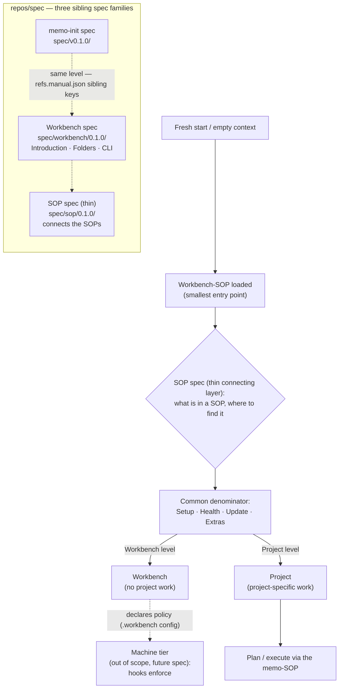
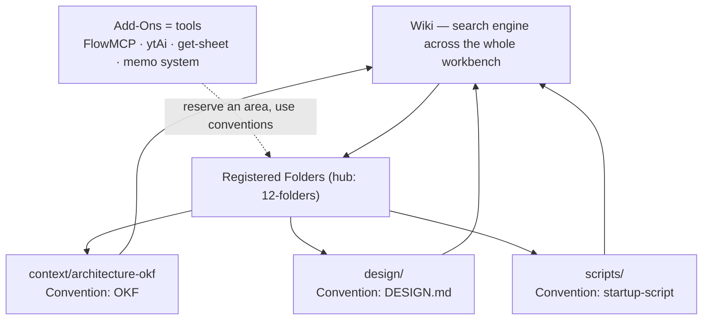
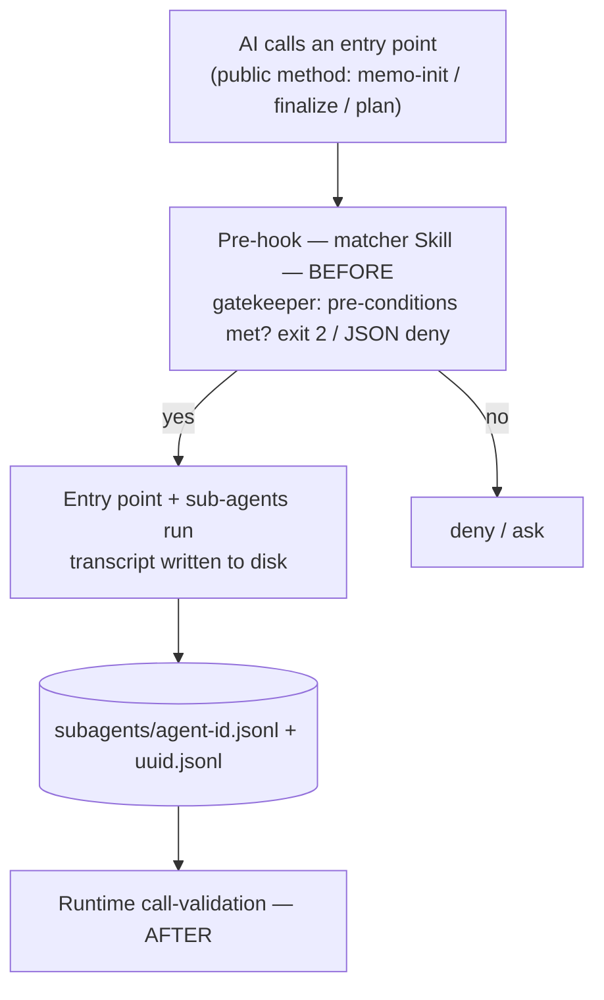
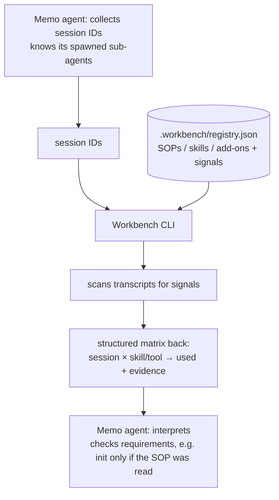
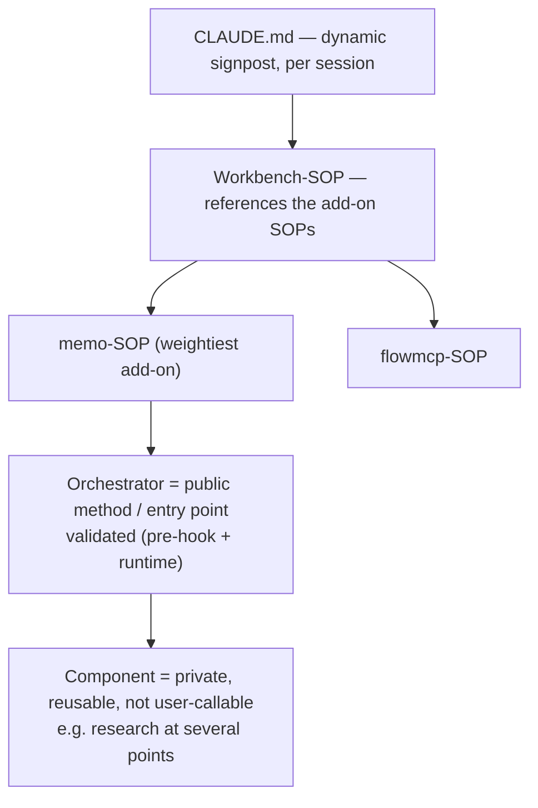

> **Informative.** This chapter collects the architecture diagrams that summarize the structures specified in the preceding chapters. They carry no requirements of their own.

The diagram has two parts. The upper flow shows the **two-level model** (Workbench and Project) reached through the workbench-SOP and the thin SOP spec, with the machine tier drawn dashed because it is out of scope for this spec. The lower group shows the **three sibling spec families** that live side by side in `repos/spec`, each with its own version line.

The upper flow reads top-down: a fresh context loads the workbench-SOP, which uses the SOP spec to read any SOP predictably, which resolves to the common denominator, which routes to one of the two levels. The workbench level *declares* policy; the dashed machine tier (a future spec) *enforces* it. The lower group is structural: three peers in one repository, the memo-init spec and the Workbench spec at the same level via sibling keys in `refs.manual.json`, with the thin SOP spec connecting them.

---

## Registered Folders, Conventions, and Add-Ons

The registered folders are the shared vocabulary; conventions are the formats their content follows; add-ons are tools that reserve an area and use conventions; and the wiki sits one level above as the search engine across all of them ([12-folders.md](/specification/folders/), [26-addons.md](/specification/addons/)).

A Convention is the format inside a folder; an Add-On is a tool. The wiki indexes the separated domains so a reader finds material without first knowing which folder holds it.

---

## The Validation Boundary — Before and After

Validation sits at the public entry points, the surface through which input enters. A pre-hook checks pre-conditions **before** the call; the runtime call-validation measures, **after**, what actually ran ([23-hooks-contract.md](/specification/hooks-contract/), [20-cli.md](/specification/cli/), [24-skills-scope.md](/specification/skills-scope/)).

Contamination enters through the public methods, so that is where the validation layer lives — a pre-hook in front, the transcript-based measurement behind.

---

## Session Validation — Memo Collects, Workbench Builds

The "after" measurement is split across the two systems: the memo collects the session IDs and interprets the result; the workbench holds the registry, searches the transcripts for the signals, and returns the matrix ([20-cli.md](/specification/cli/)).

The memo knows *which* sessions exist and what their use *means*; the workbench knows *what* to search for. The matrix is the structured hand-off between the two.

---

## The Signpost Cascade and Orchestrator/Component

The workbench-SOP is a signpost that references the add-on SOPs; each skill is either an orchestrator (a public entry point) or a component (a private, reusable part) ([02-sop-entrypoint.md](/specification/sop-entrypoint/), [24-skills-scope.md](/specification/skills-scope/)).

The signpost routes downward without becoming a container; the orchestrator is the validated public surface, the component the private interior it calls.

---

## Related

- [00-overview.md](/specification/overview/) — the sibling-spec framing the lower group depicts.
- [02-sop-entrypoint.md](/specification/sop-entrypoint/) — the two-level model, the SOP signpost, and the machine-tier exclusion.
- [12-folders.md](/specification/folders/) — the registered folders, conventions, and the core-vs-add-on split.
- [26-addons.md](/specification/addons/) — the add-on model the third diagram depicts.
- [23-hooks-contract.md](/specification/hooks-contract/) — the pre-hook half of the validation boundary.
- [20-cli.md](/specification/cli/) — the runtime call-validation and the Memo↔Workbench split.
- [24-skills-scope.md](/specification/skills-scope/) — the orchestrator/component split.
- [The SOP spec](/sop/overview/) — the thin connecting layer in the diagram.
