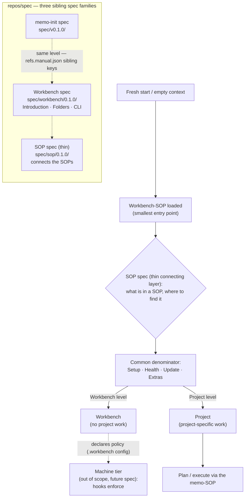

> **Informative.** This chapter holds the **core architecture diagram** that summarizes the structures specified across the spec. It carries no requirements of its own. The per-topic diagrams that once lived here have been distributed to their topic chapters — the registered-folders / convention / add-on picture is in [12-folders.md](/specification/folders/), the validation boundary in [25-validation-overview.md](/specification/validation-overview/), the session-validation hand-off in [20-cli.md](/specification/cli/), and the signpost cascade and orchestrator/component split in [24-skills-scope.md](/specification/skills-scope/).

The core diagram has two parts. The upper flow shows the **two-level model** (Workbench and Project) reached through the workbench-SOP and the thin SOP spec, with the machine tier drawn dashed because it is out of scope for this spec. The lower group shows the **three sibling spec families** that live side by side in `repos/spec`, each with its own version line.

The upper flow reads top-down: a fresh context loads the workbench-SOP, which uses the SOP spec to read any SOP predictably, which resolves to the common denominator, which routes to one of the two levels. The workbench level *declares* policy; the dashed machine tier (a future spec) *enforces* it. The lower group is structural: three peers in one repository, the memo-init spec and the Workbench spec at the same level via sibling keys in `refs.manual.json`, with the thin SOP spec connecting them.

This page deliberately holds **only** the core diagram. Each of the structures it gestures at — folders, validation, the session hand-off, the signpost cascade — carries its own focused diagram in its own chapter, so the picture sits next to the prose that explains it rather than in a single distant catalogue. The chapters that now own those diagrams are listed under [Related](#related).

---

## Related

- [00-overview.md](/specification/overview/) — the sibling-spec framing the lower group depicts.
- [02-sop-entrypoint.md](/specification/sop-entrypoint/) — the two-level model, the SOP signpost, and the machine-tier exclusion.
- [12-folders.md](/specification/folders/) — now home to the registered-folders, conventions, and add-on diagram.
- [25-validation-overview.md](/specification/validation-overview/) — now home to the before/after validation-boundary diagram.
- [20-cli.md](/specification/cli/) — now home to the session-validation hand-off diagram (Memo collects, Workbench builds).
- [24-skills-scope.md](/specification/skills-scope/) — now home to the signpost-cascade and orchestrator/component diagram.
- [23-hooks-contract.md](/specification/hooks-contract/) — the pre-hook half of the validation boundary.
- [26-addons.md](/specification/addons/) — the add-on model the folders diagram references.
- [The SOP spec](/sop/overview/) — the thin connecting layer in the core diagram.
