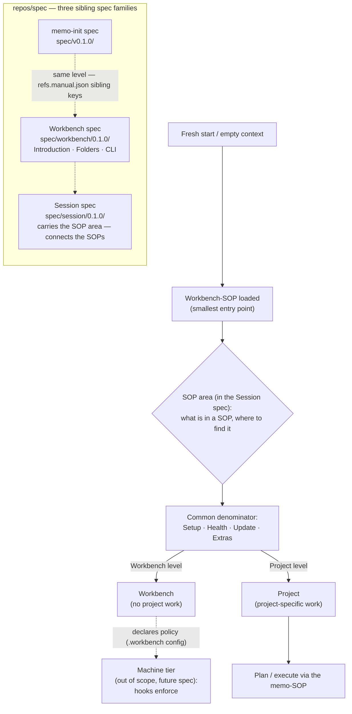

This chapter holds the workbench's architecture at two scales: the **core diagram** that summarizes the system's overall structure — the two-level model and the three sibling spec families — and the **project architecture** that describes a single project's repository graph. Both are "architecture" in the workbench sense: the first is how the whole spec-and-workbench system is put together, the second is how one project's repositories connect. It sits in the workbench **Core** category, alongside the configuration ([22-config.md](/specification/config/)) and the hooks contract ([23-hooks-contract.md](/specification/hooks-contract/)).

---

## The Core Diagram

The core diagram has two parts. The upper flow shows the **two-level model** (Workbench and Project) reached through the workbench-SOP and the thin SOP area, with the machine tier drawn dashed because it is out of scope for this spec. The lower group shows the **three sibling spec families** that live side by side in `repos/spec`, each with its own version line.

The upper flow reads top-down: a fresh context loads the workbench-SOP, which uses the SOP area to read any SOP predictably, which resolves to the common denominator, which routes to one of the two levels. The workbench level *declares* policy; the dashed machine tier (a future spec) *enforces* it. The lower group is structural: three peers in one repository, the memo-init spec and the Workbench spec at the same level via sibling keys in `refs.manual.json`, with the Session spec carrying the thin SOP area that connects them.

The per-topic diagrams that once accompanied this one have been **distributed to their topic chapters** rather than held in a single distant catalogue, so each diagram sits next to the prose that explains it: the registered-folders / convention / custom folder picture is in [12-folders.md](/specification/folders/), the validation boundary in [25-validation-overview.md](/specification/validation-overview/), the session-validation hand-off in [20-cli.md](/specification/cli/), and the signpost cascade and orchestrator/component split in [24-skills-scope.md](/specification/skills-scope/).

---

## Every Project Has an Architecture

A project's **architecture** is the answer to one question: *which repositories exist, and how are they connected?* It is content, not a file format — a graph of repo nodes, the declared edges between them, and the provenance that says when each edge was last verified. Ask *what the architecture is* before asking *what format it is stored in* (the on-disk encoding, an OKF bundle, is named at the end).

Even a single-repo project has an architecture — a trivial one. As soon as a project holds more than one repository, the relationships between them carry real information: which repo is the source another is induced from, which repo consumes another's output, which dependency is externally visible. That graph is the architecture, and it is the **Soll** (the declared target state) against which the real repositories are measured.

- **Nodes are repos.** One node per repository, each carrying its role: a human title, whether it faces inward or outward, and the source it is pinned to (`repos/<name> @ <commit>`).
- **Edges are declared relationships** between repos — `set` (a real, justified edge), `justified-omit` (deliberately no edge, with a reason), or `blocked`. Each edge carries a provenance commit so drift from it is a *count*, not a guess (see [../../v0.1.0/33-maintenance.md](/specification/maintenance/)).
- **The bundle is the Soll, the score is separate.** The architecture bundle carries the *structure*; the maintenance store carries the *score* taken against it. Keeping the two apart is what lets the structure be authored by hand and the score be measured in a fresh context.

---

## The Entry Point — One Door to the Architecture

A memo that needs the architecture **MUST be able to find it through a single entry point**, rather than guessing a path or re-deriving the structure each time. This is the bottleneck principle: there is one door, and everything goes through it.

- For an agent or a human, the door is the **wiki** ([30-wiki.md](/specification/wiki/)): the wiki indexes the architecture as one of the things it knows about, pointing at the bundle rather than copying it.
- For deterministic code, the door is **`memo architecture locate`**: a thin resolver that reads the bundle and returns where it is, what nodes it holds, and which repos have no node yet. It replaces paths that would otherwise be repeated in prose across several skills — one resolver, consulted, instead of a convention re-guessed.

The point of the single door is that the architecture's location stops being tribal knowledge embedded in each consumer and becomes a declared, resolvable fact.

---

## Presence Is Measured, Not Assumed

Every project **SHOULD** store its architecture as a bundle, so that a memo always has the structural ground it needs. Whether it does is a **measured** property, in the same spirit as goal and maintenance scoring:

- A **presence requirement** (advisory severity) states the expectation: the architecture is present as a bundle, and a memo can find it via the entry point. Advisory — not a blocker — because a project with no repositories has a trivial or empty architecture, and that is acceptable, not a failure.
- The **wiki health check** flags absence at the moment it matters: `wiki-lint` runs automatically before a memo starts, so a project whose architecture bundle is missing is surfaced right there as a non-blocking warning. The check reports the *complete absence* of the bundle (and MAY report repos that exist with no node).

Because the requirement is advisory and the check is non-blocking, presence becomes visible without becoming a gate — a project is reminded, never stopped.

---

## Maintenance Keeps the Architecture Fresh

Keeping the architecture current is one of maintenance's jobs, not a separate mechanism. The architecture bundle is itself a maintenance unit: each node pins its sources and edges to a commit, and the maintainer compares the **declared** architecture against the **real** one (`git log <pin>..HEAD`), flagging edges that have drifted from their pinned commit and edges that exist in reality but are absent or marked `justified-omit` in the node — the Soll itself can be stale. Re-verification re-stamps the provenance pin after a fresh-context check (see [../../v0.1.0/33-maintenance.md](/specification/maintenance/)). So the architecture is kept honest from two sides: the wiki flags absence when a memo starts, maintenance flags staleness and gaps periodically.

---

## Internal Projects vs. Foreign Projects

The complexity of the architecture **scales with the repositories**, and is not forced where it does not fit:

| Project kind | Architecture bundle | Wiki |
|--------------|---------------------|------|
| **Internal** (a real multi-repo system with a clear target structure) | the default — repo nodes, edges, provenance | the entry point over everything |
| **Foreign / research** (a sibling project that is mostly unstructured research, with little or no repo structure of its own) | not forced — minimal or empty is acceptable | the wiki alone carries the unstructured material |

The advisory severity is what makes this work: a research-heavy foreign project that has no architecture bundle is flagged "no architecture", and for that kind of project the flag is an **accepted state**, not an error. The full architecture — edges, justified-omits, blast-radius — earns its cost only where repositories are genuinely interconnected.

---

## OKF Is the Storage Format

The architecture is stored as an **OKF knowledge bundle** ([13-knowledge-format-okf.md](/specification/knowledge-format-okf/)): one node document per repo (`type: repo` plus the role fields as extension keys), the edges declared in the body, all under `context/architecture-okf/`. OKF is named here only as the *encoding* — the concept above stands on its own, and a reader needs to understand "project architecture" without first understanding "OKF". The bundle directory keeps its `-okf` suffix as a file convention; the visible term for the concept is **project architecture**.

---

## Related

- [10-root-and-projects.md](/specification/root-and-projects/) — the two-level model the core diagram depicts.
- [02-sop-entrypoint.md](/specification/sop-entrypoint/) — the SOP signpost and the machine-tier exclusion shown dashed in the core diagram.
- [00-overview.md](/specification/overview/) — the sibling-spec framing the core diagram's lower group shows.
- [13-knowledge-format-okf.md](/specification/knowledge-format-okf/) — OKF, the storage format the architecture (and the wiki) is encoded in.
- [30-wiki.md](/specification/wiki/) — the wiki as the entry point that indexes the architecture among everything else.
- [../../v0.1.0/33-maintenance.md](/specification/maintenance/) — maintenance scores the architecture bundle as a unit and keeps its provenance pins fresh.
- [../../v0.1.0/23-requirements.md](/specification/requirements/) — the requirements layer the advisory presence requirement is expressed in.
- [11-project-structure.md](/specification/project-structure/) — `context/` as the primary immutable source, where the bundle lives.
