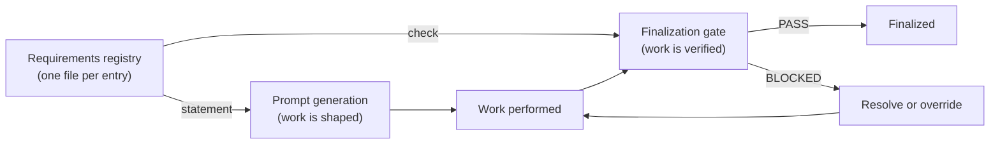

Today, requirements live only as prose scattered across the global rules file and individual skills. Prose requirements are unspecific and not reproducible: there is no machine-readable record of which formatting rules apply to a particular programming language, or which conventions a given repository must satisfy. Two memos touching the same language can apply the rules inconsistently because there is nothing authoritative to pull from. This chapter specifies requirements as a **declarative registry** — data, not prose — that drives both the generation of work and the gate that lets that work finalize.

A requirement is a single, addressable statement of something that must, should, or may hold for a piece of work. Because it is data, it can be pulled dynamically, scoped to the work at hand, diffed, and checked mechanically. The registry replaces the scattered prose with one authoritative source that every memo reads from at the moment it is needed, so a memo always sees the current requirements rather than a stale copy.

---

## The Two-Sided Model

Each requirement is **two-sided**. It carries both a human-readable `statement` of what is required and a machine-checkable `check` that decides whether the requirement is met. The two sides face in opposite directions:

- **`statement` → generation.** The requirement text feeds the prompt generator. It operates one level above the implementation: when work is being prompted, the in-scope requirement statements are surfaced as instructions, so the doer is told up front what is expected. The statement shapes the work before it is done.
- **`check` → gate.** The check drives a scope-matched finalization gate. Requirements that apply to the work in progress are collected, their checks run, and the work **MUST NOT** pass finalization while an applicable blocker check fails — unless an explicit, recorded override exists. The check verifies the work after it is done.

This is the eval-driven contract: a goal is declared as a requirement, that goal shapes generation, and once the goal is met its check becomes a standing regression gate. The same data both asks for the outcome and proves it.



---

## The Grade Axis (optional)

Beside `statement` and `check`, a requirement **MAY** carry an optional third axis: a `grade`. Where the `check` answers a binary question — is the requirement met or not — the `grade` answers a *how well* question, contributing a weighted dimension to a continuous quality score. Validation is the `check` in action; it is not a separate object. Grading is an optional layer on top: the rule of thumb is that a hard yes/no rule needs only a `check`, while a quality spectrum earns a `grade`.

The slot is **optional** — a requirement need not carry a `grade` at all (the schema leaves it out by default, and most entries do). When an author does engage it, it carries one of three honest states rather than an ambiguous blank:

| `grade` state | Meaning |
|---------------|---------|
| `{ dimension, weight }` | Real grading — the requirement contributes a named quality dimension, with a weight, to an aggregate score. |
| `binary` | Deliberately **no** score — a hard yes/no rule whose `check` is the whole story. |
| `todo` | A grade **belongs** here but is not yet written — a visible, harvestable work item, never a silent gap. |

The `todo` state is what the slot is *for* once it is engaged: a grade that is owed but not yet written is made **visible** rather than swallowed, the same "empty means an honest not-yet" principle the registry applies elsewhere. `grade` is one more optional key on the open entry schema — additive, never a breaking change. When the object form is used, the dimensions and weights feed the aggregate quality model — its scale, bands, production gate, and veto floor — specified in the grading model later in this chapter.

---

## Storage and Scale

The **target model is spec-as-source: the store is generated, not hand-maintained.** The authoritative requirement is the declaration authored prose-first into a spec chapter — its `statement`, its `check`, and its optional `grade`. A **harvest** step reads those inline declarations and generates the per-entry store under `.memo/_requirements/`, one file per entry, which the runtime then reads. In that end-state the arrow runs **spec → harvest → store → trigger**, not store → spec: the store is then a derived index rather than an independently maintained source.

> **Migration status — target model, not yet realized.** The spec → harvest → store direction above is the **normative target**, not a description of the present. Today the store is still largely authored directly — by skills and by hand — and **harvest is opt-in**: only the rules already lifted into inline spec declarations flow through it, while the rest of the store predates the harvest path and is in practice a co-authored source. The system is **migrating toward** the generated store one curated rule at a time; the prose-first guard removes drift for each rule as it is lifted, not retroactively for the whole store. Read the end-state as the direction of travel, not as a claim about the current store.

The store is a sibling of the memos under `.memo/` rather than a child of any single memo, so the generated set is shared across all memos of a project instead of trapped inside one. Because the store is generated rather than hand-maintained, it scales to hundreds of fine-grained entries without any single file becoming unmanageable: the curated rules live in the spec, and the store **MAY** additionally carry runtime entries that did not originate from a spec chapter.

Scope is **carried by the entry itself**, not by where the file sits. A `scope` object with three axes — `repos`, `categories`, and `tags` — plus a `when` trigger object decides which work an entry applies to. A scoped folder tree is a useful conceptual model for reasoning about the registry — global rules, per-repo rules, per-category rules, per-state rules — but the scope axes in the entry are authoritative. The folder layout is a lens onto the data; the data is the source of truth.

The intended conceptual tree:

```
_requirements/
  global/                 # applies to everything (for example: outward-facing language)
  repos/<repo>/           # applies to one repository
  categories/<category>/  # applies to one work category (readme, diagram, issue, …)
  states/<state>/         # applies to one workflow state
  <id>.req.json           # one file per entry; scope axes inside decide matching
```

### The Family Manifest Head

Each spec family declares a machine-readable head so tooling can read every family uniformly — a `spec.json` or a `spec-manifest.json` carrying one common, mandatory field set. That head, and the full structural field set every family satisfies, is specified in the Spec family (see its per-chapter-format chapter: [/spec/per-chapter-format/](/spec/per-chapter-format/)); it is normative there and is not restated here.

Two of the head's fields are what the requirements system reads:

- `hasRequirements` — whether the family authors its own requirements inline, which is the harvest source for this registry.
- `requirementsRef` — the chapter that hosts the family's requirement standard, or `null`.

A thin family resolves its requirements one of two ways, never both: it either carries **its own requirement series** in its own chapters (and points `requirementsRef` at them), or it **declares inheritance** — naming the host-family requirements it must satisfy — instead of duplicating a parallel series. The second is preferred where a family has no domain-specific rules of its own, because a cross-family coverage board can then read one set of obligations per family without double-counting. A family's own series uses its own id vocabulary; the shared `REQ-NNN` store holds the curated, harvested rules.

---

## Entry Schema

A requirement entry is an English-language JSON file. The fields are:

| Field | Required | Description |
|-------|----------|-------------|
| `id` | yes | Stable identifier, canonical form `REQ-NNN` (three digits; natural beyond 999). Identity is the **numeric value** — zero-padding is cosmetic, NOT a namespace, so `REQ-050` and `REQ-0050` are the same id and never coexist. Allocate the next free id with `memo req next-id` (one past the highest active number); `memo req lint` fails on any numeric collision. |
| `title` | yes | Short human name. |
| `statement` | yes | One-line human-readable description of what is required. This text flows **into prompt generation**. |
| `scope` | yes | Object with three array axes: `repos`, `categories`, `tags`. Decides which work the entry matches. |
| `when` | no | Trigger object: `worktype`, `effort`, `language`, `changetype` — each an array. Narrows applicability to specific working conditions. |
| `check` | yes | Object that decides whether the requirement is met. Drives the **gate**. See below. |
| `source` | yes | Where the requirement comes from, for example a skill reference such as `skill:node-formatting`. |
| `severity` | yes | One of `blocker`, `warning`, `info`. Governs how hard the gate enforces it. |
| `origin` | yes | One of `predefined`, `ai-added`, `evaluator-session` — how the entry entered the registry. |
| `grade` | no | Optional grade axis: the string `binary`, the string `todo`, or `{ dimension, weight }`. See **The Grade Axis** above. |
| `namespaceToken` | no | Parallel-spec uniqueness (optional, additive): a short per-spec token that, paired with `code`, forms the requirement's **global identity** — so a spec can be copied or paralleled without colliding on the shared `REQ` number space. When present it is typically the family manifest's `namespaceToken`. |
| `code` | no | Parallel-spec uniqueness (optional, additive): a human-stable code, scoped by `namespaceToken`. The pair `(namespaceToken, code)` is checked for global uniqueness; the maintenance gate fails on a duplicate pair. An entry that carries neither field is outside the namespaced set — the current, un-migrated default. |

The `check` object **MUST** declare a `kind`, one of:

| `check.kind` | Meaning | Typical fields |
|--------------|---------|----------------|
| `assertion` | Direct, deterministic assertions over code, state, or outcome. | `assertions` (list of conditions) |
| `tool` | Verified by running a named tool with a named tactic. | `tool`, `tactic`, `artifact`, `verify` |
| `evaluator` | Judged by a fresh-context evaluator against a rubric. | `rubric`, `verify` |
| `skill` | Delegated to a named skill that performs the check. | `skill`, `verify` |

A `check` **MAY** also declare `artifact` (a machine artifact the check produces or inspects), `presence` (`required` or `optional`), and `verify` (the steps a verifier runs). The `statement` drives what the work should be; the `check` drives whether it is. A `source` of `skill:…` records which skill the requirement originated from, and a `skill`-kind check records which skill verifies it — a requirement can both come from and be enforced by skills.

---

## Selection and Matching

Requirements are selected for a piece of work by a **deterministic** scope cascade evaluated at the moment of writing — one matcher, run consistently, so the same work always selects the same set.

The cascade runs from **broad to narrow**: global requirements first, then per-repo, then per-category and per-tag. Within a single scope axis, an empty array is a wildcard (matches everything on that axis) and a non-empty array matches by intersection. Across the three axes the result is an **AND**: an entry applies only when every populated axis matches the work.

When two requirements conflict, **specific beats general** — a repo-scoped requirement overrides a tag- or category-scoped one, which overrides a global one. The `when` triggers gate applicability further: a requirement with `when.changetype: ["readme"]` engages only when a README is being written, not on every edit. An override is **attribute-based** (declared on the entry), never position-dependent.

Matching **MUST** be deterministic by default. Fuzziness — glob, regex, or set-membership operators — is available only as an **opt-in** operator on a specific axis; it never changes the default exact-match behavior.

---

## Checks and Anti-Cheat

The gate distinguishes hard from soft enforcement by `severity`:

- A **`blocker`** is a hard gate. Its `check` **MUST** verify code, state, outcome, or a tool result — never the mere presence of a claim or a letter-of-the-law match, which invites reward-hacking. A failing blocker **short-circuits**: the gate stops and reports `BLOCKED`.
- A **`warning`** or **`info`** requirement layers softer evidence (a rubric or an evaluator judgment) and **SHOULD** be surfaced without blocking finalization.

Every check resolves to a **ternary** status — `PASS`, `BLOCKED`, or `INCONCLUSIVE`. A check that did not actually run reports `INCONCLUSIVE`; it **MUST NOT** silently report `PASS`. Every check **SHOULD** emit a machine artifact (a file list, an exit code, a state hash) as its evidence, so a result can be reproduced rather than trusted.

The **doer is not the grader**. The agent that performs the work **MUST NOT** be the agent that verifies it. Verification runs in a **fresh context** by a separate verifier, adversarially, so that the proof of a requirement is independent of the work that claimed to satisfy it.

---

## Workflow States

A requirement's force depends on the workflow state of the work it applies to. The registry recognizes four states:

| State | Role of requirements |
|-------|----------------------|
| Intense research | Internal requirements gather evidence first; research precedes opinion. A top-tier model is `must` here. |
| Memo creation | Requirements are added and discussed as the memo is authored and revised. |
| Rollout | Requirements are observed while the work is executed. |
| Finalization | Requirements are **binding** — the gate hands off here, and applicable blockers must pass. |

Requirements may be added or discussed at any earlier state; they become enforceable at finalization. Up to that point a requirement is a proposal that shapes generation; at finalization it is a condition the work must meet.

---

## Multi-Level Requirements

Requirements apply at several granularities, selected through the same scope axes:

| Level | Example scope | Example requirement |
|-------|---------------|---------------------|
| Single repo | `scope.repos: ["spec"]` | A LICENSE file is present; CI is green on the default branch. |
| Repo class | `scope.tags: ["public"]` | No secrets, including public tokens; an organization profile soll-set is satisfied. |
| README | `scope.categories: ["readme"]` | Required README sections exist; badges resolve. |
| Node module | `scope.categories: ["node-module"]`, `when.language: ["node"]` | 4-space indentation, no semicolons, `.mjs` ES modules. |
| Diagram | `scope.categories: ["diagram"]` | Diagram labels are in the artifact's language; the diagram type fits the data flow. |
| Blog-style text | `scope.categories: ["blog"]` | One language per artifact; a readable, structured prose style. |

A higher-level requirement (global, or a repo class) sets a baseline; a narrower one **MAY** tighten it but **MUST NOT** silently weaken it. When both apply, the broad baseline is read first and the narrow entry layered on top.

---

## Skills Declaring Requirements

A skill **MAY** declare and register requirements. When a skill encodes a rule that should hold for the work it governs, it can emit that rule as a registry entry whose `source` names the skill (for example `skill:repo-issue` for issue-writing requirements, or `skill:get-sheet` for spreadsheet work). This lets a skill add enforceable, scoped checks without changing the core gate set: the skill declares the rule as data, and the data becomes both a generation instruction and a gate. Skill-declared requirements participate in the same scope cascade and the same ternary checks as predefined ones; they are distinguished only by their `origin` and `source`.

---

## Verification Scoring and Confidence

Because checks are ternary and evidence-backed, a set of requirements yields a **score** rather than a single pass/fail bit. For a piece of work, the gate reports how many applicable blockers passed, how many warnings were raised, and how many checks were `INCONCLUSIVE`. An `INCONCLUSIVE` result lowers **confidence** without falsely raising or lowering the pass rate — it signals that a requirement could not be proven, which is treated as a gap to close, not a silent success.

A requirement set thereby doubles as an **eval set**: it is the explicit definition of what the work is being optimized against. The score tells the author both whether the work is acceptable and how much of that judgment rests on solid machine evidence versus checks that did not conclusively run.

---

## The Grading Model

> **Build status — referenced, not yet built (for requirements).** The scoring head described in this section — the continuous **1.0–5.0** scale, the bands, the **production gate 3.5**, the veto floor, the `GR-` codes, and the `checkMode` tiers — is **specified by reference, not yet implemented** for the *requirements* grading head. The requirement schema today carries only the optional `grade` axis (`binary` / `todo` / `{ dimension, weight }`); no code computes bands, enforces a numeric gate, assigns `GR-` codes, or runs `checkMode` tiers *for requirements*. This not-yet-built note is scoped to requirement grading only: the separate **executable skill grader** ([43-skill-authoring-and-quality.md](/specification/skill-authoring-and-quality/)) DOES implement skill-level grading (a shipped `gradeSkill()` with a ternary PASS/BLOCKED/INCONCLUSIVE), and is not governed by this note. Treat this section as the **target** grading contract the requirements system imports by reference and builds against — not as a gate that runs today.

When a requirement carries an object `grade` (the grade axis above), its dimension feeds a shared **grading model** — one reusable scoring head that every family follows, rather than each domain re-inventing its own. The model is deliberately the same discipline already proven in a sibling content-grading specification; it is summarised here as the common head and imported by reference, not copied.

**Weighted, continuous scale.** A grade is a weighted sum of named **dimensions** on a continuous **1.0–5.0** scale. The applicable dimension weights **MUST** sum to 100%. A dimension that does not apply to a given work type is **dropped and its weight redistributed** across the rest — never scored as a failure, so an inapplicable axis cannot silently sink a score.

**Bands and the production gate.** The aggregate maps to honest bands:

| Band | Range |
|------|-------|
| Exemplary | 5.0 |
| Strong | 4.0–4.9 |
| Production-ready | 3.5–3.9 |
| Needs work | 2.5–3.4 |
| Failing | 1.0–2.4 |

In the target model the **production gate is 3.5**: work scoring below it is not production-ready, and a family **MAY** set a stricter gate but **MUST NOT** lower it below 3.5. This numeric gate is **not yet wired into finalization** — finalization today runs the binary quality gate of [11-quality-and-finalization.md](/specification/quality-and-finalization/), not a 1.0–5.0 score (see the build-status note above).

**Veto through the scale, not beside it.** There is no separate fail flag. A `CRITICAL`-severity miss **floors its dimension to 1.0**; because one floored weighted dimension drags the aggregate under the gate on its own, the single weighted sum is the only source of the verdict.

**Two check tiers.** Each grading point declares a `checkMode`: **`deterministic`** (decided by code or CI — cheap, reproducible) or **`judged`** (decided by an evaluator against a rubric in a **fresh context**; a judged result **MUST** be stamped with the grader identity and model). The doer is not the grader, exactly as for the ternary checks above.

**Calibration honesty.** Weights and band cut-offs are assumptions until calibrated against a labelled corpus. An uncalibrated weight **MUST** be marked `provisional`; freezing a weight set as final **REQUIRES** a stated calibration basis. A grade audits the *direction* a rule points, not an unverified absolute threshold.

**Codes and namespace qualification.** A grading point carries a stable code of the form `GR-<SUBCAT>-<NNN>` — the `GR-` facet marks it as grading, so it never collides with a `REQ-` id even on the same entry. Across families a code is qualified by the family's globally-unique `namespaceToken` (for example `MC:GR-<SUBCAT>-<NNN>`), which is how a thin family imports the shared head and references core's points without collision.

**Importing the head.** A family turns grading on through its manifest `gradingRef` (see *The Family Manifest Head*). A **thin** family sets `gradingRef` to the chapter that hosts this model, imports the whole head — scale, bands, gate, veto, tiers, calibration — and declares only the dimensions it adds. A **rich** family keeps its own domain dimensions but still follows this model. The domain scoring chapters reuse this head rather than restating it: goal scoring ([31-goals.md](/specification/goals/)), maintenance scoring ([33-maintenance.md](/specification/maintenance/)), and the implementation-fidelity audit ([45-implementation-fidelity-audit.md](/specification/implementation-fidelity-audit/)) each keep only their domain axis and point here for the shared contract.

**A rich external special case is referenced, not absorbed.** A separate, directory-versioned grading system exists for the external tool-schema domain, with its own executable harness and status model. It is **referenced** as a special case, not generalised into this head and not its blueprint: this model **MAY** additionally grade that domain as a requirement, but that system's internal grading is not pulled in, and its executability is not assumed transferable here.

---

## Conformity Requirements

The requirement model described above is itself governed by binding rules, and those rules are authored here the same prose-first way every family authors its conformance ([35-memo-authoring.md](/specification/memo-authoring/)): each block's `statement` faces generation — it shapes how a requirement entry, a matcher, or a runner is built — and its `check` faces the finalization gate, verifying a built artifact with a ternary `PASS` / `BLOCKED` / `INCONCLUSIVE`. The structured blocks below are the machine-readable source the per-entry store is **harvested** from; they make the requirement model satisfy its own contract.

An entry is well-formed only against the schema — required fields, the `id` pattern, and the three scope axes — so the first rule is a hard structural gate (`grade: binary`):

```requirement
{
  "id": "REQ-840",
  "title": "Requirement entry conforms to the entry schema",
  "statement": "A requirement entry MUST conform to the entry schema: it MUST carry the required fields (`id`, `title`, `statement`, `scope`, `check`, `source`, `severity`, `origin`); its `id` MUST match the pattern `REQ-NNN` (three or more digits); and its `scope` MUST declare the three array axes `repos`, `categories`, and `tags`, where an empty array is the wildcard 'all'.",
  "scope": { "repos": ["core"], "categories": ["evals"], "tags": ["requirement-model", "schema"] },
  "severity": "blocker",
  "check": {
    "kind": "assertion",
    "assertions": [
      "Validating an entry against the requirement schema reports no missing-field error",
      "The `id` matches the pattern `REQ-` followed by three or more digits",
      "`scope` carries `repos`, `categories`, and `tags`, each an array, where an empty array means wildcard"
    ]
  },
  "grade": "binary"
}
```

A `check` is meaningful only when its `kind` brings its required subfields, so the kind-and-subfields pairing is its own gate (`grade: binary`):

```requirement
{
  "id": "REQ-841",
  "title": "check declares a valid kind with its required subfields",
  "statement": "Every entry's `check` MUST declare a `kind` of `assertion`, `tool`, `evaluator`, or `skill`, and MUST carry the subfields that kind requires: `assertion` requires a non-empty `assertions`; `tool` requires `tool` and `tactic`; `evaluator` requires `rubric`; `skill` requires `skill`, `artifact`, and `verify`.",
  "scope": { "repos": ["core"], "categories": ["evals"], "tags": ["requirement-model", "schema"] },
  "severity": "blocker",
  "check": {
    "kind": "assertion",
    "assertions": [
      "`check.kind` is one of assertion, tool, evaluator, skill",
      "An assertion check carries a non-empty `assertions`; a tool check carries `tool` and `tactic`; an evaluator check carries `rubric`; a skill check carries `skill`, `artifact`, and `verify`"
    ]
  },
  "grade": "binary"
}
```

Selection must be reproducible, so the three-axis matcher is constrained to be deterministic — a hard yes/no rule (`grade: binary`):

```requirement
{
  "id": "REQ-842",
  "title": "Requirement selection is a deterministic three-axis match",
  "statement": "Requirement selection MUST be a deterministic three-axis match: within a single axis an empty `scope` array is a wildcard and a non-empty array matches by exact-value intersection (never substring); across the three axes the result is an AND, so an entry applies only when every populated axis shares at least one value with the work context. A fully empty scope MUST match every context.",
  "scope": { "repos": ["core"], "categories": ["evals"], "tags": ["requirement-model", "matching"] },
  "severity": "blocker",
  "check": {
    "kind": "assertion",
    "assertions": [
      "Re-running the matcher on the same entry and the same work context yields the same membership decision",
      "An entry with an empty axis matches any value on that axis; a populated axis matches only by exact intersection",
      "An entry whose scope is empty on all three axes matches every context"
    ]
  },
  "grade": "binary"
}
```

Every result must be honest about whether it actually ran, so the ternary-status and machine-evidence rule is a blocker (`grade: binary`):

```requirement
{
  "id": "REQ-843",
  "title": "Every check resolves to a ternary, evidence-backed status",
  "statement": "Every check MUST resolve to a ternary status — `PASS`, `BLOCKED`, or `INCONCLUSIVE` — and MUST report `INCONCLUSIVE`, never `PASS`, when the check could not actually run. Each check SHOULD emit a machine artifact (a file list, an exit code, or a state hash) as reproducible evidence, and the runner MUST separate claim from evidence: only the machine sets the status, never a worker-supplied summary.",
  "scope": { "repos": ["core"], "categories": ["evals"], "tags": ["requirement-model", "runner"] },
  "severity": "blocker",
  "check": {
    "kind": "assertion",
    "assertions": [
      "A check result status is one of PASS, BLOCKED, INCONCLUSIVE",
      "A check that did not execute reports INCONCLUSIVE, not a default PASS",
      "The runner derives status from machine evidence read from real repo state, not from a worker-supplied claim"
    ]
  },
  "grade": "binary"
}
```

Whether the verifier was independent of the doer is a process judgment, so the anti-cheat separation is checked by a fresh-context evaluator (`grade: binary`):

```requirement
{
  "id": "REQ-844",
  "title": "The doer is not the grader",
  "statement": "Verification MUST run independently of the work it checks: the agent that performed the work MUST NOT be the agent that verifies it. Applicable checks are run adversarially in a fresh context by a separate verifier, so the proof of a requirement does not rest on the work that claimed to satisfy it.",
  "scope": { "repos": ["core"], "categories": ["evals"], "tags": ["requirement-model", "anti-cheat"] },
  "severity": "blocker",
  "check": {
    "kind": "evaluator",
    "rubric": "A fresh-context reviewer confirms the verifier that produced a requirement's result was a separate agent from the one that produced the work, running with no inherited context. PASS when verification provenance shows an independent fresh-context verifier; BLOCKED when the doer graded its own work; INCONCLUSIVE when provenance could not be established.",
    "verify": [
      "Inspect the run provenance for the requirement's result",
      "Confirm the verifier context is distinct from the doer context"
    ]
  },
  "grade": "binary"
}
```

The store must survive a gate run untouched and rebuild reproducibly, so append-safety and idempotent harvest are one blocker (`grade: binary`):

```requirement
{
  "id": "REQ-845",
  "title": "The per-entry store is append-safe and idempotently harvested",
  "statement": "The per-entry store under `.memo/_requirements/` MUST be append-safe: the gate and the runner MUST NOT overwrite or delete a `.req.json` (NO-OVERWRITE / NO-DELETE), writing only their own report artifacts. The harvest and index generation that build the store MUST be idempotent and deterministic — running them twice over an unchanged source produces a byte-identical result with a stable sort by `id`.",
  "scope": { "repos": ["core"], "categories": ["evals"], "tags": ["requirement-model", "store"] },
  "severity": "blocker",
  "check": {
    "kind": "assertion",
    "assertions": [
      "After a gate or runner pass, the set of `.req.json` files is byte-identical before and after",
      "Running harvest and index generation twice over unchanged input yields a byte-identical store",
      "Store entries are sorted deterministically by `id`"
    ]
  },
  "grade": "binary"
}
```

---


<!-- IMPLEMENTED-BY — rendered backlink lives in the dist (generated/bridge/<family>/<stem>.backlink.md); source stays authored-only (F2 Dist-Split) -->
## Related

- [24-tools-registry.md](/specification/tools-registry/) — the parallel data folder; `check.kind: tool` requirements point into the tools registry for the tool and tactic that verify them.
- [11-quality-and-finalization.md](/specification/quality-and-finalization/) — the finalization gate that runs applicable requirement checks and binds them.
- [00-overview.md](/specification/overview/) — spec scope, conformance, and the document index.
- [30-primitives.md](/specification/primitives/) — central glossary and concept map; the requirement primitive summarized as cross-cutting.
