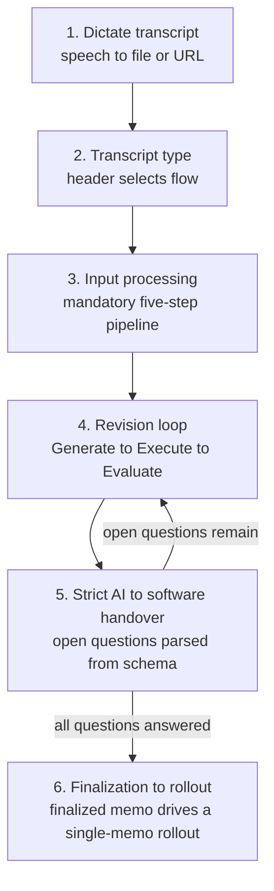

`memo-sop` is the canonical entry skill of the memo system: the one document that explains the whole process end to end. It is one instance of the common SOP standard ([the Session spec's SOP area](/session/sop/)) that it **extends** — the chapters below are how the memo system realizes that standard's Setup, Health, and Update for the memo scope. This chapter defines what makes it the single source of truth, why it is the re-entry point after any loss of session context, and how it classifies every other skill as a public entry point or a private process step.

## The Single Source of Truth

`memo-sop` is the **canonical entry skill** of the memo system. It is the one document that explains the entire process end to end: the path from a dictated transcript to an executed rollout, the state transitions along the way, the hierarchy of every other skill, and the terminal-output standards. Every other memo skill references it and follows its process.

An agent that needs to understand the memo workflow MUST load `memo-sop` first. It is the document that explains everything; the other skills are children of it. This is the same precondition the deterministic skill chain enforces elsewhere (`memo-init` requires `memo-sop`); the intake tooling SHOULD make it **visible at the entry point** — the memo-view init-transcript template and its API response surface a "precondition: `memo-sop` loaded" hint, so the requirement is stated where a memo actually begins, not only buried in a skill chain.

On the published website, `memo-sop` SHOULD be the first documentation entry after the landing page, because it is the door through which a reader enters the system.

Initialization and the revision loop are a **bidirectional conversation** between the developer and the AI — an alignment process, not a one-way command. The developer states intent, the AI reflects its interpretation back, and the two iterate until the memo expresses a shared understanding. Significant initial energy goes into proper initialization: a well-aligned memo at the start is what makes the later autonomous stages safe to run without a per-step trigger.

---

## The Re-Entry Point

The memo workflow spans sessions. A long rollout may cross a context reset, a crash, or a closed terminal. `memo-sop` is the **re-entry point**: after any loss of session context, an agent re-orients by reading `memo-sop` together with the on-disk task list and state files (see [13-orchestration.md](/specification/orchestration/)).

Because finalized memos are optimized for in-context learning, an empty agent context MUST be able to read the canonical entry point and the memo's own entry-points and resume work without prior conversation history. Re-entry MUST NOT depend on the contents of the lost session.

---

## The Four Verbs

The SOP organizes the whole system under four verbs. All four are public entry points that the developer triggers directly. The Revise verb is the developer-triggered **re-entry** into the revision loop ("here is revision X"); once re-entered, its internal Generate → Execute → Evaluate loop then runs autonomously, without a per-step trigger.

| Verb | Visibility | Meaning |
|------|------------|---------|
| **Initialize** | public | Create a memo / place a transcript. |
| **Revise** | public (re-entry) — loop then autonomous | Re-enter the revision loop with new feedback ("here is revision X"); the Generate → Execute → Evaluate loop then runs autonomously, without a per-step trigger. |
| **Finalize** | public | Close the memo. MUST be developer-triggered; the AI MUST NOT finalize autonomously. |
| **Execute** | public | Roll out a finalized memo — a single-memo run straight through its phases. |

The public entry points validate strictly and set the switches — like the public functions of a module — while the remaining skills are private process steps. Their trigger words are chosen to be mutually exclusive: no single trigger activates two entry points at once. The Revise re-entry promotes only `memo-revision-generate` to public; the loop's `memo-revision-execute` and `memo-revision-evaluate` stay internal.

---

## The End-to-End Path

The SOP documents the complete path in six steps. The steps are listed here for orientation; each is specified in detail in the chapter named in the last column.



| Step | Name | What happens | Specified in |
|------|------|--------------|--------------|
| 1 | Dictate transcript | The developer produces a transcript (speech → file or URL). | [03-input-paths.md](/specification/input-paths/) |
| 2 | The four transcript types | A type header determines the follow-up flow. | [03-input-paths.md](/specification/input-paths/) |
| 3 | Input processing | The mandatory five-step pipeline runs before any memo work. | [04-input-pipeline.md](/specification/input-pipeline/) |
| 4 | Revision loop | A revision enters the Generate → Execute → Evaluate loop. | [07-revisions-and-questions.md](/specification/revisions-and-questions/) |
| 5 | Strict AI→software handover | Open questions are parsed from a machine-readable schema. | [07-revisions-and-questions.md](/specification/revisions-and-questions/) |
| 6 | Finalization → rollout | The finalized memo drives a single-memo rollout. | [11-quality-and-finalization.md](/specification/quality-and-finalization/), [12-rollout.md](/specification/rollout/) |

A finalized memo is carried into execution through the **rollout** — a single finalized memo worked straight through its phases in one autonomous run, entered through the public `memo-rollout` entry point. A rollout is, in effect, **a plan with one memo**: the multi-memo **plan layer** that once sat above the rollout is **deprecated**. It was never used — no plans were ever created, while the single-memo rollout carried every execution — so the rollout, not the plan, is the real execution machine. The plan layer's one non-duplicative capability, the budget wake-up, is **lifted down into the rollout** ([12-rollout.md](/specification/rollout/)). This deprecation does not change the six steps above; it settles how step 6 is carried out — always as a single-memo rollout.

Across its life a memo runs in exactly two **arcs**: **Create** — the interactive first arc, spanning steps 1–5 and finalization, where the developer's judgement is spent — and **Rollout** ([12-rollout.md](/specification/rollout/)), the autonomous second arc that carries the finalized memo through step 6. An *arc* names one of the two parts of a memo's life; it is deliberately distinct from a *step* (one of the six above), a *stage* (one of the four end-stages), and a *phase* (a unit inside a rollout). It is also not the per-transcript *context mode* of [03-input-paths.md](/specification/input-paths/), which chooses empty vs in-thread context.

> **Four counts, four nouns — do not conflate them.** The memo path's **six steps** here are distinct from the **two arcs** a memo's life runs in (Create and Rollout, above), from the **four stages** of the end-of-process model ([38-stage-model.md](/specification/stage-model/)), and from the **eight principles** of the CLI doctrine. Four separate enumerations, each bound to its own noun — *steps* (the memo path), *arcs* (a memo's two-part life), *stages* (the process end), *principles* (the CLI) — and "stage" is reserved for the four-stage model alone, just as "phase" is reserved for the rollout's phases.

---

## Public / Private Skill Architecture

The SOP classifies every skill as either a public entry point or a private process step. The goal is **few** public skills, easy to find, each with distinct trigger words; everything else stays private.

| Class | Role | Examples |
|-------|------|----------|
| **Public** | Developer entry points. Validate strictly, set switches. | `memo-init` (Initialize), `memo-revision-generate` (Revise re-entry), `memo-finalize` (Finalize), `memo-rollout` (Execute) |
| **Private** | Internal process steps, invoked by the public entry points. | the revision loop's `memo-revision-execute` / `memo-revision-evaluate` steps, the quality skills, and the rollout machinery beneath `memo-rollout` (its generate / execute / evaluate sub-skills and the phase and PRD steps) |

This classification drives **progressive disclosure**: public memos and skills are the visible UI entry points, shown so a reader can find the doors into the system; internal memos and skills are linked from the public ones but not displayed up front. A reader sees the few entry points first and reaches the private process steps only by following a link.

Named in full, the memo system exposes exactly **four public skill entry points** — `memo-init` (Initialize), `memo-revision-generate` (Revise re-entry), `memo-finalize` (Finalize), and `memo-rollout` (Execute) — alongside two non-skill surfaces: the **memo-view API routes** and the **CLI**. Those are the doors into the system; everything else is reached through them. There is no public `memo-plan` door: the multi-memo plan layer is deprecated, so the earlier `memo-plan` entry point — which never had a skill file — is retired rather than left dangling.

---

## Skill-Map Role Hints (`roleHint`)

The skill-to-spec map (`draft/memo/0.2.0/data/skill-spec-map.json`) carries an optional `roleHint` field on each skill entry. This field is an **ADD-only** marker that the bridge generator and downstream tooling consume to select authoritative skills for specific roles. When `roleHint` is absent, the generator falls back to a heuristic and marks the result `inferred`.

Two values are defined:

| `roleHint` value | Meaning | Applied to |
|---|---|---|
| `"public-entry"` | The skill is a **developer-triggered public entry point** — one of the few doors through which a developer enters the memo system. These skills validate strictly, set the switches, and MUST read `memo-sop` before any work proceeds (REQ-800). | `memo-init` (Initialize), `memo-revision-generate` (Revise re-entry), `memo-finalize` (Finalize), `memo-rollout` (Execute — the lived single-memo execution path) |
| `"grader"` | The skill is responsible for **grading or scoring** a memo artifact (goals, maintenance health, fidelity, etc.). The bridge uses the grader marker to assign grading responsibility unambiguously; without it the generator infers a grader from the skill's category or name and marks the result inferred. | `memo-goal-score`, `memo-goal-score-all`, `memo-maintenance-score`, `memo-maintenance-score-all`, `memo-fidelity-audit`, and similar scoring skills |

### The Four Canonical Developer-Triggered Entry Points

The memo system exposes exactly four canonical developer-triggered skill entry points. Each maps to one of the Four Verbs (see above):

| Verb | Skill | `roleHint` | Note |
|---|---|---|---|
| Initialize | `memo-init` | `public-entry` | Creates a memo from a transcript or intent. |
| Revise | `memo-revision-generate` | `public-entry` | Re-enters the revision loop with new feedback ("here is revision X"); the Generate → Execute → Evaluate loop then runs autonomously. Only `memo-revision-generate` is public; `memo-revision-execute` / `memo-revision-evaluate` stay internal. |
| Finalize | `memo-finalize` | `public-entry` | Closes the memo; MUST be developer-triggered (never autonomous). |
| Execute | `memo-rollout` | `public-entry` | Rolls out a single finalized memo through its phases — the lived execution path. The multi-memo plan layer (`memo-plan`) is **deprecated** and was never used; a rollout is a plan with one memo, and no dangling public `memo-plan` entry point remains. |

`memo-sop` is also marked `roleHint: "public-entry"` in the map as the **canonical reference entry** — it is the SOP document a developer (or agent) loads first to understand the whole system, and the bridge SOP-flow graph uses it as the anchor. It is not a developer-triggered verb in the Four Verbs sense but is the required pre-flight for all four verb skills (REQ-800).

The `requires` field on a skill entry documents which other skills MUST be loaded or run first. For the four public entry-point skills, `requires: ["memo-sop"]` expresses the REQ-800 pre-flight mandate at the data layer, making the dependency machine-readable and checkable by the spec consistency gate.

---

## Conformity Requirements

The entry-point rules above are authored **prose-first** as declarative requirements (the prose-first guard, [35-memo-authoring.md](/specification/memo-authoring/) and [23-requirements.md](/specification/requirements/)): each rule's `statement` faces generation and its `check` faces the finalization/push gate, resolving to a ternary `PASS` / `BLOCKED` / `INCONCLUSIVE`. The blocks below are the machine-readable source the requirement store is **harvested** from.

The pre-flight precondition is a hard yes/no condition — its `check` is the whole story, so its `grade` is `binary`:

```requirement
{
  "id": "REQ-800",
  "title": "memo-sop is read before any work at every public entry point",
  "statement": "Each public memo entry point — Initialize (`memo-init`), Revise (`memo-revision-generate`), and Execute (`memo-rollout`) — MUST verify as its very first step that `memo-sop` has been read in the current session; if it has not, `memo-sop` is read first and only then does work proceed (a fail-loud pre-flight gate). The gate MUST read a structured session signal, never a substring match over influenceable text.",
  "scope": { "repos": [], "categories": ["memo"], "tags": ["memo-sop"] },
  "severity": "blocker",
  "check": {
    "kind": "assertion",
    "assertions": [
      "memo-init, memo-revision-generate, and memo-rollout each carry a pre-flight step that requires memo-sop before any further work",
      "The precondition is decided from a structured session signal, not from a substring scan over influenceable text"
    ]
  },
  "grade": "binary"
}
```

The few-public-doors discipline is a structural property of the skill set — checkable against the declared trigger words, again a hard rule (`grade: binary`):

```requirement
{
  "id": "REQ-801",
  "title": "Public entry-point trigger words are mutually exclusive",
  "statement": "The memo system MUST expose a small, fixed set of public skill entry points — Initialize, Revise, Finalize, and Execute — whose trigger words are mutually exclusive: no single trigger word activates two entry points at once. Every other memo skill is a private process step reached only through a public entry point, never triggered directly.",
  "scope": { "repos": [], "categories": ["memo"], "tags": ["memo-sop", "entry-points"] },
  "severity": "warning",
  "check": {
    "kind": "assertion",
    "assertions": [
      "Exactly the four public entry points declare developer-facing trigger words; all other memo skills are marked private",
      "The trigger-word sets of the public entry points are pairwise disjoint"
    ]
  },
  "grade": "binary"
}
```

---


<!-- IMPLEMENTED-BY — rendered backlink lives in the dist (generated/bridge/<family>/<stem>.backlink.md); source stays authored-only (F2 Dist-Split) -->
## Related

- [01-philosophy.md](/specification/philosophy/) — why the SOP defines the guardrails.
- [03-input-paths.md](/specification/input-paths/) — the four transcript types the SOP routes on.
- [11-quality-and-finalization.md](/specification/quality-and-finalization/) — the developer-triggered finalize verb.
- [13-orchestration.md](/specification/orchestration/) — state and crash recovery behind re-entry.
