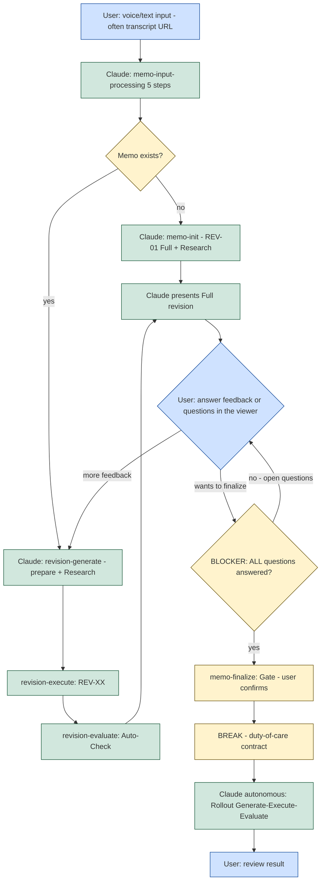

The interaction model fixes the **two points** where the user touches the system — input and feedback/finalization — and the autonomous span in between. Before finalization, the user's judgement steers the memo: input, feedback, answering questions. After the finalization gate, the rollout runs autonomously to completion. The model also fixes the hard rule that closes the gate: **as long as any question is open, finalization is blocked.**

---

## The Interaction Diagram

The following flowchart is the canonical reference for the interaction model, including the `:::` class assignments and the `classDef` lines.



---

## Where the User Interacts

User interaction has exactly two points: **input** at the start, and **feedback/finalization** during the revision loop. Everything between is autonomous.

- **Input** — the user supplies a voice or text input (often a transcript URL). Claude runs `memo-input-processing` and, depending on whether a memo already exists, either initializes it or generates the next revision.
- **Feedback / finalization** — the user reads the presented Full revision in the viewer, gives further feedback (which loops back into a new revision), or answers open questions, and finally decides to finalize.

Only **Full** revisions are presented to the user (see [20-flow-full-vs-update-revisions.md](/specification/flow-full-vs-update-revisions/)). Between the two interaction points, Claude works autonomously: input processing, research, revision generation, execution, and the auto-check.

**Questions stay essential.** The two touchpoints are deliberately minimal but high-value: minimal contact, maximally important. They are the place where the developer's taste and long view enter the work, because within the guardrails there are usually many valid paths and the choice between them belongs to the developer. As the agent learns to pre-think more over time it raises the quality of the questions rather than abolishing them — there are always questions left, and the developer holds the ultimate right of decision. The positive stance behind this is set out in [01-philosophy.md](/specification/philosophy/).

---

## The Finalization Blocker

The finalization gate is guarded by a hard blocker on open questions.

> Finalization MUST be refused while **any** question is open. The gate MUST open only once **all** questions are answered. An implementation MUST NOT allow `memo-finalize` to proceed while one or more open questions remain.

In the diagram this is the `Q{BLOCKER: ALL questions answered?}` node: when questions remain open (`no - open questions`) control returns to the user to answer them; only on `yes` does control pass to the finalization gate, where the user confirms.

After confirmation, the `BREAK - duty-of-care contract` is shown, and from there the rollout (Generate → Execute → Evaluate) runs **autonomously, without further questions** (see [12-rollout.md](/specification/rollout/)). The user's next interaction is only to review the result.

---

## The Three Communication Layers

Communication in the system runs across **three layers**, and they are a *communication topology*, not a work cycle:

```
User  ──Protocol A (Trust Layer)──▶  Orchestrator  ──Protocol B (start-prompt)──▶  Worker
```

- **User ↔ Orchestrator (Protocol A).** The trust layer: the orchestrator (the main loop) is the user's single channel. How it speaks to the user is governed by the Trust-Layer convention in [19-internal-vs-external-communication.md](/specification/internal-vs-external-communication/).
- **Orchestrator ↔ Worker (Protocol B).** The orchestrator hands work to a worker via a deterministically composed start-prompt ([15-prompt-generator.md](/specification/prompt-generator/)). A worker is any of the three agent-execution primitives ([14-agents-skills-tasks.md](/specification/agents-skills-tasks/)); it cannot address the user directly — everything it returns reaches the user only through the orchestrator.

**G→E→E is not the layer topology.** The Generate → Execute → Evaluate cycle is a *work cycle that runs at a layer*; the three layers are the *communication topology between participants*. They are related but distinct concepts and MUST NOT be conflated — G→E→E describes how a unit of work proceeds, the three layers describe who talks to whom.

**Three layers are enough; the fourth is deferred.** A separate **Communicator** agent (a fourth layer) is **not** technically required to keep the user's terminal clean: a worker never leaks its intermediate output to the user automatically, and the orchestrator already has dedicated surfacing primitives (below). The "Communicator" is therefore a **discipline of the orchestrator**, not a fourth agent. A genuine fourth layer earns its place only when several orchestrators run in parallel and their reports must themselves be marshalled — deferred until then.

---

## Staying in the Loop — Clean-Terminal Surfacing

During the autonomous span (after the duty-of-care break), the user must be able to *step away and come back* and still know what happened, without being buried in text. The orchestrator keeps the main thread clean and surfaces only what matters, on a recurring cadence or on a concrete event. The mechanisms (all available to the orchestrator, distinct from the conversation thread):

- **Surface-only output contract** — the default is an *empty* user thread; surfacing a line is a deliberate per-event decision, never a dump of everything the workers said. This is the binding invariant (see [19-internal-vs-external-communication.md](/specification/internal-vs-external-communication/)).
- **Event channel** — a background watcher with a narrow match pattern emits a single line when a risky/notable state occurs (a mass move to trash, a test break, drift). A clean one-line signal is exactly what makes a silent disaster visible the moment it happens.
- **Cadence channel** — a session timer enqueues one condensed status line every few minutes, so "staying in the loop" does not mean watching a stream.
- **Attention channel** — an out-of-band notification, used sparingly, only for "the user wants to know this now" (a run finished, a decision is needed).
- **Workflows for large runs** — when dozens of agents are needed, a script-driven workflow keeps the main thread clean by construction (its progress lives in a separate panel, one report at the end), so the clean-terminal property is free.

---

## Two Output Channels — The Reply Channel vs the State Channel

Output in the system flows on **two distinct channels**, and they MUST NOT be confused. The distinction decides *where* the human-facing overview is rendered, and it is the difference between an overview the user actually sees and one that disappears into a collapsed tool log.

- **The reply channel (R1).** Everything meant for the human — status lines, overviews, boards — is rendered as **markdown directly in the agent's reply**. This is the channel the user reads. A markdown table in the reply renders as a visible table; the human sees the overview at a glance, without expanding anything.
- **The machine / state channel.** Shelling out to a command (Bash/CLI), reading a state file, or piping JSON through a tool is how the agent *obtains* the data. Its raw `stdout` lands in the collapsed, often-invisible tool area. This channel is for the machine, not for human-facing display.

The binding rule follows from the split:

> Every status / overview / board output MUST be presented as markdown **in the agent's reply** (the R1 channel) and MUST NOT be produced by shelling out to a command for display. Fetching the underlying data via a command is allowed; the human-facing table is then **mirrored** into the reply as markdown.

Concretely, the **goal board** and the **maintenance board** are always presented in the reply: the agent may fetch their data via a command (for example, a scoring CLI emitting JSON), but the board the user reads is the markdown table in the reply — **never** a raw shell dump. Using `echo`/`printf`/`cat`/a raw JSON dump as the *sole* status output is the anti-pattern: it vanishes into the tool area. The correct shape is always *fetch with the command, render the table in the reply*. This applies equally to the surfacing during the autonomous span: surfacing a line is a deliberate per-event decision in the reply channel, never a dump of everything a worker said (see the surface-only contract above).

---

## The Context/UI Axis — Injecting into the Model vs. Rendering for the Human

The reply/state split above decides *where the agent renders its own output*. A second, **orthogonal** axis decides something sharper — **whether a human-facing signal enters the model's context at all** — and it runs between the two tiers of the system. This axis MUST NOT be collapsed into the reply/state distinction: a signal can be human-facing on either side, but only one side costs the model context.

- **Context-injection — the session tier.** The session tier writes **tokens into the model's context**: the operating material the agent actually reads and reasons over (injected project memory, a read-receipt, a surfaced status line). Everything on this side *costs context* — it is paid for in the model's attention and it shapes the next step of the run.
- **UI-rendering — the workbench tier.** The workbench tier renders a **human-facing UI element** — a status badge, a freshness marker, a greyed-out or disabled affordance — that a **human reads but the model never sees**. It makes state visible *to the person* without entering the model's context: it costs no tokens and cannot steer the agent, because the agent is not looking at it.

The two are not competing renderings of one thing; they answer different questions. Context-injection answers "what must the agent read to act?"; UI-rendering answers "what must the human see to stay oriented?". Holding them apart is exactly what lets state be shown to the user **without polluting the thread the model works in** — the same clean-thread discipline the surface-only output contract enforces on the reply channel (see [19-internal-vs-external-communication.md](/specification/internal-vs-external-communication/)). The default direction is therefore one-way: the workbench renders UI, and that UI stays *out* of the model's context.

**The reverse-channel — the UI→session direction, done deliberately.** The default is one-way, but there is a deliberate exception that runs the other way. The **reverse-channel** is a **pre-hook / wake channel** that writes *back into the session*, injecting tokens into the model's context on purpose. Its real-world example is the **precondition gate's DENY self-redirect** (see [/session/enforcement/](/session/enforcement/)): when the `PreToolUse` gate refuses a call, it writes its reason to `stderr`, and that reason is surfaced **into the agent's context**, naming the predecessor to read first. That is a UI/environment→session write by design — the reverse of the default direction, and it is the standing example of the axis being crossed on purpose.

The norm that governs crossing it:

> Injecting into the model's context from the environment is **sometimes deliberate and legitimate**: a pre-hook **MAY** surface an error, a warning, or a hint into the session — *if it happens anyway, do it deliberately and carefully*, as a named self-redirect, never as incidental noise. This is the exception, not the habit. The **core purpose stays keeping the thread clean**: state belongs in the workbench UI, and when a stretch of context has served its turn the discipline is **update it, then `/clear`** — reflect the state where the human reads it, then reset the model's context rather than letting it accumulate. An injection into the context MUST be a considered act, and the standing default MUST remain the clean, uncluttered thread.

---

## The Status-Table Layout

When rollout status is presented to the user, it follows a canonical table layout so that a glance at the reply tells the whole story. The standard column set for a rollout / stage status table is **exactly**:

```
| Stage | Phase | PRD | Status | Tests | Nächste |
```

These six columns, in this order, are the standard for every rollout / stage overview. A worked example, rendered in the reply (not via a command):

```
| Stage | Phase | PRD | Status | Tests | Nächste |
|-------|-------|-----|--------|-------|---------|
| 1 Rollout | 2/3 core | PRD-04 | fulfilled | 12/12 green | PRD-05 |
| 1 Rollout | 2/3 core | PRD-05 | running | — | Phase-Evaluate |
```

Domain boards keep their own subject-matter columns — the goal board uses `Goal | Kind | % | Status | Missing`, the maintenance board uses `Repo | Freshness % | Blast | maintStatus | Missing` — but they render the same way: as markdown in the reply, on the R1 channel. The stage table is the shared layout; the domain boards are specializations of the same presentation rule. The cells of every such table carry plain-language subjects, never bare codes or unresolved hashes.

The status tables are part of a small, fixed set of communication points during the autonomous rollout: a one-line phase start, a compact phase-end post, the hard-stop signal, and the bundled open questions at landing. There are no mid-phase "shall I continue?" questions — concerns go into the preface channel, not into a prompt that stops the run.

---

## Landing the Plane — The Mandatory Landing Checklist

The autonomous rollout is not the end of the work. After Generate → Execute → Evaluate, a **mandatory landing step** closes the run: "landing the plane." Landing does not mean "passengers out"; it means the rubbish is cleared, the machine is checked, it is parked properly and secured against gusts — **so that the next morning the aircraft can be rolled out of the garage and flown again immediately**. The deliverable is a *startable morning structure*: a fresh context can pick up the thread without a single clarifying question.

The checklist is a fixed set of checkpoints, and every one MUST be run:

- **Worktree cleanup is mandatory.** Every worktree created during the rollout is removed. An open worktree is permissible only as "deliberately open" with a named reason — otherwise cleanup is obligatory, no zombie folders.
- **Branches merged to `main`.** Every working branch is merged to `main`; "documented instead of merged" is a justified exception with a named reason, never a silent open branch.
- **Commits and the local merge.** One commit per PRD; in the merge-preparation step the machine performs the deterministic **local merge up to `main`**. Commit is not push, and a local merge is not a release: the machine commits and merges locally to a clean, push-ready `main`, but the **push** — the one act of approval — is never automatic and stays with the user.
- **Open ends named honestly.** All follow-up items, unresolved blockers, needs-review sub-states, and deferred points are named in **one** list. Naming an open end is part of an honest landing — it is surfaced, not hidden; a "landed with open ends" verdict is not a failure.
- **State left machine-readable.** A landing-readiness record is written so the next context can resume without asking.
- **Chronicle entry appended.** Exactly one narrated chronicle entry for the run is appended (append-only, each entry chaining to the previous one). It names the touched topic IDs and tells the real course of the work — what was done, what was discarded — so the append-only record reflects the real order, not the numbering.

The full stage model around this — Rollout, Landing, Merge-preparation, Merge/Push-gate, and where the user's single push-approval sits — is specified in the stage-model chapter; landing is its second stage. This chapter lifts the checklist's *existence and intent* into the interaction model: it is the obligatory close that makes the morning structure real, governed by the same two-channel and plain-language rules as the rest of the user-facing output. The guiding posture is to leave the workspace better than we found it, and to treat any problem found along the way as ours to understand and resolve — without rewriting another memo's work.

---


<!-- IMPLEMENTED-BY — rendered backlink lives in the dist (generated/bridge/<family>/<stem>.backlink.md); source stays authored-only (F2 Dist-Split) -->
## Related

- [20-flow-full-vs-update-revisions.md](/specification/flow-full-vs-update-revisions/) — the Full/Update revision flow that this interaction model wraps.
- [11-quality-and-finalization.md](/specification/quality-and-finalization/) — the finalization gate and quality checks the blocker guards.
- [19-internal-vs-external-communication.md](/specification/internal-vs-external-communication/) — the Trust-Layer convention (J1–J12) and the surface-only output contract that govern Protocol A.
- [14-agents-skills-tasks.md](/specification/agents-skills-tasks/) — the three worker primitives the orchestrator drives over Protocol B.
- [15-prompt-generator.md](/specification/prompt-generator/) — the start-prompt that is Protocol B.
- [00-overview.md](/specification/overview/) — conformance language.
- [34-question-interface.md](/specification/question-interface/) — the option-scoring discipline behind the questions the user answers here.
- [/session/enforcement/](/session/enforcement/) — the `PreToolUse` precondition gate whose DENY self-redirect is the reverse-channel example (a pre-hook that writes back into the model's context).
- [38-stage-model.md](/specification/stage-model/) — the full four-stage model (Rollout, Landing, Merge-preparation, Merge/Push-gate) that the landing checklist closes; the second stage.
- [27-landing-the-plane.md](/specification/landing-the-plane/) — the landing-the-plane stage in full, of which the mandatory checklist here is the intent.
