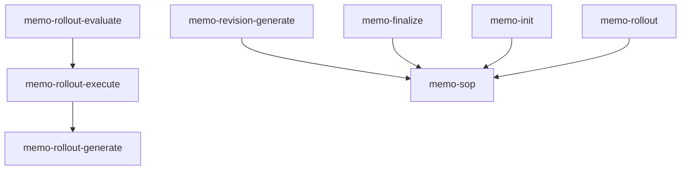

This page maps each specification chapter to the skills that implement it — so you can see which parts of the workflow are covered and where to look next.

> **Informative · generated.** Do not edit by hand; re-run the spec build to regenerate.

<!-- Auto-generated by scripts/generate-bridge.mjs from the skill-to-spec map. -->

## Graph views

### Skill dependency graph — `requires` edges (memo)

## Coverage summary

| Chapter | Covered | Implementers | Reqs |
|---|---|---|---|
| [00-overview](/specification/overview/) | ✓ | 1 | — |
| [01-philosophy](/specification/philosophy/) | ✓ | 5 | — |
| [02-memo-sop-entrypoint](/specification/memo-sop-entrypoint/) | ✓ | 15 | 2 |
| [03-input-paths](/specification/input-paths/) | ✓ | 2 | — |
| [04-input-pipeline](/specification/input-pipeline/) | ✓ | 2 | 2 |
| [05-memo-strategies](/specification/memo-strategies/) | ✓ | 2 | — |
| [06-memo-structure](/specification/memo-structure/) | ✓ | 6 | 4 |
| [07-revisions-and-questions](/specification/revisions-and-questions/) | ✓ | 11 | 5 |
| [08-phases-and-prds](/specification/phases-and-prds/) | ✓ | 19 | 6 |
| [09-contamination-context-handover](/specification/contamination-context-handover/) | ✓ | 25 | — |
| [10-proactive-research](/specification/proactive-research/) | ✓ | 9 | 8 |
| [11-quality-and-finalization](/specification/quality-and-finalization/) | ✓ | 16 | 6 |
| [12-rollout](/specification/rollout/) | ✓ | 7 | — |
| [13-orchestration](/specification/orchestration/) | ✓ | 19 | — |
| [14-agents-skills-tasks](/specification/agents-skills-tasks/) | ✓ | 4 | — |
| [15-prompt-generator](/specification/prompt-generator/) | ✓ | 5 | — |
| [16-git-security-versioning](/specification/git-security-versioning/) | ✓ | 17 | 8 |
| [17-git-workflow-and-ids](/specification/git-workflow-and-ids/) | ✓ | 10 | 6 |
| [18-multidimensionality](/specification/multidimensionality/) | ✓ | 3 | — |
| [19-internal-vs-external-communication](/specification/internal-vs-external-communication/) | ✓ | 6 | 1 |
| [20-flow-full-vs-update-revisions](/specification/flow-full-vs-update-revisions/) | ✓ | 4 | — |
| [21-human-computer-interaction](/specification/human-computer-interaction/) | ✓ | 7 | — |
| [22-tree-cli-recommended-way](/specification/tree-cli-recommended-way/) | ✓ | 4 | 4 |
| [23-requirements](/specification/requirements/) | ✓ | 17 | 6 |
| [24-tools-registry](/specification/tools-registry/) | ✓ | 5 | 5 |
| [25-strands](/specification/strands/) | ✓ | 2 | — |
| [26-memo-history](/specification/memo-history/) | ✓ | 4 | — |
| [27-landing-the-plane](/specification/landing-the-plane/) | ✓ | 5 | 1 |
| [28-drift](/specification/drift/) | ✓ | 4 | — |
| [29-behavioral-guardrails](/specification/behavioral-guardrails/) | ✓ | 5 | 1 |
| [30-primitives](/specification/primitives/) | ✓ | 4 | — |
| [31-goals](/specification/goals/) | ✓ | 6 | — |
| [32-prompt-governance](/specification/prompt-governance/) | ✓ | 4 | — |
| [33-maintenance](/specification/maintenance/) | ✓ | 6 | 2 |
| [34-question-interface](/specification/question-interface/) | ✓ | 5 | — |
| [35-memo-authoring](/specification/memo-authoring/) | ✓ | 4 | 7 |
| [36-agent-strategies](/specification/agent-strategies/) | ✓ | 12 | — |
| [37-transcript-reliability](/specification/transcript-reliability/) | ✓ | 1 | — |
| [38-stage-model](/specification/stage-model/) | ✓ | 16 | — |
| [39-release-and-pinning](/specification/release-and-pinning/) | ✓ | 4 | — |
| [40-diagrams](/specification/diagrams/) | ✓ | 1 | 4 |
| [41-mental-model](/specification/mental-model/) | ✓ | 3 | — |
| [42-plans](/specification/plans/) | ✓ | 10 | — |
| [43-skill-authoring-and-quality](/specification/skill-authoring-and-quality/) | ✓ | 2 | 8 |
| [44-repository-and-outward-docs](/specification/repository-and-outward-docs/) | — | 0 | 22 |
| [45-implementation-fidelity-audit](/specification/implementation-fidelity-audit/) | ✓ | 1 | — |
| [47-memo-lifecycle](/specification/memo-lifecycle/) | — | 0 | — |
| **Summary** | **45 / 47** | — | 108 |

## Skills by namespace

### code-patterns (1 skill)

| Skill | Chapters |
|---|---|
| `memo-budget-paste` | [42-plans](/specification/plans/) (primary) |

### evals (3 skills)

| Skill | Chapters |
|---|---|
| `memo-req-registry` | [23-requirements](/specification/requirements/) (primary), [24-tools-registry](/specification/tools-registry/), [30-primitives](/specification/primitives/) |
| `memo-req-runner` | [23-requirements](/specification/requirements/) (primary), [16-git-security-versioning](/specification/git-security-versioning/), [19-internal-vs-external-communication](/specification/internal-vs-external-communication/), [30-primitives](/specification/primitives/) |
| `memo-req-store` | [23-requirements](/specification/requirements/) (primary), [24-tools-registry](/specification/tools-registry/), [30-primitives](/specification/primitives/) |

### git (5 skills)

| Skill | Chapters |
|---|---|
| `git-commit` | [17-git-workflow-and-ids](/specification/git-workflow-and-ids/) (primary), [11-quality-and-finalization](/specification/quality-and-finalization/), [16-git-security-versioning](/specification/git-security-versioning/), [19-internal-vs-external-communication](/specification/internal-vs-external-communication/) |
| `git-merge-strategy` | [38-stage-model](/specification/stage-model/) (primary), [13-orchestration](/specification/orchestration/), [16-git-security-versioning](/specification/git-security-versioning/), [17-git-workflow-and-ids](/specification/git-workflow-and-ids/), [18-multidimensionality](/specification/multidimensionality/), [27-landing-the-plane](/specification/landing-the-plane/) |
| `git-push` | [38-stage-model](/specification/stage-model/) (primary), [11-quality-and-finalization](/specification/quality-and-finalization/), [16-git-security-versioning](/specification/git-security-versioning/), [17-git-workflow-and-ids](/specification/git-workflow-and-ids/), [18-multidimensionality](/specification/multidimensionality/), [19-internal-vs-external-communication](/specification/internal-vs-external-communication/), [23-requirements](/specification/requirements/), [39-release-and-pinning](/specification/release-and-pinning/) |
| `git-security` | [16-git-security-versioning](/specification/git-security-versioning/) (primary), [11-quality-and-finalization](/specification/quality-and-finalization/), [19-internal-vs-external-communication](/specification/internal-vs-external-communication/), [23-requirements](/specification/requirements/) |
| `release` | [39-release-and-pinning](/specification/release-and-pinning/) (primary), [16-git-security-versioning](/specification/git-security-versioning/), [29-behavioral-guardrails](/specification/behavioral-guardrails/), [33-maintenance](/specification/maintenance/), [38-stage-model](/specification/stage-model/) |

### memo (42 skills)

| Skill | Chapters |
|---|---|
| `drift-resolution` | [28-drift](/specification/drift/) (primary), [08-phases-and-prds](/specification/phases-and-prds/), [11-quality-and-finalization](/specification/quality-and-finalization/), [13-orchestration](/specification/orchestration/), [16-git-security-versioning](/specification/git-security-versioning/) |
| `memo-balance` | [11-quality-and-finalization](/specification/quality-and-finalization/) (primary), [07-revisions-and-questions](/specification/revisions-and-questions/), [35-memo-authoring](/specification/memo-authoring/) |
| `memo-chronic-add` | [26-memo-history](/specification/memo-history/) (primary), [09-contamination-context-handover](/specification/contamination-context-handover/), [31-goals](/specification/goals/) |
| `memo-chronic-build` | [26-memo-history](/specification/memo-history/) (primary), [09-contamination-context-handover](/specification/contamination-context-handover/), [13-orchestration](/specification/orchestration/), [36-agent-strategies](/specification/agent-strategies/) |
| `memo-coherence` | [11-quality-and-finalization](/specification/quality-and-finalization/) (primary), [01-philosophy](/specification/philosophy/), [07-revisions-and-questions](/specification/revisions-and-questions/), [29-behavioral-guardrails](/specification/behavioral-guardrails/), [35-memo-authoring](/specification/memo-authoring/) |
| `memo-evidence` | [11-quality-and-finalization](/specification/quality-and-finalization/) (primary), [07-revisions-and-questions](/specification/revisions-and-questions/), [10-proactive-research](/specification/proactive-research/) |
| `memo-fidelity-audit` | [45-implementation-fidelity-audit](/specification/implementation-fidelity-audit/) (primary), [07-revisions-and-questions](/specification/revisions-and-questions/), [11-quality-and-finalization](/specification/quality-and-finalization/), [12-rollout](/specification/rollout/), [31-goals](/specification/goals/), [38-stage-model](/specification/stage-model/) |
| `memo-finalize` | [11-quality-and-finalization](/specification/quality-and-finalization/) (primary), [02-memo-sop-entrypoint](/specification/memo-sop-entrypoint/), [08-phases-and-prds](/specification/phases-and-prds/), [09-contamination-context-handover](/specification/contamination-context-handover/), [12-rollout](/specification/rollout/), [16-git-security-versioning](/specification/git-security-versioning/), [20-flow-full-vs-update-revisions](/specification/flow-full-vs-update-revisions/), [21-human-computer-interaction](/specification/human-computer-interaction/), [23-requirements](/specification/requirements/), [25-strands](/specification/strands/) |
| `memo-goal-optimize` | [31-goals](/specification/goals/) (primary), [03-input-paths](/specification/input-paths/), [04-input-pipeline](/specification/input-pipeline/), [09-contamination-context-handover](/specification/contamination-context-handover/), [34-question-interface](/specification/question-interface/) |
| `memo-goal-score` | [31-goals](/specification/goals/) (primary), [09-contamination-context-handover](/specification/contamination-context-handover/), [22-tree-cli-recommended-way](/specification/tree-cli-recommended-way/), [36-agent-strategies](/specification/agent-strategies/) |
| `memo-goal-score-all` | [31-goals](/specification/goals/) (primary), [09-contamination-context-handover](/specification/contamination-context-handover/), [21-human-computer-interaction](/specification/human-computer-interaction/), [33-maintenance](/specification/maintenance/), [36-agent-strategies](/specification/agent-strategies/) |
| `memo-handover` | [09-contamination-context-handover](/specification/contamination-context-handover/) (primary), [13-orchestration](/specification/orchestration/), [16-git-security-versioning](/specification/git-security-versioning/), [27-landing-the-plane](/specification/landing-the-plane/), [42-plans](/specification/plans/) |
| `memo-init` | [06-memo-structure](/specification/memo-structure/) (primary), [02-memo-sop-entrypoint](/specification/memo-sop-entrypoint/), [05-memo-strategies](/specification/memo-strategies/), [07-revisions-and-questions](/specification/revisions-and-questions/), [08-phases-and-prds](/specification/phases-and-prds/), [09-contamination-context-handover](/specification/contamination-context-handover/), [10-proactive-research](/specification/proactive-research/), [29-behavioral-guardrails](/specification/behavioral-guardrails/), [34-question-interface](/specification/question-interface/), [35-memo-authoring](/specification/memo-authoring/), [40-diagrams](/specification/diagrams/), [41-mental-model](/specification/mental-model/) |
| `memo-input-processing` | [04-input-pipeline](/specification/input-pipeline/) (primary), [03-input-paths](/specification/input-paths/), [10-proactive-research](/specification/proactive-research/), [36-agent-strategies](/specification/agent-strategies/), [37-transcript-reliability](/specification/transcript-reliability/) |
| `memo-maintenance-score` | [33-maintenance](/specification/maintenance/) (primary), [09-contamination-context-handover](/specification/contamination-context-handover/), [22-tree-cli-recommended-way](/specification/tree-cli-recommended-way/), [28-drift](/specification/drift/), [36-agent-strategies](/specification/agent-strategies/) |
| `memo-maintenance-score-all` | [33-maintenance](/specification/maintenance/) (primary), [21-human-computer-interaction](/specification/human-computer-interaction/), [28-drift](/specification/drift/), [36-agent-strategies](/specification/agent-strategies/), [39-release-and-pinning](/specification/release-and-pinning/) |
| `memo-maintenance-verify` | [33-maintenance](/specification/maintenance/) (primary), [09-contamination-context-handover](/specification/contamination-context-handover/), [16-git-security-versioning](/specification/git-security-versioning/), [39-release-and-pinning](/specification/release-and-pinning/) |
| `memo-mental-model-derive` | [41-mental-model](/specification/mental-model/) (primary), [01-philosophy](/specification/philosophy/), [07-revisions-and-questions](/specification/revisions-and-questions/), [09-contamination-context-handover](/specification/contamination-context-handover/), [21-human-computer-interaction](/specification/human-computer-interaction/), [36-agent-strategies](/specification/agent-strategies/) |
| `memo-phase-evaluate` | [13-orchestration](/specification/orchestration/) (primary), [08-phases-and-prds](/specification/phases-and-prds/), [09-contamination-context-handover](/specification/contamination-context-handover/), [23-requirements](/specification/requirements/), [36-agent-strategies](/specification/agent-strategies/) |
| `memo-phase-execute` | [13-orchestration](/specification/orchestration/) (primary), [08-phases-and-prds](/specification/phases-and-prds/), [09-contamination-context-handover](/specification/contamination-context-handover/), [12-rollout](/specification/rollout/), [15-prompt-generator](/specification/prompt-generator/), [16-git-security-versioning](/specification/git-security-versioning/), [17-git-workflow-and-ids](/specification/git-workflow-and-ids/), [23-requirements](/specification/requirements/), [29-behavioral-guardrails](/specification/behavioral-guardrails/) |
| `memo-phase-generate` | [08-phases-and-prds](/specification/phases-and-prds/) (primary), [09-contamination-context-handover](/specification/contamination-context-handover/), [13-orchestration](/specification/orchestration/), [15-prompt-generator](/specification/prompt-generator/), [16-git-security-versioning](/specification/git-security-versioning/), [23-requirements](/specification/requirements/), [32-prompt-governance](/specification/prompt-governance/) |
| `memo-plan-add` | [42-plans](/specification/plans/) (primary), [02-memo-sop-entrypoint](/specification/memo-sop-entrypoint/), [08-phases-and-prds](/specification/phases-and-prds/), [18-multidimensionality](/specification/multidimensionality/), [38-stage-model](/specification/stage-model/) |
| `memo-plan-evaluate` | [42-plans](/specification/plans/) (primary), [08-phases-and-prds](/specification/phases-and-prds/), [09-contamination-context-handover](/specification/contamination-context-handover/), [14-agents-skills-tasks](/specification/agents-skills-tasks/), [38-stage-model](/specification/stage-model/) |
| `memo-plan-execute` | [42-plans](/specification/plans/) (primary), [02-memo-sop-entrypoint](/specification/memo-sop-entrypoint/), [09-contamination-context-handover](/specification/contamination-context-handover/), [13-orchestration](/specification/orchestration/), [16-git-security-versioning](/specification/git-security-versioning/), [17-git-workflow-and-ids](/specification/git-workflow-and-ids/), [21-human-computer-interaction](/specification/human-computer-interaction/), [38-stage-model](/specification/stage-model/) |
| `memo-plan-finalize` | [42-plans](/specification/plans/) (primary), [02-memo-sop-entrypoint](/specification/memo-sop-entrypoint/), [38-stage-model](/specification/stage-model/) |
| `memo-plan-init` | [42-plans](/specification/plans/) (primary), [02-memo-sop-entrypoint](/specification/memo-sop-entrypoint/), [06-memo-structure](/specification/memo-structure/), [08-phases-and-prds](/specification/phases-and-prds/), [38-stage-model](/specification/stage-model/) |
| `memo-plan-status` | [42-plans](/specification/plans/) (primary), [02-memo-sop-entrypoint](/specification/memo-sop-entrypoint/), [06-memo-structure](/specification/memo-structure/), [22-tree-cli-recommended-way](/specification/tree-cli-recommended-way/), [38-stage-model](/specification/stage-model/) |
| `memo-plan-stop` | [42-plans](/specification/plans/) (primary), [02-memo-sop-entrypoint](/specification/memo-sop-entrypoint/), [09-contamination-context-handover](/specification/contamination-context-handover/), [17-git-workflow-and-ids](/specification/git-workflow-and-ids/), [38-stage-model](/specification/stage-model/) |
| `memo-plan-update-checkbox` | [42-plans](/specification/plans/) (primary), [02-memo-sop-entrypoint](/specification/memo-sop-entrypoint/), [17-git-workflow-and-ids](/specification/git-workflow-and-ids/), [22-tree-cli-recommended-way](/specification/tree-cli-recommended-way/), [38-stage-model](/specification/stage-model/) |
| `memo-prds-validate` | [08-phases-and-prds](/specification/phases-and-prds/) (primary), [09-contamination-context-handover](/specification/contamination-context-handover/), [11-quality-and-finalization](/specification/quality-and-finalization/), [13-orchestration](/specification/orchestration/), [23-requirements](/specification/requirements/) |
| `memo-references` | [11-quality-and-finalization](/specification/quality-and-finalization/) (primary), [07-revisions-and-questions](/specification/revisions-and-questions/), [08-phases-and-prds](/specification/phases-and-prds/), [13-orchestration](/specification/orchestration/), [28-drift](/specification/drift/) |
| `memo-reset-recommend` | [08-phases-and-prds](/specification/phases-and-prds/) (primary), [02-memo-sop-entrypoint](/specification/memo-sop-entrypoint/), [09-contamination-context-handover](/specification/contamination-context-handover/), [21-human-computer-interaction](/specification/human-computer-interaction/) |
| `memo-revision-consolidate` | [20-flow-full-vs-update-revisions](/specification/flow-full-vs-update-revisions/) (primary), [07-revisions-and-questions](/specification/revisions-and-questions/), [11-quality-and-finalization](/specification/quality-and-finalization/) |
| `memo-revision-evaluate` | [07-revisions-and-questions](/specification/revisions-and-questions/) (primary), [09-contamination-context-handover](/specification/contamination-context-handover/), [13-orchestration](/specification/orchestration/), [34-question-interface](/specification/question-interface/) |
| `memo-revision-execute` | [07-revisions-and-questions](/specification/revisions-and-questions/) (primary), [06-memo-structure](/specification/memo-structure/), [08-phases-and-prds](/specification/phases-and-prds/), [20-flow-full-vs-update-revisions](/specification/flow-full-vs-update-revisions/), [34-question-interface](/specification/question-interface/), [35-memo-authoring](/specification/memo-authoring/) |
| `memo-revision-generate` | [07-revisions-and-questions](/specification/revisions-and-questions/) (primary), [01-philosophy](/specification/philosophy/), [02-memo-sop-entrypoint](/specification/memo-sop-entrypoint/), [10-proactive-research](/specification/proactive-research/), [13-orchestration](/specification/orchestration/), [20-flow-full-vs-update-revisions](/specification/flow-full-vs-update-revisions/), [34-question-interface](/specification/question-interface/), [41-mental-model](/specification/mental-model/) |
| `memo-rollout` | [12-rollout](/specification/rollout/) (primary), [11-quality-and-finalization](/specification/quality-and-finalization/), [13-orchestration](/specification/orchestration/), [16-git-security-versioning](/specification/git-security-versioning/), [33-maintenance](/specification/maintenance/), [38-stage-model](/specification/stage-model/) |
| `memo-rollout-evaluate` | [12-rollout](/specification/rollout/) (primary), [08-phases-and-prds](/specification/phases-and-prds/), [09-contamination-context-handover](/specification/contamination-context-handover/), [23-requirements](/specification/requirements/), [31-goals](/specification/goals/), [36-agent-strategies](/specification/agent-strategies/), [38-stage-model](/specification/stage-model/) |
| `memo-rollout-execute` | [12-rollout](/specification/rollout/) (primary), [08-phases-and-prds](/specification/phases-and-prds/), [09-contamination-context-handover](/specification/contamination-context-handover/), [13-orchestration](/specification/orchestration/), [16-git-security-versioning](/specification/git-security-versioning/), [17-git-workflow-and-ids](/specification/git-workflow-and-ids/), [26-memo-history](/specification/memo-history/), [27-landing-the-plane](/specification/landing-the-plane/), [38-stage-model](/specification/stage-model/) |
| `memo-rollout-generate` | [08-phases-and-prds](/specification/phases-and-prds/) (primary), [11-quality-and-finalization](/specification/quality-and-finalization/), [13-orchestration](/specification/orchestration/), [15-prompt-generator](/specification/prompt-generator/), [23-requirements](/specification/requirements/), [25-strands](/specification/strands/), [32-prompt-governance](/specification/prompt-governance/) |
| `memo-sop` | [02-memo-sop-entrypoint](/specification/memo-sop-entrypoint/) (primary), [00-overview](/specification/overview/), [01-philosophy](/specification/philosophy/), [12-rollout](/specification/rollout/), [13-orchestration](/specification/orchestration/), [21-human-computer-interaction](/specification/human-computer-interaction/), [27-landing-the-plane](/specification/landing-the-plane/), [30-primitives](/specification/primitives/), [38-stage-model](/specification/stage-model/) |
| `memo-sub-init` | [06-memo-structure](/specification/memo-structure/) (primary), [02-memo-sop-entrypoint](/specification/memo-sop-entrypoint/), [05-memo-strategies](/specification/memo-strategies/), [09-contamination-context-handover](/specification/contamination-context-handover/) |

### prd (3 skills)

| Skill | Chapters |
|---|---|
| `memo-prd-evaluate` | [08-phases-and-prds](/specification/phases-and-prds/) (primary), [09-contamination-context-handover](/specification/contamination-context-handover/), [13-orchestration](/specification/orchestration/), [14-agents-skills-tasks](/specification/agents-skills-tasks/), [23-requirements](/specification/requirements/) |
| `memo-prd-generate` | [08-phases-and-prds](/specification/phases-and-prds/) (primary), [15-prompt-generator](/specification/prompt-generator/), [17-git-workflow-and-ids](/specification/git-workflow-and-ids/), [23-requirements](/specification/requirements/), [32-prompt-governance](/specification/prompt-governance/) |
| `memo-req-template` | [23-requirements](/specification/requirements/) (primary), [15-prompt-generator](/specification/prompt-generator/), [24-tools-registry](/specification/tools-registry/), [32-prompt-governance](/specification/prompt-governance/) |

### research (4 skills)

| Skill | Chapters |
|---|---|
| `memo-research-agent` | [10-proactive-research](/specification/proactive-research/) (primary), [11-quality-and-finalization](/specification/quality-and-finalization/), [13-orchestration](/specification/orchestration/), [36-agent-strategies](/specification/agent-strategies/) |
| `research-best-practice-playwright` | [10-proactive-research](/specification/proactive-research/) |
| `research-scrape-docs` | [10-proactive-research](/specification/proactive-research/) |
| `research-workflow` | [13-orchestration](/specification/orchestration/) (primary), [10-proactive-research](/specification/proactive-research/), [36-agent-strategies](/specification/agent-strategies/) |

### skill (2 skills)

| Skill | Chapters |
|---|---|
| `skill-testing` | [43-skill-authoring-and-quality](/specification/skill-authoring-and-quality/) (primary), [02-memo-sop-entrypoint](/specification/memo-sop-entrypoint/), [14-agents-skills-tasks](/specification/agents-skills-tasks/) |
| `specs-to-skills` | [43-skill-authoring-and-quality](/specification/skill-authoring-and-quality/) (primary), [23-requirements](/specification/requirements/) |

### wiki (3 skills)

| Skill | Chapters |
|---|---|
| `wiki-ingest` | [10-proactive-research](/specification/proactive-research/), [26-memo-history](/specification/memo-history/) |
| `wiki-lint` | [23-requirements](/specification/requirements/) |
| `wiki-query` | [24-tools-registry](/specification/tools-registry/) |

### workbench (4 skills)

| Skill | Chapters |
|---|---|
| `workbench-audit` | [16-git-security-versioning](/specification/git-security-versioning/), [19-internal-vs-external-communication](/specification/internal-vs-external-communication/), [24-tools-registry](/specification/tools-registry/) |
| `workbench-modes` | [02-memo-sop-entrypoint](/specification/memo-sop-entrypoint/) (primary), [01-philosophy](/specification/philosophy/), [08-phases-and-prds](/specification/phases-and-prds/), [16-git-security-versioning](/specification/git-security-versioning/), [17-git-workflow-and-ids](/specification/git-workflow-and-ids/), [27-landing-the-plane](/specification/landing-the-plane/), [29-behavioral-guardrails](/specification/behavioral-guardrails/) |
| `workbench-persona-audit` | [14-agents-skills-tasks](/specification/agents-skills-tasks/) (primary), [09-contamination-context-handover](/specification/contamination-context-handover/), [11-quality-and-finalization](/specification/quality-and-finalization/), [19-internal-vs-external-communication](/specification/internal-vs-external-communication/), [36-agent-strategies](/specification/agent-strategies/) |
| `workbench-project-setup` | [06-memo-structure](/specification/memo-structure/) |

**Summary: 9 namespaces · 67 skills total**

## Chapters

### Introduction

- [00-overview](/specification/overview/) — `memo-sop`
- [01-philosophy](/specification/philosophy/) — `memo-coherence`, `memo-mental-model-derive`, `memo-revision-generate`, `memo-sop`, `workbench-modes`
- [02-memo-sop-entrypoint](/specification/memo-sop-entrypoint/) — `memo-finalize`, `memo-init`, `memo-plan-add`, `memo-plan-execute`, `memo-plan-finalize`, `memo-plan-init`, `memo-plan-status`, `memo-plan-stop`, `memo-plan-update-checkbox`, `memo-reset-recommend`, `memo-revision-generate`, `memo-sop`, `memo-sub-init`, `skill-testing`, `workbench-modes`
- [30-primitives](/specification/primitives/) — `memo-req-registry`, `memo-req-runner`, `memo-req-store`, `memo-sop`

### Input

- [03-input-paths](/specification/input-paths/) — `memo-goal-optimize`, `memo-input-processing`
- [04-input-pipeline](/specification/input-pipeline/) — `memo-goal-optimize`, `memo-input-processing`
- [37-transcript-reliability](/specification/transcript-reliability/) — `memo-input-processing`

### Initialization

- [05-memo-strategies](/specification/memo-strategies/) — `memo-init`, `memo-sub-init`
- [06-memo-structure](/specification/memo-structure/) — `memo-init`, `memo-plan-init`, `memo-plan-status`, `memo-revision-execute`, `memo-sub-init`, `workbench-project-setup`
- [10-proactive-research](/specification/proactive-research/) — `memo-evidence`, `memo-init`, `memo-input-processing`, `memo-research-agent`, `memo-revision-generate`, `research-best-practice-playwright`, `research-scrape-docs`, `research-workflow`, `wiki-ingest`
- [35-memo-authoring](/specification/memo-authoring/) — `memo-balance`, `memo-coherence`, `memo-init`, `memo-revision-execute`

### Revision

- [07-revisions-and-questions](/specification/revisions-and-questions/) — `memo-balance`, `memo-coherence`, `memo-evidence`, `memo-fidelity-audit`, `memo-init`, `memo-mental-model-derive`, `memo-references`, `memo-revision-consolidate`, `memo-revision-evaluate`, `memo-revision-execute`, `memo-revision-generate`
- [11-quality-and-finalization](/specification/quality-and-finalization/) — `drift-resolution`, `git-commit`, `git-push`, `git-security`, `memo-balance`, `memo-coherence`, `memo-evidence`, `memo-fidelity-audit`, `memo-finalize`, `memo-prds-validate`, `memo-references`, `memo-research-agent`, `memo-revision-consolidate`, `memo-rollout`, `memo-rollout-generate`, `workbench-persona-audit`
- [20-flow-full-vs-update-revisions](/specification/flow-full-vs-update-revisions/) — `memo-finalize`, `memo-revision-consolidate`, `memo-revision-execute`, `memo-revision-generate`
- [34-question-interface](/specification/question-interface/) — `memo-goal-optimize`, `memo-init`, `memo-revision-evaluate`, `memo-revision-execute`, `memo-revision-generate`
- [40-diagrams](/specification/diagrams/) — `memo-init`

### Execution

- [08-phases-and-prds](/specification/phases-and-prds/) — `drift-resolution`, `memo-finalize`, `memo-init`, `memo-phase-evaluate`, `memo-phase-execute`, `memo-phase-generate`, `memo-plan-add`, `memo-plan-evaluate`, `memo-plan-init`, `memo-prd-evaluate`, `memo-prd-generate`, `memo-prds-validate`, `memo-references`, `memo-reset-recommend`, `memo-revision-execute`, `memo-rollout-evaluate`, `memo-rollout-execute`, `memo-rollout-generate`, `workbench-modes`
- [12-rollout](/specification/rollout/) — `memo-fidelity-audit`, `memo-finalize`, `memo-phase-execute`, `memo-rollout`, `memo-rollout-evaluate`, `memo-rollout-execute`, `memo-sop`
- [13-orchestration](/specification/orchestration/) — `drift-resolution`, `git-merge-strategy`, `memo-chronic-build`, `memo-handover`, `memo-phase-evaluate`, `memo-phase-execute`, `memo-phase-generate`, `memo-plan-execute`, `memo-prd-evaluate`, `memo-prds-validate`, `memo-references`, `memo-research-agent`, `memo-revision-evaluate`, `memo-revision-generate`, `memo-rollout`, `memo-rollout-execute`, `memo-rollout-generate`, `memo-sop`, `research-workflow`
- [25-strands](/specification/strands/) — `memo-finalize`, `memo-rollout-generate`
- [27-landing-the-plane](/specification/landing-the-plane/) — `git-merge-strategy`, `memo-handover`, `memo-rollout-execute`, `memo-sop`, `workbench-modes`
- [32-prompt-governance](/specification/prompt-governance/) — `memo-phase-generate`, `memo-prd-generate`, `memo-req-template`, `memo-rollout-generate`
- [38-stage-model](/specification/stage-model/) — `git-merge-strategy`, `git-push`, `memo-fidelity-audit`, `memo-plan-add`, `memo-plan-evaluate`, `memo-plan-execute`, `memo-plan-finalize`, `memo-plan-init`, `memo-plan-status`, `memo-plan-stop`, `memo-plan-update-checkbox`, `memo-rollout`, `memo-rollout-evaluate`, `memo-rollout-execute`, `memo-sop`, `release`
- [42-plans](/specification/plans/) — `memo-budget-paste`, `memo-handover`, `memo-plan-add`, `memo-plan-evaluate`, `memo-plan-execute`, `memo-plan-finalize`, `memo-plan-init`, `memo-plan-status`, `memo-plan-stop`, `memo-plan-update-checkbox`
- [47-memo-lifecycle](/specification/memo-lifecycle/) — _— no implementer skill yet —_

### Procedure

- [22-tree-cli-recommended-way](/specification/tree-cli-recommended-way/) — `memo-goal-score`, `memo-maintenance-score`, `memo-plan-status`, `memo-plan-update-checkbox`
- [23-requirements](/specification/requirements/) — `git-push`, `git-security`, `memo-finalize`, `memo-phase-evaluate`, `memo-phase-execute`, `memo-phase-generate`, `memo-prd-evaluate`, `memo-prd-generate`, `memo-prds-validate`, `memo-req-registry`, `memo-req-runner`, `memo-req-store`, `memo-req-template`, `memo-rollout-evaluate`, `memo-rollout-generate`, `specs-to-skills`, `wiki-lint`
- [24-tools-registry](/specification/tools-registry/) — `memo-req-registry`, `memo-req-store`, `memo-req-template`, `wiki-query`, `workbench-audit`

### Behavior

- [09-contamination-context-handover](/specification/contamination-context-handover/) — `memo-chronic-add`, `memo-chronic-build`, `memo-finalize`, `memo-goal-optimize`, `memo-goal-score`, `memo-goal-score-all`, `memo-handover`, `memo-init`, `memo-maintenance-score`, `memo-maintenance-verify`, `memo-mental-model-derive`, `memo-phase-evaluate`, `memo-phase-execute`, `memo-phase-generate`, `memo-plan-evaluate`, `memo-plan-execute`, `memo-plan-stop`, `memo-prd-evaluate`, `memo-prds-validate`, `memo-reset-recommend`, `memo-revision-evaluate`, `memo-rollout-evaluate`, `memo-rollout-execute`, `memo-sub-init`, `workbench-persona-audit`
- [18-multidimensionality](/specification/multidimensionality/) — `git-merge-strategy`, `git-push`, `memo-plan-add`
- [21-human-computer-interaction](/specification/human-computer-interaction/) — `memo-finalize`, `memo-goal-score-all`, `memo-maintenance-score-all`, `memo-mental-model-derive`, `memo-plan-execute`, `memo-reset-recommend`, `memo-sop`
- [28-drift](/specification/drift/) — `drift-resolution`, `memo-maintenance-score`, `memo-maintenance-score-all`, `memo-references`
- [29-behavioral-guardrails](/specification/behavioral-guardrails/) — `memo-coherence`, `memo-init`, `memo-phase-execute`, `release`, `workbench-modes`
- [41-mental-model](/specification/mental-model/) — `memo-init`, `memo-mental-model-derive`, `memo-revision-generate`

### Health

- [26-memo-history](/specification/memo-history/) — `memo-chronic-add`, `memo-chronic-build`, `memo-rollout-execute`, `wiki-ingest`
- [31-goals](/specification/goals/) — `memo-chronic-add`, `memo-fidelity-audit`, `memo-goal-optimize`, `memo-goal-score`, `memo-goal-score-all`, `memo-rollout-evaluate`
- [33-maintenance](/specification/maintenance/) — `memo-goal-score-all`, `memo-maintenance-score`, `memo-maintenance-score-all`, `memo-maintenance-verify`, `memo-rollout`, `release`
- [45-implementation-fidelity-audit](/specification/implementation-fidelity-audit/) — `memo-fidelity-audit`

### Agents

- [14-agents-skills-tasks](/specification/agents-skills-tasks/) — `memo-plan-evaluate`, `memo-prd-evaluate`, `skill-testing`, `workbench-persona-audit`
- [15-prompt-generator](/specification/prompt-generator/) — `memo-phase-execute`, `memo-phase-generate`, `memo-prd-generate`, `memo-req-template`, `memo-rollout-generate`
- [36-agent-strategies](/specification/agent-strategies/) — `memo-chronic-build`, `memo-goal-score`, `memo-goal-score-all`, `memo-input-processing`, `memo-maintenance-score`, `memo-maintenance-score-all`, `memo-mental-model-derive`, `memo-phase-evaluate`, `memo-research-agent`, `memo-rollout-evaluate`, `research-workflow`, `workbench-persona-audit`

### Git & Repo

- [16-git-security-versioning](/specification/git-security-versioning/) — `drift-resolution`, `git-commit`, `git-merge-strategy`, `git-push`, `git-security`, `memo-finalize`, `memo-handover`, `memo-maintenance-verify`, `memo-phase-execute`, `memo-phase-generate`, `memo-plan-execute`, `memo-req-runner`, `memo-rollout`, `memo-rollout-execute`, `release`, `workbench-audit`, `workbench-modes`
- [17-git-workflow-and-ids](/specification/git-workflow-and-ids/) — `git-commit`, `git-merge-strategy`, `git-push`, `memo-phase-execute`, `memo-plan-execute`, `memo-plan-stop`, `memo-plan-update-checkbox`, `memo-prd-generate`, `memo-rollout-execute`, `workbench-modes`
- [19-internal-vs-external-communication](/specification/internal-vs-external-communication/) — `git-commit`, `git-push`, `git-security`, `memo-req-runner`, `workbench-audit`, `workbench-persona-audit`
- [39-release-and-pinning](/specification/release-and-pinning/) — `git-push`, `memo-maintenance-score-all`, `memo-maintenance-verify`, `release`
- [44-repository-and-outward-docs](/specification/repository-and-outward-docs/) — _— no implementer skill yet —_

### Skills

- [43-skill-authoring-and-quality](/specification/skill-authoring-and-quality/) — `skill-testing`, `specs-to-skills`
