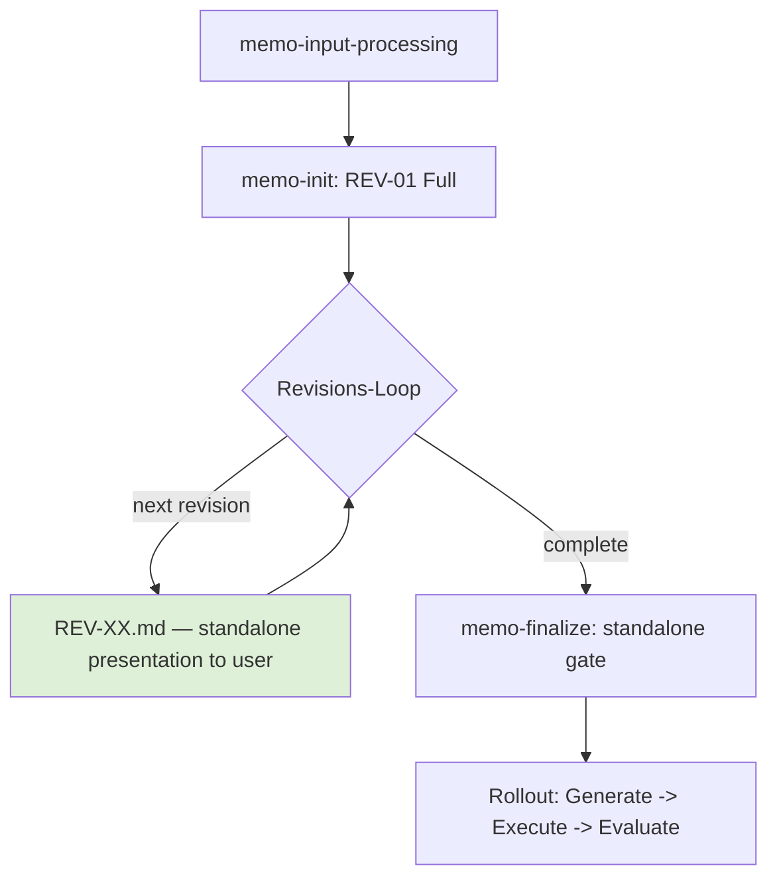

# 20. Flow: Full vs. Update Revisions

| Field | Value |
|-------|-------|
| Status | Draft |
| Depends on | [07-revisions-and-questions.md](./07-revisions-and-questions.md) |
| Related | [12-rollout.md](./12-rollout.md), [11-quality-and-finalization.md](./11-quality-and-finalization.md), [00-overview.md](./00-overview.md) |

The memo flow runs from the first input to the rollout in one continuous shape: input processing produces the seed, `memo-init` writes the first full revision, a revision loop iterates until the memo is settled, and finalization opens the gate to the rollout. This chapter fixes the **revision shape** within that loop: every revision is a self-contained snapshot that carries its whole content itself, the earlier **Update** delta form is stock that is read but no longer written, and the completeness duty is enforced rather than merely stated.

> **Chapter title.** The file name stays `20-flow-full-vs-update-revisions.md` — four skill frontmatter blocks, `skill-spec-map.json`, `inverted-map.json`, `46-bridge.md` and `README.md` bind to it. Only the content changed.

---

## The Flow Diagram

The following flowchart is the canonical reference for the flow.

---

## The Completeness Duty

A revision is one shape: a **Full** revision (`REV-XX.md`), a complete, standalone presentation of the entire memo. It is user-facing — it is the snapshot the user is shown, reasons about and releases.

> Every revision MUST carry its whole content itself. A reference to an earlier revision (`unveraendert aus REV-XX`, `wie REV-XX`, `siehe REV-XX`) MUST NOT stand in place of content. Naming an earlier revision as a **data object** — provenance, a measurement, a count ("lint run against REV-01: 36 findings") — remains allowed.

> In particular, every chapter that once carried a `User-Auftrag` block MUST carry that block forward verbatim in every following revision. The user's own wording is the comparison basis of the fidelity audit and never leaves the document.

The duty mirrors the construction that is already normative for open questions (see [07-revisions-and-questions.md](./07-revisions-and-questions.md), "Open Questions Carry Forward"): the complete set is always carried, and an element leaves it by exactly one defined path.

The first revision (`REV-01`, written by `memo-init`) is a Full revision, and so is every revision after it.

---

## The Update Form Is Stock

Earlier revision loops also produced **Update** revisions (`REV-XX-update.md`) — deltas against the most recent Full revision, which recorded only what changed and referenced the rest. That form ended: its measured price was substance leaving the document (in one memo the `User-Auftrag` blocks fell from 18 to 1 and the evidence markers from 76 to 33 in a single revision, because the unchanged chapters were referenced instead of re-emitted).

> No new `REV-XX-update.md` is written. The existing update revisions are **stock**: they stay in place unchanged, they remain readable, and they are validated against their own (update) schema. They are never converted, renamed or removed.

Because no new update revision is produced, there is nothing left to consolidate; the former consolidation step is history and its skill is decommissioned rather than deleted.

---

## Enforcement

The duty is enforced in three stages, none of which reaches into stock files:

| Stage | Mechanism | Effect |
|-------|-----------|--------|
| Language check | Lint rule `SR-13` (`memo controlled-language check <revision> --rev-type full`) | Flags a back-reference that replaces content. A code fence, an inline code span and a markdown table row are exempt, so a revision named as a data object stays allowed. `--rev-type update` / `--rev-type prepare` switch the rule off. |
| Viewer warning | `WARN-011` in the comparison banner | Non-blocking. Reports chapters that lost their `User-Auftrag` block, chapters below half their non-empty lines, and the evidence-marker balance — and always states how many chapters were compared. A result without a comparison basis is its own finding, never a pass. |
| Finalization gate | The standalone gate in `memo-finalize` | Blocking. It judges the **content** of the revision to be finalized, not its file-name suffix — the suffix test never fired on a Full file that nevertheless delegated its substance. |

---

<!-- IMPLEMENTED-BY — rendered backlink lives in the dist (generated/bridge/<family>/<stem>.backlink.md); source stays authored-only (F2 Dist-Split) -->
## Related

- [07-revisions-and-questions.md](./07-revisions-and-questions.md) — the three-area revision structure and the question format that every revision carries.
- [11-quality-and-finalization.md](./11-quality-and-finalization.md) — the finalization gate the flow opens after the revision loop settles.
- [12-rollout.md](./12-rollout.md) — the Generate → Execute → Evaluate rollout the flow enters after finalization.
- [00-overview.md](./00-overview.md) — conformance language.
