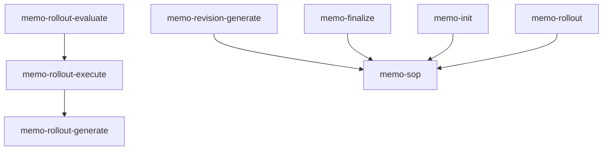

# 46. Bridge

| Field | Value |
|---|---|
| Status | Draft |
| Related | [./43-skill-authoring-and-quality.md](./43-skill-authoring-and-quality.md), [./00-overview.md](./00-overview.md) |

> **Informative.**

This page maps each specification chapter to the skills that implement it — so you can see which parts of the workflow are covered and where to look next.

<!-- generated -->
<!-- Auto-generated by scripts/generate-bridge.mjs from the skill-to-spec map. Do not edit by hand; re-run the spec build to regenerate. -->

## Graph views

### Skill dependency graph — `requires` edges (memo)

## Coverage summary

| Chapter | Covered | Implementers | Reqs |
|---|---|---|---|
| [00-overview](./00-overview.md) | ✓ | 1 | — |
| [01-philosophy](./01-philosophy.md) | ✓ | 5 | — |
| [02-memo-sop-entrypoint](./02-memo-sop-entrypoint.md) | ✓ | 15 | 2 |
| [03-input-paths](./03-input-paths.md) | ✓ | 2 | — |
| [04-input-pipeline](./04-input-pipeline.md) | ✓ | 2 | 2 |
| [05-memo-strategies](./05-memo-strategies.md) | ✓ | 2 | — |
| [06-memo-structure](./06-memo-structure.md) | ✓ | 6 | 4 |
| [07-revisions-and-questions](./07-revisions-and-questions.md) | ✓ | 11 | 5 |
| [08-phases-and-prds](./08-phases-and-prds.md) | ✓ | 19 | 6 |
| [09-contamination-context-handover](./09-contamination-context-handover.md) | ✓ | 25 | — |
| [10-proactive-research](./10-proactive-research.md) | ✓ | 9 | 8 |
| [11-quality-and-finalization](./11-quality-and-finalization.md) | ✓ | 16 | 6 |
| [12-rollout](./12-rollout.md) | ✓ | 7 | — |
| [13-orchestration](./13-orchestration.md) | ✓ | 19 | — |
| [14-agents-skills-tasks](./14-agents-skills-tasks.md) | ✓ | 4 | — |
| [15-prompt-generator](./15-prompt-generator.md) | ✓ | 5 | — |
| [16-git-security-versioning](./16-git-security-versioning.md) | ✓ | 17 | 8 |
| [17-git-workflow-and-ids](./17-git-workflow-and-ids.md) | ✓ | 10 | 6 |
| [18-multidimensionality](./18-multidimensionality.md) | ✓ | 3 | — |
| [19-internal-vs-external-communication](./19-internal-vs-external-communication.md) | ✓ | 6 | 1 |
| [20-flow-full-vs-update-revisions](./20-flow-full-vs-update-revisions.md) | ✓ | 4 | — |
| [21-human-computer-interaction](./21-human-computer-interaction.md) | ✓ | 7 | — |
| [22-tree-cli-recommended-way](./22-tree-cli-recommended-way.md) | ✓ | 4 | 4 |
| [23-requirements](./23-requirements.md) | ✓ | 17 | 6 |
| [24-tools-registry](./24-tools-registry.md) | ✓ | 5 | 5 |
| [25-strands](./25-strands.md) | ✓ | 2 | — |
| [26-memo-history](./26-memo-history.md) | ✓ | 4 | — |
| [27-landing-the-plane](./27-landing-the-plane.md) | ✓ | 5 | 1 |
| [28-drift](./28-drift.md) | ✓ | 4 | — |
| [29-behavioral-guardrails](./29-behavioral-guardrails.md) | ✓ | 5 | 1 |
| [30-primitives](./30-primitives.md) | ✓ | 4 | — |
| [31-goals](./31-goals.md) | ✓ | 6 | — |
| [32-prompt-governance](./32-prompt-governance.md) | ✓ | 4 | — |
| [33-maintenance](./33-maintenance.md) | ✓ | 6 | 2 |
| [34-question-interface](./34-question-interface.md) | ✓ | 5 | — |
| [35-memo-authoring](./35-memo-authoring.md) | ✓ | 4 | 7 |
| [36-agent-strategies](./36-agent-strategies.md) | ✓ | 12 | — |
| [37-transcript-reliability](./37-transcript-reliability.md) | ✓ | 1 | — |
| [38-stage-model](./38-stage-model.md) | ✓ | 16 | — |
| [39-release-and-pinning](./39-release-and-pinning.md) | ✓ | 4 | — |
| [40-diagrams](./40-diagrams.md) | ✓ | 1 | 4 |
| [41-mental-model](./41-mental-model.md) | ✓ | 3 | — |
| [42-plans](./42-plans.md) | ✓ | 10 | — |
| [43-skill-authoring-and-quality](./43-skill-authoring-and-quality.md) | ✓ | 2 | 8 |
| [44-repository-and-outward-docs](./44-repository-and-outward-docs.md) | — | 0 | 22 |
| [45-implementation-fidelity-audit](./45-implementation-fidelity-audit.md) | ✓ | 1 | — |
| [47-memo-lifecycle](./47-memo-lifecycle.md) | — | 0 | — |
| **Summary** | **45 / 47** | — | 108 |

## Skills by namespace

### code-patterns (1 skill)

| Skill | Chapters |
|---|---|
| `memo-budget-paste` | [42-plans](./42-plans.md) (primary) |

### evals (3 skills)

| Skill | Chapters |
|---|---|
| `memo-req-registry` | [23-requirements](./23-requirements.md) (primary), [24-tools-registry](./24-tools-registry.md), [30-primitives](./30-primitives.md) |
| `memo-req-runner` | [23-requirements](./23-requirements.md) (primary), [16-git-security-versioning](./16-git-security-versioning.md), [19-internal-vs-external-communication](./19-internal-vs-external-communication.md), [30-primitives](./30-primitives.md) |
| `memo-req-store` | [23-requirements](./23-requirements.md) (primary), [24-tools-registry](./24-tools-registry.md), [30-primitives](./30-primitives.md) |

### git (5 skills)

| Skill | Chapters |
|---|---|
| `git-commit` | [17-git-workflow-and-ids](./17-git-workflow-and-ids.md) (primary), [11-quality-and-finalization](./11-quality-and-finalization.md), [16-git-security-versioning](./16-git-security-versioning.md), [19-internal-vs-external-communication](./19-internal-vs-external-communication.md) |
| `git-merge-strategy` | [38-stage-model](./38-stage-model.md) (primary), [13-orchestration](./13-orchestration.md), [16-git-security-versioning](./16-git-security-versioning.md), [17-git-workflow-and-ids](./17-git-workflow-and-ids.md), [18-multidimensionality](./18-multidimensionality.md), [27-landing-the-plane](./27-landing-the-plane.md) |
| `git-push` | [38-stage-model](./38-stage-model.md) (primary), [11-quality-and-finalization](./11-quality-and-finalization.md), [16-git-security-versioning](./16-git-security-versioning.md), [17-git-workflow-and-ids](./17-git-workflow-and-ids.md), [18-multidimensionality](./18-multidimensionality.md), [19-internal-vs-external-communication](./19-internal-vs-external-communication.md), [23-requirements](./23-requirements.md), [39-release-and-pinning](./39-release-and-pinning.md) |
| `git-security` | [16-git-security-versioning](./16-git-security-versioning.md) (primary), [11-quality-and-finalization](./11-quality-and-finalization.md), [19-internal-vs-external-communication](./19-internal-vs-external-communication.md), [23-requirements](./23-requirements.md) |
| `release` | [39-release-and-pinning](./39-release-and-pinning.md) (primary), [16-git-security-versioning](./16-git-security-versioning.md), [29-behavioral-guardrails](./29-behavioral-guardrails.md), [33-maintenance](./33-maintenance.md), [38-stage-model](./38-stage-model.md) |

### memo (42 skills)

| Skill | Chapters |
|---|---|
| `drift-resolution` | [28-drift](./28-drift.md) (primary), [08-phases-and-prds](./08-phases-and-prds.md), [11-quality-and-finalization](./11-quality-and-finalization.md), [13-orchestration](./13-orchestration.md), [16-git-security-versioning](./16-git-security-versioning.md) |
| `memo-balance` | [11-quality-and-finalization](./11-quality-and-finalization.md) (primary), [07-revisions-and-questions](./07-revisions-and-questions.md), [35-memo-authoring](./35-memo-authoring.md) |
| `memo-chronic-add` | [26-memo-history](./26-memo-history.md) (primary), [09-contamination-context-handover](./09-contamination-context-handover.md), [31-goals](./31-goals.md) |
| `memo-chronic-build` | [26-memo-history](./26-memo-history.md) (primary), [09-contamination-context-handover](./09-contamination-context-handover.md), [13-orchestration](./13-orchestration.md), [36-agent-strategies](./36-agent-strategies.md) |
| `memo-coherence` | [11-quality-and-finalization](./11-quality-and-finalization.md) (primary), [01-philosophy](./01-philosophy.md), [07-revisions-and-questions](./07-revisions-and-questions.md), [29-behavioral-guardrails](./29-behavioral-guardrails.md), [35-memo-authoring](./35-memo-authoring.md) |
| `memo-evidence` | [11-quality-and-finalization](./11-quality-and-finalization.md) (primary), [07-revisions-and-questions](./07-revisions-and-questions.md), [10-proactive-research](./10-proactive-research.md) |
| `memo-fidelity-audit` | [45-implementation-fidelity-audit](./45-implementation-fidelity-audit.md) (primary), [07-revisions-and-questions](./07-revisions-and-questions.md), [11-quality-and-finalization](./11-quality-and-finalization.md), [12-rollout](./12-rollout.md), [31-goals](./31-goals.md), [38-stage-model](./38-stage-model.md) |
| `memo-finalize` | [11-quality-and-finalization](./11-quality-and-finalization.md) (primary), [02-memo-sop-entrypoint](./02-memo-sop-entrypoint.md), [08-phases-and-prds](./08-phases-and-prds.md), [09-contamination-context-handover](./09-contamination-context-handover.md), [12-rollout](./12-rollout.md), [16-git-security-versioning](./16-git-security-versioning.md), [20-flow-full-vs-update-revisions](./20-flow-full-vs-update-revisions.md), [21-human-computer-interaction](./21-human-computer-interaction.md), [23-requirements](./23-requirements.md), [25-strands](./25-strands.md) |
| `memo-goal-optimize` | [31-goals](./31-goals.md) (primary), [03-input-paths](./03-input-paths.md), [04-input-pipeline](./04-input-pipeline.md), [09-contamination-context-handover](./09-contamination-context-handover.md), [34-question-interface](./34-question-interface.md) |
| `memo-goal-score` | [31-goals](./31-goals.md) (primary), [09-contamination-context-handover](./09-contamination-context-handover.md), [22-tree-cli-recommended-way](./22-tree-cli-recommended-way.md), [36-agent-strategies](./36-agent-strategies.md) |
| `memo-goal-score-all` | [31-goals](./31-goals.md) (primary), [09-contamination-context-handover](./09-contamination-context-handover.md), [21-human-computer-interaction](./21-human-computer-interaction.md), [33-maintenance](./33-maintenance.md), [36-agent-strategies](./36-agent-strategies.md) |
| `memo-handover` | [09-contamination-context-handover](./09-contamination-context-handover.md) (primary), [13-orchestration](./13-orchestration.md), [16-git-security-versioning](./16-git-security-versioning.md), [27-landing-the-plane](./27-landing-the-plane.md), [42-plans](./42-plans.md) |
| `memo-init` | [06-memo-structure](./06-memo-structure.md) (primary), [02-memo-sop-entrypoint](./02-memo-sop-entrypoint.md), [05-memo-strategies](./05-memo-strategies.md), [07-revisions-and-questions](./07-revisions-and-questions.md), [08-phases-and-prds](./08-phases-and-prds.md), [09-contamination-context-handover](./09-contamination-context-handover.md), [10-proactive-research](./10-proactive-research.md), [29-behavioral-guardrails](./29-behavioral-guardrails.md), [34-question-interface](./34-question-interface.md), [35-memo-authoring](./35-memo-authoring.md), [40-diagrams](./40-diagrams.md), [41-mental-model](./41-mental-model.md) |
| `memo-input-processing` | [04-input-pipeline](./04-input-pipeline.md) (primary), [03-input-paths](./03-input-paths.md), [10-proactive-research](./10-proactive-research.md), [36-agent-strategies](./36-agent-strategies.md), [37-transcript-reliability](./37-transcript-reliability.md) |
| `memo-maintenance-score` | [33-maintenance](./33-maintenance.md) (primary), [09-contamination-context-handover](./09-contamination-context-handover.md), [22-tree-cli-recommended-way](./22-tree-cli-recommended-way.md), [28-drift](./28-drift.md), [36-agent-strategies](./36-agent-strategies.md) |
| `memo-maintenance-score-all` | [33-maintenance](./33-maintenance.md) (primary), [21-human-computer-interaction](./21-human-computer-interaction.md), [28-drift](./28-drift.md), [36-agent-strategies](./36-agent-strategies.md), [39-release-and-pinning](./39-release-and-pinning.md) |
| `memo-maintenance-verify` | [33-maintenance](./33-maintenance.md) (primary), [09-contamination-context-handover](./09-contamination-context-handover.md), [16-git-security-versioning](./16-git-security-versioning.md), [39-release-and-pinning](./39-release-and-pinning.md) |
| `memo-mental-model-derive` | [41-mental-model](./41-mental-model.md) (primary), [01-philosophy](./01-philosophy.md), [07-revisions-and-questions](./07-revisions-and-questions.md), [09-contamination-context-handover](./09-contamination-context-handover.md), [21-human-computer-interaction](./21-human-computer-interaction.md), [36-agent-strategies](./36-agent-strategies.md) |
| `memo-phase-evaluate` | [13-orchestration](./13-orchestration.md) (primary), [08-phases-and-prds](./08-phases-and-prds.md), [09-contamination-context-handover](./09-contamination-context-handover.md), [23-requirements](./23-requirements.md), [36-agent-strategies](./36-agent-strategies.md) |
| `memo-phase-execute` | [13-orchestration](./13-orchestration.md) (primary), [08-phases-and-prds](./08-phases-and-prds.md), [09-contamination-context-handover](./09-contamination-context-handover.md), [12-rollout](./12-rollout.md), [15-prompt-generator](./15-prompt-generator.md), [16-git-security-versioning](./16-git-security-versioning.md), [17-git-workflow-and-ids](./17-git-workflow-and-ids.md), [23-requirements](./23-requirements.md), [29-behavioral-guardrails](./29-behavioral-guardrails.md) |
| `memo-phase-generate` | [08-phases-and-prds](./08-phases-and-prds.md) (primary), [09-contamination-context-handover](./09-contamination-context-handover.md), [13-orchestration](./13-orchestration.md), [15-prompt-generator](./15-prompt-generator.md), [16-git-security-versioning](./16-git-security-versioning.md), [23-requirements](./23-requirements.md), [32-prompt-governance](./32-prompt-governance.md) |
| `memo-plan-add` | [42-plans](./42-plans.md) (primary), [02-memo-sop-entrypoint](./02-memo-sop-entrypoint.md), [08-phases-and-prds](./08-phases-and-prds.md), [18-multidimensionality](./18-multidimensionality.md), [38-stage-model](./38-stage-model.md) |
| `memo-plan-evaluate` | [42-plans](./42-plans.md) (primary), [08-phases-and-prds](./08-phases-and-prds.md), [09-contamination-context-handover](./09-contamination-context-handover.md), [14-agents-skills-tasks](./14-agents-skills-tasks.md), [38-stage-model](./38-stage-model.md) |
| `memo-plan-execute` | [42-plans](./42-plans.md) (primary), [02-memo-sop-entrypoint](./02-memo-sop-entrypoint.md), [09-contamination-context-handover](./09-contamination-context-handover.md), [13-orchestration](./13-orchestration.md), [16-git-security-versioning](./16-git-security-versioning.md), [17-git-workflow-and-ids](./17-git-workflow-and-ids.md), [21-human-computer-interaction](./21-human-computer-interaction.md), [38-stage-model](./38-stage-model.md) |
| `memo-plan-finalize` | [42-plans](./42-plans.md) (primary), [02-memo-sop-entrypoint](./02-memo-sop-entrypoint.md), [38-stage-model](./38-stage-model.md) |
| `memo-plan-init` | [42-plans](./42-plans.md) (primary), [02-memo-sop-entrypoint](./02-memo-sop-entrypoint.md), [06-memo-structure](./06-memo-structure.md), [08-phases-and-prds](./08-phases-and-prds.md), [38-stage-model](./38-stage-model.md) |
| `memo-plan-status` | [42-plans](./42-plans.md) (primary), [02-memo-sop-entrypoint](./02-memo-sop-entrypoint.md), [06-memo-structure](./06-memo-structure.md), [22-tree-cli-recommended-way](./22-tree-cli-recommended-way.md), [38-stage-model](./38-stage-model.md) |
| `memo-plan-stop` | [42-plans](./42-plans.md) (primary), [02-memo-sop-entrypoint](./02-memo-sop-entrypoint.md), [09-contamination-context-handover](./09-contamination-context-handover.md), [17-git-workflow-and-ids](./17-git-workflow-and-ids.md), [38-stage-model](./38-stage-model.md) |
| `memo-plan-update-checkbox` | [42-plans](./42-plans.md) (primary), [02-memo-sop-entrypoint](./02-memo-sop-entrypoint.md), [17-git-workflow-and-ids](./17-git-workflow-and-ids.md), [22-tree-cli-recommended-way](./22-tree-cli-recommended-way.md), [38-stage-model](./38-stage-model.md) |
| `memo-prds-validate` | [08-phases-and-prds](./08-phases-and-prds.md) (primary), [09-contamination-context-handover](./09-contamination-context-handover.md), [11-quality-and-finalization](./11-quality-and-finalization.md), [13-orchestration](./13-orchestration.md), [23-requirements](./23-requirements.md) |
| `memo-references` | [11-quality-and-finalization](./11-quality-and-finalization.md) (primary), [07-revisions-and-questions](./07-revisions-and-questions.md), [08-phases-and-prds](./08-phases-and-prds.md), [13-orchestration](./13-orchestration.md), [28-drift](./28-drift.md) |
| `memo-reset-recommend` | [08-phases-and-prds](./08-phases-and-prds.md) (primary), [02-memo-sop-entrypoint](./02-memo-sop-entrypoint.md), [09-contamination-context-handover](./09-contamination-context-handover.md), [21-human-computer-interaction](./21-human-computer-interaction.md) |
| `memo-revision-consolidate` | [20-flow-full-vs-update-revisions](./20-flow-full-vs-update-revisions.md) (primary), [07-revisions-and-questions](./07-revisions-and-questions.md), [11-quality-and-finalization](./11-quality-and-finalization.md) |
| `memo-revision-evaluate` | [07-revisions-and-questions](./07-revisions-and-questions.md) (primary), [09-contamination-context-handover](./09-contamination-context-handover.md), [13-orchestration](./13-orchestration.md), [34-question-interface](./34-question-interface.md) |
| `memo-revision-execute` | [07-revisions-and-questions](./07-revisions-and-questions.md) (primary), [06-memo-structure](./06-memo-structure.md), [08-phases-and-prds](./08-phases-and-prds.md), [20-flow-full-vs-update-revisions](./20-flow-full-vs-update-revisions.md), [34-question-interface](./34-question-interface.md), [35-memo-authoring](./35-memo-authoring.md) |
| `memo-revision-generate` | [07-revisions-and-questions](./07-revisions-and-questions.md) (primary), [01-philosophy](./01-philosophy.md), [02-memo-sop-entrypoint](./02-memo-sop-entrypoint.md), [10-proactive-research](./10-proactive-research.md), [13-orchestration](./13-orchestration.md), [20-flow-full-vs-update-revisions](./20-flow-full-vs-update-revisions.md), [34-question-interface](./34-question-interface.md), [41-mental-model](./41-mental-model.md) |
| `memo-rollout` | [12-rollout](./12-rollout.md) (primary), [11-quality-and-finalization](./11-quality-and-finalization.md), [13-orchestration](./13-orchestration.md), [16-git-security-versioning](./16-git-security-versioning.md), [33-maintenance](./33-maintenance.md), [38-stage-model](./38-stage-model.md) |
| `memo-rollout-evaluate` | [12-rollout](./12-rollout.md) (primary), [08-phases-and-prds](./08-phases-and-prds.md), [09-contamination-context-handover](./09-contamination-context-handover.md), [23-requirements](./23-requirements.md), [31-goals](./31-goals.md), [36-agent-strategies](./36-agent-strategies.md), [38-stage-model](./38-stage-model.md) |
| `memo-rollout-execute` | [12-rollout](./12-rollout.md) (primary), [08-phases-and-prds](./08-phases-and-prds.md), [09-contamination-context-handover](./09-contamination-context-handover.md), [13-orchestration](./13-orchestration.md), [16-git-security-versioning](./16-git-security-versioning.md), [17-git-workflow-and-ids](./17-git-workflow-and-ids.md), [26-memo-history](./26-memo-history.md), [27-landing-the-plane](./27-landing-the-plane.md), [38-stage-model](./38-stage-model.md) |
| `memo-rollout-generate` | [08-phases-and-prds](./08-phases-and-prds.md) (primary), [11-quality-and-finalization](./11-quality-and-finalization.md), [13-orchestration](./13-orchestration.md), [15-prompt-generator](./15-prompt-generator.md), [23-requirements](./23-requirements.md), [25-strands](./25-strands.md), [32-prompt-governance](./32-prompt-governance.md) |
| `memo-sop` | [02-memo-sop-entrypoint](./02-memo-sop-entrypoint.md) (primary), [00-overview](./00-overview.md), [01-philosophy](./01-philosophy.md), [12-rollout](./12-rollout.md), [13-orchestration](./13-orchestration.md), [21-human-computer-interaction](./21-human-computer-interaction.md), [27-landing-the-plane](./27-landing-the-plane.md), [30-primitives](./30-primitives.md), [38-stage-model](./38-stage-model.md) |
| `memo-sub-init` | [06-memo-structure](./06-memo-structure.md) (primary), [02-memo-sop-entrypoint](./02-memo-sop-entrypoint.md), [05-memo-strategies](./05-memo-strategies.md), [09-contamination-context-handover](./09-contamination-context-handover.md) |

### prd (3 skills)

| Skill | Chapters |
|---|---|
| `memo-prd-evaluate` | [08-phases-and-prds](./08-phases-and-prds.md) (primary), [09-contamination-context-handover](./09-contamination-context-handover.md), [13-orchestration](./13-orchestration.md), [14-agents-skills-tasks](./14-agents-skills-tasks.md), [23-requirements](./23-requirements.md) |
| `memo-prd-generate` | [08-phases-and-prds](./08-phases-and-prds.md) (primary), [15-prompt-generator](./15-prompt-generator.md), [17-git-workflow-and-ids](./17-git-workflow-and-ids.md), [23-requirements](./23-requirements.md), [32-prompt-governance](./32-prompt-governance.md) |
| `memo-req-template` | [23-requirements](./23-requirements.md) (primary), [15-prompt-generator](./15-prompt-generator.md), [24-tools-registry](./24-tools-registry.md), [32-prompt-governance](./32-prompt-governance.md) |

### research (4 skills)

| Skill | Chapters |
|---|---|
| `memo-research-agent` | [10-proactive-research](./10-proactive-research.md) (primary), [11-quality-and-finalization](./11-quality-and-finalization.md), [13-orchestration](./13-orchestration.md), [36-agent-strategies](./36-agent-strategies.md) |
| `research-best-practice-playwright` | [10-proactive-research](./10-proactive-research.md) |
| `research-scrape-docs` | [10-proactive-research](./10-proactive-research.md) |
| `research-workflow` | [13-orchestration](./13-orchestration.md) (primary), [10-proactive-research](./10-proactive-research.md), [36-agent-strategies](./36-agent-strategies.md) |

### skill (2 skills)

| Skill | Chapters |
|---|---|
| `skill-testing` | [43-skill-authoring-and-quality](./43-skill-authoring-and-quality.md) (primary), [02-memo-sop-entrypoint](./02-memo-sop-entrypoint.md), [14-agents-skills-tasks](./14-agents-skills-tasks.md) |
| `specs-to-skills` | [43-skill-authoring-and-quality](./43-skill-authoring-and-quality.md) (primary), [23-requirements](./23-requirements.md) |

### wiki (3 skills)

| Skill | Chapters |
|---|---|
| `wiki-ingest` | [10-proactive-research](./10-proactive-research.md), [26-memo-history](./26-memo-history.md) |
| `wiki-lint` | [23-requirements](./23-requirements.md) |
| `wiki-query` | [24-tools-registry](./24-tools-registry.md) |

### workbench (4 skills)

| Skill | Chapters |
|---|---|
| `workbench-audit` | [16-git-security-versioning](./16-git-security-versioning.md), [19-internal-vs-external-communication](./19-internal-vs-external-communication.md), [24-tools-registry](./24-tools-registry.md) |
| `workbench-modes` | [02-memo-sop-entrypoint](./02-memo-sop-entrypoint.md) (primary), [01-philosophy](./01-philosophy.md), [08-phases-and-prds](./08-phases-and-prds.md), [16-git-security-versioning](./16-git-security-versioning.md), [17-git-workflow-and-ids](./17-git-workflow-and-ids.md), [27-landing-the-plane](./27-landing-the-plane.md), [29-behavioral-guardrails](./29-behavioral-guardrails.md) |
| `workbench-persona-audit` | [14-agents-skills-tasks](./14-agents-skills-tasks.md) (primary), [09-contamination-context-handover](./09-contamination-context-handover.md), [11-quality-and-finalization](./11-quality-and-finalization.md), [19-internal-vs-external-communication](./19-internal-vs-external-communication.md), [36-agent-strategies](./36-agent-strategies.md) |
| `workbench-project-setup` | [06-memo-structure](./06-memo-structure.md) |

**Summary: 9 namespaces · 67 skills total**

## Chapters

### Introduction

- [00-overview](./00-overview.md) — `memo-sop`
- [01-philosophy](./01-philosophy.md) — `memo-coherence`, `memo-mental-model-derive`, `memo-revision-generate`, `memo-sop`, `workbench-modes`
- [02-memo-sop-entrypoint](./02-memo-sop-entrypoint.md) — `memo-finalize`, `memo-init`, `memo-plan-add`, `memo-plan-execute`, `memo-plan-finalize`, `memo-plan-init`, `memo-plan-status`, `memo-plan-stop`, `memo-plan-update-checkbox`, `memo-reset-recommend`, `memo-revision-generate`, `memo-sop`, `memo-sub-init`, `skill-testing`, `workbench-modes`
- [30-primitives](./30-primitives.md) — `memo-req-registry`, `memo-req-runner`, `memo-req-store`, `memo-sop`

### Input

- [03-input-paths](./03-input-paths.md) — `memo-goal-optimize`, `memo-input-processing`
- [04-input-pipeline](./04-input-pipeline.md) — `memo-goal-optimize`, `memo-input-processing`
- [37-transcript-reliability](./37-transcript-reliability.md) — `memo-input-processing`

### Initialization

- [05-memo-strategies](./05-memo-strategies.md) — `memo-init`, `memo-sub-init`
- [06-memo-structure](./06-memo-structure.md) — `memo-init`, `memo-plan-init`, `memo-plan-status`, `memo-revision-execute`, `memo-sub-init`, `workbench-project-setup`
- [10-proactive-research](./10-proactive-research.md) — `memo-evidence`, `memo-init`, `memo-input-processing`, `memo-research-agent`, `memo-revision-generate`, `research-best-practice-playwright`, `research-scrape-docs`, `research-workflow`, `wiki-ingest`
- [35-memo-authoring](./35-memo-authoring.md) — `memo-balance`, `memo-coherence`, `memo-init`, `memo-revision-execute`

### Revision

- [07-revisions-and-questions](./07-revisions-and-questions.md) — `memo-balance`, `memo-coherence`, `memo-evidence`, `memo-fidelity-audit`, `memo-init`, `memo-mental-model-derive`, `memo-references`, `memo-revision-consolidate`, `memo-revision-evaluate`, `memo-revision-execute`, `memo-revision-generate`
- [11-quality-and-finalization](./11-quality-and-finalization.md) — `drift-resolution`, `git-commit`, `git-push`, `git-security`, `memo-balance`, `memo-coherence`, `memo-evidence`, `memo-fidelity-audit`, `memo-finalize`, `memo-prds-validate`, `memo-references`, `memo-research-agent`, `memo-revision-consolidate`, `memo-rollout`, `memo-rollout-generate`, `workbench-persona-audit`
- [20-flow-full-vs-update-revisions](./20-flow-full-vs-update-revisions.md) — `memo-finalize`, `memo-revision-consolidate`, `memo-revision-execute`, `memo-revision-generate`
- [34-question-interface](./34-question-interface.md) — `memo-goal-optimize`, `memo-init`, `memo-revision-evaluate`, `memo-revision-execute`, `memo-revision-generate`
- [40-diagrams](./40-diagrams.md) — `memo-init`

### Execution

- [08-phases-and-prds](./08-phases-and-prds.md) — `drift-resolution`, `memo-finalize`, `memo-init`, `memo-phase-evaluate`, `memo-phase-execute`, `memo-phase-generate`, `memo-plan-add`, `memo-plan-evaluate`, `memo-plan-init`, `memo-prd-evaluate`, `memo-prd-generate`, `memo-prds-validate`, `memo-references`, `memo-reset-recommend`, `memo-revision-execute`, `memo-rollout-evaluate`, `memo-rollout-execute`, `memo-rollout-generate`, `workbench-modes`
- [12-rollout](./12-rollout.md) — `memo-fidelity-audit`, `memo-finalize`, `memo-phase-execute`, `memo-rollout`, `memo-rollout-evaluate`, `memo-rollout-execute`, `memo-sop`
- [13-orchestration](./13-orchestration.md) — `drift-resolution`, `git-merge-strategy`, `memo-chronic-build`, `memo-handover`, `memo-phase-evaluate`, `memo-phase-execute`, `memo-phase-generate`, `memo-plan-execute`, `memo-prd-evaluate`, `memo-prds-validate`, `memo-references`, `memo-research-agent`, `memo-revision-evaluate`, `memo-revision-generate`, `memo-rollout`, `memo-rollout-execute`, `memo-rollout-generate`, `memo-sop`, `research-workflow`
- [25-strands](./25-strands.md) — `memo-finalize`, `memo-rollout-generate`
- [27-landing-the-plane](./27-landing-the-plane.md) — `git-merge-strategy`, `memo-handover`, `memo-rollout-execute`, `memo-sop`, `workbench-modes`
- [32-prompt-governance](./32-prompt-governance.md) — `memo-phase-generate`, `memo-prd-generate`, `memo-req-template`, `memo-rollout-generate`
- [38-stage-model](./38-stage-model.md) — `git-merge-strategy`, `git-push`, `memo-fidelity-audit`, `memo-plan-add`, `memo-plan-evaluate`, `memo-plan-execute`, `memo-plan-finalize`, `memo-plan-init`, `memo-plan-status`, `memo-plan-stop`, `memo-plan-update-checkbox`, `memo-rollout`, `memo-rollout-evaluate`, `memo-rollout-execute`, `memo-sop`, `release`
- [42-plans](./42-plans.md) — `memo-budget-paste`, `memo-handover`, `memo-plan-add`, `memo-plan-evaluate`, `memo-plan-execute`, `memo-plan-finalize`, `memo-plan-init`, `memo-plan-status`, `memo-plan-stop`, `memo-plan-update-checkbox`
- [47-memo-lifecycle](./47-memo-lifecycle.md) — _— no implementer skill yet —_

### Procedure

- [22-tree-cli-recommended-way](./22-tree-cli-recommended-way.md) — `memo-goal-score`, `memo-maintenance-score`, `memo-plan-status`, `memo-plan-update-checkbox`
- [23-requirements](./23-requirements.md) — `git-push`, `git-security`, `memo-finalize`, `memo-phase-evaluate`, `memo-phase-execute`, `memo-phase-generate`, `memo-prd-evaluate`, `memo-prd-generate`, `memo-prds-validate`, `memo-req-registry`, `memo-req-runner`, `memo-req-store`, `memo-req-template`, `memo-rollout-evaluate`, `memo-rollout-generate`, `specs-to-skills`, `wiki-lint`
- [24-tools-registry](./24-tools-registry.md) — `memo-req-registry`, `memo-req-store`, `memo-req-template`, `wiki-query`, `workbench-audit`

### Behavior

- [09-contamination-context-handover](./09-contamination-context-handover.md) — `memo-chronic-add`, `memo-chronic-build`, `memo-finalize`, `memo-goal-optimize`, `memo-goal-score`, `memo-goal-score-all`, `memo-handover`, `memo-init`, `memo-maintenance-score`, `memo-maintenance-verify`, `memo-mental-model-derive`, `memo-phase-evaluate`, `memo-phase-execute`, `memo-phase-generate`, `memo-plan-evaluate`, `memo-plan-execute`, `memo-plan-stop`, `memo-prd-evaluate`, `memo-prds-validate`, `memo-reset-recommend`, `memo-revision-evaluate`, `memo-rollout-evaluate`, `memo-rollout-execute`, `memo-sub-init`, `workbench-persona-audit`
- [18-multidimensionality](./18-multidimensionality.md) — `git-merge-strategy`, `git-push`, `memo-plan-add`
- [21-human-computer-interaction](./21-human-computer-interaction.md) — `memo-finalize`, `memo-goal-score-all`, `memo-maintenance-score-all`, `memo-mental-model-derive`, `memo-plan-execute`, `memo-reset-recommend`, `memo-sop`
- [28-drift](./28-drift.md) — `drift-resolution`, `memo-maintenance-score`, `memo-maintenance-score-all`, `memo-references`
- [29-behavioral-guardrails](./29-behavioral-guardrails.md) — `memo-coherence`, `memo-init`, `memo-phase-execute`, `release`, `workbench-modes`
- [41-mental-model](./41-mental-model.md) — `memo-init`, `memo-mental-model-derive`, `memo-revision-generate`

### Health

- [26-memo-history](./26-memo-history.md) — `memo-chronic-add`, `memo-chronic-build`, `memo-rollout-execute`, `wiki-ingest`
- [31-goals](./31-goals.md) — `memo-chronic-add`, `memo-fidelity-audit`, `memo-goal-optimize`, `memo-goal-score`, `memo-goal-score-all`, `memo-rollout-evaluate`
- [33-maintenance](./33-maintenance.md) — `memo-goal-score-all`, `memo-maintenance-score`, `memo-maintenance-score-all`, `memo-maintenance-verify`, `memo-rollout`, `release`
- [45-implementation-fidelity-audit](./45-implementation-fidelity-audit.md) — `memo-fidelity-audit`

### Agents

- [14-agents-skills-tasks](./14-agents-skills-tasks.md) — `memo-plan-evaluate`, `memo-prd-evaluate`, `skill-testing`, `workbench-persona-audit`
- [15-prompt-generator](./15-prompt-generator.md) — `memo-phase-execute`, `memo-phase-generate`, `memo-prd-generate`, `memo-req-template`, `memo-rollout-generate`
- [36-agent-strategies](./36-agent-strategies.md) — `memo-chronic-build`, `memo-goal-score`, `memo-goal-score-all`, `memo-input-processing`, `memo-maintenance-score`, `memo-maintenance-score-all`, `memo-mental-model-derive`, `memo-phase-evaluate`, `memo-research-agent`, `memo-rollout-evaluate`, `research-workflow`, `workbench-persona-audit`

### Git & Repo

- [16-git-security-versioning](./16-git-security-versioning.md) — `drift-resolution`, `git-commit`, `git-merge-strategy`, `git-push`, `git-security`, `memo-finalize`, `memo-handover`, `memo-maintenance-verify`, `memo-phase-execute`, `memo-phase-generate`, `memo-plan-execute`, `memo-req-runner`, `memo-rollout`, `memo-rollout-execute`, `release`, `workbench-audit`, `workbench-modes`
- [17-git-workflow-and-ids](./17-git-workflow-and-ids.md) — `git-commit`, `git-merge-strategy`, `git-push`, `memo-phase-execute`, `memo-plan-execute`, `memo-plan-stop`, `memo-plan-update-checkbox`, `memo-prd-generate`, `memo-rollout-execute`, `workbench-modes`
- [19-internal-vs-external-communication](./19-internal-vs-external-communication.md) — `git-commit`, `git-push`, `git-security`, `memo-req-runner`, `workbench-audit`, `workbench-persona-audit`
- [39-release-and-pinning](./39-release-and-pinning.md) — `git-push`, `memo-maintenance-score-all`, `memo-maintenance-verify`, `release`
- [44-repository-and-outward-docs](./44-repository-and-outward-docs.md) — _— no implementer skill yet —_

### Skills

- [43-skill-authoring-and-quality](./43-skill-authoring-and-quality.md) — `skill-testing`, `specs-to-skills`

## Related

- [./43-skill-authoring-and-quality.md](./43-skill-authoring-and-quality.md) — family entry point
- [./00-overview.md](./00-overview.md) — family entry point
