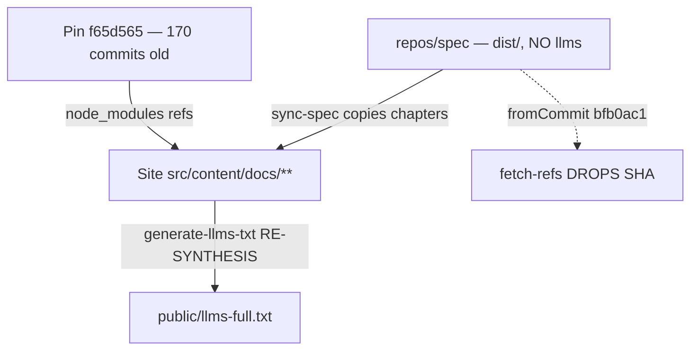
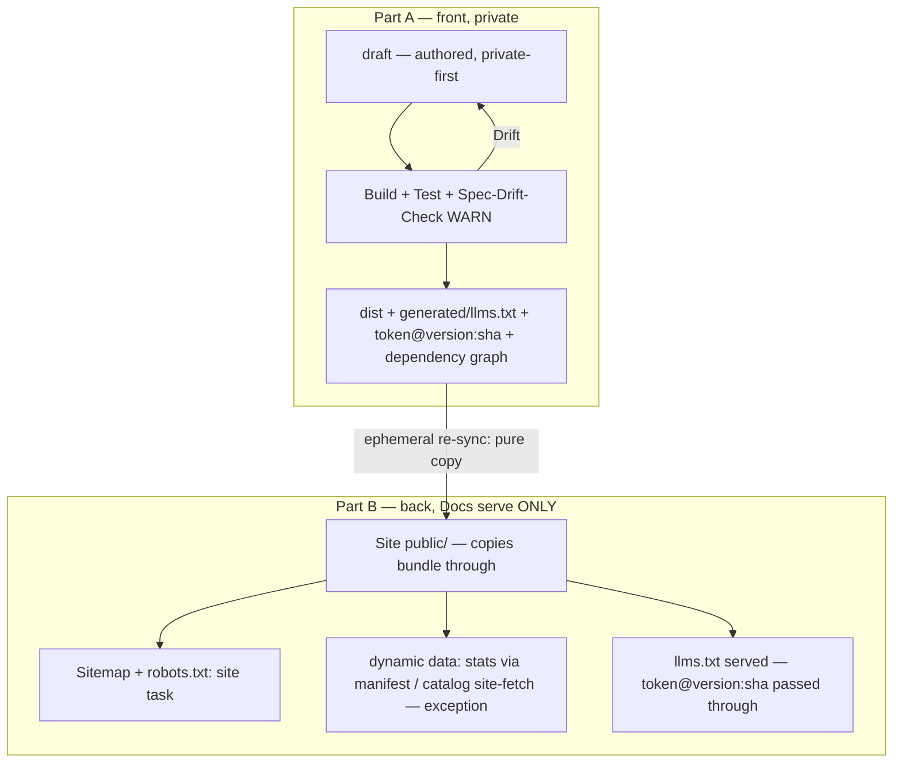

> **Informative.** This chapter is a verified snapshot, not a set of binding rules. It records the current state of the organization's three spec repos and sets it against the end-to-end target, so that the later build phases work from one grounded baseline instead of re-deriving the state each time.

The state recorded here is **[FAKT]** — a verified fact, not an assumption. It was established by **11 empty-context agents** (7 research + 4 quality-gate), each checking the live repos with file:line / commit granularity, rather than inferred. It is deliberately kept apart from the design *assumptions* of the rebuild: the target this snapshot is contrasted against is the decided direction (F14 = B — the spec generates content, the docs only serve it), whose feasibility the rollout still has to prove.

---

## The Three Spec Repos Today

The three spec repos differ on structure, on where `llms` content is generated, and on how they publish. The single verified row that matters is the third column: only memo-init generates its `llms` content on the site side today, and that is the drift the lifecycle removes.

| Repo | Structure | Families/NS | Content generation (llms) | Publish |
|------|-----------|-------------|---------------------------|---------|
| memo-init `repos/spec` | medium-first (→ namespace-first) | 4: memo/session/spec/workbench | **NONE** (deleted in M058) → site re-synthesizes today | github.io (pin 170 commits old) |
| flowmcp `flowmcp-spec` | medium-first | 3: specification/grading/best-practice | **Spec level** (`generated/llms.txt`) | github.io; auto-commit bots |
| personal-brand `specs-private` | **namespace-first** (model) | 5 NS | **Spec/dist level** (`dist/<ns>/…/llms.txt`) | offline → promote → a6b8-public |

---

## Current Delta — memo-init (today: generation site-side, drifting)

memo-init is the repo with the drift. Its spec `dist/` carries no `llms` bundle (deleted in M058), so the site re-synthesizes the content itself, and the pinned ref the site consumes is 170 commits behind the spec head — two independent sources of drift.

---

## End-to-End Target

The diagram below is the end-to-end **target** (F14 = B — the spec generates, the docs only serve), against which the current delta above stands: what drifts today because generation happens site-side is resolved by moving generation to the spec and letting the docs pass the finished bundle through.

---

## Evidence

> **[FAKT].** The current state on this page is a **verified fact, not an assumption**. It was established by **11 empty-context agents** (7 research + 4 quality-gate), each checking the live repos with file:line / commit granularity (the references quality-gate returned PASS).

This snapshot is drawn verbatim from the two ground-truth records the memo maintains — cited here as references, not as live site links (they live in the memo, not in this repo):

- `context/verified-spec-landscape.md` — Part A, the verified spec landscape (4 empty-context agents).
- `context/verified-publish-backend.md` — Part B, the verified publish backend (2 empty-context agents).

---

<!-- IMPLEMENTED-BY — rendered backlink lives in the dist (generated/bridge/<family>/<stem>.backlink.md); source stays authored-only (F2 Dist-Split) -->
## Related

- [./08-spec-lifecycle.md](/spec/spec-lifecycle/) — the Spec-Lifecycle meta-spec whose current-state baseline this chapter records.
- [./05-publishing-principle.md](/spec/publishing-principle/) — the private-first publishing principle the lifecycle generalizes org-wide.
- [./00-overview.md](/spec/overview/) — the Meta-Specification entry point this family belongs to.
