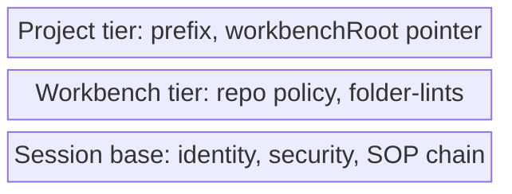

# 05. The .session Config Cascade

| | |
|---|---|
| Status | Draft |
| Depends on | [01-genesis-root.md](./01-genesis-root.md) |
| Related | [02-enforcement.md](./02-enforcement.md), [06-namespace-registry.md](./06-namespace-registry.md), [07-doctor-init.md](./07-doctor-init.md) |

The machine-readable form of the SOP chain (skills, dependency edges, namespace reservations) is a **config** the PreToolUse gate reads. This chapter specifies where that config lives, how it merges across tiers, and the one-time move that relocates it from the workbench tier down to the session tier. The deterministic gate that reads it is specified in [02-enforcement.md](./02-enforcement.md); the structure of the registrant blocks inside it is specified in [06-namespace-registry.md](./06-namespace-registry.md).

---

## The Entry Point Moves Down a Tier

Today the only active registry is project-scoped — `.workbench/registry.json`, carrying the single live edge REQ-061 (`memo-init → memo-sop`, `when:pre`). Because the workbench is itself just **one session-SOP application** above the genesis root ([01-genesis-root.md](./01-genesis-root.md)), the config that anchors the chain belongs at the **session tier**, not the workbench tier.

A new per-location **`.session/config.json`** therefore becomes THE entry point the PreToolUse hook resolves. The chain edges, the registered SOPs, and the namespace reservations move one tier **down** — out of `.workbench/`, into `.session/`. What stays in `.workbench/` is only what is genuinely workbench-specific (repo facing/visibility/remote policy, folder-lints).

---

## What `.session/config.json` Is — The Fields

Before the merge mechanics, this is **what the config holds**, separately from *how* the tiers combine it. `.session/config.json` is the single declarative file the genesis tier resolves: it carries the session's identity, its trust level, the registered SOP blocks, and the precondition edges between them. Its top-level fields are:

| Field | Holds |
|-------|-------|
| `sessionId` | **identity** — one id per session, resolved by the genesis tier and never overridable by a higher tier. |
| `security` | the resolved **trust level**; a project may never self-elevate it (monotonicity, [01-genesis-root.md](./01-genesis-root.md)). |
| `sops[]` | the **registrant blocks** — one per reserved **namespace**. Each block names its `owner` and `tier`, reserves a namespace, and declares the `cli` it ships, the `folders` it owns, and the `skills[]` it contributes ([06-namespace-registry.md](./06-namespace-registry.md)). |
| `requirements[]` | the fine, cross-namespace **pre-gate edges** (entry point → skill, with `when: pre`/`post`) the PreToolUse hook evaluates ([02-enforcement.md](./02-enforcement.md)). |
| `assertions[]` | the **policy checkpoint rows** — read-receipt requirements (a `requiresGroup` that must be read by the time a named `checkpoint` skill fires, `onMissing:"redirect"`), fed ONLY by policy blocks; the policy-axis counterpart to `requirements[]`, never mixed with it ([06-namespace-registry.md](./06-namespace-registry.md)). |

The two newer dimensions a registrant now carries — the **`folders`** a namespace owns and the **`namespaces`** themselves (each reserved exclusively, one owner apiece) — are declared *inside* `sops[]`, not as separate top-level authorities. The reserved-namespace set and the folder-ownership map are therefore **views over `sops[]`**, which keeps the config single-source by ownership rather than by repetition. *How* these fields then merge across tiers is answered in the cascade mechanics that follow.

### Annotated Example — `.session/config.json`

The block below is an **illustrative** `.session/config.json` (placeholders, not real values); the `//` comments annotate each field:

```jsonc
// .session/config.json — the genesis-tier config the PreToolUse gate resolves (EXAMPLE)
{
  // Identity: one id per session — resolved here, never overridden by a higher tier.
  "sessionId": "<session-uuid>",

  // Security: the resolved trust level. A more-specific tier may never raise it.
  "security": { "level": "<trust-level>" },

  // sops[]: the registrant blocks — one per reserved namespace (list-union by `namespace`).
  "sops": [
    {
      "namespace": "memo",            // reserved, exclusive discovery handle (one owner)
      "owner": "memo-init",           // the single unit that maintains this block
      "tier": 2,                       // 0 = genesis root, ascending
      "cli": "memo",                   // the binary / CLI namespace this Tool ships
      "folders": [ ".memo/" ],        // the folders this namespace owns
      "requires": [],                 // empty: memo↔workbench is a sibling convention, not a coarse requires[] edge (F2=A, see 06-namespace-registry.md)
      "skills": [                      // the declarative "contributes" block
        { "id": "memo-init", "signals": [ "attributionSkill:memo-init" ] },
        { "id": "memo-sop",  "signals": [ "attributionSkill:memo-sop"  ] }
      ]
    }
  ],

  // requirements[]: the fine, cross-namespace pre-gate edges the hook evaluates.
  "requirements": [
    { "id": "REQ-061", "entrypoint": "memo-init", "requires": "memo-sop", "when": "pre" }
  ],

  // assertions[]: policy checkpoint rows — read-receipts owed at a named checkpoint
  // (list-union by id, fed ONLY by policy blocks, never mixed with requirements[]).
  "assertions": [
    { "id": "REQ-NODE-SEC-FINALIZE", "checkpoint": "memo-finalize", "requiresGroup": "security",
      "mode": "all", "when": "landing", "onMissing": "redirect" }
  ]
}
```

---

## The Three-Tier Cascade

The config is a cascade in the git/kustomize sense: a base set of values that more-specific tiers extend and merge, read **bottom-up**, an absent tier contributing nothing.

```
.session/config.json   (Genesis base — identity, security, SOP chain, namespaces)
   ↑ extended/merged by
.workbench/config.json (Workbench tier — repo facing/visibility/remote, folder-lints)
   ↑ extended/merged by
Project tier           (project specifics — prefix, optional workbenchRoot pointer)
```

A layered cascade reads as a stack — the more-specific tiers overlay the base, which is exactly what a block stack shows:



The base tier carries identity and the chain; the overlays stay thin. The cascade MUST stay shallow — a project does not introduce a fourth authority, it only contributes its own specifics over the base.

---

## Per-Concern Ownership — Two Structures, Two Merge Rules

The config holds **two separate top-level structures with different merge semantics**, and the two MUST NOT be conflated (conflating override-scalars with merge-collections is the classic cascade bug). One concern has exactly one owning tier; single-source is enforced by **ownership**, not prose.

| Concern | Owning tier | Override / merge |
|---------|-------------|------------------|
| `sessionId` (global) · per-namespace ids under `options` (e.g. `options.memo.memoId`) | session | resolved, not overridable (global-per-session) |
| Security / trust level | session | resolved, NOT cascaded — a project may never self-elevate (monotonicity, see [01-genesis-root.md](./01-genesis-root.md)) |
| `sops[]` (registrant blocks: namespace+owner+tier+skills[]+optional requires[]) | session base + drop-in merge | **list-union by `namespace`** (one block per namespace) |
| `requirements[]` (fine entrypoint→skill pre-gate edges, e.g. REQ-061) | session base + merge | **list-union**; fed ONLY by SOP-instance blocks ([06-namespace-registry.md](./06-namespace-registry.md)) |
| `assertions[]` (policy checkpoint read-receipt rows) | session base + merge | **list-union by id**; fed ONLY by policy blocks; never mixed with `requirements[]` ([06-namespace-registry.md](./06-namespace-registry.md)) |
| reserved namespaces | session | unique-key override; collision = error |
| disable switch / sentinel / canary | `~/.claude/session/` | — (recovery reachable above any project) |
| repo facing/visibility/remote | workbench (`.workbench/`) | override per repo |

The collection concerns (`sops[]`, `requirements[]`) **merge** as list-unions so each tier and each registrant contributes its own entries. The scalar concerns (identity, security/trust level) are **resolved, not cascaded**: they live only in the session tier and the cascade deliberately does not apply to them, so a more-specific tier can never raise its own trust level. This is the one place the cascade differs from git/XDG, and it preserves the monotonicity property of [01-genesis-root.md](./01-genesis-root.md).

**Visibility is a tier assignment today; its machine-readable marker is follow-up.** The `visibility` concern in the table above is currently only an **ownership assignment** — it belongs to the workbench tier (`.workbench/`). Its **machine-readable public/private marker** — the field that stamps each namespace or repo as an outward *Orchestrator* (public / entry point) vs. an internal *Component* (private / reusable) — is **follow-up work**: it is **not** part of this version's config shape and is specified in a later phase of this landscape work.

---

## Skills Live Inside Their `sops[]` Block

The old **flat `skills[]` list no longer exists**. Skills are now declared **inside** their owning `sops[]` block (`namespace` + `owner` + `tier` + `skills[]` + optional `requires[]`), as specified in [06-namespace-registry.md](./06-namespace-registry.md). The cascade merge is therefore a **namespace-block union** (one block per namespace), not a flat skill union: two tiers each contributing skills do so by contributing their respective namespace blocks, and a namespace collision is an error rather than a silent concatenation.

Only SOP-instance blocks feed `requirements[]` (the pre-gate edges); a catalog block (e.g. FlowMCP) carries skills but contributes no edge and is therefore never a gate; a **policy block** (e.g. `node`) feeds the separate `assertions[]` collection — checkpoint read-receipts enforced only as a redirect — and is likewise never a `when:pre` predecessor — see [06-namespace-registry.md](./06-namespace-registry.md).

---

## Project State vs Machine-Global State — `.session/` vs `~/.claude/session/`

The spec uses **two sharply distinguished** paths whose names are deliberately close but whose scope is not:

| Path | Scope | Holds |
|------|-------|-------|
| `.session/` | **per-place** (sibling of `.workbench/`, one per tree) | this location's `config.json`: chain edges, namespaces, registrant blocks |
| `~/.claude/session/` | **machine-global** (one per machine) | recovery state above any project: disable-switch sentinel, canary fixtures, logs |

Recovery primitives live in the machine-global home precisely so they remain reachable when no project config is present. The per-place name `.session/` was chosen over `.context/`, which was **rejected** because it would collide with the authored-content folder `context/`.

---

## Migration — A One-Time Move, No Dual-Read

Moving REQ-061 out of `.workbench/registry.json` into `.session/config.json` is a **behavioural change to the live gate**, so it MUST be performed as a single deliberate step, never silently:

- **One-time move via `session init`** ([07-doctor-init.md](./07-doctor-init.md), which carries the migration): `init` proposes the relocated config as a **reviewed diff** and never auto-overwrites an existing file (REQ-SS-NOWRITE).
- **Canary-guarded:** the SessionStart canary MUST be green **before and after** the move, so a regression self-discloses immediately.
- **No dual-read** (explicitly excluded): the hook reads exactly one resolved config. There is no transition window in which both `.workbench/registry.json` and `.session/config.json` are consulted — the move is single-source by construction, not by a fallback chain.

This chapter is spec-first: it **describes** the migration as the intended one-time change at the live gate; it does not perform it.

---

## Carrier Harmonization (Memo 049) — One Carrier

Memo 049 left an open tension: the SOP trägerschaft — *who is registered, what they own, and which edges gate* — appeared to have **two** carriers, `.workbench/registry.json` (`skills[]` / `addons[]` / `requirements[]`) at the workbench tier and the session `sops[]` blocks here. Two carriers for one fact is precisely the drift source the config-single-source rule exists to remove, so the tension resolves to **exactly one carrier**:

- **The single authored carrier is the session `sops[]` set** in `.session/config.json`. It is the one source of truth for registration (namespaces, owners, tiers), the skills a namespace contributes, and the `requires[]` / `requirements[]` edges. The move-down migration above is what makes this true at the live gate: the registration fact lives at the session tier, not the workbench tier.
- **`.workbench/registry.json` is not a parallel authored carrier.** After the one-time move it is either **removed** (its content having folded into the session config) or, where the workbench tier still needs a discovery surface, it is a **generated read-projection** over the session `sops[]` — filtered to the workbench-tier blocks — never a second hand-authored source. A projection is regenerated from the carrier; it is never edited to lead it.
- **The file the workbench spec still names is described, not re-authored.** The workbench CLI chapter continues to name `.workbench/registry.json` as the workbench-tier *discovery view* ([20-cli.md](/workbench/cli/)); this section fixes its **status** — a projection of the one carrier, not a co-equal source. No live config is touched here; this is the normative decision the later carrier-migration code implements.

The rule generalizes the no-dual-read guarantee from the single REQ-061 edge to the whole carrier: one authored source, and any second surface a generated projection of it.

---

## The env File Naming Schema — `<name>.<stage>.env`

Beside the resolved `config.json`, a location's **environment files** carry the stage-specific
values a project boots against. Their filenames follow one declared schema so a stage's env file
is discoverable by name, the same "meaning lives in the name" principle the script family uses:

- **Schema:** `<name>.<stage>.env`, with the `<stage>` drawn from the operating stages
  `development` / `staging`. The dotfile form drops the `<name>` to a leading dot — `.<stage>.env`
  — so the two canonical files are **`.development.env`** and **`.staging.env`**.
- **Stage-paired with the script family.** Each stage names *one* script and *one* env file that
  share the same stage word: `dev.sh` ↔ `.development.env`, `staging.sh` ↔ `.staging.env` (the
  script family lives in [21-environment-scripts.md](/workbench/environment-scripts/)). The pairing
  is what makes "which env does this stage boot?" answerable from the filename alone.

### The Schema Is Reported, Never Auto-Applied

A deviation from the schema is **surfaced, not silently corrected**. `session doctor`
([07-doctor-init.md](./07-doctor-init.md)) reports a mis-named stage env file with the fix command,
and it obeys two hard bounds:

- It **MUST NEVER auto-rename** a stage env file — it prints the `mv` the developer may run, it
  does not run it.
- It **MUST NEVER touch `.env`** — the schema check is read-only over filenames; `.env` is
  diagnose-only and is never read for values, never written, and never renamed. This is the
  no-auto-write / no-overwrite discipline (REQ-SS-NOWRITE) applied to env files, and it matches the
  doctor's read-only contract ([07-doctor-init.md](./07-doctor-init.md): *"never — read-only, prints
  the fix command per failing item"*).

### Secrets Stay Out of the Repo and Out of the Spec

The schema governs **names, not values**. No real secret ever appears in a spec page or in the
repository:

- The **real** `.env` (and the stage files) live in the **parent directory**, outside the repo.
- At the repo root, only a **`.example.env`** with **dummy** placeholders is committed — never real
  keys.
- The CLI doctrine already forbids reading secrets from flags or env ([04-cli.md](./04-cli.md),
  rule 7 — *"no secrets read from flags or env"*), so the schema check inspects filenames only.

---

## Conformity Requirements

The cascade's binding `MUST`s are authored here **prose-first**: each block's `statement` faces generation (it shapes how the config and its loader are built) and its `check` faces the finalization gate with a ternary verdict. Today only the `flag > env > null` identity resolution ships (`memo session resolve`); the `.session/config.json` file tier and the `config.d/*` merge loader are the spec'd **target**, so both rules below carry the honest `grade: todo`.

The resolution precedence and the single entry point are the cascade's load-bearing contract; the file tier and loader are not yet shipped, so the grade is `todo`:

```requirement
{
  "id": "REQ-990",
  "title": "The config cascade resolves deterministically, flag > env > file",
  "statement": "Session resolution MUST be deterministic with precedence `flag > env > file`, and `.session/config.json` MUST be the single entry point the genesis tier resolves. An absent value resolves to `null` with an explicit source (no silent default), and a more-specific tier MUST NOT raise the resolved trust level (monotonicity).",
  "scope": { "repos": [], "categories": ["session"], "tags": ["session-sop", "config-cascade", "precedence"] },
  "severity": "blocker",
  "check": {
    "kind": "assertion",
    "assertions": [
      "Re-resolving the same inputs yields the same result (deterministic)",
      "A flag value overrides an env value, which overrides the file value; an absent value resolves to null with source 'none'",
      "A more-specific tier cannot raise the resolved session trust level"
    ]
  },
  "grade": "todo"
}
```

The two-structures-two-merge-rules contract guards the classic cascade bug (conflating override-scalars with merge-collections); the merge loader is not yet shipped, so the grade is `todo`:

```requirement
{
  "id": "REQ-991",
  "title": "config.d fragments merge by per-concern semantics",
  "statement": "The cascade MUST merge `config.d/*.json` fragments by their declared semantics: collection concerns are list-unions (`sops[]` by `namespace`, `requirements[]` and `assertions[]` by `id`), while scalar concerns (identity, trust level) are resolved-not-cascaded. Conflating an override-scalar with a merge-collection is forbidden, and a namespace collision is an error, never a silent concatenation.",
  "scope": { "repos": [], "categories": ["session"], "tags": ["session-sop", "config-cascade", "merge"] },
  "severity": "blocker",
  "check": {
    "kind": "assertion",
    "assertions": [
      "sops[] merges as a list-union keyed by namespace; requirements[] and assertions[] merge as list-unions keyed by id",
      "Identity and trust level are resolved once and not overlaid by a more-specific tier",
      "A duplicate namespace across fragments is reported as a collision, not silently concatenated"
    ]
  },
  "grade": "todo"
}
```

The env-file naming schema is a deterministic name check the doctor reports on; the reported-never-mutated rule is the load-bearing half, so this block carries a hard `binary` grade:

```requirement
{
  "id": "REQ-998",
  "title": "Stage env files follow `<name>.<stage>.env`, reported never renamed",
  "statement": "A location's stage environment files MUST follow the naming schema `<name>.<stage>.env` — the dotfile form `.<stage>.env`, so a `development`/`staging` stage pairs its script and env file under the same stage word (`.development.env`, `.staging.env`). A deviation MUST be reported by `session doctor` with its fix command, and the check MUST NEVER auto-rename a file and MUST NEVER touch `.env` (read-only over filenames; real `.env` lives in the parent directory, only a dummy `.example.env` is committed).",
  "scope": { "repos": [], "categories": ["session"], "tags": ["session-sop", "config-cascade", "env-naming"] },
  "severity": "warning",
  "check": {
    "kind": "assertion",
    "assertions": [
      "A stage env file named `.<stage>.env` (e.g. `.development.env`) passes; a deviating name is reported with a fix command",
      "The check never renames a file and never reads, writes, or renames `.env`",
      "No real secret appears in the spec or repo; only a dummy `.example.env` is committed, the real files live in the parent directory"
    ]
  },
  "grade": "binary"
}
```

---


<!-- IMPLEMENTED-BY — rendered backlink lives in the dist (generated/bridge/<family>/<stem>.backlink.md); source stays authored-only (F2 Dist-Split) -->
## Related

- [01-genesis-root.md](./01-genesis-root.md) — the tier model, identity, and the security level this cascade keeps resolved-not-overridable.
- [06-namespace-registry.md](./06-namespace-registry.md) — the structure of the `sops[]` registrant blocks the cascade merges, and `requires[]` vs `requirements[]`.
- [07-doctor-init.md](./07-doctor-init.md) — `session init` carries the one-time migration; `session doctor` validates the resolved config.
- [02-enforcement.md](./02-enforcement.md) — the PreToolUse hook that reads this config and enforces its edges.
