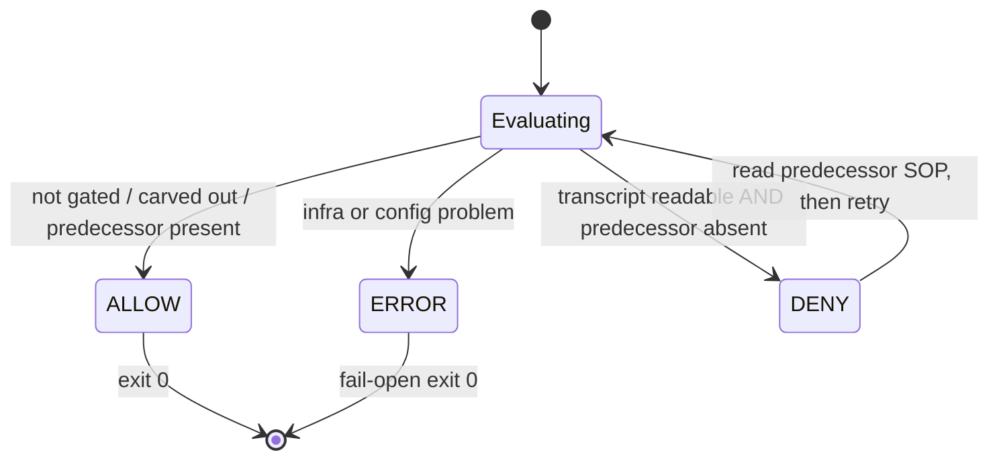
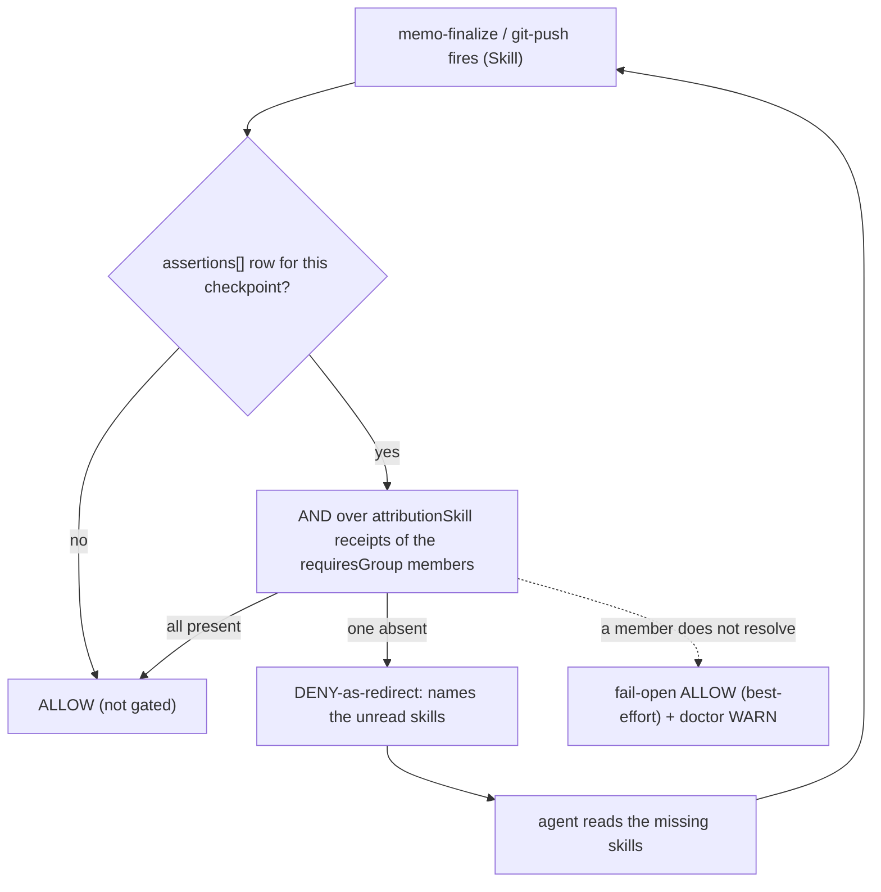

# 02. Deterministic Enforcement

| | |
|---|---|
| Status | Draft |
| Depends on | [01-genesis-root.md](./01-genesis-root.md) |
| Related | [03-recovery.md](./03-recovery.md), [workbench/23-hooks-contract.md](/workbench/hooks-contract/), [workbench/20-cli.md](/workbench/cli/) |

Self-discovery describes what an agent *should* do. Making it **deterministic** — guaranteeing the required predecessor SOP was active before a gated entry point runs, regardless of model behaviour — is the job of the genesis tier, through a Claude Code **PreToolUse hook**. This chapter specifies the contract that hook MUST satisfy. The concrete reference implementation is `sop-precondition.sh`; the contract it realizes is shared with [workbench/23-hooks-contract.md](/workbench/hooks-contract/).

---

## The Registry Is the Entry Point — Read from `.workbench/` Today, Migrating to the Session Tier

The machine-readable form of the SOP chain is a **registry** of registrant blocks and `when:pre` edges (`sops[]` + `requirements[]`, [06-namespace-registry.md](./06-namespace-registry.md)). **The armed gate reads that registry from the workbench tier — `.workbench/registry.json` — united with the machine-global genesis registry.** That union is the current Ist, and this chapter describes the hook as it actually behaves, never a home the code has not yet moved to. The pre-gate edge active in this version is the single project-scoped `memo-init → memo-sop`:

```json
{ "sops": [ { "namespace": "memo", "owner": "memo-init", "tier": 2, "requires": [],
              "skills": [ { "id": "memo-init", "signals": ["attributionSkill:memo-init"] },
                          { "id": "memo-sop",  "signals": ["attributionSkill:memo-sop"]  } ] } ],
  "requirements": [ { "id": "REQ-061", "entrypoint": "memo-init",
                      "requires": "memo-sop", "when": "pre" } ] }
```

**Migration, not dual-read, not a third home.** The registry's declared destination is **one tier down**, at the session-tier `.session/config.json` — a **one-time migration** carried by `session init` ([05-config-cascade.md](./05-config-cascade.md), [07-doctor-init.md](./07-doctor-init.md)), after which the hook reads the session home and the workbench copy is retired. **Until that migration has run, the hook reads `.workbench/registry.json`, and this spec MUST NOT claim `.session/config.json` is read while it is not** — the spec tracks the Ist hook, never a target the code has not yet reached. There is deliberately **no dual-read and no third registry home**: the read set is exactly {`.workbench/registry.json`} ∪ {the machine-global genesis registry}, and the session-tier file **replaces** — never adds to — the workbench home once the migration lands. A machine-global registry at `~/.claude/session/registry.json` (the **session** tier, not a workbench path) is the natural home for cross-project edges; activating it is the same follow-up migration, not a parallel source. The registry is a privilege artifact and MUST be protected from silent rewrite (a Write/Edit guard; see [03-recovery.md](./03-recovery.md)).

**The SOP read-chain is normative.** The chain a memo entry point sits behind is `session-sop → memo-sop → memo-init`: the session genesis root is the parent every layer reads first, `memo-sop` extends it, and `memo-init` is gated behind `memo-sop`. Under the flat topology (F2=A) `workbench-sop` is a **sibling** extension of the session — **not** a link between session and memo — so it is deliberately absent from this chain ([06-namespace-registry.md](./06-namespace-registry.md)). Only the `memo-init → memo-sop` edge (REQ-061) is armed in this version; the `session-sop → memo-sop` parent edge is *declared now, enforced when present* ([01-genesis-root.md](./01-genesis-root.md)). The chain is worth gating because reading `memo-sop` first measurably improves the work — on the order of a ~20 % lift, an estimate, not yet a measured figure.

**Absence is fail-open and LOUD.** When the registry the gate reads (`.workbench/registry.json` today; `.session/config.json` after the migration) is absent the gate MUST treat it as a configuration problem that **fails open** (ALLOW, exit 0) — never a lockout — while emitting a **loud SessionStart warning** so the missing config is noticed rather than silently tolerated (REQ-SS-CONFIG-LOUD). Enforcement deliberately starts **permissive**: warn first, tighten later. The strict, refusing posture lives in the foreground `session doctor` / `session init` ([07-doctor-init.md](./07-doctor-init.md)), not in the always-on hook.

---

## The Command-Class Preconditions Are Matrix-Sourced

The single `memo-init → memo-sop` entry-point edge above is not the only precondition this gate backs. The broader **command-class** preconditions — a `git …` command behind `git-sop`, `memo …` behind `memo-sop`, `npm …` behind `npm-security`, `flowmcp …` behind `flowmcp-sop`, a `node`-write behind `node-sop`, and `git worktree …` behind `workbench-sop` — are governed by the **same** three-state contract this chapter fixes. Those class→SOP edges are **not** hardcoded in the hook: their single normative source is the **declarative command→SOP matrix** at [workbench · hooks-contract](/workbench/hooks-contract/) — a `{ class, trigger, requires }` registry, form-identical to `folder-lints.json` — whose edge *targets* (the umbrella SOPs) this family reserves in [06-namespace-registry.md](./06-namespace-registry.md).

The gate resolves a command-class precondition with the mechanism specified here and nowhere else: the jq-structured `attributionSkill` signal scan (REQ-SS-SIGNAL below), the three-state ALLOW / DENY-as-redirect / fail-open contract, and the loud fail-open on any infra fault. The matrix is the **data** (which class requires which umbrella SOP); this chapter's contract is the **mechanism** that reads it. A dangling matrix edge — a `requires` target that is not installed — is refused exactly as a dangling `when:pre` edge is (REQ-SS-EDGEVALID), so the same `registry-validate` gate keeps both edge sets honest.

---

## The Signal Is Structured, Never a Substring

The predecessor signal MUST be read **jq-structured** from the harness-authored `attributionSkill` field of the session transcript. It MUST NOT be a raw substring match over transcript text: transcript content includes user- and model-influenced text, so a substring grep over it is a **forgeable gate**. Only the structured `attributionSkill` value — which the harness, not the model, writes — is trusted. The scan MUST be bounded and BSD-safe (`tail -r` + early-exit, never `tac`).

The hook locates `.session/config.json` from the **pinned** project root, not from a live `cwd`: the root is resolved once at SessionStart and read from the pin thereafter, so a `cd` mid-session can never repoint the gate at a sister project's config ([08-identity-pin.md](./08-identity-pin.md), [09-root-detection.md](./09-root-detection.md)).

---

## The Three-State Contract

The gate has exactly three outcomes. Two are decisions; the third is the fail-safe.

| State | Meaning | Exit |
|-------|---------|------|
| **ALLOW** | not gated, carved out, or the predecessor signal is present | 0 |
| **DENY** | the transcript is readable AND the required predecessor is genuinely absent | 2 |
| **ERROR (fail-open)** | any infrastructure or configuration problem | 0 + stderr note |

The decision table the reference hook MUST implement:

| Condition | Result | Exit |
|-----------|--------|------|
| disable switch set (`$SESSION_SOP_DISABLE` or the sentinel) | ALLOW | 0 |
| tool ≠ `Skill` | ALLOW | 0 |
| the registry the hook reads (`.workbench/registry.json` today) absent | ERROR (fail-open) + LOUD SessionStart warning | 0 |
| `jq` missing · `transcript_path` empty/unreadable · config malformed | ERROR (fail-open) | 0 |
| `transcript_path` is a subagent transcript (`…/subagents/agent-*.jsonl`) | ALLOW (carve-out) | 0 |
| the entry point is not gated by a when:pre edge | ALLOW | 0 |
| the required skill is **not installed** (dangling edge) | ERROR (fail-open) | 0 |
| transcript readable AND predecessor `attributionSkill` found (jq) | ALLOW | 0 |
| transcript readable AND predecessor genuinely absent | DENY | 2 |
| firing skill is a checkpoint in `assertions[]` AND every `requiresGroup` member receipt present | ALLOW | 0 |
| firing skill is a checkpoint in `assertions[]` AND a member receipt absent | DENY-as-redirect (names the unread skills) | 2 |
| a `requiresGroup` member does not resolve (e.g. a pending, not-yet-registered skill) | ERROR (fail-open) + doctor WARN | 0 |

The last three rows are the **policy checkpoint** branch (see [Policy Checkpoints — The Landing Gate](#policy-checkpoints--the-landing-gate) below); the rows above them are the unchanged `when:pre` predecessor branch. The two branches are evaluated independently on the same `Skill` call, and either may DENY-as-redirect.

The governing principle: **the gate never fail-CLOSES on infrastructure trouble** (FAILOPEN), and **never produces an unrecoverable lockout** (EDGEVALID). A DENY is a *redirect*, not a dead end — its message tells the agent to read the predecessor SOP first, after which the same entry point passes.

A gate is a state machine, so its three outcomes read as states. The key property the diagram makes visible: `ALLOW` and the fail-open `ERROR` both terminate at exit 0, while `DENY` is a self-redirect — it returns to the decision once the predecessor SOP has been read, never a terminal dead end:



---

## Never Blocking, Always Pre-Checked

The three-state contract has a companion invariant that binds the gate and the foreground doctor into
one guarantee: the enforcement path is **never blocking**, and **every runtime precondition it depends
on is pre-checked at init** rather than discovered mid-session. The two halves are inseparable — the
gate may stay permissive *because* the doctor and `init` verify, up front, that the machinery the gate
reads is present and resolvable (a readable registry, an installed skill for every edge, `jq` on PATH,
a unique namespace per block). A precondition that is checked at the boundary into work never has to be
enforced by blocking during it.

This is why the strict, potentially-rejecting checks live in the foreground pair and never on the
always-on hook: **pre-checking replaces blocking.** The doctor is the runtime superset of the
build-time edge validator, so the same precondition is verified at three timings — build, session
start, and the deliberate foreground run — and the runtime path is left free to fail open.

The invariant also fixes the shape of the error surface: **there is exactly one checkable error path**,
and it is minimal. The gate resolves to exactly three outcomes (ALLOW, DENY-as-redirect, fail-open
ERROR), and every infrastructure or configuration fault collapses onto the single fail-open ERROR
branch rather than fanning out into many distinct failure modes. One error path is auditable and cannot
hide a lockout in a rarely-hit branch; a proliferation of error paths is exactly the surface an
unrecoverable lockout hides in. The foreground doctor is where those faults are surfaced with their
fixes — one place to read, one place to repair.

---

## Policy Checkpoints — The Landing Gate

The `when:pre` branch gates an entry point behind a predecessor SOP. A **policy block** ([06-namespace-registry.md](./06-namespace-registry.md)) needs a different shape of gate: *"by the time work lands, a sub-set of standards must have been read."* That is expressed by the top-level **`assertions[]`** collection ([05-config-cascade.md](./05-config-cascade.md)) and evaluated by the **same** PreToolUse hook — there is no second hook.

An `assertions[]` row names a **checkpoint** skill, a **`requiresGroup`**, and an `onMissing` policy:

```jsonc
{ "id": "REQ-NODE-SEC-FINALIZE",    "checkpoint": "memo-finalize", "requiresGroup": "security",     "mode": "all", "when": "landing", "onMissing": "redirect" }
{ "id": "REQ-NODE-SEC-PUSH",        "checkpoint": "git-push",      "requiresGroup": "security",     "mode": "all", "when": "landing", "onMissing": "redirect" }
{ "id": "REQ-NODE-VERIFY-FINALIZE", "checkpoint": "memo-finalize", "requiresGroup": "verification", "mode": "all", "when": "landing", "onMissing": "redirect" }
```

When the firing skill matches a row's `checkpoint`, the hook resolves the row's `requiresGroup` over the union of all blocks and takes the **AND** over its members' `attributionSkill` receipts (`mode:"all"`). All present ⇒ ALLOW. One absent ⇒ **DENY-as-redirect**: a redirect, not a dead end, whose message names exactly the unread skills, after which the same checkpoint passes. The landing gate fires at the next *real* skill the standards must be settled by — `memo-finalize` (primary) with `git-push` as the irreversible-outward backstop; there is no dedicated landing skill to key on.

Three invariants bound the checkpoint branch, all inherited from the three-state contract:

- **Never a hard lock.** `onMissing` is `redirect` only; a checkpoint group may never produce a terminal block.
- **Never blocks the workflow** (REQ-SS-WORKFLOW). Checkpoints sit on `memo-finalize` / `git-push`; `memo-init` / `memo-plan` / `memo-revision-*` are never checkpoints and run unimpeded.
- **A non-resolving member fails open.** If a `requiresGroup` member is not installed (e.g. a standard documented but not yet registered as a skill), the gate cannot honestly assert "all read", so it degrades to fail-open ALLOW (best-effort, **no** hard guarantee) and the foreground doctor reports the unresolved member ([07-doctor-init.md](./07-doctor-init.md)). An `assertions[]` id collision is likewise a fail-open ALLOW at the hook, never a redirect; it is rejected strictly only in the foreground doctor.

The landing gate as a top-down flow:



---

## Required Properties

| Requirement | Statement |
|-------------|-----------|
| **REQ-SS-PRECHECK** | The enforcement path is never blocking AND every runtime precondition it depends on is pre-checked at init/doctor rather than discovered mid-session; there is exactly ONE checkable error path (the fail-open ERROR branch) and the error surface is kept minimal. Pre-checking replaces blocking. |
| **REQ-SS-FAILOPEN** | Any infra/config problem ⇒ ALLOW (exit 0) with a stderr note. Never deny on trouble. |
| **REQ-SS-CONFIG-LOUD** | An absent registry (the `.workbench/registry.json` the hook reads today; `.session/config.json` after the `session init` migration) ⇒ ALLOW (fail-open) **and** a loud SessionStart warning; enforcement starts permissive, strict checks live in `session doctor`. |
| **REQ-SS-SIGNAL** | The predecessor signal is matched jq-structured on `attributionSkill`, never as a substring. |
| **REQ-SS-EDGEVALID** | An edge to a non-installed skill fails open; a build-time `registry-validate` MAY refuse it. |
| **REQ-SS-SUBAGENT** | A subagent transcript is carved out (ALLOW) — it carries no parent attribution chain. |
| **REQ-SS-BSD** | The transcript scan is bounded + BSD-safe (`tail -r`, early-exit), never `tac`. |
| **REQ-SS-DISABLE** | A disable switch (env var + sentinel file) short-circuits to ALLOW as the first action. |
| **REQ-SS-CANARY** | A SessionStart canary re-verifies the gate against known fixtures and auto-disables on drift. |
| **REQ-SS-NOWRITE** | Live `~/.claude/` config (settings.json, CLAUDE.md) is changed only additively via a reviewed diff, never auto-written. |
| **REQ-SS-WORKFLOW** | The gate MUST NOT block the memo workflow: `memo-init` / `memo-plan` / `memo-revision-*` run under the active gate (a DENY only redirects through the predecessor SOP). |
| **REQ-SS-POLICY** | A policy block gates only via `assertions[]` checkpoint rows, only as `onMissing:"redirect"`, never as a `when:pre` predecessor. A non-resolving `requiresGroup` member fails open (best-effort); an `assertions[]` id collision fails open at the hook and is rejected only in the foreground doctor. Defined in [06-namespace-registry.md](./06-namespace-registry.md). |

---

## Wiring Is Additive and Reviewed (REQ-SS-NOWRITE)

The gate is wired into `~/.claude/settings.json` as a PreToolUse hook on the `Skill` matcher, **additively**: the existing `*` and `Write|Edit` hooks remain. Because `settings.json` is the single point of failure for all hooks, it MUST NOT be auto-written — a change is presented as an exact diff, backed up, validated with `jq`, and the matcher is asserted present after the edit. The same discipline applies to the `~/.claude/CLAUDE.md` genesis block.

---

## The Block-Flip Precondition — The CLI-Receipt-Leaf (Named, Not Armed)

Enforcement starts permissive (warn) and is meant to **tighten later** — to *flip* a given edge from
fail-open warn to a true block. That flip has a precondition that is **not yet met**, and this section
**names** it so the path is explicit; it deliberately builds no arming here.

The unmet precondition is a **receipt gap**. The gate proves a predecessor SOP ran by finding its
structured `attributionSkill` receipt in the transcript. An SOP invoked through the `Skill` tool leaves
that receipt; an SOP reached another way — most notably a **`/slash` command** — need not, so a genuine
read can be invisible to the gate. Flipping an edge to block while that gap is open would deny a session
that has, in fact, done the right thing — precisely the lockout the fail-open posture exists to avoid.

The **CLI-Receipt-Leaf** is the named path that closes the gap: a foreground `memo` leaf that a slash
entry point (or any non-`Skill` path) runs to **emit the same structured receipt** the gate already
trusts, so a read performed off the `Skill` tool becomes a first-class, jq-readable signal rather than
an invisible one. Once every gated entry point can produce a receipt through one channel — the `Skill`
tool or the CLI-Receipt-Leaf — the `/slash` bypass is closed and a specific edge may be flipped to block
with no lockout risk.

This is a **named future precondition, not a build order.** The block-flip stays gated on the
CLI-Receipt-Leaf existing; this version arms nothing new, and the flip remains out of scope until the
receipt channel is real. It is recorded here so the tightening path is a named, auditable step rather
than an implicit assumption.

---

## Scope: Fail-Open Substrate, Arming Deferred

The enforcement layer this chapter specifies is a **fail-open substrate**: it declares the command→SOP
matrix, resolves and pre-checks preconditions, and **reports**. It arms nothing. Every path terminates
in ALLOW or a DENY-as-redirect that always has a forward exit; none produces a block or a lockout
(REQ-SS-FAILOPEN, REQ-SS-PRECHECK). This is the normative scope boundary of the enforcement work:
**everything here is fail-open and reports; nothing is armed; arming is a separate, deliberate,
user-gated step**, never a side effect of shipping the substrate.

What this layer **is** — substrate, built and reporting:

- the declarative command→SOP matrix ([workbench · hooks-contract](/workbench/hooks-contract/)), the single source of the class→SOP edges;
- the foreground `session doctor` expanded from four checks to seven, plus the SessionStart canary that re-verifies the gate against fixtures (REQ-SS-CANARY);
- the never-blocking / pre-checked-at-init invariant with its single fail-open error path (REQ-SS-PRECHECK);
- a work-mode state with its config gate, and the dashboard that renders the substrate's state.

What stays **deferred and user-gated** — named here, armed only by a later, deliberate step, never here:

- the warn→**block flip** of any edge (`SESSION_SOP_MODE=block`), itself gated on the CLI-Receipt-Leaf existing (see [The Block-Flip Precondition](#the-block-flip-precondition--the-cli-receipt-leaf-named-not-armed) above — not restated here);
- a **hard folder block** — the folder-lint edges stay warn-only;
- the **live promotion** of the per-role agents into `~/.claude/agents`;
- the **`settings.json` wiring** of the canary and command hook into the live `~/.claude/` config, which stays additive-and-reviewed and is never auto-written (REQ-SS-NOWRITE).

Each deferred capability is its own named, auditable arming step under its own user gate — not an implicit
consequence of this layer being present. The substrate makes the reports; a human decides when, and which
edge, to arm.

---

## The Fail-Closed Target — Security-Critical Gates

The fail-open substrate above is the **interim, unarmed** posture, and it is fail-open-**LOUD**, never silent: a missing store is reported with a loud SessionStart warning, not quietly tolerated ([Absence is fail-open and LOUD](#the-registry-is-the-entry-point--read-from-workbench-today-migrating-to-the-session-tier)). That loudness is what keeps a config gap from disabling enforcement unnoticed today. But *loud-and-permissive* is not the end state for the gates whose silent pass would be dangerous, and this section declares the **target** posture those gates take **once armed** — a declaration, like the other arming steps above; the arming itself stays deferred and user-gated.

The enforcement gates split into two calibrated classes, and they do **not** share a fail direction when armed:

| Gate class | On missing / malformed store, when armed | Why |
|-----------|------------------------------------------|-----|
| **SOP-read chain** (a `when:pre` edge, a command→SOP precondition) | **fail-open-LOUD** — ALLOW + loud warning | A config glitch must never lock the developer out of their own tree; the loud warning already prevents *silent* tolerance. |
| **Security-critical gates** (secret scan; the remote gate refusing a remote outside `repos/`; an unconfirmed `.env` write) | **fail-CLOSED** — DENY | For these, a silent pass on a missing store is worse than a stop: it would let a secret-bearing commit, a stray remote, or an unreviewed `.env` write through. Absence of the store MUST NOT be a bypass. |

- **Fail-closed means the absence of proof is a DENY, not an ALLOW.** When a security-critical gate cannot read the store that tells it whether an action is safe, the armed gate treats the missing answer as *unsafe* and refuses — the same three-state contract, but with the ERROR path routing to DENY rather than fail-open for this class. This is the precise sense of the memo's *no silent pass where a store is missing*: the loud interim warning becomes an armed refusal for the gates that guard secrets, remotes, and `.env`.
- **The root is resolved relatively, never hardcoded.** A gate MUST resolve the workbench/session root through the relative `.session/` marker walk-up ([09-root-detection.md](./09-root-detection.md)), and MUST NOT bake an absolute root path into its logic. A hardcoded absolute root is itself a security defect: it breaks the moment the tree is relocated and can silently point enforcement at the wrong directory — the failure mode a `.session/`-relative resolution removes by construction.
- **Arming stays deferred and user-gated (F8).** Flipping a security gate to its fail-closed target is a named arming step under its own user gate, exactly like the warn→block flip above — never an implicit consequence of this declaration. The substrate reports; a human arms.

This makes the *scalable security architecture* the memo asks for a **declared policy** — a fail-closed target for the security-critical class, a relative-root rule that removes the stale-hardcode failure mode — rather than only a list of today's gaps. Wiring it into a live hook is downstream, `~/.claude/`-touching work and stays user-gated (REQ-SS-NOWRITE).

---

## Conformity Requirements

This chapter is the session family's **`requirementsRef`** — the anchor the family manifest points at for its requirement standard ([23-requirements.md](/specification/requirements/)) — so it carries the family's **richest** inline set. The binding `MUST`s above are authored here **prose-first**: each block's `statement` faces generation (it shapes how a gate, a config, or a CLI leaf is built) and its `check` faces the finalization gate, resolving to a ternary `PASS` / `BLOCKED` / `INCONCLUSIVE`. The structured blocks below are the machine-readable source the per-entry requirement store is **harvested** from. Several rules below describe the always-on PreToolUse hook, which is **spec'd-but-not-yet-armed-live**: those carry an honest `grade: todo` (the score belongs there but the target is not yet shipped), while the rules already enforced by a shipped CLI leaf carry a hard `binary` grade.

**Two id families, one contract set — not a duplication.** The chapter cites requirement ids in two forms, and they are deliberately distinct roles rather than two competing records:

- **`REQ-SS-*`** are the **prose-facing, spec-internal anchors** of the *Required Properties* table above — short handles the narrative cites inline (`REQ-SS-FAILOPEN`, `REQ-SS-SIGNAL`, …). They carry **no** separate store record and are defined only here (as [14-migration.md](./14-migration.md) records).
- **`REQ-9xx`** are the **harvested store records** — the machine-readable blocks below (and their siblings across the family) from which the per-entry requirement store is built.

Where a harvested store block restates a contract a `REQ-SS-*` names in prose, the two are the **same contract seen twice** (readable anchor + harvested store id), never two independent requirements. The `REQ-SS-*` prose anchor is the stable form to cite; a reader resolves it to its harvested store entry through the requirements store, not by treating the two as separate obligations.

The gate's central safety property is a hard-block when the predecessor SOP is genuinely absent. The hook is not yet armed live, so the grade is the honest `todo`:

```requirement
{
  "id": "REQ-982",
  "title": "PreToolUse gate hard-blocks a missing predecessor SOP",
  "statement": "The PreToolUse precondition gate MUST hard-block a gated entry point — DENY with exit 2 — when the required predecessor SOP is genuinely absent (the transcript is readable AND no predecessor `attributionSkill` receipt is present). The DENY MUST be a self-redirect that names the predecessor to read first, after which the same entry point passes; it MUST NOT be a terminal dead end.",
  "scope": { "repos": [], "categories": ["session"], "tags": ["session-sop", "enforcement", "pre-hook"] },
  "severity": "blocker",
  "check": {
    "kind": "assertion",
    "assertions": [
      "With a readable transcript carrying no predecessor attributionSkill receipt, the gate returns DENY with process exit 2",
      "The DENY message names the predecessor SOP the agent must read before retrying",
      "Once the predecessor receipt appears in the transcript, the same entry point resolves to ALLOW (exit 0)"
    ]
  },
  "grade": "todo"
}
```

Whether the predecessor signal is read structurally rather than as forgeable prose is a hard yes/no contract (REQ-SS-SIGNAL); the gate is specified but not yet armed, so its grade carries the honest `todo` rather than `binary`:

```requirement
{
  "id": "REQ-983",
  "title": "The predecessor signal is jq-structured, never a substring",
  "statement": "The predecessor signal MUST be read jq-structured from the harness-authored `attributionSkill` field of the session transcript, never as a raw substring match over transcript text — transcript content is user- and model-influenced, so a substring grep is a forgeable gate. Only the structured `attributionSkill` value the harness writes is trusted, and the scan MUST be bounded and BSD-safe (`tail -r` + early exit, never `tac`).",
  "scope": { "repos": [], "categories": ["session"], "tags": ["session-sop", "enforcement", "anti-cheat"] },
  "severity": "blocker",
  "check": {
    "kind": "assertion",
    "assertions": [
      "The gate derives the predecessor receipt by parsing the structured attributionSkill field, not by grepping transcript prose",
      "A transcript whose prose mentions the predecessor name but carries no attributionSkill receipt does NOT satisfy the gate",
      "The transcript scan is bounded and BSD-safe (tail -r with early exit, never tac)"
    ]
  },
  "grade": "todo"
}
```

The governing safety contract — never a lockout on trouble — is also a hard yes/no rule (REQ-SS-FAILOPEN / REQ-SS-CONFIG-LOUD); the fail-open gate is specified but not yet fully armed, so its grade carries the honest `todo`:

```requirement
{
  "id": "REQ-984",
  "title": "Infra and config faults fail open and LOUD, never a lockout",
  "statement": "Any infrastructure or configuration problem — an absent or malformed registry (the `.workbench/registry.json` the hook reads today, `.session/config.json` after the `session init` migration), a missing `jq`, an empty or unreadable transcript path, or an edge to a not-installed skill — MUST fail OPEN (ALLOW, exit 0 with a stderr note) and MUST NEVER produce a lockout. An absent registry file additionally emits a LOUD SessionStart warning so the missing entry point is noticed rather than silently tolerated.",
  "scope": { "repos": [], "categories": ["session"], "tags": ["session-sop", "enforcement", "fail-open"] },
  "severity": "blocker",
  "check": {
    "kind": "assertion",
    "assertions": [
      "Each infra/config fault (absent or malformed config, missing jq, unreadable transcript, dangling edge) resolves to ALLOW with exit 0 and a stderr note",
      "An absent registry file the hook reads additionally surfaces a loud SessionStart warning",
      "No infra/config fault path can reach a DENY"
    ]
  },
  "grade": "todo"
}
```

Refusing a dangling `when:pre` edge before it can ever gate a live session (REQ-SS-EDGEVALID) is enforced by a shipped CLI leaf — a `tool` check, a hard yes/no rule (`grade: binary`), and one of the few that is **checkable now**:

```requirement
{
  "id": "REQ-985",
  "title": "registry-validate refuses a dangling when:pre edge",
  "statement": "A build/runtime `registry-validate` MUST refuse a dangling `when:pre` edge: every edge whose `entrypoint` or `requires` skill is not installed under the skills root MUST be reported with `status:false` and a non-empty `problems[]`, so a lockout edge is caught before it can ever gate a live session.",
  "scope": { "repos": [], "categories": ["session"], "tags": ["session-sop", "enforcement", "registry-validate"] },
  "severity": "blocker",
  "check": {
    "kind": "tool",
    "tool": "memo",
    "tactic": "session-registry-validate-dangling-edge",
    "verify": [
      "Run `memo session registry-validate` against a registry whose when:pre edge points at an absent skill",
      "Assert the envelope reports status:false with a non-empty problems[] naming the dangling edge"
    ]
  },
  "grade": "binary"
}
```

The disable kill-switch must short-circuit the gate before any other evaluation (REQ-SS-DISABLE); the switch lives in the not-yet-armed hook, so the grade is the honest `todo`:

```requirement
{
  "id": "REQ-986",
  "title": "The disable kill-switch short-circuits to ALLOW first",
  "statement": "A disable kill-switch — an environment variable AND a sentinel file — MUST short-circuit the gate to ALLOW as its very first action, before any other evaluation, so an operator can always recover the session from a misbehaving gate without editing the hook.",
  "scope": { "repos": [], "categories": ["session"], "tags": ["session-sop", "enforcement", "kill-switch"] },
  "severity": "blocker",
  "check": {
    "kind": "assertion",
    "assertions": [
      "When the disable env var or the sentinel file is set, the gate returns ALLOW (exit 0) before evaluating any edge",
      "The kill-switch is honored regardless of config or transcript state"
    ]
  },
  "grade": "todo"
}
```

Whether the policy-checkpoint branch only ever redirects (never hard-locks, never gates the workflow entry skills — REQ-SS-POLICY / REQ-SS-WORKFLOW) is a process judgment best made by a fresh-context evaluator; the branch is part of the not-yet-armed hook, so the grade is `todo`:

```requirement
{
  "id": "REQ-987",
  "title": "Policy checkpoints redirect only, and never gate the workflow",
  "statement": "A policy checkpoint (`assertions[]` row) MUST gate only as `onMissing:\"redirect\"` — a DENY-as-redirect that names exactly the unread standards and lets the same checkpoint pass once they are read — and MUST NEVER be a hard lock. Checkpoints sit only on landing skills (`memo-finalize` / `git-push`); `memo-init` / `memo-plan` / `memo-revision-*` are never checkpoints and run unimpeded. A non-resolving `requiresGroup` member fails open (best-effort).",
  "scope": { "repos": [], "categories": ["session"], "tags": ["session-sop", "enforcement", "policy-checkpoint"] },
  "severity": "warning",
  "check": {
    "kind": "evaluator",
    "rubric": "A fresh-context reviewer confirms every assertions[] checkpoint resolves only to ALLOW or DENY-as-redirect (never a terminal block), that memo-init / memo-plan / memo-revision-* are absent from the checkpoint set, and that an unresolved group member degrades to fail-open ALLOW. PASS when all hold; BLOCKED when a checkpoint can hard-lock or a workflow-entry skill is gated; INCONCLUSIVE when the policy blocks could not be resolved.",
    "verify": [
      "Resolve every assertions[] checkpoint row and its requiresGroup",
      "Confirm each is redirect-only and that no workflow-entry skill is a checkpoint"
    ]
  },
  "grade": "todo"
}
```

---


<!-- IMPLEMENTED-BY — rendered backlink lives in the dist (generated/bridge/<family>/<stem>.backlink.md); source stays authored-only (F2 Dist-Split) -->
## Related

- [03-recovery.md](./03-recovery.md) — the disable switch, sentinel, canary, and recovery runbook that make the gate always recoverable.
- [05-config-cascade.md](./05-config-cascade.md) — the registry entry point and the `session init` migration that will move it from `.workbench/registry.json` to the session-tier `.session/config.json`.
- [07-doctor-init.md](./07-doctor-init.md) — the foreground `session doctor` / `session init` that carry the strict checks the hook deliberately omits.
- [08-identity-pin.md](./08-identity-pin.md) — the SessionStart-Pin the gate reads instead of a live `cwd`.
- [workbench/23-hooks-contract.md](/workbench/hooks-contract/) — the workbench-side statement of the same PreToolUse contract.
- [workbench/20-cli.md](/workbench/cli/) — `memo session resolve` and `memo session registry-validate`.
