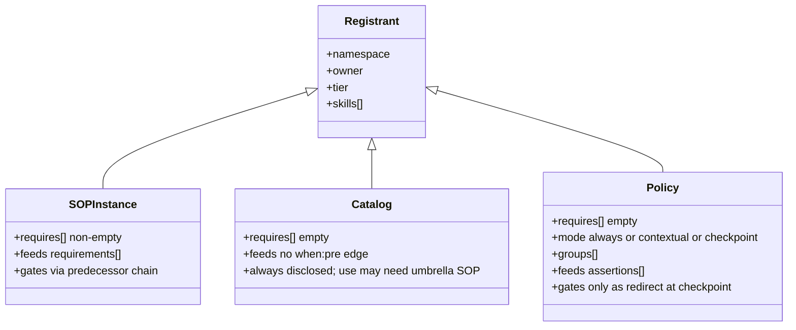

# 06. The Namespace Registry

| | |
|---|---|
| Status | Draft |
| Depends on | [05-config-cascade.md](./05-config-cascade.md) |
| Related | [07-doctor-init.md](./07-doctor-init.md), [02-enforcement.md](./02-enforcement.md), [10-sop.md](./10-sop.md), [workbench/20-cli.md](/workbench/cli/) |

The flat `skills[]` array of [02-enforcement.md](./02-enforcement.md) records *what* skills exist but not *who owns them* or *which family they belong to*. This chapter replaces it with an `sops[]` array of **registrant blocks** — one per **Tool** (a registered namespace, [00-overview.md](./00-overview.md)): each block reserves a `namespace`, names its `owner`, declares the `cli` it ships and the `folders[]` it owns, and lists the `skills[]` it contributes. The model is VS Code's `publisher` + `contributes` — a reserved owner identity on the left, a declarative capability block on the right.

---

## From Flat `skills[]` to Owned `sops[]` Blocks

The `prefix-hyphen-name` convention ([13-conventions.md](./13-conventions.md)) already *is* a namespace mechanism: `memo-init`, `memo-sop`, `memo-revision-*` all share the `memo` prefix that names their family. This chapter promotes that implicit prefix to a **first-class, owned, reserved `namespace` field**. Each block in `sops[]` carries:

| Field | Role |
|-------|------|
| `namespace` | the reserved discovery handle — the `prefix` of `prefix-hyphen-name` made first-class and exclusive (VS Code `publisher`, npm scope) |
| `owner` | the single unit that reserves and maintains the block (exclusive contribution right) |
| `tier` | the tier the block sits at (`0` = genesis root, ascending) |
| `cli` | the binary / CLI namespace the Tool ships (e.g. `memo`) — the command surface the namespace exposes |
| `folders[]` | the folders the namespace owns (e.g. `.memo/`) — the directories reserved to this Tool |
| `skills[]` | the declarative `contributes` block — what the namespace provides, each with detection `signals` |
| `requires[]` | optional, coarse inter-namespace dependency (which namespace this one genuinely presupposes). A *sibling* relationship — e.g. memo↔workbench under the flat topology (F2=A) — is a documented **convention**, **not** encoded as a `requires[]` entry. |

The reserved memo block:

```jsonc
{ "namespace": "memo", "owner": "memo-init", "tier": 2,
  "cli": "memo", "folders": [".memo/"], "requires": [],
  // convention (F2=A): memo is a *sibling* extension of workbench — both extend the
  // session — NOT a coarse prerequisite; the memo->workbench edge is a documented
  // convention, never a hard requires[] entry.
  "skills": [ { "id": "memo-init", "signals": ["attributionSkill:memo-init"] },
              { "id": "memo-sop",  "signals": ["attributionSkill:memo-sop"]  } ] }
```

The host **reads** the union of every block; a tool never imperatively mutates the central config (see *Declare, Don't Register* below).

---

## Three Block Kinds: SOP-Instance, Catalog, and Policy

The same `sops[]` array holds three kinds of block, distinguished by **how — and whether — the namespace gates**:

| Kind | `requires[]` | Gates via | Role | Example |
|------|--------------|-----------|------|---------|
| **SOP-instance block** | carries dependencies | `requirements[]` — its entry point sits behind a `when:pre` edge | a process that gates work behind a predecessor SOP | `memo`, `workbench` |
| **Catalog block** | empty | **not a chain predecessor** — no `when:pre` entry-point gate; the catalog is always *disclosed*. *Use* MAY still carry a command→SOP umbrella precondition | an always-disclosed capability catalog whose *use* may key on an umbrella SOP | `flowmcp` |
| **Policy block** | empty (never a chain predecessor) | `assertions[]` — only as a checkpoint `redirect`, never a `when:pre` edge | a body of standards that is *always findable*, of which a sub-set must be *read by a checkpoint* | `node`, `communication` |

A **catalog** block reserves a namespace and contributes skills like any block. Its defining property is **disclosure, not freedom from every precondition**. Two axes must be held apart:

- **Disclosure** — the catalog's tools are always *disclosed*: visible and discoverable, never hidden behind a gate you must clear merely to *see* them. A catalog block is never a **chain predecessor** — its `requires[]` is empty and no `requirements[]` `when:pre` edge sits an entry point behind it.
- **Use-time precondition** — *using* the namespace MAY still carry an SOP precondition. The command→SOP matrix ([workbench · hooks-contract](/workbench/hooks-contract/)) maps the `flowmcp …` command class to the `flowmcp-sop` umbrella, so *running* a `flowmcp` command expects that umbrella to have been read this session.

**Disclosed is therefore not the same as ungated.** FlowMCP reserves `flowmcp`, contributes `flowmcp-usage`, and its catalog is disclosed by construction — yet a use-time umbrella precondition (`flowmcp → flowmcp-sop`) is fully consistent with that, because the two act on different axes: **disclosure** (always open) versus **use-time precondition** (the umbrella read-receipt). What a catalog block guarantees is that its tools are never hidden, not that invoking one is free of any SOP; it remains "never a *chain* predecessor" in the precise sense above:

```jsonc
{ "namespace": "flowmcp", "owner": "flowmcp", "tier": 2,
  "cli": "flowmcp", "folders": [], "requires": [],
  "skills": [ { "id": "flowmcp-usage", "signals": ["attributionSkill:flowmcp-usage"] } ] }
```

A **policy** block also reserves a namespace and contributes skills, and like a catalog it is **never a chain predecessor** — its `requires[]` is always empty and it feeds **no** `requirements[]` edge. What sets it apart is a third, separate gate axis: a policy block MAY feed the top-level `assertions[]` collection ([05-config-cascade.md](./05-config-cascade.md)), through which a *sub-set* of its skills must be read by the time a named **checkpoint** skill fires — enforced only as a `redirect`, never as a hard block. The development standards are one such policy block, reserved under the `node` namespace (see [The `node` Policy Block](#the-node-policy-block) below).

The three kinds coexisting in one array is deliberate: the registry is the single union of everything registered, and a reader distinguishes them by inspecting `requires[]`, the top-level `requirements[]`, and the top-level `assertions[]` — not by reading three separate files. The SOP-instance-vs-catalog framing is elaborated in [10-sop.md](./10-sop.md).

The three kinds are a classification over one base registrant — same reservation fields, three distinct gate behaviours:



### REGISTERED ≠ GATE Is a Trinary

With three kinds, the rule that *being registered does not make a block a gate* MUST be read as an explicit trinary, so no reader applies an old binary "gates or doesn't" to a policy block and mis-reads it as inert:

| Requirement | Statement |
|-------------|-----------|
| **REQ-SS-POLICY** | A **Catalog** block is never a **chain predecessor** — it feeds no `requirements[]` / `when:pre` entry-point gate and its catalog is always *disclosed*; a use-time command→SOP umbrella precondition is a separate axis and does **not** make it a chain predecessor. An **SOP-instance** block gates only via `requirements[]` / `when:pre`. A **Policy** block gates only via `assertions[]`, only as `onMissing:"redirect"`, and is never a chain predecessor (`requires[]` always empty). |

---

## The `node` Policy Block

The development standards register as **one** policy block under the `node` namespace. The seven `node-*` skills are already named under that prefix, so the namespace is reserved with **no renames** — N-2 already holds. The block reserves `namespace` + `owner` + `tier` and contributes its `skills[]`; `requires[]` is empty (a policy block is never a chain predecessor); it feeds **no** `requirements[]` edge (the gate axis is left untouched, byte for byte); it MAY feed `assertions[]` (the separate policy gate axis, [05-config-cascade.md](./05-config-cascade.md)). Its canonical declaration:

```jsonc
{ "namespace": "node", "owner": "node-formatting", "tier": 2,
  "cli": null, "folders": [], "requires": [],
  "skills": [
    { "id": "node-formatting",          "signals": ["attributionSkill:node-formatting"],          "mode": "always" },
    { "id": "node-class-architecture",  "signals": ["attributionSkill:node-class-architecture"],  "mode": "always" },
    { "id": "node-error-codes",         "signals": ["attributionSkill:node-error-codes"],         "mode": "contextual" },
    { "id": "node-validation",          "signals": ["attributionSkill:node-validation"],          "mode": "contextual", "groups": ["security"] },
    { "id": "node-environment-manager", "signals": ["attributionSkill:node-environment-manager"], "mode": "contextual", "groups": ["security"] },
    { "id": "node-server-design",       "signals": ["attributionSkill:node-server-design"],       "mode": "contextual", "groups": ["security"] },
    { "id": "node-testing",             "signals": ["attributionSkill:node-testing"],             "mode": "checkpoint", "groups": ["verification"] }
  ] }
```

`owner` is a single unit (`node-formatting`); a policy block needs no team. The block's **umbrella entry** is `node-sop` — the owner-umbrella a `node`-write command class routes through to reach these seven standards ([Umbrella SOPs — `git-sop` and `node-sop`](#umbrella-sops--git-sop-and-node-sop)); it opens **no** second `node` block (N-1 holds — the `node` namespace is reserved once). The canonical description of *what* each standard is lives in the public user-preferences specification; the block links to it through each skill's `metadata.memo.specs` rather than restating the rule — single-source by ownership, no re-inventory (see [Linking the Standards, Not Re-Describing Them](#linking-the-standards-not-re-describing-them)).

### Per-Member Facets: `signals`, `mode`, `groups`

Beyond its `id`, each policy-block member carries up to three facets:

| Facet | Holds | Required? |
|-------|-------|-----------|
| `signals` | the read-receipt — `attributionSkill:<id>`, the harness-authored, structured signal that proves the skill was read ([02-enforcement.md](./02-enforcement.md), REQ-SS-SIGNAL) | yes |
| `mode` | the activation mode: `always` \| `contextual` \| `checkpoint` | **yes — mandatory, no silent default** |
| `groups` | the checkpoint groups the member belongs to (e.g. `security`, `verification`); resolved cross-namespace ([Cross-Namespace Groups](#cross-namespace-groups)) | only for `checkpoint` members |

The `mode` enum models the "some standards apply always, some only in context, some must be confirmed at a checkpoint" spectrum with **one** per-member field:

| `mode` | Meaning | Spec footprint |
|--------|---------|----------------|
| `always` | present by construction — pinned ambient through the genesis configuration, **no edge** | none (ambient) |
| `contextual` | surfaced by the model's own skill-description triggering when the work calls for it | none |
| `checkpoint` | additionally carries a `group` and is pulled into an `assertions[]` row — its read-receipt is required when a checkpoint skill fires | one `assertions[]` row per group |

For the seven `node-*` skills this resolves to: `node-formatting` and `node-class-architecture` are `always` (ambient editor + no-silent-defaults / static-class discipline, in force on every file); `node-error-codes`, `node-validation`, `node-environment-manager`, `node-server-design` are `contextual` (loaded on demand by description triggering); `node-testing` is `checkpoint` (the test-verification standard, whose read-receipt is required at landing). A member MAY be **both** `contextual` and `checkpoint` — `node-validation` is loaded contextually yet still owes a `security` read-receipt at the landing checkpoint.

`mode` being **mandatory** is load-bearing: an unresolved `mode` is generated as `null` with source `"none"`, never silently as `contextual`, so a missing activation decision is surfaced by the foreground doctor rather than guessed (no-silent-default).

### Read-Tracking Reuses the Harness Signal

"Has the agent read skill X" is answered from the **same** structured `attributionSkill` signal the enforcement gate already trusts: the receipt is present iff `attributionSkill:node-X` appears, read jq-structured from the harness-authored transcript field, never as a substring (REQ-SS-SIGNAL, [02-enforcement.md](./02-enforcement.md)). No new sensor is introduced — read-tracking is a *view* over a signal the harness already writes. The read-only board that renders this view per-skill and per-group is `session prefs-status` ([07-doctor-init.md](./07-doctor-init.md)).

### Cross-Namespace Groups

A `group` resolves over the **union of all blocks**, not within a single namespace — so a checkpoint group can span owners. Two groups are defined:

| Group | Members | Spans |
|-------|---------|-------|
| `security` | `node-validation`, `node-environment-manager`, `node-server-design` (node) **+ `git-security`** (git) **+ `npm-security`** (the supply-chain standard) | cross-namespace |
| `verification` | `node-testing` (node) | single namespace |

`git-security` and `npm-security` join `security` from their own namespaces, each declaring `groups:["security"]` in **its own** fragment — declare-don't-register, the marketplace firewall holds (no block reaches into another's). A group **resolves** only when every member is installed and ships its signal. A standard that is documented but **not yet registered as a core skill** is a **pending member**: the foreground doctor reports that the `requiresGroup` does not fully resolve, and the runtime gate degrades that to fail-open ALLOW (best-effort), never a redirect (see [07-doctor-init.md](./07-doctor-init.md)) — this is the safety net for any group whose membership outruns its registration. The checkpoint rows that consume these groups live in `assertions[]` ([05-config-cascade.md](./05-config-cascade.md)); the gate that evaluates them is in [02-enforcement.md](./02-enforcement.md).

### Linking the Standards, Not Re-Describing Them

The policy block registers *how* the standards are activated and tracked; it does not restate *what* each standard says. Each `node-*` skill's canonical description lives in the public user-preferences specification, and the skill points at it through `metadata.memo.specs`. Where this spec names a standard it links the owning chapter rather than duplicating its rule — the registry is single-source by ownership, the standards' text is single-source in their own specification, and the two never drift into two copies.

---

## Umbrella SOPs — `git-sop` and `node-sop`

Two SOP skills are **umbrellas**: a single entry point a command class keys on, which **routes** to a family of child skills rather than carrying procedure of its own. They exist in the core skill set but were, until this version, **unanchored** — declared in no registrant block, built earlier and left unwired. This section anchors them normatively.

| Umbrella | Namespace | Routes to | Keyed on |
|----------|-----------|-----------|----------|
| **`git-sop`** | `git` | `git-commit`, `git-push`, `git-security` — the commit / push-gate / secrets-scan children | a `git …` shell command class |
| **`node-sop`** | `node` | the seven `node-*` standards of the [node policy block](#the-node-policy-block) | a `node`-write command class (a `.mjs` `Write`/`Edit`) |

`git-sop` reserves an **SOP-instance** registrant block: `owner: "git-sop"`, contributing its three children under the `git` namespace (N-2 holds — `git-commit` / `git-push` / `git-security` all sit under `git`, as `git-security` already does when it joins the `security` group). `node-sop` does **not** open a second `node` block — the `node` namespace is reserved once by `node-formatting` (N-1) — it is the **owner-umbrella** *over* the existing node policy block, the entry the `node`-write command class routes through to reach the seven standards.

```jsonc
{ "namespace": "git", "owner": "git-sop", "tier": 2,
  "cli": "git", "folders": [], "requires": [],
  "skills": [ { "id": "git-sop",      "signals": ["attributionSkill:git-sop"] },
              { "id": "git-commit",   "signals": ["attributionSkill:git-commit"] },
              { "id": "git-push",     "signals": ["attributionSkill:git-push"],     "groups": ["security"] },
              { "id": "git-security", "signals": ["attributionSkill:git-security"], "groups": ["security"] } ] }
```

**The command→SOP edges are declared, not hardcoded.** An umbrella is *reached* by a command class, and that binding — `git …` ⇒ `git-sop`, a `node`-write ⇒ `node-sop`, `memo …` ⇒ `memo-sop`, `flowmcp …` ⇒ `flowmcp-sop`, `npm …` ⇒ `npm-security`, `git worktree …` ⇒ `workbench-sop` (worktree management is a workbench concern, matched before the generic `git …` class) — is the **command→SOP matrix**. Per the flat-tier separation it is **workbench-tier declared data** (a `{ class, pattern, requires }` map form-identical to `folder-lints.json`, [workbench · config](/workbench/config/)), consumed by one global command-class hook ([workbench · hooks-contract](/workbench/hooks-contract/)); it is **not** carried as hardcoded matchers in the hook. This chapter owns the umbrellas (the edge *targets*); the workbench config owns the *edges* — single-source by tier, no duplication.

| Requirement | Statement |
|-------------|-----------|
| **REQ-SS-UMBRELLA** | An umbrella SOP (`git-sop`, `node-sop`) is a routing entry point reached by a **declared** command→SOP edge, never a hardcoded in-hook matcher. `git-sop` reserves the `git` namespace and routes to `git-commit` / `git-push` / `git-security`; `node-sop` is the owner-umbrella over the `node` policy block's seven standards and opens **no** second `node` block (N-1). The command→SOP edges are workbench-tier declared data ([workbench · config](/workbench/config/)), read by the command-class hook. |

---

## The Communication Policy Block

The `node` block is not the only body of standards. The **communication conventions** `J1`–`J12` — the orchestrator-to-user trust layer specified in [../memo/19-internal-vs-external-communication.md](/specification/internal-vs-external-communication/) — register as a **second** policy block, reusing the same `kind:"policy"` primitive with **no** new registry kind. A policy block's body of standards need not be skills: the `node` block's standards are skills, the communication block's standards are named convention rules. Both are the same policy primitive, gated only through `assertions[]` per `REQ-SS-POLICY`, and neither is ever a chain predecessor.

The block reserves the `communication` namespace, names its `owner`, keeps `requires[]` empty, feeds **no** `requirements[]` edge, and carries its convention set as addressable entries. Because these entries are rules rather than skills, they use the communication chapter's own `J`-numbering as their stable id (the skill-id form of N-2 constrains skill members, not convention entries):

```jsonc
{ "namespace": "communication", "owner": "memo-sop", "tier": 2,
  "cli": null, "folders": [], "requires": [],
  "source": "spec:memo/19 — the J1–J12 trust-layer table",
  "conventions": [
    { "id": "J1",  "mode": "always" }, { "id": "J2",  "mode": "always" },
    { "id": "J3",  "mode": "always" }, { "id": "J4",  "mode": "always" },
    { "id": "J5",  "mode": "always" }, { "id": "J6",  "mode": "always" },
    { "id": "J7",  "mode": "always" }, { "id": "J8",  "mode": "always" },
    { "id": "J9",  "mode": "always" }, { "id": "J10", "mode": "always" },
    { "id": "J11", "mode": "always" }, { "id": "J12", "mode": "always" }
  ] }
```

The twelve conventions are the ambient communication discipline in force on every user-facing turn, so each is `mode: "always"`; the block feeds no checkpoint group today, but MAY pull a sub-set into `assertions[]` later exactly as the `node` block does (the mechanism is unchanged). Like the `node` block, this block registers *how* the conventions are found and tracked — it does **not** restate what each `J`-rule says. The readable `J1`–`J12` table stays single-source in the communication chapter; the policy block is single-source for the registration. `REQ-SS-POLICY` already governs every policy block, so it covers `J1`–`J12` here with no change to its statement: the communication block is findable by construction and gates only as an `assertions[]` redirect at a checkpoint, never as a hard block or a chain predecessor.

*(How a convention is written and why it registers as a policy block rather than a new primitive is specified in the Spec family — see [its conventions-writing chapter](/spec/conventions-writing/).)*

---

## Two Dependency Granularities

A registrant carries dependency information at **two granularities**, and both are kept, clearly separated:

| Granularity | Field | Scope | Read by |
|-------------|-------|-------|---------|
| **Coarse** | `sops[].requires[]` | per-SOP, namespace → namespace, for a namespace that genuinely presupposes another; a *sibling* convention such as memo↔workbench is **not** encoded here (F2=A) | `session doctor` / `registry-validate` readiness preflight |
| **Fine** | top-level `requirements[]` | entry point → skill, with `when:pre/post` (e.g. REQ-061 `memo-init → memo-sop`) | the PreToolUse enforcement gate |

`requires[]` is the documentation of which families must be present; `requirements[]` is the exact runtime pre-gate edge the hook evaluates. They are **not** redundant: one declares a dependency between namespaces, the other declares the precise activation edge. `requirements[]` stays a **top-level** array (not nested per block) because a precondition edge crosses namespaces, and keeping it top level preserves the existing REQ-061 shape and the three-state enforcement contract of [02-enforcement.md](./02-enforcement.md) verbatim.

---

## Collision Rules N-1 and N-2

Two rules keep the registry sound. Both are stated normatively:

| Rule | Statement |
|------|-----------|
| **N-1** (one owner per namespace) | Every `sops[].namespace` MUST be unique within the config and reserved by exactly one `owner`. Two blocks reserving the same namespace is a collision and MUST be rejected. |
| **N-2** (skill id under its namespace) | Every skill `id` MUST have the form `<namespace>-<name>` of the block that declares it. `memo-sop` is legal under `memo`; declaring `repo-readme` inside the `memo` block is a mismatch and MUST be rejected. |

N-2 makes the prefix convention a checkable invariant and, as a consequence, the **same leaf name MAY safely recur across namespaces** (`memo`/`init` and a future `workbench`/`init` are distinct) — the namespace's only job is to bound where a name must be unique.

**Where they are caught is load-bearing.** Both rules are enforced **only at the foreground** `session doctor` / `session registry-validate` ([07-doctor-init.md](./07-doctor-init.md)) — the same place dangling edges are already caught. The PreToolUse hook MUST NEVER evaluate the collision rules: a colliding or malformed registry is **"registry malformed" → ERROR → fail-open ALLOW** per the three-state table of [02-enforcement.md](./02-enforcement.md). A namespace clash must never lock the machine out of its own tools.

| Requirement | Statement |
|-------------|-----------|
| **REQ-SS-NAMESPACE** | Each namespace is reserved by exactly one owner (N-1); a skill id MUST sit under its declaring namespace (N-2). Both are asserted at the foreground validator. A violation degrades the runtime gate to fail-open, never to block. |

---

## Declare, Don't Imperatively Register

A tool MUST NOT imperatively mutate the central config. Instead each registrant **declares** its own block as a drop-in fragment — `config.d/<ns>.json`, one owner per file — and `session init` / `session doctor` **collects** the fragments into the resolved `.session/config.json` ([05-config-cascade.md](./05-config-cascade.md)). The collection step runs N-1/N-2 at merge time and **proposes** the result for the developer to accept; it never silently clobbers an existing config.

This is how three independent registrants coexist sustainably: `memo`, `workbench`, and `flowmcp` each own a **disjoint** namespace and each contributes **only its own** `config.d/` fragment. The central config is their union, and any overlap is an N-1 collision caught at merge — the namespaces are the firewall between the plug-ins, exactly as a marketplace lets many publishers coexist.

---


<!-- IMPLEMENTED-BY — rendered backlink lives in the dist (generated/bridge/<family>/<stem>.backlink.md); source stays authored-only (F2 Dist-Split) -->
## Related

- [05-config-cascade.md](./05-config-cascade.md) — the `.session/config.json` schema and `config.d/` cascade the `sops[]` array lives in.
- [07-doctor-init.md](./07-doctor-init.md) — where N-1/N-2 are enforced: the foreground readiness preflight and additive scaffold.
- [02-enforcement.md](./02-enforcement.md) — the three-state gate and why a collision degrades to fail-open ALLOW, never block.
- [10-sop.md](./10-sop.md) — the SOP-instance-vs-catalog framing in full.
- [workbench · config](/workbench/config/) — the workbench-tier home of the command→SOP matrix (the edges these umbrella SOPs are the targets of), and [workbench · hooks-contract](/workbench/hooks-contract/), the command-class hook that reads it.
- [/spec/conventions-writing/](/spec/conventions-writing/) — how a convention is written and why it registers as a policy block, not a new primitive.
