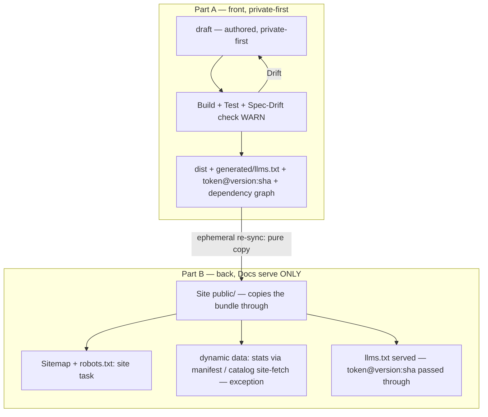

This chapter holds the whole organization-wide **spec lifecycle** in one place: from an authored `draft`, through the built `dist/` and its `generated/` bundle, to the served website — across both drift boundaries, with the private-first front (Part A) and the docs-serve-only back (Part B). Until now this workflow existed only as tribal knowledge scattered across the generators and the memos, so it was neither reviewable nor versionable. The specification is the family that owns spec structure, so the lifecycle of a spec has its home here.

It is a normative chapter of the Meta-Specification family and is read under the RFC-2119 conformance interpretation this family establishes in its overview ([./00-overview.md](/spec/overview/)). It describes the lifecycle at overview height and points at the neighboring work-items that own each exact definition, rather than restating them.

---

## The Principle — One Generation Point

> **One generation point (F14 = B).** The spec side (draft → distribution) is the only place content is generated: **content generation belongs exclusively on the spec side; the docs/site generate NO content.** The site copies the spec-emitted bundle through and serves it.

Site audits confirmed the boundary concretely: per site there is **exactly one** piece of llms content generation to remove — that is **one script** (`generate-llms-txt.mjs`), and **at flowmcp two** (additionally `generate-best-practices-txt.mjs`). These are stood down. The site then only **copies** the spec-emitted bundle through and **serves** it.

**What the docs MAY still do** — these are legitimate site tasks, not content generation:

- **Sitemap** — produced by `astro build` (`@astrojs/sitemap` via Starlight); there is no dedicated script.
- **robots.txt** — `generate-robots-txt.mjs` (a pointer to the passed-through bundle plus the sitemap line).
- **Site infrastructure** — pagefind metadata, the og-image, favicons, the markdown map (copy button), the build stamp.
- **Copy / re-sync** of the spec `dist/` + **refs-fetch** (passing version/SHA through) + **serving** (`astro build`).

**The one exception — genuinely dynamic external data (not content).** There is exactly one admissible exception to this rule: data that is the live state of another repository and therefore cannot be derived from the spec text. It is specified normatively in its own section below, *The One Exception — Genuinely Dynamic External Data* (**ORG-6**) — named once, there, so it is neither a silent rule-break nor a blind spot.

**Emit precondition.** The spec side MUST **emit** the llms bundle before the site can pass it through. flowmcp (`generated/llms.txt`) and personal-brand (`dist/<ns>/llms.txt`) already emit it; memo-init `repos/spec` currently emits none (it was deleted in M058) and MUST restore emission before its site can pass a bundle through.

---

## The One Exception — Genuinely Dynamic External Data (ORG-6)

There is **exactly one** admissible exception to the one-generation-point rule: **genuinely dynamic external data** — which is *not* content, because it cannot be derived from the spec text. It is the live state of another repository, so it can neither be authored on the spec side nor produced as a transform of already-published spec content. Naming this exception once, here, is what keeps it from becoming either a silent rule-break or a blind spot on every site that binds external live data.

At FlowMCP two such inputs flow in, and each has a fixed, distinct path:

- **Schema stats** — `count_schemas`, `count_tools`, `count_unique_datasources`, and the like — flow **through the spec manifest**: `generate-manifest.mjs` writes them into `manifest.meta.stats`, and the site only **reads** them.
- **The live catalog** from `flowmcp-schemas-public` is fetched **site-side** directly (`sync-schemas.mjs`) and stays deliberately site-side as a documented dynamic-data exception (FM-T9).

This exception is **categorically different** from `llms.txt` and `best-practices.txt`: those are **deterministic transforms of already-published spec content**, so they belong on the spec side and are **not** covered by it. The exception admits live external state only — never a transform of the spec itself.

---

## The Two Drift Boundaries

Large specs depend on one another; when one changes, the specs that depend on it drift — and **finding those drifts is the largest problem**. The lifecycle names exactly two boundaries where drift is detected:

1. **draft → dist** — an authored change in one chapter drifts the dependent chapters that build into the same distribution.
2. **dist → website** — the served site drifts from the spec-emitted bundle.

The detection machinery is **not** newly built: the drift engine already exists (`DriftSensor`, M029/M030) and is **lifted** onto the spec edges — reused as-is, not reinvented.

---

## Front — draft → dist (Part A)

The front half is authored and **private-first**. At overview height it comprises:

- **Namespace-first structure.** A spec lives at `spec/<namespace>/<version>/{draft,dist,skills}/` (the version sits *outside* the layout, one level in from the namespace). personal-brand is the reference model; memo-init migrates onto it reversibly, slug-based, and URL-stable. The `spec/` plural-container folder convention itself is declared in the workbench folders chapter (`workbench/…/12-folders.md`) by **ORG-7** — referenced here, not declared on this page.
- **Spec reference ID.** A spec is identified by `<namespaceToken>@<version>:<shortSha>`, where `shortSha` is the **7-character prefix** of the full `fromCommit` SHA — the same provenance token that later stamps the llms.txt header (see Part B).
- **Deterministic dependency graph.** The `requires` / `references` edges are lifted out of the prose into the family head as an OKF edge model `{target, kind, pin}`; the graph is resolved via `ArchitectureLocator.mjs`.
- **Drift detection (WARN).** `DriftSensor.commitsSinceVerified` is reused on the spec edges, with a `verifiedAtSha` per `requires` edge; the dist build **WARNs** on drift rather than auto-blocking, and a boundary is re-blessed via `memo maintenance verify`.
- **private-first.** Every spec is private per se; publishing is a separate, explicit opt-in step. personal-brand is the org-wide reference model for this: its workshop container carries `site.json` `publication.git: false` — a private-draft that is never itself a published git site — and every namespace stays `spec.json` `publish: false` until a deliberate promotion flips it. This front generalizes that model across memo-init, flowmcp, and personal-brand.
- **Placement by visibility (F3 = C).** A spec is stored in both places according to its visibility: **private = the project-local `spec/` container (offline)**; **public = a promoted `repos/<x>-spec`**. These are the same content at two lifecycle stages, not two independently authored copies.
- **Promotion.** `migrate-namespace.mjs` promotes a spec: copy → strip the private subfolders (`personas/`, `docs/`) → flip `publish:true` → refuse to overwrite an existing target without `--force` → **never rm** (an overwrite is in place; nothing is deleted) → supports `--dry-run`. The shared `_tooling/` and the container `site.json` **never travel per-spec** — they are container infrastructure assumed to already exist in the target, so a promotion can never drag tooling and a tooling fix never has to be copied into N spec folders.
- **Git strategy.** There is no root git; each spec container MAY carry an optional local git **without a remote** (opt-in), which provides the hash layer that drift detection and provenance stamping rely on.

> **Note — Phase-5 promotion gate.** Two work-items anchor how this private-first front reaches the public side. **PB-W3 [behalten]:** the personal-brand workshop stays the private-first reference — its `site.json` keeps `publication.status: "private-draft"` and `publication.git: false`, and every `spec.json` stays `publish: false` until a deliberate promotion; the container is not restructured (`site.json` is not changed). **PB-P1 [gate]:** a namespace MAY be promoted only once its workshop `spec.json` carries `publish: true` — setting that flag *is* the deliberate opt-in publish act, which `migrate-namespace.mjs` then carries into the promoted copy (`spec.publish = true`). Without the flag nothing is promoted; this gate is the precondition of the actual a6b8 promotion (PB-P2..P7), which is a separate code work-item.

---

## Back — dist → generated → website (Part B)

The back half serves only — it copies the spec-emitted bundle through and generates nothing.

- **The `generated/` funnel.** The `generated/` folder lives **inside** `dist/` → `spec/<ns>/<version>/dist/generated/`, and `dist/` is the **atomic copy unit** (a single funnel). Its exact contents — which artifacts, to what purpose, with what determinism — are defined normatively below in *The `generated/` Folder — Definition and Single-Funnel* (**ORG-2**); this bullet states only the funnel at overview height.
- **Ephemeral re-sync as a pure copy.** The publish pipeline (dist → copy → website) performs the re-sync as a **pure copy**: the site copies the spec-emitted bundle through and generates none of it.
- **Provenance threading.** The llms.txt header is stamped `Source: <namespaceToken>@<version>:<shortSha>` — the **identical format** to the reference ID at the front (Part A). The token is stamped at the source, and the site passes it through unchanged.
- **One shared generation script (F13).** A single shared, dependency-free script serves the three **spec**-repo generators, config-parametrized. The site layer generates no content.

---

## The `generated/` Folder — Definition and Single-Funnel (ORG-2)

`generated/` is defined **org-wide**: it holds exactly the artifacts below, and nothing a site re-synthesizes on its own. This is the authoritative definition every spec repo's `generated/` folder conforms to — the normative table the Part B funnel points at.

| Artifact | Purpose | Determinism |
|----------|---------|-------------|
| `llms.txt` | Spec-only concatenation of all chapters | `readdir → sort → concat → write` |
| `llms-schema-spec.txt` | Byte-identical alias (site convention) | copy |
| (flowmcp) `best-practices.txt` | Best-practice aggregate | deterministic |
| `refs.resolved.json` | Includes `generated.fromCommit` (the provenance token) | `git rev-parse` |

**Placement (single funnel).** `generated/` lives **inside** `dist/` → `spec/<ns>/<version>/dist/generated/`. `dist/` is the **atomic copy unit** — the single funnel through which the whole bundle moves. The docs receive this bundle by a **pure copy** and never generate it. The same namespace-first hierarchy is declared from the folder side by the `spec/` plural-container convention (**ORG-7**) in the workbench folders chapter (`workbench/…/12-folders.md`).

---

## End-to-End

> **Note — Phase-5 rename.** This page is authored in today's layout, where this meta family's folder and label are literally `spec`. In Phase 5, MI-S7 renames the family to `meta-spec`; the rename is **URL-stable**, so existing paths keep resolving. This page is planned in the current layout and is carried along by that rename rather than re-authored for it.

---

<!-- IMPLEMENTED-BY — rendered backlink lives in the dist (generated/bridge/<family>/<stem>.backlink.md); source stays authored-only (F2 Dist-Split) -->
## Related

- [./00-overview.md](/spec/overview/) — the family entry point and the RFC-2119 conformance anchor this chapter is read under.
- [./05-publishing-principle.md](/spec/publishing-principle/) — what is published versus kept private, the principle the docs-serve-only back rests on.
- [./07-versioning.md](/spec/versioning/) — how a version directory is named and kept URL-stable while a newer one is authored beside it.
