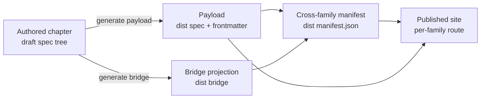

Every specification chapter in this organization has the same shape. The shape is not a style preference — it is what lets a build pipeline read any chapter of any family uniformly, lets a reader arrive at a chapter and know where to look, and lets a new family be added by following a document instead of reverse-engineering a generator. Until now that shape lived only as tribal knowledge inside the authored chapters and the scripts that process them. This chapter makes it normative: the invariant elements every chapter carries, the family-level files that describe a family as a whole, and the draft-to-dist pipeline that turns an authored chapter into published output.

The rules here are authored the same way they describe: this chapter is itself a chapter in the format it specifies (it dogfoods its own contract), and so is every other chapter in this family.

---

## The Invariant Chapter Elements

A chapter is a single Markdown file. In reading order, it **MUST** carry the following elements, and a build gate **MUST** enforce the presence of the machine-checkable ones — the H1 title, the header metadata table, the intro prose, and the bottom `## Related` section:

| Element | Rule |
|---------|------|
| **H1 title** | The first line is a single `# NN. Title` heading. The `NN` is the chapter's two-digit number and the title is a short human name. The published page renders its title from the family payload, so the body H1 is stripped in the dist — it exists in the source as the canonical chapter name. |
| **Header metadata table** | Directly under the H1, a small table carries the chapter's own metadata: a `Status` row (always), an optional `Depends on` row, and a `Related` row. Both the `\| Field \| Value \|` header form and the borderless `\| \| \|` form are accepted; the presence of a `Status` row is what marks the block as the metadata table. This table is stripped from the top of the published page (reading order is content-first) and its links are preserved in the bottom `## Related` footer. |
| **Intro prose** | Between the metadata table and the first `##` heading there **MUST** be at least one paragraph of running prose. A chapter opens by explaining itself to a reader, not by dropping straight into a sub-heading. This intro is the source of the page's one-line description in the family manifest: the description is derived as the intro's **first sentence**, truncated at a word boundary — never hand-maintained as a second field. |
| **`## ` section headings** | The body is organized under second-level headings. Deeper nesting (`###`, `####`) is allowed within a section. |
| **Bottom `## Related` section** | The last section is `## Related`, a list of the chapters (and, where useful, cross-family pages) a reader should follow next, each with a one-line note on why. |

### Normative and Informative Marking

By default every chapter is normative and is read under the family's RFC-2119 conformance interpretation ([00-overview.md](/spec/overview/)). A chapter that is motivation or index prose rather than binding rules marks itself non-normative. The marker forms are fixed so a build detects them by **position**, not by scanning the whole page for the word:

- **Page marker.** A short blockquote whose bold lead word is exactly `Informative.`, placed **near the top** — inside the intro prose, before the first `##` heading. Only a marker in that position marks the whole chapter non-normative; the same word appearing later in the body does not.
- **Sectional marker.** The same `Informative.` blockquote **MAY** open an individual `##` section, marking only that section non-normative inside an otherwise normative chapter.
- **Hybrid chapter.** A chapter that is mostly prose but hosts a normative anchor — for example a `requirementsRef` chapter carrying inline requirement blocks — is **not** given a page marker. Its prose is descriptive, yet its requirement blocks stay binding: the presence of an inline requirement block overrides any `Informative.` lead, so the machine-checkable rules are never read as non-normative.

### The Implemented-By Placeholder

Each non-bridge chapter also carries a single generated marker — the implemented-by placeholder — immediately above its `## Related` section. Its canonical form is the exact HTML-comment line:

```html
<!-- IMPLEMENTED-BY — rendered backlink lives in the dist (generated/bridge/<family>/<stem>.backlink.md); source stays authored-only (F2 Dist-Split) -->
```

The rendered "Implemented by" backlink (which skills implement the chapter) is a derived artifact that lives only in the dist; the source chapter carries this placeholder and never the full block. This authored-versus-derived split is described in [The Bridge Standard](/spec/bridge-standard/); a chapter author leaves the placeholder line in place verbatim and does not hand-edit the backlink.

### The Related Section Rules

The bottom `## Related` section is an annotated map, not a bare link list, and its shape is fixed by nine rules so a build gate can enforce the machine-checkable ones and a reader always gets a reason rather than a bare pointer. These rules are family-agnostic and hold for every chapter in every family:

- **R1 — Two locations, two jobs.** The header metadata `Related` row is a *teaser* — a short comma-separated inline list of the two-to-four closest siblings, links only. The bottom `## Related` footer is the *annotated map*. Both are mandatory.
- **R2 — Every entry is link + reason.** The exact form is `- [NN. Title](./NN-name.md) — one-line reason.`, never a bare link; the em-dash ` — ` separates the link from the reason.
- **R3 — The reason describes the relationship, not the target.** Say how this chapter connects to the target, not a paraphrase of the target's title.
- **R4 — `Depends on` and `Related` stay distinct.** A `Related` entry **MUST NOT** duplicate a `Depends on` entry.
- **R5 — The teaser is a subset of the footer.** Everything in the header `Related` cell appears in the bottom footer with its reason added; the footer **MAY** add a few more (the overview, the index). The two never contradict.
- **R6 — Every chapter opens with intro prose** before the first `##` heading — also machine-enforced (see SPEC-REQ-001).
- **R7 — Order entries for reading flow,** not alphabetically: foundation first, then siblings in chapter order, then the index last if included.
- **R8 — No internal leaks in reasons.** A reason carries no internal record id, internal tool or CLI name, or absolute path ([The Publishing Principle](/spec/publishing-principle/)).
- **R9 — Reasons are short** — roughly fifteen words or fewer, ending with a period, and in one language.

> **Canonical single source.** These nine rules R1–R9 are this organization's canonical definition of the chapter and Related-section format. The personal-brand `user-preferences` spec, chapter 14 ("How to Write a Spec"), mirrors R1–R9 for its own workshop and follows this chapter as its source — it is a copy, not a second definition.

### The Load-Art Marker

A chapter **MAY** declare a **load-art** — when it applies during a session — surfaced as a column on the family's chapter-index and, where useful, in the chapter's own metadata. There are two kinds: **always-on**, a chapter that applies to every interaction and is part of the permanent baseline, and **conditional**, a chapter that applies only when its trigger context is present (files of a given kind are in play, error codes are being defined, push time). A chapter **MAY** be mixed — a discipline part always-on, a setup part conditional — and states which part is which in its intro. The load-art is a reading aid projected onto the chapter index; it does not change the RFC-2119 conformance of a chapter's rules, which is governed by the normative/informative marking above.

---

## The Numbering Convention

A chapter file is named `NN-name.md`: a two-digit ordinal, a hyphen, and a lowercase hyphenated slug. The number orders the family and the slug names the chapter. Two rules keep numbering sound:

- The **published slug is the filename minus its `NN-` prefix and `.md` suffix**, so `02-per-chapter-format.md` publishes at the slug `per-chapter-format`. Renaming the number does **not** change the slug, so a renumbered chapter keeps its published URL — numbering is a reading-order device, not part of a page's identity.
- The **`NN-bridge.md` name is reserved** for the family's generated bridge hub ([The Bridge Standard](/spec/bridge-standard/)). A family has exactly one bridge chapter; the build reuses its existing number so re-runs stay idempotent.

Within a chapter, same-family links **MUST** use the relative `./NN-name.md` form; the pipeline rewrites each to the family's **own** published route, derived from the family head (its `prefix` / `docEntry`) — never a route hardcoded to another family. A build gate **MUST** assert that no chapter's published links resolve into a foreign family's route, so the same-family rewrite is verified rather than assumed (an early defect published `spec`-family links under the `memo` route because the rewrite target was hardcoded).

Cross-family links are written as the target family's absolute route directly. The absolute form is required **not** because a relative link *cannot* be transformed — the generator could rewrite it — but because a relative path across families is ambiguous and generator-dependent: the absolute route names the target unambiguously and stays stable no matter how any family's build rewrites its own links.

---

## Category Classification

The work that produces and maintains a chapter is classified with a **category tag** — `[Docs]` for a prose chapter, `[Code]` where a chapter drives a code artifact, and further tags (`[GitHub]`, `[Text]`, …) for other work families. The tag vocabulary is defined once, at memo creation, and is described in the memo input pipeline ([/specification/input-pipeline/](/specification/input-pipeline/)); it is not re-invented here.

The tag classifies the *work*, not the chapter file — a chapter does not embed its tag in the header. Where the classification surfaces at chapter granularity it does so as the **cluster** column on a family's chapter-index README, computed from the skills that implement the chapter ([The Bridge Standard](/spec/bridge-standard/)). A reader therefore sees the classification as a property projected onto the chapter, single-sourced from the work, never hand-maintained on the chapter itself.

---

## The Family Head

Beside its chapters, each spec family declares a machine-readable **head** so tooling can read every family uniformly. Inside this organization the head is **two files with disjoint responsibilities**: a per-family `spec.json` that carries the family's identity, route, and sidebar metadata, and a per-version `spec-manifest.json` that carries the structural flags and the `groups[]` navigation categories. The two are not interchangeable containers — each owns its own field set. An **external adopter** not yet split this way **MAY** instead place the mandatory field set in a single file under either name; that either-or is a concession to external adopters, not the internal shape. *(This structural field set was previously specified from the requirements chapter and now lives here, in the family that owns spec structure.)*

The `spec-manifest.json` (per-version, beside the chapters) carries the structural flags and the navigation groups:

| Field | Meaning |
|-------|---------|
| `namespaceToken` | A short, globally-unique uppercase token for the family, so cross-family references never collide. (Also mirrored in `spec.json` — see the conflict rule below.) |
| `hasRequirements` | Whether the family authors its own requirements inline (the harvest source). |
| `hasGrading` | Whether the family carries a grading head. |
| `requirementsRef` | The chapter that hosts the family's requirement standard, or `null`. |
| `gradingRef` | The chapter that hosts the family's grading model, or `null` — a thin family points this at the shared model it imports. |
| `groups[]` | The navigation categories, specified in [Navigation Categories](/spec/categories/). |

A family that hosts a standard sets its flag `true` and points the ref at the hosting chapter; a **thin** family that only consumes sets the flag `false` / the ref `null` and, when it grades, imports the model via `gradingRef`. The **field set is the contract, not the container filename** — an external family adopts the same fields when it is ready.

The `spec.json` (per-family) carries the family's identity, published route, and sidebar metadata:

| Field | Meaning |
|-------|---------|
| `schemaVersion` | The head schema version, so a consumer can validate the shape. |
| `slug` | The family's stable URL slug. |
| `title` | The family's human-readable title. |
| `namespaceToken` | The same short uppercase token as the manifest — see the conflict rule. |
| `currentVersion` | The version line the site publishes by default. |
| `specDir` | The path to the authored chapter directory for `currentVersion`. |
| `prefix` | The published route prefix links resolve against (e.g. `spec/`). |
| `sopAnchor` | The family's canonical entry chapter stem. |
| `docEntry` | The family's docs landing route. |
| `relatedRefs` | Chapter stems surfaced as the family's related entry points. |
| `sidebarMeta` | The derived sidebar `order` + `labels` view (single-sourced from `groups[]`, [Navigation Categories](/spec/categories/)). |

**Conflict rule.** The two heads together are the family head, and where a field appears in **both** — today only `namespaceToken` — the two **MUST** agree; a divergence is a build failure, never a silent pick. For a shared field the canonical source is by responsibility: `spec.json` is canonical for family-identity fields (`slug`, `title`, `namespaceToken`, `currentVersion`, route), and `spec-manifest.json` is canonical for per-version structure (`hasRequirements`, `hasGrading`, `requirementsRef`, `gradingRef`, `groups[]`). A reader that wants the whole family reads the head first and the chapters second.

---

## The Draft-to-Dist Pipeline

A chapter is authored under `draft/<family>/<version>/spec/`, beside a sibling `draft/<family>/<version>/data/` directory that holds the family's authored data inputs — chiefly the `skill-spec-map.json` the bridge is projected from ([The Bridge Standard](/spec/bridge-standard/)). The build publishes from `dist/<family>/<version>/`. The source is content-first prose; the published payload is the source plus generated metadata. The build is deterministic and idempotent — running it twice over an unchanged source produces the same output.



The payload step prepends discovery frontmatter (title, one-line description, order, section, normative flag, provenance), strips the body H1 and the top metadata table, and rewrites same-family links to published routes. The manifest step reads the payload frontmatter and the family head to assemble the cross-family index the site consumes. Because the layout is `draft/<family>/<version>/spec` for every family, one build path serves all families, and a new family drops into the same tree.

### Family Discovery

A family is not discovered by guessing directory names. The repository carries a single manual registration point — `data/refs.manual.json` — that lists every family, its namespace key, and its authoritative version number; version numbers live there and **MUST NOT** be hardcoded in prose (the build stamps each chapter with its family's version from this registry). The build reads the registry to enumerate the families it processes, following the family-scanner principle. Adding a family is therefore two moves: drop its tree under `draft/<family>/` and register it in `refs.manual.json`. A family present on disk but absent from the registry is not built — an unregistered tree surfaces in review rather than publishing silently.

---


## Conformity Requirements

The structural invariants above are authored **prose-first** and carry a machine-checkable side: each rule's `statement` faces authoring and its `check` faces the build gate, resolving to a ternary `PASS` / `BLOCKED` / `INCONCLUSIVE`. The blocks below are the machine-readable source the `SPEC-REQ` series is harvested from ([00-overview.md](/spec/overview/), section *Conformance*); the bridge counts them as this family's inline requirements.

```requirement
{
  "id": "SPEC-REQ-001",
  "title": "Every chapter carries the invariant elements",
  "statement": "Every non-bridge specification chapter MUST carry, in reading order, a single `# NN. Title` H1, a header metadata table with a `Status` row directly under it, at least one paragraph of intro prose before the first `##` heading, and a bottom `## Related` section. A build gate MUST enforce the presence of these machine-checkable elements.",
  "scope": { "repos": [], "categories": ["spec"], "tags": ["spec-format"] },
  "severity": "blocker",
  "check": {
    "kind": "assertion",
    "assertions": [
      "Each authored chapter has exactly one H1 of the form `# NN. Title`",
      "A metadata table with a Status row sits directly under the H1",
      "At least one prose paragraph precedes the first `##` heading",
      "The last section is `## Related`"
    ]
  },
  "grade": "binary"
}
```

```requirement
{
  "id": "SPEC-REQ-002",
  "title": "Published links resolve to the correct family route",
  "statement": "Same-family links MUST be authored in the relative `./NN-name.md` form and be rewritten by the build to the authoring family's own published route, derived from its head; cross-family links MUST be authored as the target family's absolute route. A build gate MUST assert that no published chapter link resolves into a foreign family's route.",
  "scope": { "repos": [], "categories": ["spec"], "tags": ["spec-links"] },
  "severity": "blocker",
  "check": {
    "kind": "assertion",
    "assertions": [
      "No same-family relative link publishes under a route prefix other than the authoring family's own",
      "Cross-family links are authored in absolute form, not relative"
    ]
  },
  "grade": "binary"
}
```

```requirement
{
  "id": "SPEC-REQ-003",
  "title": "The implemented-by split is authored-versus-derived",
  "statement": "Each non-bridge chapter MUST carry exactly the canonical implemented-by placeholder comment immediately above its `## Related` section and MUST NOT carry a hand-written backlink block; the rendered backlink lives only in the dist. The split is checked in both directions.",
  "scope": { "repos": [], "categories": ["spec"], "tags": ["spec-bridge"] },
  "severity": "blocker",
  "check": {
    "kind": "assertion",
    "assertions": [
      "Every non-bridge chapter contains the verbatim IMPLEMENTED-BY placeholder line above `## Related`",
      "No authored chapter contains a rendered `## Implemented by` backlink block"
    ]
  },
  "grade": "binary"
}
```

```requirement
{
  "id": "SPEC-REQ-004",
  "title": "The two family heads agree on shared fields",
  "statement": "Where a field appears in both `spec.json` and `spec-manifest.json` — today only `namespaceToken` — the two values MUST be identical. A divergence MUST be a build failure, never a silent pick.",
  "scope": { "repos": [], "categories": ["spec"], "tags": ["spec-head"] },
  "severity": "blocker",
  "check": {
    "kind": "assertion",
    "assertions": [
      "For each family, spec.json.namespaceToken equals spec-manifest.json.namespaceToken",
      "A shared-field divergence fails the build"
    ]
  },
  "grade": "binary"
}
```

```requirement
{
  "id": "SPEC-REQ-007",
  "title": "The Related footer is annotated, not bare links",
  "statement": "Every bottom `## Related` entry MUST be a link followed by an em-dash and a one-line reason (`- [text](link) — reason`), never a bare link (R2). The header `Related` teaser MUST be a subset of the bottom footer (R5) and MUST NOT duplicate a `Depends on` entry (R4). A build gate MUST reject a bottom-`## Related` bullet that is a bare link.",
  "scope": { "repos": [], "categories": ["spec"], "tags": ["spec-format", "spec-related"] },
  "severity": "blocker",
  "check": {
    "kind": "assertion",
    "assertions": [
      "Each bottom `## Related` bullet matches `- [text](link) — reason`",
      "No bottom `## Related` bullet is a bare link",
      "Every header Related teaser entry also appears in the bottom footer"
    ]
  },
  "grade": "binary"
}
```

---


<!-- IMPLEMENTED-BY — rendered backlink lives in the dist (generated/bridge/<family>/<stem>.backlink.md); source stays authored-only (F2 Dist-Split) -->
## Related

- [./00-overview.md](/spec/overview/) — why this meta-specification exists and how it relates to the three system families.
- [./03-categories.md](/spec/categories/) — the `groups[]` navigation categories the family head carries.
- [./04-bridge-standard.md](/spec/bridge-standard/) — the generated bridge chapter and the implemented-by backlink projected onto each chapter.
- [/specification/requirements/](/specification/requirements/) — the requirements family, whose manifest-head flags (`hasRequirements`, `requirementsRef`) are interpreted for the harvest.
