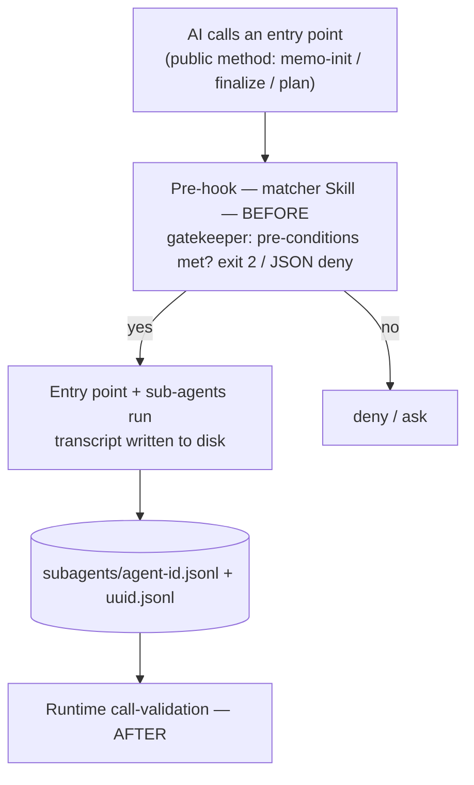

# 25. Validation Overview

| | |
|---|---|
| Status | Draft |
| Depends on | [23-hooks-contract.md](./23-hooks-contract.md), [02-sop-entrypoint.md](./02-sop-entrypoint.md) |
| Related | [22-config.md](./22-config.md), [20-cli.md](./20-cli.md), [21-environment-scripts.md](./21-environment-scripts.md), [32-trash.md](./32-trash.md) |

> **Informative.** This chapter is a **wayfinder**: it gathers the workbench's validation rules in one place and points at the chapter where each is specified. It introduces no new rule of its own — every entry below is normative *there*, not here.

The workbench's checks are deliberately spread across the chapters they belong to — the hook contract, the configuration, the trash policy, the scripts. That keeps each rule next to the thing it governs, but it makes the *set* of rules hard to see. This page is the index that makes the set visible: a reader who asks "what does the workbench actually validate, and where is it defined?" starts here and follows the link. The pattern mirrors a published rule-registry — a stable family name on the left, the defining chapter on the right.

---

## The Validation Families

Each family has a stable name (the wayfinder handle), a short statement of what it checks, **when** it fires relative to the action, the **mechanism** that enforces it, and the chapter that specifies it.

| Family | Checks | When | Mechanism | Defined in |
|--------|--------|------|-----------|------------|
| `WRITE-LINT` | Content matches the target folder's convention before it is written | before (on `Write`/`Edit`) | PreToolUse hook | [23-hooks-contract.md](./23-hooks-contract.md) |
| `ENTRY-PRE` | An entry point's pre-conditions are met before it runs | before (on `Skill`) | PreToolUse hook | [23-hooks-contract.md](./23-hooks-contract.md) |
| `RUNTIME-VAL` | Which skills and tools actually ran this session | after (from the transcript) | transcript scan | [20-cli.md](./20-cli.md) |
| `EGRESS-C1` | Inward routes through the memo ID, outward through Issues | on coordination / push | push / coordination gate | [22-config.md](./22-config.md), [11-project-structure.md](./11-project-structure.md) |
| `TRASH` | Deletion routes through `.trash/` rather than a hard delete | on delete | command rewrite | [32-trash.md](./32-trash.md) |
| `HEALTH` | Project structure and global-tool reachability | on demand / before a memo | CLI / script | [21-environment-scripts.md](./21-environment-scripts.md) |
| `INSTALL-GATE` | A dependency is safe before it is installed | before install | pre-install gate | [00-overview.md](./00-overview.md) |

A second group of rules is **declared** by the workbench but **enforced at the machine tier**, whose hook scripts are out of scope for this spec ([02-sop-entrypoint.md](./02-sop-entrypoint.md)). They are listed so the wayfinder is complete:

| Family | Checks | When | Mechanism | Declared by |
|--------|--------|------|-----------|-------------|
| `ENV-GUARD` | A write to a `.env` file is refused | before (on `Write`/`Edit`) | PreToolUse hook | [23-hooks-contract.md](./23-hooks-contract.md) |
| `NO-DESTRUCT` | A destructive shell command is rewritten or refused | before (on `Bash`) | PreToolUse hook | [23-hooks-contract.md](./23-hooks-contract.md) |
| `ATTRIB-GUARD` | A commit message carries no unapproved AI-attribution trailer | before a commit | commit-msg hook | [23-hooks-contract.md](./23-hooks-contract.md) |

---

## Severity

A validation family blocks or warns; the two outcomes are kept distinct so a warning is never silently treated as a hard stop:

- **block** — the action is refused (`exit 2` or `permissionDecision: "deny"`). Structural, high-risk rules use this: `ENTRY-PRE` on a missing prerequisite, `ENV-GUARD`, `NO-DESTRUCT`, `EGRESS-C1` on an inward push.
- **warn** — the action proceeds, but a finding is surfaced. Advisory rules use this: a `HEALTH` finding, a `WRITE-LINT` entry whose severity is `warn`.

The severity of a configurable rule (notably `WRITE-LINT`) is set per entry in `.workbench/folder-lints.json` ([22-config.md](./22-config.md)); the structural rules are block by nature.

---

## Hub and Detail

This page is the **hub**; each family's chapter is the **detail**. The contract for the hook-based families — their inputs, their two block paths, the transcript-inspection rule — is specified once in [23-hooks-contract.md](./23-hooks-contract.md), and the families that are not hooks (`TRASH`, `HEALTH`, `EGRESS-C1`, `INSTALL-GATE`) point at their own chapters. Adding a new validation rule means specifying it in its chapter **and** giving it a row here, so the set never silently grows beyond what this wayfinder lists.

---

## The Validation Boundary — Before and After

The two checkability halves act on the same public entry point at two different moments: a **pre-hook** gates the call *before* it runs ([23-hooks-contract.md](./23-hooks-contract.md)), and **runtime call-validation** measures, *after* the fact, what really ran ([20-cli.md](./20-cli.md)). The diagram traces one call through both.

*The left-of-the-call check is the "before" half ([23-hooks-contract.md](./23-hooks-contract.md)); the transcript scan after the run is the "after" half ([20-cli.md](./20-cli.md)) — the same before/after split this wayfinder records for `ENTRY-PRE` and `RUNTIME-VAL`.*

---

## Related

- [23-hooks-contract.md](./23-hooks-contract.md) — the contract for every hook-based family, and the hub for the "before" and "after" checkability mechanisms.
- [20-cli.md](./20-cli.md) — the runtime call-validation (`RUNTIME-VAL`), the "after" measurement.
- [22-config.md](./22-config.md) — `.workbench/` policy, including `folder-lints.json` severities.
- [32-trash.md](./32-trash.md) — the trash-routing rule.
- [21-environment-scripts.md](./21-environment-scripts.md) — the health checks.
