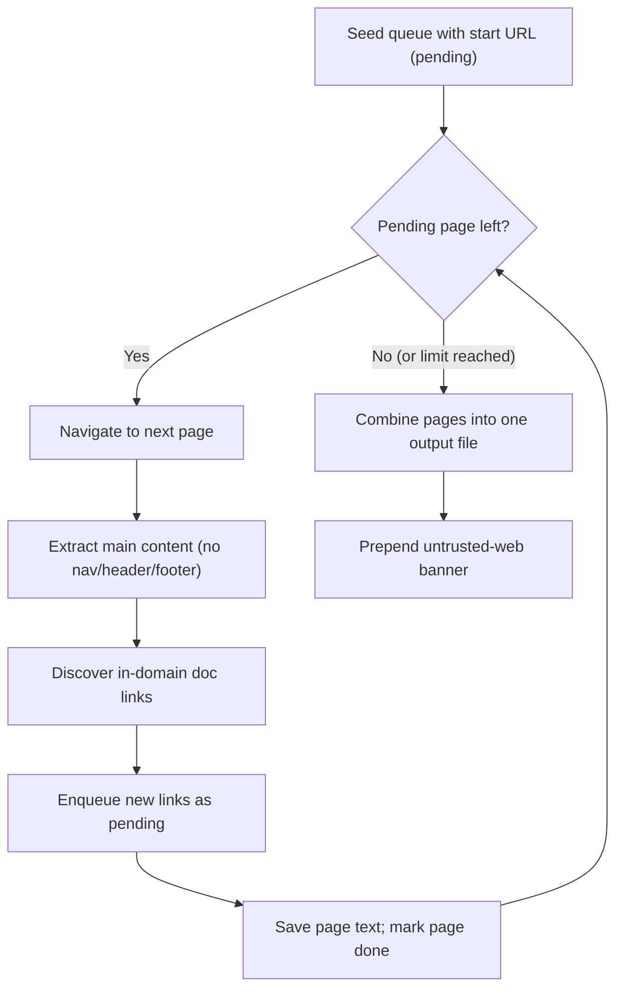
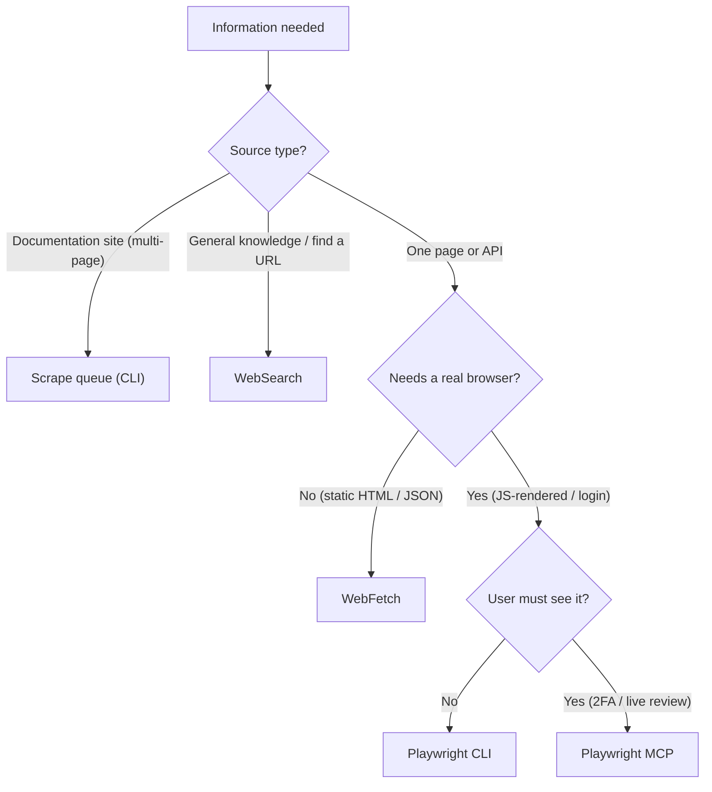

# 31. Browser Automation & Research Method

| | |
|---|---|
| Status | Draft |
| Depends on | [00-overview.md](./00-overview.md), [12-folders.md](./12-folders.md) |
| Related | [11-project-structure.md](./11-project-structure.md), [12-folders.md](./12-folders.md), [../../v0.1.0/10-proactive-research.md](../../v0.1.0/10-proactive-research.md), [32-trash.md](./32-trash.md) |

The core specification's research chapter ([../../v0.1.0/10-proactive-research.md](../../v0.1.0/10-proactive-research.md)) defines the research *duty* — when a memo must verify its assumptions and how that research feeds the revision lifecycle. This document defines the research *method* — the concrete tooling a project uses to gather external information, and the cost discipline that governs which tool is chosen. The two are complementary: the core chapter says *what must be researched and when*, this chapter says *how the gathering is done*.

Browser automation lives at the project level. Each project that uses it carries its own `.playwright/` folder (an optional folder — see [12-folders.md](./12-folders.md)), its own session, and its own scripts. The conventions below are normative for that folder and for the tool-selection decisions a project makes.

---

## The Cost-Driven Tool Choice

The single most important rule of browser automation is that the choice between the **Playwright CLI** and the **Playwright MCP server** is driven by **cost**, not by convenience.

- The **CLI is the default**. It handles the large majority of automation work — logins, batch screenshots, content extraction, health checks — and it does so at a small fraction of the context cost of the MCP server. A CLI script executes outside the agent's context and returns only a compact result.
- The **MCP server is the exception**. Each MCP tool call streams browser state back into the agent's context and is therefore an order of magnitude more expensive per action. The MCP server is reserved for the cases where the user must *see* the browser or *interact* with it live.

> **CLI is the default; MCP is the exception. The deciding factor is cost.**

The MCP server's cost is justified only by a genuine need for a live, visible, or interactive browser. Whenever the work can be expressed as a repeatable script that returns a compact result, the CLI **MUST** be preferred.

---

## When CLI, When MCP

The CLI is the correct tool whenever the browser work is non-interactive and its result can be written to a file or returned as a small summary.

| Use the CLI for | Use the MCP server for |
|-----------------|------------------------|
| Login and session capture | First-time login with 2FA or CAPTCHA |
| Batch screenshots across routes | UI/UX review the user watches live |
| Single-page content extraction | Collaborative, iterative debugging |
| Health checks | Accessibility audits over a rich tree |

The pattern that bridges the two is **session transfer**: when a first login genuinely requires the user (2FA, CAPTCHA), the MCP server is used once to perform that login interactively and capture the session; every subsequent run reuses the captured session through the CLI at no further interactive cost.

---

## The `.playwright/` Project Structure

Every project that uses browser automation **MUST** keep it inside a `.playwright/` folder at the project root. The folder separates three concerns — the captured session, the reusable scripts, and the produced output.

```
.playwright/
├── auth.json              # captured session — secret, never committed
├── output/                # produced artifacts — local-only
│   ├── screenshots/
│   └── temp/
└── scripts/
    ├── login.mjs
    ├── screenshot-routes.mjs
    ├── scrape-page.mjs
    └── health-check.mjs
```

- **`scripts/`** holds the reusable automation. A script is written once and re-run at zero additional context cost; this reusability is the economic reason the CLI is the default.
- **`output/`** holds produced artifacts — screenshots, extracted text, temporary files. Output is written here, **not** into the agent's context; the agent reads back only what it needs. Output is local-only and is never committed.
- **`auth.json`** holds the captured browser session.

### `auth.json` Is a Session Secret

The captured session file `auth.json` carries live authentication state — cookies and tokens equivalent to being logged in. It **MUST** be treated as a secret:

- `auth.json` **MUST NOT** be committed. It belongs in `.gitignore`, and because the project root is local-only (see [11-project-structure.md](./11-project-structure.md)) it cannot leave the machine through `repos/` either.
- Credentials used to *produce* a session **MUST NOT** be hardcoded into scripts. They are read from the project runbook or environment, never embedded in committed code.
- Scripts **MUST** check for an existing valid session before re-authenticating, so a stored session is reused rather than needlessly regenerated.

---

## The Documentation-Scrape Queue

Scraping a multi-page documentation site is a distinct method with its own algorithm: a **work queue** of pages, **per-page main-content extraction**, and a **single combined output file**.



The algorithm is deliberately simple and bounded:

1. **Seed.** A work queue (a `TODO.md` of links with a status each) starts with the entry URL marked *pending*.
2. **Drain.** While a *pending* entry remains and the page limit is not reached, take the next entry, navigate to it, and extract only its **main content** — the article body, with navigation, header, and footer stripped out.
3. **Expand.** Identify in-domain, documentation-relevant links on the page (sidebar, table of contents, next/previous, sub-pages) and enqueue any not already seen. External links, anchors, assets, and excluded patterns are skipped.
4. **Record.** Save the extracted text as a per-page file and mark the queue entry *done*.
5. **Combine.** When the queue is drained, concatenate the per-page files into a **single** combined output file under `context/`. The combined file **MUST** begin with an untrusted-web banner (see below).

A **safety page limit** bounds the crawl, and the crawl **MUST** stay on the allowed domain. The per-page intermediate files are temporary working material; the combined file is the durable artifact.

### The Combined Output Is Untrusted Data

A scraped documentation file lands in `context/` and is **read back later** by a human or by an agent. To prevent a stray imperative buried in the scraped text from being mistaken for an instruction at read-back time, the combined file **MUST** begin with a banner that marks everything below it as untrusted *data*. This inward trust boundary is specified normatively in [../../v0.1.0/10-proactive-research.md](../../v0.1.0/10-proactive-research.md); the banner is its concrete enforcement at the point of capture.

---

## The Tool-Selection Decision Tree

Not every information need calls for a browser. Before reaching for Playwright at all, the cheapest tool that can answer the question **MUST** be chosen. The order of preference, from cheapest to most expensive, is: **WebSearch → WebFetch → Playwright CLI → Playwright MCP**.



| Tool | When to reach for it | Relative cost |
|------|----------------------|---------------|
| **WebSearch** | General questions; finding the right URL | Lowest |
| **WebFetch** | A single static page, an API, or JSON | Low |
| **Playwright CLI** | JS-rendered pages, login required, batch work | Medium |
| **Playwright MCP** | The user must see the browser; 2FA or CAPTCHA | High |

The rule is to **default to the lowest-cost tool that can do the job** and to escalate only when a concrete capability — JavaScript rendering, an interactive login, a live visual review — forces the next tier. Escalating past the tool the task actually needs spends context for nothing.

---

## Related

- [00-overview.md](./00-overview.md) — the workbench spec framing and the global helpers it exposes.
- [12-folders.md](./12-folders.md) — the optional `.playwright/` folder in the project layout.
- [11-project-structure.md](./11-project-structure.md) — the local guarantee that keeps `auth.json` and `output/` off the network.
- [../../v0.1.0/10-proactive-research.md](../../v0.1.0/10-proactive-research.md) — the research *duty* this chapter's *method* serves, and the normative inward trust boundary on ingested web content.
- [32-trash.md](./32-trash.md) — why temporary scrape working material is removed through `.trash/` rather than hard-deleted.
