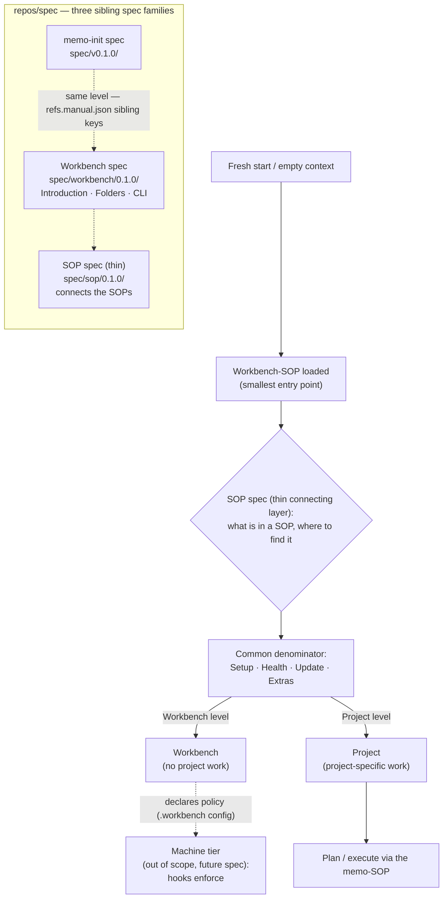

# 40. Architecture Diagram

| | |
|---|---|
| Status | Draft |
| Depends on | [00-overview.md](./00-overview.md), [02-sop-entrypoint.md](./02-sop-entrypoint.md) |
| Related | [10-root-and-projects.md](./10-root-and-projects.md), [The SOP spec](/sop/overview/) |

> **Informative.** This chapter is a single diagram that summarizes the structures specified in the preceding chapters. It carries no requirements of its own.

The diagram has two parts. The upper flow shows the **two-level model** (Workbench and Project) reached through the workbench-SOP and the thin SOP spec, with the machine tier drawn dashed because it is out of scope for this spec. The lower group shows the **three sibling spec families** that live side by side in `repos/spec`, each with its own version line.

The upper flow reads top-down: a fresh context loads the workbench-SOP, which uses the SOP spec to read any SOP predictably, which resolves to the common denominator, which routes to one of the two levels. The workbench level *declares* policy; the dashed machine tier (a future spec) *enforces* it. The lower group is structural: three peers in one repository, the memo-init spec and the Workbench spec at the same level via sibling keys in `refs.manual.json`, with the thin SOP spec connecting them.

---

## Related

- [00-overview.md](./00-overview.md) — the sibling-spec framing the lower group depicts.
- [02-sop-entrypoint.md](./02-sop-entrypoint.md) — the two-level model and the machine-tier exclusion the upper flow depicts.
- [The SOP spec](/sop/overview/) — the thin connecting layer in the diagram.
