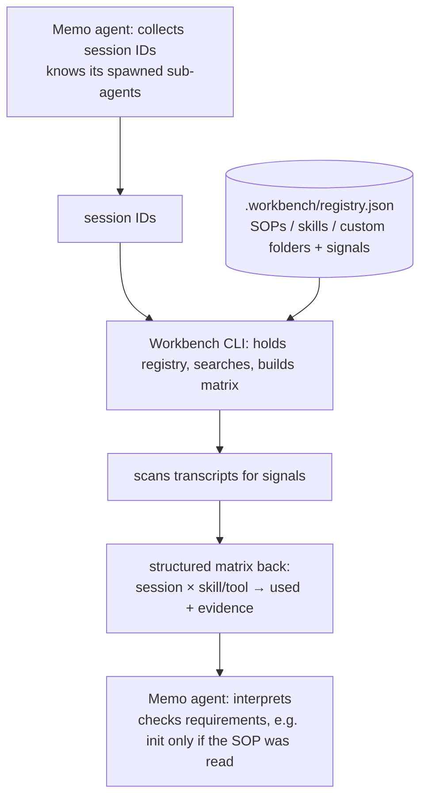

The workbench's command-line tools follow one convention: a **self-describing command tree** built from branches and leaves. This CLI-authoring convention is **single-sourced to the Session spec's [CLI doctrine chapter](/session/cli/)** — the session tier owns the doctrine every family's CLI inherits, and the workbench convention is **one scoped instance** of it, not a second specification. This chapter records only the workbench-scoped specifics — the registry as the discovery source, the script-subfolder rule, and runtime call-validation — and references the doctrine rather than restating it.

The **universal CLI doctrine** — the eight principles every CLI in the system shares (one result envelope, the exit-code mirror, the standard verbs, config precedence, additive evolution) — is stated once at the lowest tier, in the Session spec's [CLI doctrine chapter](/session/cli/), and is **not** restated here. This chapter records only what is specific to the **workbench** scope: the Branch/Leaf convention, the `registry.json` discovery source, the script-subfolder rule, and runtime call-validation. For the eight principles and the conformance checklist, reference down to [/session/cli/](/session/cli/).

---

## Self-Describing Command Tree (Branch/Leaf)

A workbench CLI is a **tree of commands**, and the tree describes itself. The full normative treatment lives in the core specification's [Tree CLI chapter](/specification/tree-cli-recommended-way/); this chapter states the convention and points there. The two roles in the tree are:

- A **branch** is a grouping node — a "bag of tools." It carries no behavior of its own; it organizes the leaves beneath it and lets a caller discover what is available by walking the tree.
- A **leaf** is an executable command with **typed input and output**. The crucial property is that a leaf's **field descriptions encode its behavior**: reading the leaf's typed in/out is enough to understand what it does, without separate prose. The tree is self-describing because each leaf documents itself through its types.

A workbench CLI **SHOULD** be structured this way so that an agent can discover and call commands by inspecting the tree rather than by being told about each command out of band.

---

## `npm link` Is Only a Registration Mechanism

Making a CLI globally callable — for example via `npm link` — is **only a registration mechanism**. It puts the command on the path; it says nothing about the command's design. The Branch/Leaf convention is the design contract, and it stands independently of how the binary is registered. Registration and convention **MUST NOT** be conflated: a tool is not "well-formed" because it is linked, only because its command tree is self-describing.

---

## `registry.json` Is the Self-Discovery Source

An agent **MUST** discover the workbench's available CLIs, skills, and custom folders **deterministically by reading `.workbench/registry.json`**. It **MUST NOT** discover them by reading a `CLAUDE.md` or by inferring them from the shape of the filesystem. The registry is the **single discovery source**: one declared file answers "what is part of this workbench?", so discovery does not depend on prose that can drift or on a tree walk that can guess wrong.

Discovery and preconditions are **unified in one file**. The same `registry.json` that lists `skills[]` and `addons[]` (discovery) also carries `requirements[]` — the precondition dependency table ([23-hooks-contract.md](/workbench/hooks-contract/)). One source therefore answers both questions at once:

- **"What exists?"** — the `skills[]` and `addons[]` arrays.
- **"What must run first?"** — the `requirements[]` array, with its `when: "pre" | "post"` timing.

This is the same registry whose shape, signals, and pre/post split are specified below; here it is named as the *discovery* source, not only the *validation* source.

`npm link` and the registry play different roles and **MUST NOT** be conflated. Linking is **only the registration mechanism** (see [`npm link` Is Only a Registration Mechanism](#npm-link-is-only-a-registration-mechanism)) — it puts a CLI on the path. The registry is what makes that CLI **discoverable** as a declared part of the workbench. **Registration ≠ discovery:** a linked binary the registry does not list is on the path but is not part of the discoverable workbench surface.

The **naming convention** for the discovery handle (the prefix-plus-hyphen scheme) is defined once in the SOP standard's conventions chapter ([/session/conventions/](/session/conventions/)); it is referenced here and **MUST NOT** be restated.

---

## Scripts Live in Meaningful Subfolders

The same self-describing principle applies to a project's `scripts/` folder. Scripts **MUST** live in **meaningful subfolders**, not as a flat collection at the top level. The reason is identical to the Branch/Leaf rule: a bare `dev.sh` says too little about *which* environment it operates on, while a subfolder name (for example `scripts/rails/`) carries that meaning.

The **folder name is the unit of meaning**. This connects to the About convention (see [30-wiki.md](/workbench/wiki/)): a scripts subfolder carries an `About` describing what it is for, and that description is ingested into the wiki — so the meaning a reader infers from the folder name is also recorded where the wiki can answer for it. The script families themselves are specified in [21-environment-scripts.md](/workbench/environment-scripts/).

---

## Runtime Call-Validation — the "After" Measurement

Beyond defining the command convention, the workbench CLI provides one capability that is itself a leaf of the command tree: **runtime call-validation**. It is the **"after" half** of checkability — the runtime counterpart to the "before" pre-hook. The before/after split itself is specified once in [25-validation-overview.md](/workbench/validation-overview/); this chapter owns only the "after" **mechanism**. Once a session has run, the CLI inspects what was recorded and measures **which skills and tools were actually invoked**, answering questions a pre-hook cannot answer in advance — most importantly, **"was the SOP actually read this session?"**.

### Where Sessions Live

The measurement reads the session transcripts Claude Code writes to disk:

- **Main session:** `~/.claude/projects/<project-slug>/<session-uuid>.jsonl`.
- **Sub-agents:** `<session-uuid>/subagents/agent-<agent-id>.jsonl`, each with a `.meta.json` sidecar.

Both levels log `Skill` tool-use entries and tool calls, so a skill loaded in a sub-agent is visible too. (No `SubagentStop` hook is assumed; the transcript files are the source.)

### Three Signals That a Skill Ran

Whether a given skill (for example the SOP) ran is **deterministically detectable post-hoc** from three greppable signals in a transcript:

1. A `Skill` tool-use entry naming the skill (`"skill": "<name>"`).
2. A `Base directory …/skills/<name>` line emitted when the skill loads.
3. An attribution field recording the active skill.

Any one signal is evidence the skill ran; their absence across a session is evidence it did not.

### The Workbench Registry — the "What to Search"

The CLI does not hardcode what to look for; it reads a project's **`.workbench/registry.json`** — the machine-readable form of the SOP signpost ([02-sop-entrypoint.md](/workbench/sop-entrypoint/)). The registry lists the SOPs, skills, and custom folders that *could* be used, each with the signals that prove it was:

```jsonc
// .workbench/registry.json — the single structural definition of the workbench registry.
// It is the "what to search": every searchable skill, custom folder (addon), and requirement.
{
  // skills[] — what exists: each skill with the signals that prove it ran.
  "skills": [
    {
      "id": "<skill-id>",
      "role": "orchestrator | component",
      "signals": [ "skill:<skill-id>", "path:/skills/<skill-id>", "attributionSkill:<skill-id>" ]
    }
  ],

  // addons[] — custom-folder tools: each with the CLI it ships and its signals.
  "addons": [
    {
      "name": "<addon>",
      "cli": "<addon-cli>",
      "signals": [ "bash:<addon-cli> ", "skill:<usage-skill>" ]
    }
  ],

  // requirements[] — what must run first: entrypoint -> skill edges, split by `when`.
  "requirements": [
    {
      "id": "<requirement-id>",
      "entrypoint": "<entry-point>",
      "requires": "<skill-id>",
      "when": "pre | post"
    }
  ]
}
```

### The Matrix — the CLI's Structured Output

Given a set of session IDs and the registry, the CLI scans the transcripts and returns a **structured matrix**: per session, which registered skill or custom folder was used, with the evidence that proves it. The output is machine-readable, in the manner of the existing CLI JSON envelopes:

```jsonc
{
  "session": "<session-uuid>",
  "matrix": [
    { "id": "<sop-skill>", "kind": "skill", "used": true,  "evidence": "skill:<sop-skill> @ <uuid>.jsonl:<line>" },
    { "id": "<addon>",     "kind": "addon", "used": false, "evidence": null }
  ]
}
```

### The Memo ↔ Workbench Split

The validation is split across the two systems by what each one *knows*. The memo system knows **which** sessions exist and what their use **means**; the workbench knows **what** can be searched for:

| Step | Who | Detail |
|------|-----|--------|
| 1. Collect the session IDs | **Memo** | the memo agent knows the sub-agents it spawned and their IDs. |
| 2. Hand the IDs over | Memo → Workbench CLI | — |
| 3. Hold the registry of possibilities | **Workbench** | the `.workbench/registry.json` — the "what to search". |
| 4. Search signals, build the matrix | **Workbench CLI** | takes the IDs and the registry, scans the transcripts, returns the structured matrix. |
| 5. Interpret the matrix | **Memo** | checks the matrix against requirements and intent. |

So **the memo collects IDs and interprets; the workbench holds the registry, searches the signals, and builds the matrix.** The division follows from knowledge: the workbench "knows all tools and SOPs", so it owns the *what-to-search*; the memo system carries the *which-sessions* and the *meaning*. A per-memo-scoped system interprets a project-wide matrix because interpretation is an **intent/requirements** check — only the memo system holds the requirements and the memo context. The workbench returns an already-matched, structured matrix; the memo reads it as a dataset, so the scope boundary is preserved.

#### Session Validation Is a CLI Function the Memo Uses

Session validation is a **workbench CLI function the memo uses**, not work the memo does itself: the workbench CLI holds the registry, searches the transcripts, and builds the matrix, while the memo only supplies the session IDs and interprets the result.



### Requirements on Top

Because the matrix is a structured fact, **post-hoc requirements** can be expressed against it — for example, "the init entry point may run only if the SOP was read this session". This is the after-the-fact counterpart of the entry-point pre-condition ([23-hooks-contract.md](/workbench/hooks-contract/)) and is registered like any other validation family ([25-validation-overview.md](/workbench/validation-overview/)).

### Pre and Post Share One Registry

The post-hoc matrix above and the new pre-gate read the **same** `.workbench/registry.json` and the **same** transcript signals — they differ only in *when* they read. The `requirements[]` entries split by their `when` field:

- **`when: "pre"`** entries are consumed by the **`PreToolUse` precondition hook** ([23-hooks-contract.md](/workbench/hooks-contract/)). This **pulls the session-JSONL signal scan from post-hoc to a pre-gate**: the same three signals that prove a skill ran are checked *before* the entry point runs, so an unmet predecessor blocks the call instead of being reported after the fact.
- **`when: "post"`** entries feed the after-the-fact matrix described above.

So it is **one registry, one signal scan, two timings**. The seed first edge is **REQ-061** — `{ entrypoint: "memo-init", requires: "memo-sop", when: "pre" }` — the `memo-init → memo-sop` precondition that the pre-gate resolves deterministically.

> **Spec now, build deferred.** This chapter fixes the path schema, the registry shape, the matrix output, and the memo-vs-workbench split. Building the workbench CLI leaf and the memo-side ID-collection/interpretation is a later, separate step.

---

## Conformity Requirements

This chapter records the workbench-scoped CLI rules; the eight universal principles stay in the session doctrine and are not restated. The blocks below encode the workbench-specific `MUST`s prose-first — each `statement` faces how a CLI and its discovery source are built, each `check` faces the built tool. They are the source the requirement store is harvested from ([../../v0.1.0/23-requirements.md](/specification/requirements/)).

That the registry is the single, declared discovery source is a structural fact about the file:

```requirement
{
  "id": "REQ-964",
  "title": "registry.json is the single deterministic discovery source",
  "statement": "An agent MUST discover the workbench's available CLIs, skills, and custom folders deterministically by reading `.workbench/registry.json`, and MUST NOT discover them by reading a `CLAUDE.md` or inferring them from the filesystem shape. The registry MUST carry the discovery arrays (`skills[]`, `addons[]`) and the precondition table (`requirements[]`) in one file, so one source answers both what exists and what must run first.",
  "scope": { "repos": [], "categories": ["workbench"], "tags": ["cli", "registry", "discovery"] },
  "severity": "warning",
  "check": {
    "kind": "assertion",
    "assertions": [
      "`.workbench/registry.json` exists and parses",
      "It carries `skills[]`, `addons[]`, and `requirements[]`",
      "Discovery does not depend on `CLAUDE.md` prose or a filesystem walk"
    ]
  },
  "grade": "binary"
}
```

Whether a CLI's command tree is genuinely self-describing is a quality spectrum a reviewer judges, so this rule earns an object `grade`. The Branch/Leaf contract itself is the core standard's (REQ-703); the workbench convention is one scoped instance of it, not a second specification:

```requirement
{
  "id": "REQ-965",
  "title": "A workbench CLI follows the core Branch/Leaf contract (REQ-703)",
  "statement": "A workbench CLI SHOULD follow the Branch/Leaf command-tree contract defined ONCE by the core CLI standard (REQ-703, [22-tree-cli-recommended-way.md](/specification/tree-cli-recommended-way/)): branches group without behaviour, and each leaf is re-implementable from its typed `input`/`output` alone. This is referenced, not re-authored — the workbench convention is one scoped instance of that single core contract. (Making a CLI globally callable, e.g. via `npm link`, is only a registration mechanism and MUST NOT be conflated with this design contract or registry discoverability.)",
  "scope": { "repos": [], "categories": ["workbench"], "tags": ["cli", "branch-leaf", "self-describing"] },
  "severity": "warning",
  "check": {
    "kind": "evaluator",
    "rubric": "A reviewer walks a workbench CLI's command tree. PASS when branches group and every leaf carries typed input/output whose field docs encode behaviour; BLOCKED when leaves lack typed in/out or rely on out-of-band prose to explain themselves; INCONCLUSIVE when the tree cannot be inspected.",
    "verify": [
      "Inspect the command tree's branches and leaves",
      "Judge whether each leaf is re-implementable from its typed in/out alone"
    ]
  },
  "grade": { "dimension": "self-describing completeness", "weight": 100 }
}
```

---


<!-- IMPLEMENTED-BY — rendered backlink lives in the dist (generated/bridge/<family>/<stem>.backlink.md); source stays authored-only (F2 Dist-Split) -->
## Related

- [Tree CLI — the recommended way](/specification/tree-cli-recommended-way/) — the normative Branch/Leaf treatment in the core spec.
- [/session/cli/](/session/cli/) — the universal CLI doctrine (the eight principles, exit-code mirror, standard verbs, conformance checklist) that this workbench convention is one scoped instance of.
- [/session/conventions/](/session/conventions/) — the SOP standard's conventions chapter that defines the naming convention (the discovery handle).
- [23-hooks-contract.md](/workbench/hooks-contract/) — the entry-point pre-condition, the "before" half this measurement complements.
- [02-sop-entrypoint.md](/workbench/sop-entrypoint/) — the SOP signpost that `.workbench/registry.json` is the machine-readable form of.
- [25-validation-overview.md](/workbench/validation-overview/) — the validation wayfinder and code index, and the single source of the before/after split where runtime call-validation is registered.
- [21-environment-scripts.md](/workbench/environment-scripts/) — the script families that follow the subfolder rule.
- [30-wiki.md](/workbench/wiki/) — the About convention that records what a scripts subfolder is for.
