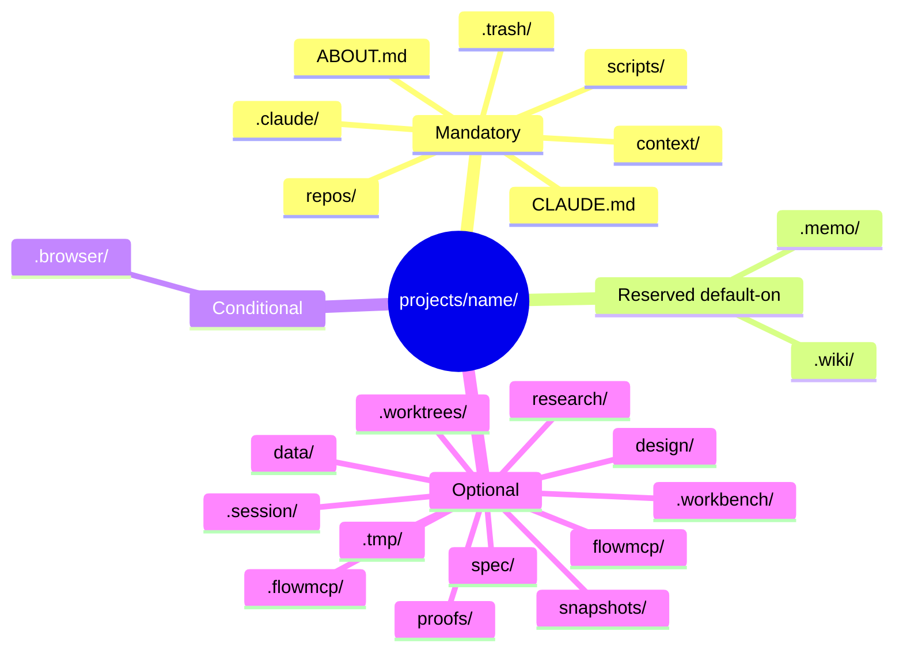
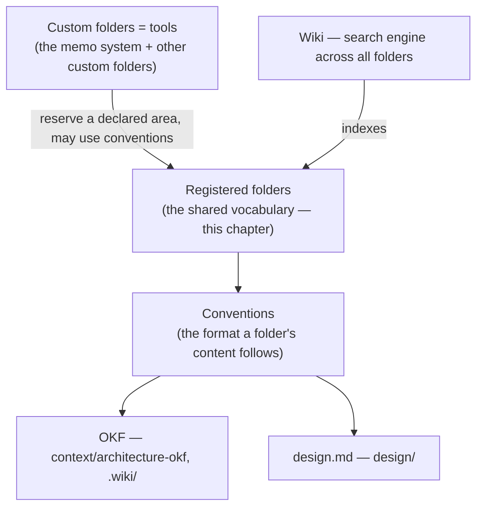

# 12. Project Folders — Mandatory and Optional

| | |
|---|---|
| Status | Draft |
| Depends on | [10-root-and-projects.md](./10-root-and-projects.md), [11-project-structure.md](./11-project-structure.md) |
| Related | [22-config.md](./22-config.md), [30-wiki.md](./30-wiki.md), [31-browser-automation.md](./31-browser-automation.md), [32-trash.md](./32-trash.md) |

Every project under `projects/{name}/` **MUST** follow a single, predictable layout. A predictable layout is what lets the workbench audit check structure mechanically and what lets a memo assume where its context, repositories, and scripts are without searching. This chapter is the authoritative folder contract; the root-vs-project split is in [10-root-and-projects.md](./10-root-and-projects.md), and the local guarantee that protects the layout in [11-project-structure.md](./11-project-structure.md).

---

## Registered Folders — A Shared, Named Vocabulary

The workbench's core idea is that a project's top-level folders are a **registered vocabulary**: a fixed set of names, identical in every project, each with a declared meaning. Because the names are the same everywhere, a developer moving between projects — and an agent reading a project for the first time — already knows where context, repositories, scripts, and tooling live. The shared layout is a shared *working mentality*, not merely a directory listing; standardizing the first place a thing is put is worth the cost, because the alternative is every project doing it differently.

Five properties make a folder **registered**:

- **A stable name.** The folder is referred to by exactly one name across all projects (`repos/`, `context/`, `.memo/`); the name is a load-bearing identifier, not a project-local choice.
- **A required-or-optional status.** Each registered folder is either mandatory (every project has it) or optional (a project adds it when it needs it).
- **A level.** Each registered folder lives at the workbench **root**, at the **project** level, or — like `context/` — at **both**; the level says where the name is expected (see [10-root-and-projects.md](./10-root-and-projects.md)).
- **A declared meaning.** Each folder has one purpose and, where it is non-trivial, its own chapter or convention that says what belongs in it.
- **A content contract (optional, default empty).** Along with its name, a registered folder **MAY** reserve a default requirement its *content* must satisfy — plain Markdown unless the name declares a named standard. This per-folder mechanism is developed in [A Reserved Name May Carry a Content Contract](#a-reserved-name-may-carry-a-content-contract); it is the part of the definition the **runtime** check reads.

The contract table in the next section **is** this registry: the single, authoritative list of registered folders. Tooling that needs the list — the project-setup helper, the structure audit — **SHOULD derive it from this registry** rather than restate it. A hardcoded copy in a tool is drift, and this registry is the source it must agree with. This one definition is checked at **two moments** — at init and at runtime — as [One Folder Definition, Checked at Init and at Runtime](#one-folder-definition-checked-at-init-and-at-runtime) sets out.

---

## The Folder Contract

Folder names are load-bearing identifiers and are reproduced verbatim. The workbench audit reports any missing mandatory path as a structural finding and any unexpected top-level entry for review. The rows are kept in a **stable, reproducible order**: by status — mandatory entries first, then the default-on reservations (`.memo/`, `.wiki/`), then the conditional `.browser/`, then optional entries — and in ascending path order within each group, so the registry reads the same way every time and a new entry has one correct place.

| Path | Status | Level | Entry-point | Format/Convention | Purpose |
|------|--------|-------|-------------|-------------------|---------|
| `.claude/` | Mandatory | Project | `settings.json` | — | Claude Code settings and project-local skills. |
| `.trash/` | Mandatory | Project | — | — | Recoverable trash; the deletion target (see [32-trash.md](./32-trash.md)). |
| `ABOUT.md` | Mandatory | Project | — | — | Project documentation for humans. |
| `CLAUDE.md` | Mandatory | Project | — | — | The runbook for the AI. |
| `context/` | Mandatory | Both | per-topic sub-folders | plain Markdown; OKF opt-in for `architecture-okf/` | **Processed**, derived material — specifications, distilled research, Markdown/PDF documents. Also exists at the root for cross-project standards (see [10-root-and-projects.md](./10-root-and-projects.md)). |
| `repos/` | Mandatory | Project | — | — | The project's git repositories (one domain per repository). |
| `scripts/` | Mandatory | Project | meaningful sub-folders | startup-script convention | Environment and health scripts (see [21-environment-scripts.md](./21-environment-scripts.md)). |
| `.memo/` | reserved (custom folder, default-on) | Project | `config.json` + `memos/` | — | Memos and their shared stores, generated by `memo-init`; the on-disk footprint of the memo Add-on (see [17-memo-store.md](./17-memo-store.md)). |
| `.wiki/` | reserved (custom folder, default-on) | Project | `index.md` (published as "overview") | OKF | LLM-generated project wiki, an OKF-conformant knowledge bundle; reserved default-on like `.memo/` (see [30-wiki.md](./30-wiki.md)). |
| `.browser/` | Required (conditional) | Project | — | — | Browser-automation session, scripts, and output — present **only when** the project does browser automation, but when present the name is **required**: `.browser/` is the canonical name and the only conforming one, and `.playwright/` is a **deprecated** alias projects **MUST** migrate now — not at their own pace (see [31-browser-automation.md](./31-browser-automation.md)). |
| `.flowmcp/` | Optional | Project | — | — | Regenerable FlowMCP `namespace-index.json` cache — generated machinery, **gitignored**; the local side of the FlowMCP custom folder (see [33-flowmcp.md](./33-flowmcp.md)). |
| `.session/` | Optional | Both | `config.json` | — | The session genesis-root marker — its presence marks where a session is rooted; holds `config.json`, the base of the config cascade. One per tree, a sibling of `.workbench/`. Owned by the session spec (see [`.session/` Is Session-Owned](#session-is-session-owned) and [session/01-genesis-root.md](/session/genesis-root/)). |
| `.tmp/` | Optional | Project | — | — | Scratch / temporary working area — transient material, not durable knowledge and not committed (see [19-tmp.md](./19-tmp.md)). |
| `.workbench/` | Optional | Project | `config.json` · `registry.json` | — | The manual project configuration the workbench core reads (see [22-config.md](./22-config.md)). |
| `.worktrees/` | Optional | Project | — | — | The consistent location for git worktrees — generated machinery, **gitignored**, with mandatory cleanup via `git worktree remove`/`prune` (see "Worktree Placement" below). |
| `data/` | Optional | Project | — | — | **Raw inputs** — feeds and source material, as ingested, before processing; the input side that `context/` is derived from. |
| `design/` | Optional | Project | `design.md` | design format | Design system and visual sources — `design.md`, variants, and `.pen` files (see [18-design.md](./18-design.md)). |
| `flowmcp/` | Optional | Both | — | — | FlowMCP authored content and produced output — the footprint of the FlowMCP custom folder (see [33-flowmcp.md](./33-flowmcp.md)). |
| `proofs/` | Optional | Project | — | — | Proofs captured when a view changes (see "Specialized folders" below). |
| `research/` | Optional | Project | — | — | Cloned foreign / research repositories that are **not** the project's own domain repos (for example `dune`, spellbook) — distinct from `repos/` (own repos) and `data/` (raw inputs). |
| `snapshots/` | Optional | Project | — | — | Application snapshots (see "Specialized folders" below). |
| `spec/` | Optional | Project | `<namespace>/<version>/{draft,dist,skills}/` | namespace-first spec container | The project-local, private-first **plural container** for authored specs, structured `spec/<namespace>/<version>/{draft,dist,skills}/` (see "`spec/` Is the Namespace-First Spec Container" below). |

A project **MUST NOT** omit a mandatory folder. A project **MAY** add any optional folder when it needs it. `.memo/` carries a third status — **reserved (custom folder, default-on)**: it is the on-disk footprint of the memo system, the recommended, default-on custom folder, so it is present in every real project but is a *reservation of that custom folder* rather than a requirement of the bare workbench core ([26-addons.md](./26-addons.md)). `.wiki/` carries the **same** reserved (custom folder, default-on) status — the wiki is a default-on custom folder, present in every project ([30-wiki.md](./30-wiki.md)). `.browser/` carries a **conditional** status — it is *required when* a project does browser automation and absent otherwise; when present, `.browser/` is the only conforming name and `.playwright/` is a deprecated alias that **MUST** be migrated (see [31-browser-automation.md](./31-browser-automation.md)). The `.wiki/` entry point is the OKF-reserved `index.md`, **published under the label "overview"** — a published navigation label, not a file rename (renaming `index.md` would break OKF).

The **Level** column records where each name is expected. The rows above are the **project-level** contract for folders under `projects/{name}/`; `context/` is marked **Both** because the same name is also a registered folder at the workbench root, where it holds cross-project standards. The root-only folders — `cli/`, `projects/`, `templates/`, and the root `context/` — are registered in [10-root-and-projects.md](./10-root-and-projects.md), not restated here.

The same registry reads as a **taxonomy by status**. A folder tree is a hierarchy, so a mindmap shows it at a glance — mandatory names first, the default-on reservations (`.memo/`, `.wiki/`), then the optional folders a project adds when it needs them:



---

## One Folder Definition, Checked at Init and at Runtime

The registry above is a **single definition** of a project's folder structure, and it is deliberately checked at **two moments** in a project's life. Its pieces have historically been specified in the chapters that enforce them; this section names them as one definition so the whole is visible in one place rather than scattered across four documents.

A registered folder's properties split cleanly across the two moments:

- **At init — presence, status, and level.** When a project is set up or audited, the structure check reads this registry and verifies that every mandatory folder is present at its declared level and that no top-level entry is unaccounted for. This is the *init-time* half — it governs whether a folder **exists where it should** (the workbench structure audit, [00-overview.md](./00-overview.md) · [21-environment-scripts.md](./21-environment-scripts.md); the binding rule is the mandatory-folder requirement in [Conformity Requirements](#conformity-requirements) below).
- **At runtime — the content requirement.** As content is written into a folder, the write-time content lint checks that what lands satisfies the folder's content contract ([A Reserved Name May Carry a Content Contract](#a-reserved-name-may-carry-a-content-contract) below). This is the *runtime* half — it governs whether a folder **holds what it should** (the folder-gate lint, [23-hooks-contract.md](./23-hooks-contract.md)).

Both halves check the **same** registry — the one authoritative list in this chapter — from two directions, and the full set of validation families that act on it is indexed by the validation wayfinder ([25-validation-overview.md](./25-validation-overview.md)). Naming the definition once, here, keeps the init check and the runtime check reading the same source instead of drifting into two independent lists — the same *derive from this registry, do not restate it* discipline the contract table already carries.

---

## The Folder Contract Is Machine-Readable — Overview and Config Are Derived

The registry table above is the human-readable face of the contract, but it is **not** the authored source. Each registered folder that carries a per-folder page states its identity in a machine-readable ` ```folder ` block — the parseable Folder Contract defined in [session/13-conventions.md](/session/conventions/) — and those blocks are the **single source** from which the rest is generated. This is the same move the requirement blocks in [Conformity Requirements](#conformity-requirements) already make: rules and identity are written *as data* on the page, so a tool can read them instead of parsing prose.

- **The machine registry is generated; the human table is agreement-checked.** The spec build derives a machine-readable registry — `dist/data/folder-registry.json` — from the `folder` blocks (assembled the same way the navigation manifest is; `scripts/generate-manifest.mjs` is the pattern), and any folder list a structure tool consumes **SHOULD** be derived from that registry rather than restated. The human-readable contract table in this chapter is the readable face of the same blocks: it is hand-maintained but **not free to drift** — the generator checks each block's `status` and `level` against its table row and **fails** on a disagreement (the *shape-and-agreement* half of the Folder-Page Contract lint, [session/13-conventions.md](/session/conventions/)). The blocks are the source; the table must agree with them.
- **The project config is derived.** The same blocks feed the **generated base tier** of the project configuration — `.workbench/folders.generated.json` — from which the effective per-folder settings, including the `git` and `remote` defaults, are computed. How that generated tier sits *beneath* the manual `.workbench/config.json` overrides is specified in [22-config.md](./22-config.md).
- **Completeness becomes trivial.** Because the folders are enumerated as data, a lint checks that **every registered folder has a complete block** — every required key present, every value in range — in one deterministic pass, rather than reading prose page by page. This is the completeness half of the Folder-Page Contract's lint gate ([session/13-conventions.md](/session/conventions/)).

The direction is fixed and one-way: **author the block on the folder's page → generate the machine registry and the config from it, and hold the human table in agreement with it.** This inverts the older habit of maintaining the table by hand and pointing tools at it — the pages are now the source; the machine registry and the config are the generated output, and the human table is agreement-checked against the blocks — and it follows the **spec-first** ordering this chapter already keeps ([The Convention Model](#the-convention-model)): the block format and its derivation are declared here before the generator that materializes them is built. The `git` and `remote` keys the block adds ([session/13-conventions.md](/session/conventions/)) are the first contract keys that live **only** in the machine-readable block and flow into config without a column in the human table: the block is a *superset* of what the table shows, carrying the two per-folder git axes — is a local history recommended, may a remote be attached — that were previously scattered across the dot-prefix convention, the local-guarantee, and per-page prose. Those defaults are **user-overridable** per folder through `.workbench/config.json` ([22-config.md](./22-config.md)); they never require editing the spec.

---

## The Dot-Prefix Convention

Whether a registered folder's name begins with a dot is **not arbitrary** — it encodes what kind of thing the folder holds:

- A name **begins with `.`** when the folder is **generated or local machinery**: tooling configuration and local-only artifacts that are not authored by hand and, in several cases, never leave the machine (`.claude/`, `.memo/`, `.trash/`, `.workbench/`, `.wiki/`, `.browser/`, `.tmp/`, `.flowmcp/`, `.worktrees/`).
- A name **carries no prefix** when the folder holds **authored, user-facing content** — the substantive material a person creates and reads (`context/`, `repos/`, `scripts/`, `proofs/`, `snapshots/`, `data/`, `design/`, `flowmcp/`, `research/`, `spec/`).

The dot carries two reinforcing meanings — *hidden from casual view* and, for the local-only stores, *never pushed* — and it gives the machine a cheap, structural signal: a folder-aware tool can tell generated machinery from authored content by the leading character alone. `scripts/` is the deliberate edge case — it holds tooling, but it is authored and run by people, so it follows the no-dot, content rule.

A new registered folder **MUST** follow this convention: a dot for generated or local machinery, no dot for authored content.

---

## Three Orthogonal Axes

The dot-prefix is easy to conflate with two properties it is **not** the same as. Three independent axes are at work, and a folder has a value on each:

- **Dot-prefix** — *authored vs. machinery*. A leading dot marks generated or local machinery; no dot marks hand-authored, user-facing content (the convention above).
- **Local guarantee** — *stays on the machine*. The project root is local in its entirety ([11-project-structure.md](./11-project-structure.md)): **every** folder, dotted or not, stays on the machine unless something is **deliberately** published from it (a `repos/` git remote, a generated site). Locality is a property of the whole root, **orthogonal** to the dot.
- **Outward-facing** — *audience calibration, if published*. Whether content is written for an outside reader is a communication-register default (the memo specification's "outward-facing by default" posture), not a statement about where the bytes live or whether they are pushed.

This dissolves an apparent contradiction: the project's `context/` is non-dot (authored), fully local (it stays on the machine — which is exactly why half-formed research is safe there, [16-context.md](./16-context.md)), **and** outward-facing-calibrated (written so it *could* be shared). All three hold at once because they answer different questions. "Outward-facing" never means "already pushed," and "no dot" never means "not local."

---

## `data/` vs `context/`

The distinction between `data/` and `context/` is by **state of processing**, and it is the reason both exist:

- **`data/`** holds **raw inputs** — feeds, dumps, and source files exactly as they arrive. It is the input side: material the project ingests but does not author.
- **`context/`** holds **processed, derived** material — the Markdown, PDFs, and distilled research produced *from* the raw data (and from elsewhere). It is the worked, readable side that memos draw on.

The contract is directional: `data/` is the input, `context/` is what is derived from it. A project that only ever works with processed documents has a `context/` and no `data/`; a project that ingests raw feeds keeps them in `data/` and writes the distilled result into `context/`. Keeping the two apart prevents raw dumps from polluting the readable research store.

Both differ from `.tmp/`, the third, transient tier: `data/` and `context/` are **durable knowledge** (the raw inputs and the processed result are both kept), whereas `.tmp/` is **scratch space** for ephemeral working material that may be discarded at any time and is not committed as knowledge (see [32-trash.md](./32-trash.md)).

---

## `research/` vs `repos/` vs `data/`

A cloned repository is not the same kind of thing as an ingested feed, and a foreign clone is not the same as an own repository. Three registered folders keep them apart:

- **`repos/`** holds the project's **own git repositories** — one domain per repository, the code the project authors and owns ([15-repos.md](./15-repos.md)).
- **`research/`** holds **cloned foreign / research repositories** — repositories the project reads but does not own (for example `dune` or spellbook, cloned to study or reference). They are authored content (no dot), but they are *someone else's* repos, so they stay out of `repos/` to keep the "own repositories" boundary clean.
- **`data/`** holds **raw inputs** — feeds and dumps as ingested, not repositories at all.

The contract is by **ownership and shape**: `repos/` is own repos, `research/` is foreign clones, `data/` is raw feeds. Keeping foreign clones in `research/` rather than `repos/` means the structure audit and any "one domain per repo" reasoning over `repos/` is not polluted by material the project does not maintain.

---

## Conventions and Custom Folders

Two distinct things attach to folders, and the spec keeps them apart:

| Term | What it is | Examples |
|------|-----------|----------|
| **Convention** | A named **standard or format** that the *content* of a folder follows. | OKF for `context/architecture-okf/` and `.wiki/` ([13-knowledge-format-okf.md](./13-knowledge-format-okf.md)); design.md for `design/`. |
| **Custom Folder** | A **tool** that reserves an area of the project and may use or bring conventions of its own. | The memo system, and other globally provided tools. |

A Convention answers *what format does this folder's content take?*; a Custom Folder answers *which tool reserves space here and operates on it?*. The two compose: a custom folder may write into a folder whose content follows a convention. The convention model — how a folder declares the standard its content follows — is developed across this Folders category (OKF in [13-knowledge-format-okf.md](./13-knowledge-format-okf.md) is the first instance); the custom folder model — how a tool reserves an area and where its data lives — is specified in the custom folder chapter ([26-addons.md](./26-addons.md)).

The relationship reads in one direction — from the shared vocabulary outward, with the wiki indexing across the whole:



The registered folders are the shared vocabulary; a convention is the format the *content* of a folder follows; a custom folder is a *tool* that reserves a declared area and may use those conventions; and the wiki sits one level above as the search engine that indexes across them all, so a reader finds material without first knowing which folder holds it.

---

## The Convention Model

A **convention** is the named standard a folder's *content* follows. The workbench does not impose one universal schema on everything; it **separates domains by folder** and lets each folder declare the convention that fits its material. A convention is named, documented in its folder's chapter, and — where possible — checked when content is written.

A convention is **opt-in and scoped**, never a blanket mandate. The **default for a folder is plain Markdown**: a folder, or a sub-folder, that declares no convention is unconstrained authored content. OKF, for instance, is opt-in per sub-folder — only `context/architecture-okf/` and `.wiki/` adopt it, and every other `context/` sub-folder stays plain Markdown ([16-context.md](./16-context.md), [13-knowledge-format-okf.md](./13-knowledge-format-okf.md)). A convention becomes binding for a folder only where it is declared, and the declaration is concrete: the per-folder convention is bound through `.workbench/folder-lints.json` ([22-config.md](./22-config.md)), scoped to exactly the folders that opt in. Opt-in is the *presence* of that binding; non-mandate is its *absence* everywhere else.

| Folder | Domain | Convention | Status |
|--------|--------|-----------|--------|
| `context/architecture-okf/`, `.wiki/` | Architecture / knowledge | OKF ([13-knowledge-format-okf.md](./13-knowledge-format-okf.md)) | established |
| `design/` | Design system | design.md ([18-design.md](./18-design.md)) | new |
| `scripts/` | Environment startup | startup-script convention ([21-environment-scripts.md](./21-environment-scripts.md)) | proposed |

OKF was the **first** convention and design.md the **second**; neither is privileged, and a convention is **replaceable** — if a format is superseded, the folder and its role survive and the standard is swapped. The ordering rule is **spec-first**: a convention is defined here before the tooling that enforces or generates it is built.

---

## A Reserved Name May Carry a Content Contract

Reserving a folder name does two things, and the second is easy to miss. It reserves the **name** — the identifier is load-bearing, so no project may repurpose `context/` or `repos/` for something else. And it **MAY also reserve a content contract**: a default requirement that the *content* written into the folder must satisfy. The name says *this folder exists and means one thing*; the content contract says *and what goes inside it must look like this*.

This is the **systematic** form of the folder lints — not a set of special cases, but one per-folder mechanism of which the current lints are simply the first instances. Today a content requirement exists wherever a name has declared one: `design/` must carry a valid `design.md` ([18-design.md](./18-design.md)), `context/` files carry the untrusted-source banner ([16-context.md](./16-context.md)), the OKF folders follow OKF ([13-knowledge-format-okf.md](./13-knowledge-format-okf.md)). Each is a reserved name that has declared a content contract; the mechanism is the same one every reserved name may use.

The mechanism has a deliberate default and a fixed shape:

- **The default content contract is empty.** A reserved name that declares nothing about its content imposes plain Markdown — unconstrained authored material. Most registered folders are in this state; a content contract is **opt-in per name**, never a blanket mandate (consistent with [The Convention Model](#the-convention-model)).
- **A declared contract is named, documented, and checked.** Where a name carries a content contract, that contract is a **named standard** — a *convention* — documented in the folder's own chapter and, where mechanizable, enforced at write time by the folder-gate lint ([23-hooks-contract.md](./23-hooks-contract.md)) and indexed by the validation wayfinder ([25-validation-overview.md](./25-validation-overview.md)). A **convention is the named form of a content contract**: the two terms name one thing from the format side and the reservation side.
- **The contract binds to the name, not to a project.** Because the requirement travels with the reserved name, it holds in *every* project that has the folder — it is part of what the name *means*, not a per-project choice. Declaring a new content contract is therefore an act of reserving (or extending) a name in this registry, not of editing one project.

Phrased this way the mechanism is **open-ended**: a later reserved name plugs into it by declaring its own content contract, with no new machinery. A folder such as `spec/`, for example, is a reserved name that **also carries a content contract** — a requirement on the shape its contents must take — stated in that folder's own chapter rather than re-derived here. The registry reserves the name and points at the contract; the folder's chapter says what the contract requires.

---

## Core Is Independent of the Memo System

The registered folders divide into two groups, and the division is deliberate:

- The **workbench core** — `context/`, `repos/`, `scripts/`, `.trash/`, and the authored project files — is **independent of the memo system**. A project can use the workbench layout, the CLIs, the wiki, and the trash policy without any memo ever being written.
- The **memo system's footprint** — `.memo/` (the memo store, generated by `memo-init`) and the memo-specific skills inside `.claude/` — is the on-disk presence of a **custom folder**: the memo system. It is the **recommended default** way of working, which is why `.memo/` is listed as **reserved (custom folder, default-on)** in the contract above — present by default in every real project; but that status is the footprint of the recommended custom folder, not a requirement of the bare workbench.

In practice the two are rarely separated: reading and writing a project's work runs **through the memo system** as the normal mode, so a real project almost always carries `.memo/`. "The core is usable without the memo system" is a statement about *dependency*, not about *typical use* — the workbench does not depend on the memo system, even though it is normally driven by it. The memo system is **an Add-on — a custom folder like the others**, generated by `memo-init` and the recommended default mode of working; the single, authoritative statement of that — one custom folder model for all tools — lives in the custom folder chapter ([26-addons.md](./26-addons.md)).

---

## `proofs/` and `snapshots/` Are Specialized

`proofs/` (view-change proofs) and `snapshots/` (application snapshots) are **specialized** — a project keeps them top-level, or places them under `.tmp/` when the captured material is ephemeral and need not persist. Full contracts: [35-proofs.md](./35-proofs.md), [37-snapshots.md](./37-snapshots.md).

---

## `.browser/` Is Conditional

`.browser/` is **conditional** — carried only when a project does browser automation, and then the **only** conforming name (`.playwright/` is a deprecated alias projects **MUST** migrate). Full contract: [31-browser-automation.md](./31-browser-automation.md).

---

## `.workbench/` Carries the Configuration

`.workbench/` holds the project's **manual** configuration — the single source deterministic enforcement is derived from. Full contract: [22-config.md](./22-config.md).

---

## `.session/` Is Session-Owned

`.session/` is the **session genesis-root marker** — one per tree, holding the `config.json` at the **base of the config cascade** the workbench tier extends. It is **owned by the session spec**, not this one: the registry reserves the name, the session spec defines it — [session/01-genesis-root.md](/session/genesis-root/), [session/09-root-detection.md](/session/root-detection/).

---

## `spec/` Is the Namespace-First Spec Container

A project that authors its own specifications carries a `spec/` folder — the **plural container** for one or more specs, structured **namespace-first**. It is optional and authored content (no dot): a project that writes no specs of its own does not have it.

- **Namespace-first level ordering.** A spec lives at `spec/<namespace>/<version>/{draft,dist,skills}/` — the container first, then the namespace, then the version, and only inside the version the `draft`, `dist`, and `skills` layout. The version sits *outside* that layout, one level in from the namespace, so a newer version is authored beside an existing one without disturbing it.
- **Consistent with the `generated/` funnel.** The build output nests under the same hierarchy: `spec/<ns>/<version>/dist/generated/` — the exact placement the meta-spec lifecycle's `generated/` definition declares. The `spec/` container and the `generated/` funnel are the *same* namespace-first hierarchy read from opposite ends.
- **Private-first, promoted on publish.** The project-local `spec/` container is offline and private per se; a public spec is a separate, promoted `repos/<x>-spec` repository, and publication is an explicit opt-in — never automatic. How that promotion runs as a *process* is developed in **The `spec/` Pipeline** below.

This declares the `spec/` plural-container convention that the folder taxonomy previously left undeclared.

---

## The `spec/` Pipeline — Authored in the Workshop, Promoted to `repos/<x>-spec`

The `spec/` container is not merely where specs sit — it is the **authoring workshop**, the first tier of a two-tier pipeline whose second tier is a public repository. The two tiers do different jobs, and keeping them apart is what the reserved name's content contract protects.

- **`spec/` is the workshop — the authoritative source.** Specs are *written* in the project-local `spec/` container. It is private-first and offline per se ([11-project-structure.md](./11-project-structure.md)): the authored `draft/` chapters, their built `dist/`, and the derived `skills/` all live here, and this is the copy an author edits.
- **`repos/<x>-spec` is the promotion copy — the public face.** A published spec is a *separate*, promoted repository carrying the **same** namespace-first layout. It is a downstream mirror: the workshop's built distribution is copied onto it, not re-authored there.

The pipeline runs in one direction, in two stages:

1. **Build (draft → dist), inside the workshop.** The authored `draft/` chapters are built into the versioned `dist/` distribution under the same `<namespace>/<version>/` hierarchy — the `generated/` funnel of the namespace-first spec container defined above. The build runs against the workshop, where the source and its output both live.
2. **Promote (Workshop → `repos/<x>-spec`), on publish.** When — and only when — a spec is published, the workshop's built distribution is carried over onto the public promotion repository. Promotion is an **explicit opt-in**, never automatic, and it copies the built distribution rather than rebuilding it on the far side, so the workshop stays the single origin and the public copy cannot drift into a second source of truth.

Because the workshop is the source and `repos/<x>-spec` is a copy induced from it, editing the copy directly is a defect: a hand-edit on the promotion repository is overwritten by the next promotion — the mirror clobbers it — and the change is lost. The direction is fixed: author in the workshop, promote outward. The next section makes that direction a normative requirement.

---

## The `spec/` Content Contract — Author in the Workshop, Never in `repos/<x>-spec`

`spec/` is a **reserved name that carries a content contract** ([A Reserved Name May Carry a Content Contract](#a-reserved-name-may-carry-a-content-contract)): reserving the name also reserves a requirement on what its content must be. That contract has two parts, and both travel with the name in every project that has a `spec/` folder.

- **Shape.** The content of `spec/` **MUST** be the namespace-first spec-workshop layout — `<namespace>/<version>/{draft,dist,skills}/` — not an ad-hoc arrangement of specification files. This is the shape half of the contract, developed in the namespace-first spec-container section above.
- **Origin.** Where a project authors its specifications, it **MUST** author them in the `spec/` workshop container, and **MUST NOT** author them directly in the public `repos/<x>-spec` promotion copy. The workshop is the source; the promotion repository is induced from it, so an edit made in the copy is lost at the next promotion.

Like every content contract, this one is **conformity-checkable**: it is a named requirement of the reserved `spec/` name, enforced in the same family as the other folder-gate lints ([23-hooks-contract.md](./23-hooks-contract.md)) and indexed by the validation wayfinder ([25-validation-overview.md](./25-validation-overview.md)). The binding rule is stated in [Conformity Requirements](#conformity-requirements) below. Making anti-`repos/<x>-spec` authoring a **MUST** — rather than an informal habit — is what lets a check catch a spec edited in the wrong tier before the mistake is promoted, so the reserved name protects the pipeline's direction and not only the folder's layout.

---

## `.worktrees/`

`.worktrees/` is the **one consistent, gitignored** home for a project's git worktrees, with **mandatory cleanup** — a worktree is removed via `git worktree remove`/`prune` when its work is done, so no orphaned checkouts accrue. Full contract: [38-worktrees.md](./38-worktrees.md).

---

## Per-Folder Pages

Several registered folders carry enough depth to have their own page; this chapter is the **hub**, and those pages are its spokes. A reader looking for one folder goes straight to its page:

| Folder | Page |
|--------|------|
| `repos/` | [15-repos.md](./15-repos.md) |
| `context/` | [16-context.md](./16-context.md) |
| `context/architecture-okf/` | [41-project-architecture.md](./41-project-architecture.md) (concept) · [13-knowledge-format-okf.md](./13-knowledge-format-okf.md) (format) |
| `.memo/` | [17-memo-store.md](./17-memo-store.md) |
| `.workbench/` | [22-config.md](./22-config.md) |
| `design/` | [18-design.md](./18-design.md) |
| `.wiki/` | [30-wiki.md](./30-wiki.md) |
| `.browser/` | [31-browser-automation.md](./31-browser-automation.md) |
| `flowmcp/` | [33-flowmcp.md](./33-flowmcp.md) |
| `.trash/` | [32-trash.md](./32-trash.md) |
| `.tmp/` | [19-tmp.md](./19-tmp.md) |
| `data/` | [34-data.md](./34-data.md) |
| `proofs/` | [35-proofs.md](./35-proofs.md) |
| `research/` | [36-research.md](./36-research.md) |
| `snapshots/` | [37-snapshots.md](./37-snapshots.md) |
| `.worktrees/` | [38-worktrees.md](./38-worktrees.md) |

Every registered folder that warrants its own depth now carries a page — the coverage is complete, which is exactly what the machine-readable [completeness lint](#the-folder-contract-is-machine-readable--overview-and-config-are-derived) checks. The registered entries that remain page-less are specified by their row in the contract above: `.claude/` (Claude Code settings) and the two authored files `ABOUT.md` / `CLAUDE.md`. `scripts/` is covered by [21-environment-scripts.md](./21-environment-scripts.md), and `spec/` by its own sections in this chapter above. The root-level `projects/` folder carries its own page one level up ([43-projects.md](./43-projects.md), registered in [10-root-and-projects.md](./10-root-and-projects.md)). The **wiki sits one level above the folders** as the search engine across all of them: it indexes the separated domains so a reader can find material without first knowing which folder holds it ([30-wiki.md](./30-wiki.md)).

**The registry is authoritative for tooling.** Where a tool — the project-setup helper, the structure audit — carries its own list of folders, that list **MUST** agree with this registry. A tool that treats an *optional* folder (`proofs/`, `snapshots/`) as mandatory has drifted from the registry and is the copy to reconcile, not the source. (`.browser/` is **conditional**, not optional — a tool that requires it *when a project does browser automation* is correct, not drifted.)

---

## Conformity Requirements

The folder contract is a registry, and a registry is checkable. The blocks below encode this chapter's binding rules prose-first: each `statement` faces generation (it shapes how a project is constituted and how a structure tool reads the contract) and each `check` faces the structure audit. They are the machine-readable source the requirement store is harvested from ([23-requirements.md](/specification/requirements/)).

Presence of the mandatory folders is a hard yes/no fact, so this rule's `grade` is `binary`:

```requirement
{
  "id": "REQ-952",
  "title": "Every mandatory registered folder is present and at the right level",
  "statement": "A project MUST contain every mandatory registered folder — `.claude/`, `.trash/`, `ABOUT.md`, `CLAUDE.md`, `context/`, `repos/`, `scripts/` — each at its declared level. A missing mandatory path is a structural failure; an unexpected top-level entry that the registered layout does not account for MUST be flagged for review. A project MUST NOT omit a mandatory folder, and MAY add any optional folder when it needs it.",
  "scope": { "repos": [], "categories": ["workbench"], "tags": ["folders", "structure"] },
  "severity": "blocker",
  "check": {
    "kind": "assertion",
    "assertions": [
      "Each mandatory registered path exists at the project level",
      "No mandatory registered path is absent",
      "Each top-level entry is accounted for by the registry, or is flagged for review"
    ]
  },
  "grade": "binary"
}
```

The dot-prefix is a structural signal a tool can read from the leading character alone, so a new folder's adherence is a hard yes/no rule:

```requirement
{
  "id": "REQ-953",
  "title": "A registered folder follows the dot-prefix convention",
  "statement": "A registered folder's name MUST follow the dot-prefix convention: a leading dot for generated or local machinery (`.claude/`, `.memo/`, `.trash/`, `.workbench/`, `.wiki/`, `.browser/`, `.tmp/`, `.flowmcp/`, `.worktrees/`), and no dot for authored, user-facing content (`context/`, `repos/`, `scripts/`, `proofs/`, `snapshots/`, `data/`, `design/`, `flowmcp/`, `research/`, `spec/`). `scripts/` is the sanctioned edge case — it holds tooling but is authored and run by people, so it carries no dot.",
  "scope": { "repos": [], "categories": ["workbench"], "tags": ["folders", "naming"] },
  "severity": "warning",
  "check": {
    "kind": "assertion",
    "assertions": [
      "Every machinery folder name begins with a dot",
      "Every authored-content folder name carries no leading dot"
    ]
  },
  "grade": "binary"
}
```

Whether a tool's folder list has drifted from the registry is judged against the contract table, a scorable agreement rather than a single yes/no, so this rule earns an object `grade`:

```requirement
{
  "id": "REQ-954",
  "title": "A tool's folder list agrees with the registry",
  "statement": "Where a tool — the project-setup helper, the structure audit — carries its own list of folders, that list MUST agree with this chapter's contract registry and SHOULD be derived from it rather than restated. A tool that treats an optional folder (`proofs/`, `snapshots/`) as mandatory has drifted from the registry and is the copy to reconcile, not the source. `.wiki/` and `.memo/` are reserved default-on (present by default), and `.browser/` is conditional, not optional: a tool that treats these as present by default, or requires `.browser/` when the project does browser automation, is correct.",
  "scope": { "repos": [], "categories": ["workbench"], "tags": ["folders", "registry", "drift"] },
  "severity": "warning",
  "check": {
    "kind": "evaluator",
    "rubric": "A reviewer compares a tool's embedded folder list against the contract registry. PASS when every status (mandatory / reserved-default-on / conditional / optional) and level matches the registry; BLOCKED when the tool treats an optional folder as mandatory or omits a mandatory one; INCONCLUSIVE when the tool exposes no inspectable list.",
    "verify": [
      "Extract the tool's folder list and its per-folder status",
      "Diff it against the contract registry's status and level columns"
    ]
  },
  "grade": { "dimension": "registry agreement", "weight": 100 }
}
```

Whether specs are authored in the workshop rather than the promotion copy is judged against where authored source originates — a scorable property rather than a single yes/no — so this rule earns an object `grade`:

```requirement
{
  "id": "REQ-999",
  "title": "Specs are authored in the `spec/` workshop, never in the `repos/` promotion copy",
  "statement": "Where a project authors its own specifications, the `spec/` workshop container MUST hold the namespace-first spec-workshop layout (`<namespace>/<version>/{draft,dist,skills}/`), specs MUST be authored in that `spec/` container, and they MUST NOT be authored directly in the public `repos/<x>-spec` promotion copy. The `repos/<x>-spec` repository is a downstream mirror onto which the workshop's built distribution is promoted on explicit publish; a hand-edit made there is overwritten by the next promotion and lost. This is the content contract carried by the reserved `spec/` name; it binds only where the optional `spec/` folder is present.",
  "scope": { "repos": [], "categories": ["workbench"], "tags": ["folders", "spec", "authoring", "promotion"] },
  "severity": "warning",
  "check": {
    "kind": "evaluator",
    "rubric": "A reviewer confirms that authored spec source lives in the project-local `spec/` workshop container in the namespace-first layout, and that no authored change originates in a `repos/<x>-spec` promotion copy. PASS when the workshop is the source and `repos/<x>-spec` only receives promoted distribution; BLOCKED when specs are authored directly in the `repos/` copy; INCONCLUSIVE when the project authors no specs of its own (no `spec/` folder).",
    "verify": [
      "Confirm the `spec/` container holds the `<namespace>/<version>/{draft,dist,skills}/` layout",
      "Confirm authored spec changes originate in the `spec/` workshop, not in a `repos/<x>-spec` copy"
    ]
  },
  "grade": { "dimension": "authoring-in-workshop", "weight": 100 }
}
```

The completeness of the machine-readable folder blocks — that every registered per-folder page carries a full ` ```folder ` block from which the overview and config are derived — is checked by the Folder-Page Contract's own lint gate ([session/13-conventions.md](/session/conventions/)) and materialized by the derivation generator ([22-config.md](./22-config.md)), rather than restated as a separate requirement here.

---


<!-- IMPLEMENTED-BY — rendered backlink lives in the dist (generated/bridge/<family>/<stem>.backlink.md); source stays authored-only (F2 Dist-Split) -->
## Related

- [10-root-and-projects.md](./10-root-and-projects.md) — the workbench-root vs. project split.
- [11-project-structure.md](./11-project-structure.md) — the local guarantee that protects this layout.
- [13-knowledge-format-okf.md](./13-knowledge-format-okf.md) — OKF, a convention used by the wiki and architecture folders.
- [22-config.md](./22-config.md) — the `.workbench/` configuration.
- [23-hooks-contract.md](./23-hooks-contract.md) — the folder-gate lint that enforces a folder's content contract at write time (the runtime half of the folder definition).
- [25-validation-overview.md](./25-validation-overview.md) — the wayfinder that indexes every check acting on the folder registry.
- [26-addons.md](./26-addons.md) — the custom folder model; the memo system as a recommended, default-on Add-on (a custom folder).
- [32-trash.md](./32-trash.md) — why deletion routes through `.trash/`.
